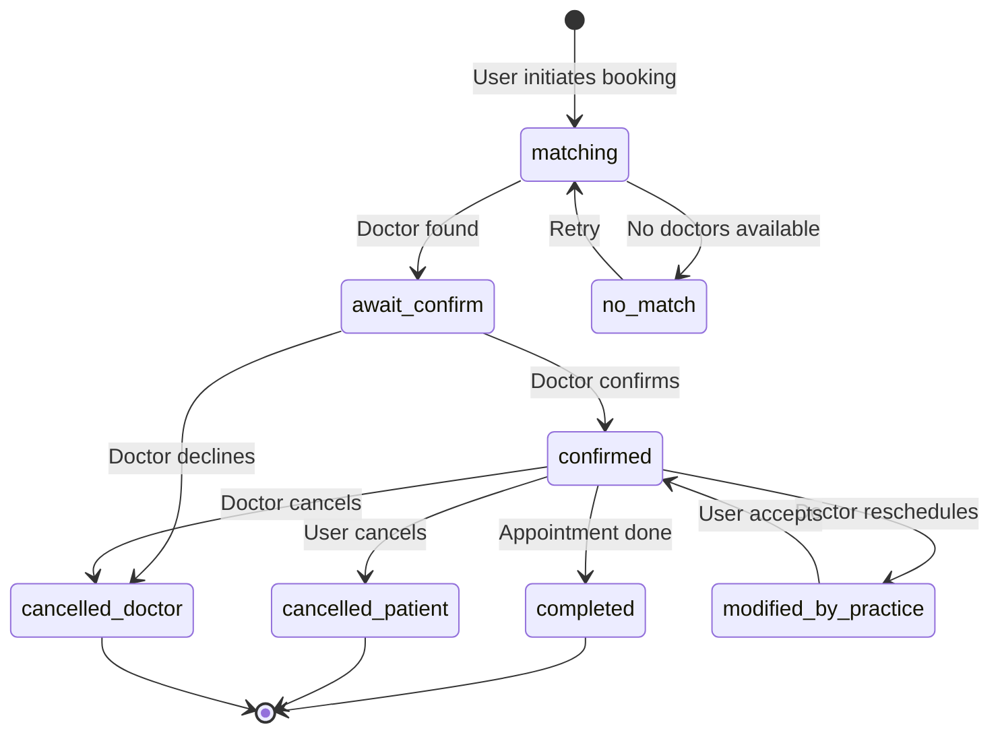

# Feature Impact Analysis: INFO-MAP v3 → v4

**Date:** 2026-02-05
**Base Document:** INFO-MAP-v3.md (2026-01-29)
**Target Document:** INFO-MAP-v4.md (2026-02-05)
**Purpose:** Document all changes between v3 and v4 Information Architecture

---

## Updated Information Architecture (v4)

```mermaid
flowchart TB
    subgraph APP["MedAlpha Connect v4"]
        direction TB

        subgraph AUTH["Authentication"]
            A1[Welcome]
            A2[Sign In]
            A3[Register]
            A4[Verify Email]
            A5[Verify Identity]
            A6[Forgot Password]
            A7[Reset Password]
            A8["OAuth Consent (NEW)"]
            A9["OAuth Error (NEW)"]
            A10["Insurance Request (NEW)"]
        end

        subgraph ONBOARD["Onboarding (NEW)"]
            O1["Profile Setup (NEW)"]
            O2["Insurance Setup (NEW)"]
            O3["Verify Intro (NEW)"]
            O4["Card Scan (NEW)"]
            O5["Success (NEW)"]
        end

        subgraph MAIN["Main App"]
            direction TB

            subgraph NAV["Bottom Navigation"]
                direction LR
                N1["Home"]
                N2["Book"]
                N3["History"]
                N4["Settings"]
            end

            subgraph HOME["HOME (MODIFIED)"]
                H1[Dashboard]
                H2[Today's Focus]
                H3[Pending Stack]
                H4[Quick Actions]
                H5["Follow-up Card (NEW)"]
                H6["My Doctors (NEW)"]
                H7[Notifications]
                H8[News Feed]
            end

            subgraph BOOKING["BOOK (MODIFIED)"]
                direction TB
                B0["Type Selection"]
                B0I["Intent Capture (NEW)"]

                subgraph FASTLANE["Fast-Lane (follow_up)"]
                    FL1[Care Request]
                    FL2[Request Sent]
                    FL3[Matching Status]
                    FL4[Success]
                    FL5[No Match]
                end

                subgraph SPECIALTY["Specialty-First (acute_urgent) (MODIFIED)"]
                    SP1[Specialty Search]
                    SP2[Availability Prefs]
                    SP3[Matched Doctors]
                end

                subgraph DOCTOR["Doctor-First (prevention_wellness) (MODIFIED)"]
                    DR1[Doctor Results]
                end

                subgraph COMMON["Common Booking (MODIFIED)"]
                    BC1[Doctor Profile]
                    BC2[Reviews]
                    BC3["Slot Selection (MODIFIED: direct, no symptoms)"]
                    BC4[Confirm]
                    BC5[Success]
                end
            end

            subgraph HISTORY["HISTORY (MODIFIED)"]
                HI1[Upcoming Stack]
                HI2["Others + Filters (MODIFIED)"]
                HI3[Appointment Detail]
                HI4[Archive]
            end

            subgraph ACTIONS["Appointment Actions"]
                AC1[Reschedule Reason]
                AC2[Suggested Slots]
                AC3[Reschedule Confirm]
                AC4[Reschedule Success]
                AC5[Book Again Context]
                AC6[Alternatives]
            end

            subgraph SETTINGS["SETTINGS (MODIFIED)"]
                S1[Settings Hub]
                S2[Family Members]
                S3[Member Detail]
                S4[Notification Prefs]
                S5[Language]
                S6["Privacy (MODIFIED)"]
                S7[FAQ]
                S8[Contact Support]
                S9[Help Centre]
                S10["Biometrics (NEW)"]
                S11["Password (NEW)"]
                S12["Address (NEW)"]
                S13["Insurance (NEW)"]
                S14["Delete Confirm (NEW)"]
            end

            subgraph PROFILE["Profile (MODIFIED)"]
                P1[Edit Profile]
                P2["Verify Phone (NEW)"]
                P3["Add Family (NEW)"]
            end

            subgraph ASSISTANT["Assistant"]
                AS1[Chat]
                AS2[Voice]
                AS3[Recommendations]
            end

            subgraph LEGAL["Legal (NEW)"]
                L1["Privacy Policy (NEW)"]
                L2["Terms of Service (NEW)"]
                L3["Impressum (NEW)"]
                L4["Cookie Policy (NEW)"]
            end
        end
    end

    %% Auth Flow
    A1 --> A2
    A1 --> A3
    A3 --> A4
    A2 --> A4
    A2 -->|Forgot| A6
    A6 --> A4
    A4 --> A7
    A7 --> H1
    A4 --> H1
    A4 -.-> A5
    A5 --> H1
    A4 -.-> O1

    %% Onboarding Flow (NEW)
    O1 --> O2 --> O3 --> O4 --> O5
    O5 --> H1

    %% Tab Navigation
    N1 --> H1
    N2 --> B0
    N3 --> HI1
    N4 --> S1

    %% Home flows (v4 - MODIFIED)
    H1 --> H2
    H1 --> H3
    H1 --> H4
    H1 --> H5
    H1 --> H6
    H1 --> H7
    H7 --> H8
    H3 --> HI3
    H4 -.-> B0
    H4 -.-> S2
    H5 -.->|Quick Book| BC4
    H6 -.->|Quick Book| BC4
    H1 -.-> AS1

    %% Booking Type Selection
    B0 -->|Follow-up| FL1
    B0 -->|Acute/Urgent| SP1
    B0 -->|Prevention| DR1
    B0I --> B0

    %% Fast-Lane flow
    FL1 --> FL2 --> FL3
    FL3 -->|Success| FL4
    FL3 -->|No Match| FL5
    FL5 -.->|Retry| FL1
    FL5 -.->|Change| SP1
    FL5 -.->|Browse| DR1

    %% Specialty-First flow (MODIFIED - no symptoms)
    SP1 --> SP2 --> SP3
    SP3 --> BC1
    SP3 --> BC3

    %% Doctor-First flow (MODIFIED - no symptoms)
    DR1 --> BC1
    DR1 --> BC3

    %% Common booking (MODIFIED - direct to slots)
    BC1 --> BC2
    BC1 --> BC3
    BC3 --> BC4 --> BC5

    %% History flows (MODIFIED)
    HI1 --> HI2
    HI2 --> HI3
    HI1 --> HI4
    HI3 --> AC1
    HI3 --> AC5

    %% Reschedule flow
    AC1 --> AC2 --> AC3 --> AC4

    %% Book Again flow
    AC5 --> AC6
    AC5 --> BC3
    AC6 --> BC3

    %% Settings flows (MODIFIED)
    S1 --> S2 --> S3
    S1 --> S4
    S1 --> S5
    S1 --> S6
    S1 --> S7
    S1 --> S8
    S1 --> S9
    S1 --> S10
    S1 --> S11
    S1 --> S12
    S1 --> S13
    S1 --> S14
    S1 -.-> P1
    P1 -.-> P2
    S2 --> P3

    %% Cross-flow connections
    H7 -.->|Appointment tap| HI3
    FL4 -.->|View appointments| HI1
    BC5 -.->|View appointments| HI1

    style APP fill:#ffffff,stroke:#9e9e9e,stroke-width:2px
    style AUTH fill:#e8f5e9,stroke:#2e7d32
    style ONBOARD fill:#c8e6c9,stroke:#2e7d32,stroke-width:3px
    style NAV fill:#e3f2fd,stroke:#1565c0,stroke-width:3px
    style HOME fill:#fff9c4,stroke:#f9a825,stroke-width:2px
    style BOOKING fill:#fff3e0,stroke:#e65100
    style FASTLANE fill:#fce4ec,stroke:#c2185b
    style SPECIALTY fill:#fff9c4,stroke:#f9a825,stroke-width:2px
    style DOCTOR fill:#fff9c4,stroke:#f9a825,stroke-width:2px
    style COMMON fill:#fff9c4,stroke:#f9a825,stroke-width:2px
    style HISTORY fill:#fff9c4,stroke:#f9a825,stroke-width:2px
    style ACTIONS fill:#f3e5f5,stroke:#7b1fa2
    style SETTINGS fill:#fff9c4,stroke:#f9a825,stroke-width:2px
    style PROFILE fill:#fff9c4,stroke:#f9a825,stroke-width:2px
    style ASSISTANT fill:#eceff1,stroke:#546e7a
    style LEGAL fill:#c8e6c9,stroke:#2e7d32,stroke-width:3px
```



**Legend:**
- **Green border/fill** = NEW elements in v4
- **Yellow border/fill** = MODIFIED elements in v4
- Solid arrows (→) = Primary navigation
- Dashed arrows (-.→) = Optional/secondary paths

---

## Summary of Changes

### NEW Elements

| Component | Location | Purpose |
|-----------|----------|---------|
| Onboarding Flow (5 screens) | `/onboarding/*` | 5-step identity verification: Profile → Insurance → Verify → Scan → Success |
| Follow-up Visit Card | Home Screen | Quick rebook with recent doctor for follow-up appointments |
| My Doctors Section | Home Screen | Horizontal scroll of saved/favorite doctors |
| `modified_by_practice` status | Appointment System | New status when doctor/practice reschedules appointment |
| Intent Capture | `/booking/intent` | AI-assisted booking entry point |
| OAuth Consent | `/auth/oauth-consent` | OAuth flow consent screen |
| OAuth Error | `/auth/oauth-error` | OAuth error handling |
| Insurance Request | `/auth/insurance-request` | Insurance linking during auth |
| Biometrics Settings | `/settings/biometrics` | Face ID / Touch ID configuration |
| Password Settings | `/settings/password` | Change password screen |
| Address Settings | `/settings/address` | Update address |
| Insurance Settings | `/settings/insurance` | Update insurance info |
| Delete Account Confirm | `/settings/delete-email-confirm` | Account deletion confirmation |
| Privacy Sub-routes | `/settings/privacy/*` | Data Export, Data Sharing, Consent Management |
| Verify Phone | `/profile/verify-phone` | Phone verification |
| Add Family Member | `/profile/family/add` | Dedicated add member route |
| Legal Pages (4) | `/legal/*` | Privacy Policy, Terms, Impressum, Cookie Policy |

### MODIFIED Elements

| Component | Change | Impact |
|-----------|--------|--------|
| Home Screen | Added Follow-up Visit Card and My Doctors Section | Enhanced quick-booking experience, reduced navigation for repeat visits |
| History Screen | Filter chips moved under "Others" label; "Doctor rescheduled" → "Modified by practice" | Cleaner UI hierarchy, consistent terminology |
| Specialty-First Flow | User provides Specialty + Availability Prefs → Backend matches doctor + slot | User does NOT select doctor or time slot; backend handles matching asynchronously |
| Doctor-First Flow | User selects Doctor + provides Availability Prefs → Backend matches slot | User selects doctor but NOT time slot; backend matches slot within preferences |
| Slot Selection | Only used for Follow-up (quick rebook), Reschedule, Book Again | Acute/Urgent and Prevention/Wellness use Availability Prefs + Matching instead |
| Booking Type Labels | "Fast-Lane/Specialty/Doctor" → "Follow-up/Acute-Urgent/Prevention-Wellness" | User-centric terminology matching appointment types |
| Back Button Logic | Reduced from 5-level to 3-level fallback | Simpler navigation, less edge cases |
| Settings Hub | Added 5+ new routes for granular settings | More fine-grained user control |
| Appointment Status System | 6 statuses → 7 statuses | Added `modified_by_practice` for doctor-initiated changes |

### REMOVED Elements

| Component | Previous Location | Reason |
|-----------|-------------------|--------|
| SymptomsScreen | `/booking/symptoms` | Simplified booking flow - symptoms no longer required |
| Step Progress Indicators | All booking screens | Reduced visual clutter, flows are self-explanatory |
| NavigationTracker | `NavigationTracker.tsx` | Replaced with simpler back button logic |
| navigation.ts utility | `utils/navigation.ts` | Session-based navigation tracking no longer needed |
| 5-level back fallback | Back button logic | Simplified to 3-level fallback |

### Navigation Changes

| Navigation | v3 (Before) | v4 (After) |
|------------|-------------|------------|
| Follow-up booking (with recent) | Book → Type → Fast-Lane → Care Request → Matching | Book → Type (Follow-up) → Auto-select doctor + slot → Confirm |
| Follow-up booking (no recent) | Book → Type → Fast-Lane → Care Request → Matching | Book → Type (Follow-up) → Care Request → Confirm → Matching |
| Specialty booking | Book → Type → Specialty → Availability → Results → Symptoms → Slots | Book → Type (Acute/Urgent) → Specialty → Availability Prefs → Confirm → **Matching** (no doctor/slot selection) |
| Doctor booking | Book → Type → Doctor Search → Symptoms → Slots | Book → Type (Prevention) → Select Doctor → Availability Prefs → Confirm → **Matching** (no slot selection) |
| Quick rebook | N/A | Home → Follow-up Card → Confirm |
| My Doctors access | N/A | Home → My Doctors → Confirm |
| History filtering | Filters inline with section | Filters under "Others" label |

### Data Model Additions

```
Appointment Status System:
v3: matching | await_confirm | confirmed | completed | cancelled_patient | cancelled_doctor
v4: matching | await_confirm | confirmed | completed | cancelled_patient | cancelled_doctor | modified_by_practice (NEW)

Appointment Type ↔ Booking Flow mapping (v4 Implementation):

| Type              | Flow Name        | User Selects Doctor? | User Selects Slot? | Uses Matching? |
|-------------------|------------------|---------------------|-------------------|----------------|
| follow_up (recent)| Fast-Lane        | Auto-selected       | Auto-selected     | No             |
| follow_up (none)  | Fast-Lane        | No                  | No                | Yes            |
| acute_urgent      | Specialty-First  | No                  | No                | Yes            |
| prevention_wellness| Doctor-First    | Yes                 | No (Avail Prefs)  | Yes            |

History Filter Chips (v4 order):
1. All (IconFilter)
2. Await Confirm (IconClock)
3. Matching (IconSearch)
4. Modified by practice (IconRefresh) [NEW]
5. Doctor Canceled (IconX)
```

---

## Route Structure Updates

### Authentication Routes

| Route | Screen Name | Protection | Change | Purpose |
|-------|-------------|------------|--------|---------|
| `/auth/welcome` | Welcome | Public | Unchanged | Entry point |
| `/auth/sign-in` | Sign In | Public | Unchanged | Email/password + biometrics |
| `/auth/register` | Register | Public | Unchanged | New user registration |
| `/auth/verify` | Verify | Public | Unchanged | Email OTP verification |
| `/auth/verify-identity` | Verify Identity | Auth | Unchanged | Optional KYC |
| `/auth/forgot-password` | Forgot Password | Public | Unchanged | Initiate password reset |
| `/auth/reset-password` | Reset Password | Public | Unchanged | Set new password |
| `/auth/oauth-consent` | OAuth Consent | Public | **NEW** | OAuth flow consent |
| `/auth/oauth-error` | OAuth Error | Public | **NEW** | OAuth error handling |
| `/auth/insurance-request` | Insurance Request | Public | **NEW** | Insurance linking |

### Onboarding Routes (NEW Section)

| Route | Screen Name | Protection | Change | Purpose |
|-------|-------------|------------|--------|---------|
| `/onboarding/profile` | Profile Setup | Auth | **NEW** | Step 1: DOB, Gender, Phone |
| `/onboarding/insurance` | Insurance Setup | Auth | **NEW** | Step 2: Insurance selection |
| `/onboarding/verify` | Verify Intro | Auth | **NEW** | Step 3: eGK scan intro |
| `/onboarding/scan` | Card Scan | Auth | **NEW** | Step 3b: Camera mock |
| `/onboarding/success` | Verification Success | Auth | **NEW** | Verification complete |

### Profile Routes

| Route | Screen Name | Protection | Change | Purpose |
|-------|-------------|------------|--------|---------|
| `/profile/complete` | Profile Completion | Auth | Deprecated | Redirects to onboarding |
| `/profile/edit` | Edit Profile | Auth | Unchanged | Update personal info |
| `/profile/family` | Family Members | Auth | Unchanged | List family |
| `/profile/family/add` | Add Family Member | Auth | **NEW** | Add new member |
| `/profile/family/:id` | Family Member Detail | Auth | Unchanged | View/edit member |
| `/profile/verify-phone` | Verify Phone | Auth | **NEW** | Phone verification |

### Main App Routes

| Route | Screen Name | Protection | Change | Purpose |
|-------|-------------|------------|--------|---------|
| `/home` | Home | Auth | **MODIFIED** | Dashboard + Follow-up Card + My Doctors |
| `/notifications` | Notifications Center | Auth | Unchanged | Updates + Newsfeed tabs |
| `/news/:articleId` | Article Detail | Auth | Unchanged | Read article |

### Booking Routes - Entry

| Route | Screen Name | Protection | Change | Purpose |
|-------|-------------|------------|--------|---------|
| `/booking` | Booking Type Selection | Auth | **MODIFIED** | Labels: Follow-up, Acute/Urgent, Prevention/Wellness |
| `/booking/intent` | Intent Capture | Auth | **NEW** | AI-assisted booking entry |

### Booking Routes - Fast-Lane Flow

| Route | Screen Name | Protection | Change | Purpose |
|-------|-------------|------------|--------|---------|
| `/booking/fast-lane` | Care Request | Auth | Unchanged | Specialty, city, insurance (or quick rebook) |
| `/booking/fast-lane/matching` | Matching Status | Auth | Unchanged | Live progress animation |
| `/booking/fast-lane/success` | Fast-Lane Success | Auth | Unchanged | Matched appointment |
| `/booking/fast-lane/no-match` | No Match | Auth | Unchanged | Alternatives offered |

### Booking Routes - Specialty-First Flow

| Route | Screen Name | Protection | Change | Purpose |
|-------|-------------|------------|--------|---------|
| `/booking/specialty` | Specialty Search | Auth | Unchanged | Search by specialty |
| `/booking/availability` | Availability Prefs | Auth | Unchanged | Select preferred days/times |
| `/booking/location` | Location | Auth | Unchanged | Location selection |
| `/booking/insurance` | Insurance | Auth | Unchanged | Insurance selection |
| `/booking/results` | Matched Doctors | Auth | **MODIFIED** | Doctor-First: browse doctors; Specialty-First: not used (uses matching) |

### Booking Routes - Common

| Route | Screen Name | Protection | Change | Purpose |
|-------|-------------|------------|--------|---------|
| `/booking/doctor/:id` | Doctor Profile | Auth | Unchanged | Doctor details |
| `/booking/doctor/:id/reviews` | Reviews | Auth | Unchanged | Doctor reviews |
| `/booking/doctor/:id/slots` | Slot Selection | Auth | **MODIFIED** | Used for: Follow-up quick rebook, Reschedule, Book Again (NOT for Specialty-First or Doctor-First) |
| `/booking/confirm` | Confirm | Auth | Unchanged | Review & confirm |
| `/booking/success` | Success | Auth | Unchanged | Booking confirmed |
| `/booking/request-sent` | Request Sent | Auth | Unchanged | Fast-lane confirmation |
| ~`/booking/symptoms`~ | ~Symptoms~ | ~Auth~ | **REMOVED** | ~Describe symptoms~ |

### History Routes

| Route | Screen Name | Protection | Change | Purpose |
|-------|-------------|------------|--------|---------|
| `/history` | History | Auth | **MODIFIED** | Chips under "Others" label; new filter |
| `/history/:id` | History Detail | Auth | Unchanged | Past appointment |
| `/history/archive` | Archive | Auth | Unchanged | Manage history |
| `/appointments/:id` | Appointment Detail | Auth | Unchanged | Current appointment |

### Settings Routes

| Route | Screen Name | Protection | Change | Purpose |
|-------|-------------|------------|--------|---------|
| `/settings` | Settings | Auth | **MODIFIED** | Added new route links |
| `/settings/notifications` | Notification Prefs | Auth | Unchanged | Toggle preferences |
| `/settings/language` | Language | Auth | Unchanged | EN/DE selection |
| `/settings/privacy` | Privacy & Data | Auth | **MODIFIED** | Added sub-routes |
| `/settings/privacy/export` | Data Export | Auth | **NEW** | Export user data |
| `/settings/privacy/sharing` | Data Sharing | Auth | **NEW** | Control sharing |
| `/settings/privacy/consents` | Consent Management | Auth | **NEW** | Manage consents |
| `/settings/faq` | FAQ | Auth | Unchanged | Help questions |
| `/settings/contact-support` | Contact Support | Auth | Unchanged | Get help |
| `/settings/help-centre` | Help Centre | Auth | Unchanged | Resources |
| `/settings/password` | Change Password | Auth | **NEW** | Update password |
| `/settings/biometrics` | Biometrics | Auth | **NEW** | Face ID / Touch ID |
| `/settings/address` | Address Edit | Auth | **NEW** | Update address |
| `/settings/insurance` | Insurance Edit | Auth | **NEW** | Update insurance |
| `/settings/delete-email-confirm` | Delete Account Confirm | Auth | **NEW** | Account deletion |

### Legal Routes (NEW Section)

| Route | Screen Name | Protection | Change | Purpose |
|-------|-------------|------------|--------|---------|
| `/legal/privacy` | Privacy Policy | Public | **NEW** | Privacy policy |
| `/legal/terms` | Terms of Service | Public | **NEW** | Terms |
| `/legal/impressum` | Impressum | Public | **NEW** | Legal info |
| `/legal/cookies` | Cookie Policy | Public | **NEW** | Cookie info |

---

## Route Count Comparison

| Category | v3 Count | v4 Count | Change |
|----------|----------|----------|--------|
| Authentication | 7 | 10 | +3 (OAuth, Insurance) |
| Onboarding | 0 | 5 | +5 (NEW section) |
| Profile | 4 | 6 | +2 (Verify Phone, Add Family) |
| Main App | 3 | 3 | — |
| Booking Entry | 1 | 2 | +1 (Intent Capture) |
| Fast-Lane | 5 | 4 | -1 (request-sent moved) |
| Specialty-First | 3 | 6 | +3 (Location, Insurance, Constraints) |
| Doctor-First | 2 | 1 | -1 (Symptoms removed) |
| Booking Common | 7 | 6 | -1 (Symptoms removed) |
| History | 4 | 4 | — |
| Reschedule | 4 | 4 | — |
| Book Again | 2 | 2 | — |
| Settings | 7 | 14 | +7 (Sub-routes, Biometrics, etc.) |
| Assistant | 5 | 5 | — |
| Legal | 0 | 4 | +4 (NEW section) |
| **TOTAL** | ~54 | **76** | **+22 routes** |

---

## Appointment Status Lifecycle Update



**Change:** Added `modified_by_practice` status with bidirectional transition to `confirmed`.

---

## Key Features Delivered (v3 → v4)

### New in v4
1. **Onboarding Flow** - 5-step identity verification (Profile → Insurance → Verify → Scan → Success)
2. **Follow-up Visit Card** - Quick rebook with recent doctor from Home
3. **My Doctors Section** - Horizontal scroll of saved doctors on Home
4. **Modified by Practice Status** - Track doctor-initiated reschedules
5. **OAuth Integration** - Support for OAuth consent flow
6. **Biometric Authentication** - Face ID / Touch ID settings
7. **Granular Privacy Settings** - Data export, sharing, consent management
8. **Legal Pages** - Privacy Policy, Terms, Impressum, Cookie Policy

### Modified in v4
1. **Simplified Booking** - Removed symptoms step from Specialty-First and Doctor-First flows
2. **User-Centric Labels** - Appointment types (Follow-up, Acute/Urgent, Prevention/Wellness) instead of flow names
3. **History Filters** - Chips repositioned under "Others" label with new "Modified by practice" filter
4. **Streamlined Navigation** - 3-level back button fallback (reduced from 5)
5. **Enhanced Settings** - 7 new settings routes for granular control

### Removed in v4
1. **SymptomsScreen** - `/booking/symptoms` route deleted
2. **Step Progress** - Visual step indicators removed from booking screens
3. **Navigation Complexity** - NavigationTracker, navigation.ts, sessionStorage tracking

---

## Implementation Notes

- **Storage:** No new storage mechanisms; existing appointment store handles `modified_by_practice` status
- **Loading:** Onboarding flow uses lazy loading; Legal pages are static
- **UI Behaviors:** Follow-up Card and My Doctors use swipeable/scrollable patterns consistent with existing Pending Stack
- **Migration:** No data migration required; new status is additive
- **Breaking Changes:** None - all v3 functionality preserved except SymptomsScreen (which had no user data)
