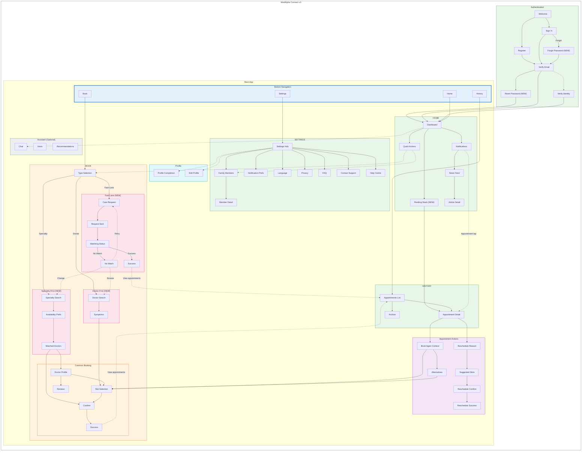
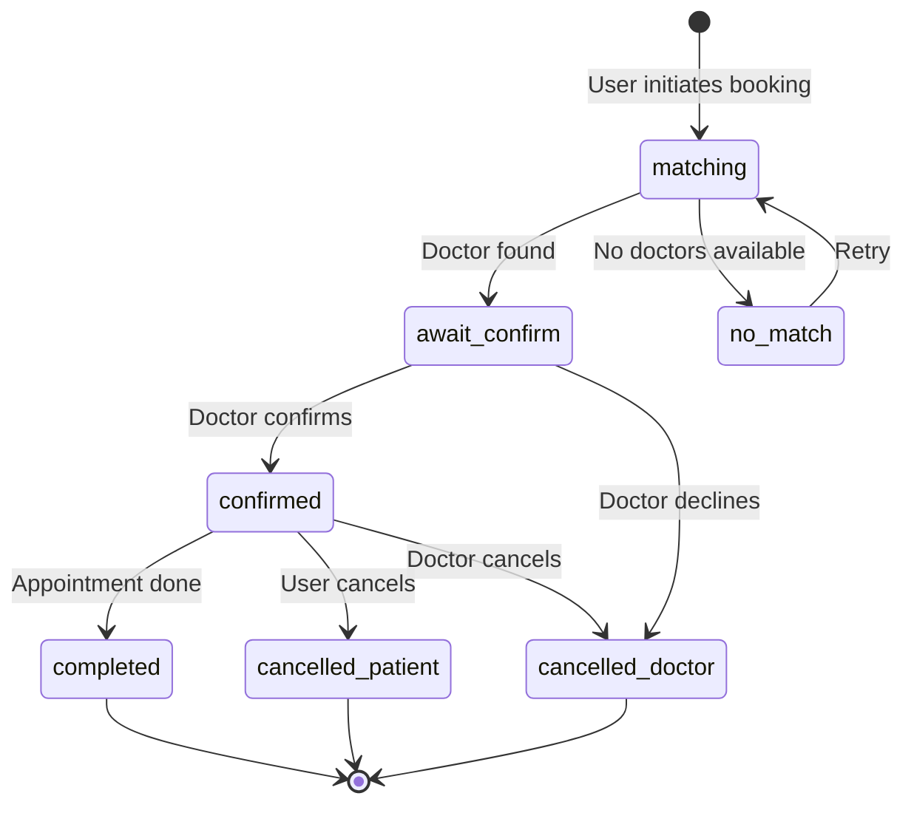

# IA Map - MedAlpha Connect v3

**Generated From:** N3 App Implementation Analysis
**Date:** 2026-01-29
**Purpose:** Document v3 Information Architecture with all current features and flows

---

## Key Features Delivered (v3)

1. **User Authentication** - Email-based with OTP verification + Forgot Password flow
2. **Profile Management** - Insurance, address, GDPR consent (optional gate)
3. **Family Members** - Add/manage dependents for family appointments
4. **3 Booking Paths**:
   - Fast-Lane: Quick symptom-based matching
   - Specialty-First: Choose specialty → get matched doctors
   - Doctor-First: Browse doctors → describe symptoms → book
5. **Background Matching** - Async doctor matching with live progress
6. **Appointment Status System** - 6 statuses with status-aware UI
7. **In-App Toast Notifications** - Status change alerts
8. **Swipeable Pending Stack** - Interactive home widget
9. **Appointment History** - Upcoming/Past with reschedule/cancel/book-again
10. **Newsfeed & Articles** - Health content via Notifications Center
11. **Settings & Preferences** - Language (EN/DE), notifications, privacy
12. **i18n Support** - Full English and German translations (7 namespaces)

---

## High-Level Structure (v3)

```
MedAlpha Connect v3
│
├── Authentication
│   ├── Welcome
│   ├── Sign In
│   ├── Register
│   ├── Verify (Email OTP)
│   ├── Verify Identity (Optional KYC)
│   ├── Forgot Password                  [NEW in v3]
│   └── Reset Password                   [NEW in v3]
│
├── Profile Management
│   ├── Profile Completion (Optional)
│   ├── Edit Profile
│   ├── Family Members List
│   └── Family Member Detail
│
├── Main Application (4 Tabs)
│   │
│   ├── HOME
│   │   ├── User Greeting
│   │   ├── Quick Actions (Book, Family)
│   │   ├── Today's Focus (verified users)
│   │   ├── Swipeable Pending Appointments    [NEW in v3]
│   │   ├── Notifications Entry (Bell icon)
│   │   └── Latest Health News
│   │
│   ├── BOOK (3 Booking Paths)           [RESTRUCTURED in v3]
│   │   │
│   │   ├── Booking Type Selection
│   │   │
│   │   ├── Fast-Lane Path               [NEW in v3]
│   │   │   ├── Care Request (symptoms, specialty, city, insurance)
│   │   │   ├── Request Sent
│   │   │   ├── Matching Status (live progress)
│   │   │   ├── Success (matched)
│   │   │   └── No Match (alternatives)
│   │   │
│   │   ├── Specialty-First Path         [NEW in v3]
│   │   │   ├── Specialty Search
│   │   │   ├── Set Preferences (city, insurance)
│   │   │   ├── Availability Preferences
│   │   │   ├── Matched Doctors List
│   │   │   ├── Doctor Detail Sheet
│   │   │   └── Confirm → Success
│   │   │
│   │   └── Doctor-First Path            [NEW in v3]
│   │       ├── Doctor Search/Browse
│   │       ├── Describe Symptoms
│   │       ├── Slot Selection
│   │       ├── Confirm
│   │       └── Success
│   │
│   ├── HISTORY
│   │   ├── Appointments List (Upcoming/Past toggle)
│   │   ├── Appointment Detail
│   │   ├── Archive View
│   │   └── Actions: Reschedule, Cancel, Book Again
│   │
│   └── SETTINGS
│       ├── Profile Card & Actions
│       ├── Family Members
│       ├── Notification Preferences
│       ├── Language
│       ├── Privacy & Data
│       ├── FAQ
│       ├── Contact Support
│       ├── Help Centre
│       └── Sign Out
│
├── Appointment Actions
│   ├── Reschedule Flow (Reason → Slots → Confirm → Success)
│   └── Book Again Flow (Context → Alternatives → Confirm)
│
├── Notifications & Content
│   ├── Notifications Center (Updates tab)
│   ├── News Feed (Articles tab)
│   └── Article Detail
│
├── Assistant (Optional)
│   ├── Chat Assistant
│   ├── Voice Assistant
│   ├── Recommendations
│   ├── Assistant Doctor Detail
│   └── Assistant Confirm
│
└── NOT IN v3 (Future)
    ├── Telemedicine
    ├── E-Rezept
    ├── Stores
    ├── Health Checks
    ├── Payback Integration
    └── dm Account Link / SSO
```

---

## Master IA Diagram (v3)



**Legend:**
- **(NEW)** indicates features added in v3
- Solid arrows (→) indicate primary navigation
- Dashed arrows (-.→) indicate optional/secondary paths

---

## Navigation Paths (v3)

| Flow | Primary Path | Optimized For | Alternative |
|------|--------------|---------------|-------------|
| Registration | Welcome → Register → Verify → Home | New users | - |
| Sign In | Welcome → Sign In → Verify → Home | Returning users | Forgot Password flow |
| Fast-Lane Booking | Book → Type → Care Request → Matching → Success | Speed | Home → Quick Action |
| Specialty Booking | Book → Type → Specialty → Availability → Doctors → Confirm | Discovery | No Match → Change Specialty |
| Doctor Booking | Book → Type → Doctor Search → Symptoms → Slot → Confirm | Specific doctor | Home → Quick Action |
| Reschedule | History → Detail → Reason → Slots → Confirm → Success | Modification | Appointment notification tap |
| Book Again | History → Detail → Context → Slot → Confirm → Success | Re-booking | Alternatives if unavailable |
| View History | History Tab → List → Detail | Records | Home → Pending Stack tap |
| News | Home → Notifications → News Feed → Article | Content | Notification tap |

---

### IA Diagram — Appointment Status Lifecycle



---

## Appointment Status System (v3)

### Status Values

| Status | Display | Description |
|--------|---------|-------------|
| `matching` | "Matching" (info) | Finding a doctor, no doctor assigned yet |
| `await_confirm` | "Await confirm" (pending) | Doctor found, awaiting confirmation |
| `confirmed` | "Confirmed" (positive) | Appointment confirmed |
| `completed` | "Completed" (neutral) | Appointment finished |
| `cancelled_patient` | "Patient canceled" (negative) | Cancelled by patient |
| `cancelled_doctor` | "Doctor canceled" (negative) | Cancelled by doctor |

### Status Transitions

```
[User initiates booking]
         │
         ▼
    ┌─────────┐
    │ matching │◄──────────────────┐
    └────┬────┘                    │
         │ Doctor found            │ Retry
         ▼                         │
┌────────────────┐            ┌────┴────┐
│ await_confirm  │            │ no_match │
└───────┬────────┘            └─────────┘
        │ Confirmed
        ▼
   ┌───────────┐
   │ confirmed │
   └─────┬─────┘
         │
    ┌────┴────┐
    ▼         ▼
┌─────────┐  ┌──────────────────┐
│completed│  │cancelled_patient │
└─────────┘  │cancelled_doctor  │
             └──────────────────┘
```


---

## Route Structure (v3)

### Authentication Routes

| Route | Screen | Status | Notes |
|-------|--------|--------|-------|
| `/auth/welcome` | Welcome | Existing | Entry point |
| `/auth/sign-in` | Sign In | Existing | Email/password |
| `/auth/register` | Register | Existing | New user registration |
| `/auth/verify` | Verify | Existing | Email OTP verification |
| `/auth/verify-identity` | Verify Identity | Existing | Optional KYC |
| `/auth/forgot-password` | Forgot Password | **NEW** | Initiate password reset |
| `/auth/reset-password` | Reset Password | **NEW** | Set new password |

### Profile Routes

| Route | Screen | Status | Notes |
|-------|--------|--------|-------|
| `/profile/complete` | Profile Completion | Existing | Optional gate |
| `/profile/edit` | Edit Profile | Existing | Update personal info |
| `/profile/family` | Family Members | Existing | List family |
| `/profile/family/:id` | Family Member Detail | Existing | View/edit member |

### Main App Routes

| Route | Screen | Status | Notes |
|-------|--------|--------|-------|
| `/home` | Home | Existing | Dashboard |
| `/notifications` | Notifications Center | Existing | Updates + Newsfeed tabs |
| `/news/:articleId` | Article Detail | Existing | Read article |

### Booking Routes - Entry

| Route | Screen | Status | Notes |
|-------|--------|--------|-------|
| `/booking` | Booking Type Selection | Existing | Choose Fast-Lane, Specialty, or Doctor |

### Booking Routes - Fast-Lane Flow

| Route | Screen | Status | Notes |
|-------|--------|--------|-------|
| `/booking/fast-lane` | Care Request | **NEW** | Symptoms, specialty, city, insurance |
| `/booking/request-sent` | Request Sent | **NEW** | Confirmation, matching started |
| `/booking/fast-lane/matching` | Matching Status | **NEW** | Live progress animation |
| `/booking/fast-lane/success` | Fast-Lane Success | **NEW** | Matched appointment |
| `/booking/fast-lane/no-match` | No Match | **NEW** | Alternatives offered |

### Booking Routes - Specialty-First Flow

| Route | Screen | Status | Notes |
|-------|--------|--------|-------|
| `/booking/specialty` | Specialty Search | Existing | Search by specialty |
| `/booking/availability` | Availability Prefs | **NEW** | Select preferred days/times |
| `/booking/results` | Matched Doctors | Existing | Doctor list with filters |

### Booking Routes - Doctor-First Flow

| Route | Screen | Status | Notes |
|-------|--------|--------|-------|
| `/booking/doctor` | Doctor Search | **NEW** | Browse/search doctors |
| `/booking/symptoms` | Symptoms | **NEW** | Describe symptoms |

### Booking Routes - Common (All Flows)

| Route | Screen | Status | Notes |
|-------|--------|--------|-------|
| `/booking/doctor/:id` | Doctor Profile | Existing | Doctor details |
| `/booking/doctor/:id/reviews` | Reviews | Existing | Doctor reviews |
| `/booking/doctor/:id/slots` | Slot Selection | Existing | Pick time |
| `/booking/confirm` | Confirm | Existing | Review & confirm |
| `/booking/success` | Success | Existing | Booking confirmed |

### History Routes

| Route | Screen | Status | Notes |
|-------|--------|--------|-------|
| `/history` | History | Existing | Upcoming/Past toggle |
| `/history/:id` | History Detail | Existing | Past appointment |
| `/history/archive` | Archive | Existing | Manage history |
| `/appointments/:id` | Appointment Detail | Existing | Current appointment |

### Reschedule Routes

| Route | Screen | Status | Notes |
|-------|--------|--------|-------|
| `/reschedule/:id` | Suggested Slots | Existing | Alternative times |
| `/reschedule/:id/reason` | Reason | Existing | Why rescheduling |
| `/reschedule/:id/confirm` | Confirm | Existing | Confirm change |
| `/reschedule/:id/success` | Success | Existing | Reschedule done |

### Book Again Routes

| Route | Screen | Status | Notes |
|-------|--------|--------|-------|
| `/book-again/:id` | Context | Existing | Re-book same doctor |
| `/book-again/:id/alternatives` | Alternatives | Existing | If unavailable |

### Settings Routes

| Route | Screen | Status | Notes |
|-------|--------|--------|-------|
| `/settings` | Settings | Existing | Main settings |
| `/settings/notifications` | Notification Prefs | Existing | Toggle preferences |
| `/settings/language` | Language | Existing | EN/DE selection |
| `/settings/privacy` | Privacy & Data | Existing | GDPR controls |
| `/settings/faq` | FAQ | Existing | Help questions |
| `/settings/contact-support` | Contact Support | Existing | Get help |
| `/settings/help-centre` | Help Centre | Existing | Resources |

### Assistant Routes

| Route | Screen | Status | Notes |
|-------|--------|--------|-------|
| `/assistant` | Assistant | Existing | Chat interface |
| `/assistant/voice` | Voice | Existing | Voice booking |
| `/assistant/recommendations` | Recommendations | Existing | AI suggestions |
| `/assistant/doctor/:id` | Doctor Detail | Existing | From recommendation |
| `/assistant/confirm` | Confirm | Existing | AI booking confirm |

---
