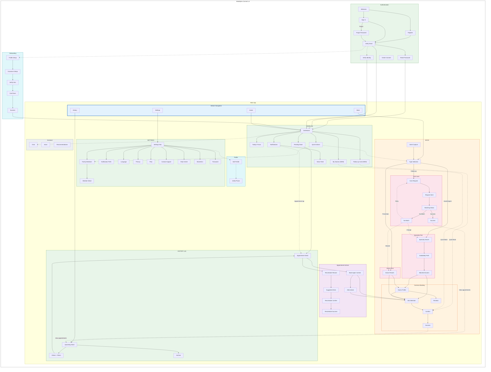
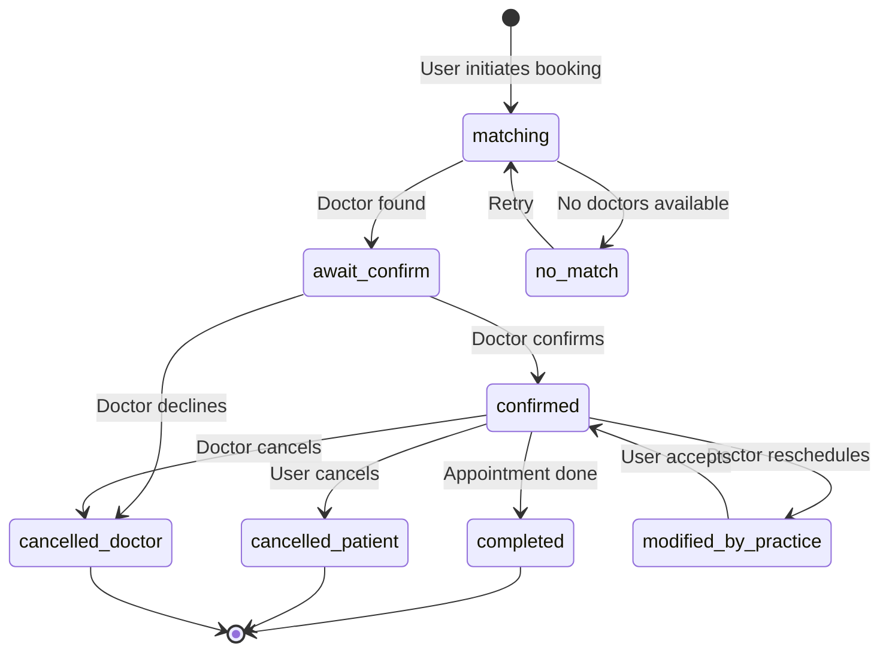

# IA Map - MedAlpha Connect v4

**Generated From:** DocliQ Mobile App Implementation Analysis
**Date:** 2026-02-05
**Purpose:** Document v4 Information Architecture with all current features and flows

---

## Changes from v3

| Change Type | Item | Description |
|-------------|------|-------------|
| **REMOVED** | `/booking/symptoms` | SymptomsScreen deleted from booking flows |
| **REMOVED** | Step Progress | Step indicators removed from all booking screens |
| **REMOVED** | NavigationTracker | Component and `navigation.ts` utility removed |
| **REMOVED** | SessionStorage Nav | Session-based navigation tracking removed |
| **CHANGED** | Back Button Logic | Simplified to 3-level fallback (from 5) |
| **CHANGED** | History Others | Filter chips moved underneath "Others" label |
| **CHANGED** | Doctor Rescheduled | Renamed to "Modified by practice" with IconRefresh |
| **NEW** | Follow-up Visit Card | Quick rebook card on Home screen |
| **NEW** | My Doctors Section | Horizontal scroll of favorites on Home |
| **NEW** | `modified_by_practice` | New appointment status type |

---

## Key Features Delivered (v4)

1. **User Authentication** - Email-based with OTP verification + Forgot Password flow
2. **Profile Management** - Insurance, address, GDPR consent (optional gate)
3. **Onboarding Flow** - 5-step identity verification (Profile → Insurance → Verify → Scan → Success)
4. **Family Members** - Add/manage dependents for family appointments
5. **3 Booking Paths** (all use async matching except Follow-up with recent doctor):
   - Fast-Lane (follow_up) → `/booking/fast-lane` - Quick rebook with recent doctor OR matching
   - Specialty-First (acute_urgent) → `/booking/specialty` - Choose specialty + availability prefs → backend matches doctor + slot
   - Doctor-First (prevention_wellness) → `/booking/results` - Choose doctor + availability prefs → backend matches slot
6. **Background Matching** - Async doctor matching with live progress
7. **Appointment Status System** - 7 statuses including `modified_by_practice`
8. **In-App Toast Notifications** - Status change alerts
9. **Swipeable Pending Stack** - Interactive home widget
10. **Follow-up Visit Card** - Quick rebook with recent doctor [NEW in v4]
11. **My Doctors Section** - Horizontal scroll favorites on Home [NEW in v4]
12. **Appointment History** - Upcoming/Others with redesigned filters [CHANGED in v4]
13. **Newsfeed & Articles** - Health content via Notifications Center
14. **Settings & Preferences** - Language (EN/DE), notifications, privacy, biometrics
15. **i18n Support** - Full English and German translations

---

## High-Level Structure (v4)

```
MedAlpha Connect v4
│
├── Authentication
│   ├── Welcome
│   ├── Sign In
│   ├── Register
│   ├── Verify (Email OTP)
│   ├── Verify Identity (Optional KYC)
│   ├── Forgot Password
│   ├── Reset Password
│   ├── OAuth Consent
│   ├── OAuth Error
│   └── Insurance Request
│
├── Onboarding (5-step)
│   ├── Profile Setup (DOB, Gender, Phone)
│   ├── Insurance Setup
│   ├── Verify Intro
│   ├── Card Scan
│   └── Verification Success
│
├── Profile Management
│   ├── Profile Completion (Deprecated → Onboarding)
│   ├── Edit Profile
│   ├── Family Members List
│   ├── Add Family Member
│   ├── Family Member Detail
│   └── Verify Phone
│
├── Main Application (4 Tabs)
│   │
│   ├── HOME [ENHANCED in v4]
│   │   ├── User Greeting + Avatar
│   │   ├── Today's Focus (verified users)
│   │   ├── Swipeable Pending Appointments
│   │   ├── Quick Actions (Book, Family)
│   │   ├── Follow-up Visit Card           [NEW in v4]
│   │   ├── My Doctors Scroll              [NEW in v4]
│   │   ├── Notifications Entry (Bell icon)
│   │   └── Latest Health News
│   │
│   ├── BOOK (3 Booking Paths)
│   │   │
│   │   ├── Booking Type Selection
│   │   │   ├── Acute/Urgent → Specialty-First
│   │   │   ├── Prevention/Wellness → Doctor-First
│   │   │   └── Follow-up → Fast-Lane
│   │   │
│   │   ├── Intent Capture (Alternative Entry)
│   │   │
│   │   ├── Fast-Lane Path (follow_up)
│   │   │   ├── Care Request (or Quick Rebook)
│   │   │   ├── Request Sent
│   │   │   ├── Matching Status (live progress)
│   │   │   ├── Success (matched)
│   │   │   └── No Match (alternatives)
│   │   │
│   │   ├── Specialty-First Path (acute_urgent)
│   │   │   ├── Specialty Search
│   │   │   ├── Availability Preferences     [USER SETS DAY/TIME PREFS]
│   │   │   ├── Confirm                      [NO DOCTOR/SLOT SELECTION]
│   │   │   ├── Matching Status              [BACKEND FINDS DOCTOR + SLOT]
│   │   │   ├── Success (matched)
│   │   │   └── No Match (alternatives)
│   │   │
│   │   └── Doctor-First Path (prevention_wellness)
│   │       ├── Doctor Results/Search
│   │       ├── Doctor Profile               [USER SELECTS DOCTOR]
│   │       ├── Availability Preferences     [USER SETS DAY/TIME PREFS, NO SLOT]
│   │       ├── Confirm                      [NO SLOT SELECTION]
│   │       ├── Matching Status              [BACKEND FINDS SLOT]
│   │       ├── Success (matched)
│   │       └── No Match (alternatives)
│   │
│   ├── HISTORY [CHANGED in v4]
│   │   ├── Upcoming Section (Swipeable Stack)
│   │   ├── Others Section
│   │   │   ├── Label + Count
│   │   │   └── Filter Chips (under label)  [CHANGED in v4]
│   │   │       ├── All
│   │   │       ├── Await Confirm
│   │   │       ├── Matching
│   │   │       ├── Modified by practice    [NEW in v4]
│   │   │       └── Doctor Canceled
│   │   ├── Appointment Detail
│   │   ├── Archive View
│   │   └── Actions: Reschedule, Cancel, Book Again
│   │
│   └── SETTINGS
│       ├── Profile Card & Actions
│       ├── Family Members
│       ├── Notification Preferences
│       ├── Language
│       ├── Privacy & Data
│       │   ├── Data Export
│       │   ├── Data Sharing
│       │   └── Consent Management
│       ├── Password Change
│       ├── Biometrics
│       ├── Address Edit
│       ├── Insurance Edit
│       ├── FAQ
│       ├── Contact Support
│       ├── Help Centre
│       ├── Delete Account Confirm
│       └── Sign Out
│
├── Appointment Actions
│   ├── Reschedule Flow (Reason → Slots → Confirm → Success)
│   └── Book Again Flow (Context → Alternatives → Confirm)
│
├── Notifications & Content
│   ├── Notifications Center (Updates tab)
│   ├── News Feed (Articles tab)
│   └── Article Detail
│
├── Assistant (Optional)
│   ├── Chat Assistant
│   ├── Voice Assistant
│   ├── Recommendations
│   ├── Assistant Doctor Detail
│   └── Assistant Confirm
│
├── Legal Pages
│   ├── Privacy Policy
│   ├── Terms of Service
│   ├── Impressum
│   └── Cookie Policy
│
└── NOT IN v4 (Future)
    ├── Telemedicine
    ├── E-Rezept
    ├── Stores
    ├── Health Checks
    ├── Payback Integration
    └── dm Account Link / SSO
```

---

## Master IA Diagram (v4)



**Legend:**
- **(NEW)** indicates features added in v4
- **(v4)** indicates sections changed in v4
- Solid arrows (→) indicate primary navigation
- Dashed arrows (-.→) indicate optional/secondary paths

---

## Navigation Paths (v4)

| Flow | Primary Path | Optimized For | Alternative |
|------|--------------|---------------|-------------|
| Registration | Welcome → Register → Verify → Home | New users | - |
| Sign In | Welcome → Sign In → Verify → Home | Returning users | Forgot Password flow |
| Onboarding | Profile → Insurance → Verify → Scan → Success | Identity verification | Skip to Home |
| Fast-Lane Booking | Book → Type → Fast-Lane OR Quick Rebook → Confirm | Speed | Home → Follow-up Card |
| Specialty Booking | Book → Type → Specialty → Availability Prefs → Confirm → Matching | Urgent care | No Match → Change Specialty |
| Doctor Booking | Book → Type → Results → Select Doctor → Availability Prefs → Confirm → Matching | Specific doctor | Home → My Doctors |
| Quick Rebook | Home → Follow-up Card → Confirm | Repeat visits | Home → My Doctors tap |
| Reschedule | History → Detail → Reason → Slots → Confirm → Success | Modification | Notification tap |
| Book Again | History → Detail → Context → Slot → Confirm → Success | Re-booking | Alternatives if unavailable |
| View History | History Tab → Upcoming/Others → Detail | Records | Home → Pending Stack tap |
| News | Home → Notifications → News Feed → Article | Content | Notification tap |

---

## Appointment Status Lifecycle (v4)



---

## Appointment Status System (v4)

### Status Values

| Status | Display | Description |
|--------|---------|-------------|
| `matching` | "Matching" (info) | Finding a doctor/slot (all flows except Follow-up with recent doctor) |
| `await_confirm` | "Await confirm" (pending) | Doctor found, awaiting confirmation |
| `confirmed` | "Confirmed" (positive) | Appointment confirmed |
| `completed` | "Completed" (neutral) | Appointment finished |
| `cancelled_patient` | "Patient canceled" (negative) | Cancelled by patient |
| `cancelled_doctor` | "Doctor canceled" (negative) | Cancelled by doctor |
| `modified_by_practice` | "Modified by practice" (info) | **[NEW in v4]** Rescheduled by doctor/practice |

### History Filter Chips (v4)

| Order | Chip Label | Icon | Filter Value |
|-------|------------|------|--------------|
| 1 | All | IconFilter | `all` |
| 2 | Await Confirm | IconClock | `await_confirm` |
| 3 | Matching | IconSearch | `matching` |
| 4 | Modified by practice | IconRefresh | `modified_by_practice` |
| 5 | Doctor Canceled | IconX | `cancelled_doctor` |

### Status Transitions

```
[User initiates booking]
         │
         ▼
    ┌─────────┐
    │ matching │◄──────────────────┐
    └────┬────┘                    │
         │ Doctor found            │ Retry
         ▼                         │
┌────────────────┐            ┌────┴────┐
│ await_confirm  │            │ no_match │
└───────┬────────┘            └─────────┘
        │ Confirmed
        ▼
   ┌───────────┐
   │ confirmed │◄─────────────────┐
   └─────┬─────┘                  │
         │                        │ User accepts
    ┌────┼────────────┐           │
    ▼    ▼            ▼           │
┌─────────┐ ┌───────────────────┐ │
│completed│ │cancelled_patient  │ │
└─────────┘ │cancelled_doctor   │ │
            └───────────────────┘ │
                                  │
            ┌─────────────────────┴───┐
            │ modified_by_practice    │ [NEW v4]
            └─────────────────────────┘
```

---

## Route Structure (v4)

### Authentication Routes (10)

| Route | Screen | Status | Notes |
|-------|--------|--------|-------|
| `/auth/welcome` | Welcome | Existing | Entry point |
| `/auth/sign-in` | Sign In | Existing | Email/password + biometrics |
| `/auth/register` | Register | Existing | New user registration |
| `/auth/verify` | Verify | Existing | Email OTP verification |
| `/auth/verify-identity` | Verify Identity | Existing | Optional KYC |
| `/auth/forgot-password` | Forgot Password | Existing | Initiate password reset |
| `/auth/reset-password` | Reset Password | Existing | Set new password |
| `/auth/oauth-consent` | OAuth Consent | Existing | OAuth flow |
| `/auth/oauth-error` | OAuth Error | Existing | OAuth error handling |
| `/auth/insurance-request` | Insurance Request | Existing | Insurance linking |

### Onboarding Routes (5)

| Route | Screen | Status | Notes |
|-------|--------|--------|-------|
| `/onboarding/profile` | Profile Setup | Existing | Step 1: DOB, Gender, Phone |
| `/onboarding/insurance` | Insurance Setup | Existing | Step 2: Insurance selection |
| `/onboarding/verify` | Verify Intro | Existing | Step 3: eGK scan intro |
| `/onboarding/scan` | Card Scan | Existing | Step 3b: Camera mock |
| `/onboarding/success` | Verification Success | Existing | Verification complete |

### Profile Routes (6)

| Route | Screen | Status | Notes |
|-------|--------|--------|-------|
| `/profile/complete` | Profile Completion | Deprecated | Redirects to ONBOARDING_PROFILE |
| `/profile/family` | Family Members | Existing | List family |
| `/profile/family/add` | Add Family Member | Existing | Add new member |
| `/profile/family/:id` | Family Member Detail | Existing | View/edit member |
| `/profile/edit` | Edit Profile | Existing | Update personal info |
| `/profile/verify-phone` | Verify Phone | Existing | Phone verification |

### Main App Routes (3)

| Route | Screen | Status | Notes |
|-------|--------|--------|-------|
| `/home` | Home | **[ENHANCED v4]** | Dashboard + Follow-up + My Doctors |
| `/notifications` | Notifications Center | Existing | Updates + Newsfeed tabs |
| `/news/:articleId` | Article Detail | Existing | Read article |

### Booking Routes - Entry (2)

| Route | Screen | Status | Notes |
|-------|--------|--------|-------|
| `/booking` | Booking Type Selection | Existing | Choose appointment type |
| `/booking/intent` | Intent Capture | Existing | AI-assisted booking entry |

### Booking Routes - Fast-Lane Flow (4)

| Route | Screen | Status | Notes |
|-------|--------|--------|-------|
| `/booking/fast-lane` | Care Request | Existing | Specialty, city, insurance (or quick rebook) |
| `/booking/fast-lane/matching` | Matching Status | Existing | Live progress animation |
| `/booking/fast-lane/success` | Fast-Lane Success | Existing | Matched appointment |
| `/booking/fast-lane/no-match` | No Match | Existing | Alternatives offered |

### Booking Routes - Specialty-First Flow (6)

| Route | Screen | Status | Notes |
|-------|--------|--------|-------|
| `/booking/specialty` | Specialty Search | Existing | Search by specialty |
| `/booking/constraints` | Constraints | Deprecated | Redirects to specialty |
| `/booking/availability` | Availability Prefs | Existing | Select preferred days/times |
| `/booking/location` | Location | Existing | Location selection |
| `/booking/insurance` | Insurance | Existing | Insurance selection |
| `/booking/results` | Matched Doctors | Existing | Doctor list with filters |

### Booking Routes - Doctor-First Flow (1)

| Route | Screen | Status | Notes |
|-------|--------|--------|-------|
| `/booking/doctor-search` | Doctor Search | Existing | Browse/search doctors |

### Booking Routes - Common (7)

| Route | Screen | Status | Notes |
|-------|--------|--------|-------|
| `/booking/doctor/:id` | Doctor Profile | Existing | Doctor details |
| `/booking/doctor/:id/reviews` | Reviews | Existing | Doctor reviews |
| `/booking/doctor/:id/slots` | Slot Selection | Existing | Pick time [Used for: Follow-up quick rebook, Reschedule, Book Again] |
| `/booking/confirm` | Confirm | Existing | Review & confirm |
| `/booking/success` | Success | Existing | Booking confirmed |
| `/booking/request-sent` | Request Sent | Existing | Fast-lane confirmation |
| ~`/booking/symptoms`~ | ~Symptoms~ | **[REMOVED v4]** | ~Describe symptoms~ |

### History Routes (4)

| Route | Screen | Status | Notes |
|-------|--------|--------|-------|
| `/history` | History | **[CHANGED v4]** | Upcoming stack + Others with filters |
| `/history/:id` | History Detail | Existing | Past appointment |
| `/history/archive` | Archive | Existing | Manage history |
| `/appointments/:id` | Appointment Detail | Existing | Current appointment |

### Reschedule Routes (4)

| Route | Screen | Status | Notes |
|-------|--------|--------|-------|
| `/reschedule/:id` | Suggested Slots | Existing | Alternative times |
| `/reschedule/:id/reason` | Reason | Existing | Why rescheduling |
| `/reschedule/:id/confirm` | Confirm | Existing | Confirm change |
| `/reschedule/:id/success` | Success | Existing | Reschedule done |

### Book Again Routes (2)

| Route | Screen | Status | Notes |
|-------|--------|--------|-------|
| `/book-again/:id` | Context | Existing | Re-book same doctor |
| `/book-again/:id/alternatives` | Alternatives | Existing | If unavailable |

### Settings Routes (14)

| Route | Screen | Status | Notes |
|-------|--------|--------|-------|
| `/settings` | Settings | Existing | Main settings |
| `/settings/notifications` | Notification Prefs | Existing | Toggle preferences |
| `/settings/language` | Language | Existing | EN/DE selection |
| `/settings/privacy` | Privacy & Data | Existing | GDPR controls |
| `/settings/privacy/export` | Data Export | Existing | Export user data |
| `/settings/privacy/sharing` | Data Sharing | Existing | Control sharing |
| `/settings/privacy/consents` | Consent Management | Existing | Manage consents |
| `/settings/faq` | FAQ | Existing | Help questions |
| `/settings/contact-support` | Contact Support | Existing | Get help |
| `/settings/help-centre` | Help Centre | Existing | Resources |
| `/settings/password` | Change Password | Existing | Update password |
| `/settings/biometrics` | Biometrics | Existing | Face ID / Touch ID |
| `/settings/address` | Address Edit | Existing | Update address |
| `/settings/insurance` | Insurance Edit | Existing | Update insurance |
| `/settings/delete-email-confirm` | Delete Account Confirm | Existing | Account deletion |

### Assistant Routes (5)

| Route | Screen | Status | Notes |
|-------|--------|--------|-------|
| `/assistant` | Assistant | Existing | Chat interface |
| `/assistant/voice` | Voice | Existing | Voice booking |
| `/assistant/recommendations` | Recommendations | Existing | AI suggestions |
| `/assistant/doctor/:id` | Doctor Detail | Existing | From recommendation |
| `/assistant/confirm` | Confirm | Existing | AI booking confirm |

### Legal Routes (4)

| Route | Screen | Status | Notes |
|-------|--------|--------|-------|
| `/legal/privacy` | Privacy Policy | Existing | Privacy policy |
| `/legal/terms` | Terms of Service | Existing | Terms |
| `/legal/impressum` | Impressum | Existing | Legal info |
| `/legal/cookies` | Cookie Policy | Existing | Cookie info |

---

## Route Summary (v4)

| Category | Count | Notes |
|----------|-------|-------|
| Authentication | 10 | Includes OAuth |
| Onboarding | 5 | 5-step flow |
| Profile | 6 | Includes family |
| Main App | 3 | Home, Notifications, Article |
| Booking Entry | 2 | Type + Intent |
| Fast-Lane | 4 | Quick booking |
| Specialty-First | 6 | By specialty |
| Doctor-First | 1 | Doctor search |
| Booking Common | 6 | Shared screens (symptoms removed) |
| History | 4 | List + detail + archive |
| Reschedule | 4 | Full flow |
| Book Again | 2 | Context + alternatives |
| Settings | 14 | Full settings |
| Assistant | 5 | AI features |
| Legal | 4 | Legal pages |
| **TOTAL** | **76** | Active routes |

---

## Screen Inventory (v4)

### By Directory

| Directory | Screen Count | Screens |
|-----------|-------------|---------|
| `auth/` | 10 | Welcome, SignIn, Register, Verify, VerifyIdentity, ForgotPassword, ResetPassword, OAuthConsent, OAuthError, InsuranceRequest |
| `onboarding/` | 5 | ProfileSetup, InsuranceSetup, VerifyIntro, CardScan, VerificationSuccess |
| `profile/` | 6 | ProfileCompletion, EditProfile, FamilyMembers, AddFamilyMember, FamilyMemberDetail, VerifyPhone |
| `home/` | 1 | HomeScreen |
| `booking/` | 15 | BookingType, IntentCapture, Search, Constraints, Availability, Location, Insurance, Results, DoctorProfile, Reviews, SlotSelection, SlotsRedirect, Confirm, Success, RequestSent |
| `booking/fast-lane/` | 4 | CareRequest, MatchingStatus, Success, NoMatch |
| `history/` | 3 | History, AppointmentDetail, HistoryArchive |
| `appointments/` | 1 | AppointmentDetail |
| `reschedule/` | 4 | SuggestedSlots, RescheduleReason, RescheduleConfirm, RescheduleSuccess |
| `book-again/` | 2 | BookAgainContext, BookAgainAlternatives |
| `settings/` | 12 | Settings, Notifications, Language, PrivacyData, FAQ, ContactSupport, HelpCentre, ChangePassword, Biometrics, AddressEdit, InsuranceEdit, DeleteEmailConfirm |
| `settings/privacy/` | 3 | DataExport, DataSharing, ConsentManagement |
| `assistant/` | 5 | Assistant, VoiceAssistant, Recommendations, AssistantDoctorProfile, AssistantConfirm |
| `notifications/` | 1 | Notifications |
| `newsfeed/` | 1 | ArticleDetail |
| `legal/` | 4 | PrivacyPolicy, TermsOfService, Impressum, CookiePolicy |
| **TOTAL** | **77** | Screen files |

---

## Removed in v4

| Item | Route/File | Reason |
|------|------------|--------|
| SymptomsScreen | `/booking/symptoms` | Simplified booking flow - symptoms no longer required |
| Step Progress | N/A (component) | Removed step indicators from all booking screens |
| NavigationTracker | `NavigationTracker.tsx` | Replaced with simpler back button logic |
| navigation.ts | `utils/navigation.ts` | Session-based navigation tracking removed |
| 5-level fallback | Back button logic | Simplified to 3-level fallback |

---
