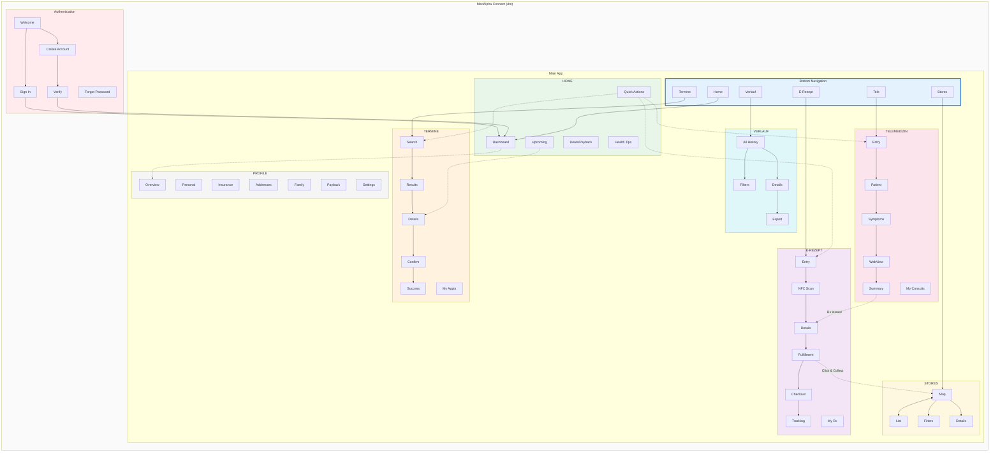

# Info Map

Notes: This document is derived from SCOPE-FOR-EXPLORATION.md. Items listed under Assumptions are inferred and not explicitly stated in the source.

## High-Level Structure

```
MedAlpha Connect (dm)
│
├── Authentication
│   ├── Welcome
│   ├── Sign In
│   ├── Create Account
│   ├── Verify (Email/SMS)
│   └── Forgot Password
│
├── Main Application
│   │
│   ├── HOME (Dashboard)
│   │   ├── Personalized Content (CMS)
│   │   ├── dm Deals & Payback
│   │   ├── Health Tips
│   │   ├── Upcoming Appointments
│   │   ├── Active Prescriptions
│   │   └── Quick Actions
│   │
│   ├── TERMINE (Booking)
│   │   ├── Search
│   │   │   ├── Doctor Search
│   │   │   ├── Health Check Search
│   │   │   └── Beauty Service Search
│   │   ├── Results List
│   │   ├── Provider/Service Details
│   │   ├── Booking Confirmation
│   │   ├── Booking Success
│   │   └── My Appointments
│   │
│   ├── TELEMEDIZIN
│   │   ├── Entry (Specialty Select)
│   │   ├── Patient Selection
│   │   ├── Symptom Input
│   │   ├── Teleclinic WebView
│   │   ├── Consultation Summary
│   │   └── My Consultations
│   │
│   ├── E-REZEPT
│   │   ├── Entry (Online/Offline Choice)
│   │   ├── NFC Scan
│   │   ├── Prescription Details
│   │   ├── Fulfillment Choice
│   │   │   ├── Delivery Checkout
│   │   │   └── Click & Collect (Store Select)
│   │   ├── Order Confirmation
│   │   ├── Order Tracking
│   │   └── My Prescriptions
│   │
│   ├── STORES (dm + Pharmacies)
│   │   ├── Map View
│   │   ├── List View
│   │   ├── Filters
│   │   ├── Store Details
│   │   └── Directions
│   │
│   ├── VERLAUF (History)
│   │   ├── All History
│   │   ├── Filters
│   │   ├── Item Details
│   │   └── Export
│   │
│   └── PROFILE
│       ├── Overview
│       ├── Personal Info
│       ├── Insurance
│       ├── Addresses
│       ├── Family Members
│       ├── Payback
│       ├── dm Account Link
│       ├── Notifications Settings
│       └── Help & Support
│
└── System Layer
    ├── Push Notifications
    ├── Deep Links
    ├── Bottom Sheets
    └── Modals
```

### Assumptions

- Bottom navigation exists with tabs: Home, Termine, Tele, E-Rezept, Stores, Verlauf.
- Dedicated Stores section exists separate from the E-Rezept flow.
- Dedicated Profile section includes Payback, dm Account Link, Notification Settings, Help & Support.
- Forgot Password screen exists in Authentication.
- System Layer grouping (Push Notifications, Deep Links, Bottom Sheets, Modals) exists.

## Master IA Diagram



Note: The diagram reflects the assumptions listed above.

## Navigation Paths

| Flow | Primary Path | Optimized For | Alternative |
|------|--------------|---------------|-------------|
| Registration | Welcome → Create → Verify → Profile | New users | SSO via dm account |
| Booking | Tab → Search → Results → Book | Discovery | Home → Quick Action |
| Telemedicine | Tab → Specialty → Symptoms → Video | Speed | Post-appointment prompt |
| Online Rx | Tab → NFC → Details → Checkout | Convenience | Telemedicine → Rx CTA |
| Offline Rx | Tab → Map → Select → Directions | Local pickup | Click & Collect from E-Rezept |
| History | Tab → Filter → Details → Export | Records | Home → Upcoming tap |
| Home | App Open → Dashboard | Engagement | Notification deep link |


### Key dm Integration Points

- **SSO** - Link existing dm account at registration
- **Click & Collect** - Pickup at dm stores for E-Rezept
- **In-Store Services** - Health checks and beauty bookings
- **Payback** - Loyalty points on orders
- **Deals** - dm promotions on home screen via CMS
- **Store Finder** - dm + pharmacy locations unified
