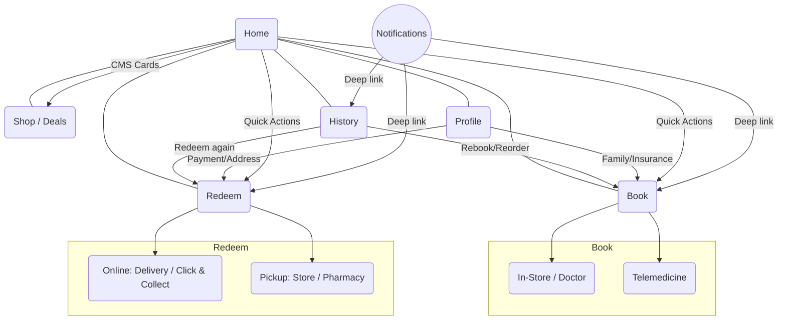

# IA Map — MedAlpha Connect (dm-style retail partner)
Date: January 20, 2026  
Source: `scope-for-exploration.md`

## IA Overview Diagram

## Top-Level Navigation
- **Home** — CMS-driven feed (dm branding, deals, Payback, health tips) + quick actions.
- **Book** — In-store health checks, doctor visits, telemedicine entry.
- **Redeem** — Prescription redemption: Online (delivery/Click & Collect) and Offline Pickup.
- **Shop/Deals** — OTC, supplements, beauty, loyalty/deals integration.
- **History** — Unified log of appointments, telemed visits, redemptions, purchases; exports and reminders.
- **Profile** — Account, insurance, addresses, payment methods, family members, consent, notification settings.

## Cross-Entry & Deep Links
- Notifications → target detail (appointment, redemption, deal, reminder).  
- Calendar events → Appointment detail.  
- CMS cards → specific flow entry (Book, Redeem, Shop).  
- History → Rebook, Reorder, or Redeem again.  
- Map links → external Maps for directions.

## Object-to-Location Mapping
- **User Profile / Family Member** — Profile tab; picker surfaced in Book & Redeem steps.  
- **Insurance / eGK** — Profile > Insurance; verification step in Redeem Online.  
- **Payment Method** — Profile > Payments; used in Book (paid services) and Redeem Online.  
- **Addresses** — Profile > Addresses; reused for delivery and Click & Collect defaults.  
- **Loyalty & Deals (Payback)** — Home cards; Shop/Deals tab.  
- **Appointment / In-Store Service** — Book tab; details live in History.  
- **Telemedicine Visit** — Book > Telemedicine; session recap in History.  
- **Prescription & Order** — Redeem tab; tracking in History.  
- **Store/Pharmacy** — Redeem > Pickup search; map detail screen.  
- **History Entry** — History tab; exports and reminders.  
- **Notification** — Settings in Profile; entries link into target flows.  
- **CMS Card / Home Quick Action** — Home layout; editable via CMS (partner admin future state).

## Navigation Paths Optimized for Flows
- Home → Quick Action → Flow steps (Book, Telemed, Redeem, Shop).  
- Home → Deal card → Shop/Deals or Redeem (Click & Collect).  
- Redeem → Online → Scan → Delivery/Click & Collect → Tracking.  
- Redeem → Pickup → Store/Pharmacy Finder → Directions → Confirm.  
- Book → Telemedicine → Device Check → Session → Summary.  
- History → Detail → Rebook/Reorder/Redeem → Confirmation.  
- Notification → Deep link → Relevant step with pre-filled context.

## Permissions & Accessibility
- Location permission requested at Redeem Pickup and store search with manual entry fallback.  
- Camera/Mic for telemedicine; NFC for eGK scan; graceful fallbacks (photo/manual).  
- Large text/high contrast for profile, telemed setup, Helga persona accessibility needs.

## Admin / CMS (future-ready)
- CMS content editor (partner) to manage Home cards, deals, and quick actions.  
- Multi-tenant branding support; preview mode before publish.

## IA Change Log (relative to generic health app)
- Added dm-specific Home CMS, Deals/Payback hooks, in-store service entry.  
- Split Redeem into Online vs Pickup to foreground Click & Collect.  
- Surfaced Family picker across Book/Redeem.  
- History unified with shopping + health events.
