# Info Map - User Flows

**Generated From:** SCOPE-FOR-EXPLORATION.md
**Date:** 2026-01-20
**Focus:** dm-drogerie markt retail partner integration (healthcare + shopping + loyalty)

---


# Part 1: User Flows

## 1.1 Jobs-to-be-Done Summary

| Job ID | Feature | Job Statement | Primary Personas |
|--------|---------|---------------|------------------|
| J1 | Registration | When I download the app, I want to register quickly so that I can access healthcare + shopping features | Elena, All |
| J2 | Profile | When I need to use core features, I want to complete my profile so that insurance/family are set up | Helga, Sarah |
| J3 | Booking | When I need care, I want to book doctor/in-store appointments so that I get confirmed slots | Sarah, Marc, Elena |
| J4 | Telemedicine | When I have a health concern, I want video consultation so that I avoid travel | Marc, Sarah, Helga |
| J5 | Online Rx | When I have a prescription, I want to redeem online so that meds come to me | Helga, Sarah, Elena |
| J6 | Offline Rx | When I prefer pickup, I want to find dm/pharmacies so that I get meds locally | Thomas, Sarah |
| J7 | History | When I need records, I want to view history so that I track everything | Sarah, Helga |
| J8 | Home | When I open the app, I want personalized content so that I see relevant actions/deals | Elena, All |
| J9 | Notifications | When something needs attention, I want alerts so that I don't miss important actions | All |

## 1.2 Flow 1: User Registration (J1)

### Flow Steps

| Step | User Action | System Response | Objects Modified | Success Criteria |
|------|-------------|-----------------|------------------|------------------|
| 1 | Open app (first time) | Show registration prompt | - | Prompt displays |
| 2 | Enter name, email/phone, password | Validate inputs | - | No errors |
| 3 | Tap "Registrieren" | Send verification code | User: created (pending) | Code sent |
| 4 | Enter verification code | Verify code | User: verified | Code accepted |
| 5 | (Optional) Link dm account via SSO | Connect dm login | User: dmAccountLinked | SSO success |
| 6 | Navigate to profile completion | Show profile form | - | Form displays |

### Decision Points

| Branch Point | Condition | Path A | Path B |
|--------------|-----------|--------|--------|
| Verification method | Email or Phone? | Email verification | SMS verification |
| dm account | Has dm account? | SSO handoff | Skip to profile |

### Flow Diagram


## 1.3 Flow 2: Profile Completion (J2)

### Flow Steps

| Step | User Action | System Response | Objects Modified | Success Criteria |
|------|-------------|-----------------|------------------|------------------|
| 1 | View profile form | Show fields (insurance, address, family) | - | Form loads |
| 2 | Enter insurance details (GKV/PKV, eGK) | Validate insurance | Insurance: created | Insurance saved |
| 3 | Enter address | Save address | Address: created | Address saved |
| 4 | (Optional) Add family members | Show family form | - | Form displays |
| 5 | Enter family member details | Validate, request consent | FamilyMember: created | Member added |
| 6 | Tap "Speichern" | Show success, unlock features | User: profileComplete | Success message |

### Flow Diagram


## 1.4 Flow 3: Appointment Booking (J3)

### Flow Steps

| Step | User Action | System Response | Objects Modified | Success Criteria |
|------|-------------|-----------------|------------------|------------------|
| 1 | Tap "Termin buchen" | Show search screen | - | Screen loads |
| 2 | Select type (Doctor/Health Check/Beauty) | Filter by type | - | Type selected |
| 3 | Enter specialty/service + location | Search Curaay + dm API | - | Results load |
| 4 | Browse results | Show cards with slots | - | Cards display |
| 5 | Select provider/service + time slot | Show confirmation | - | Details shown |
| 6 | Select patient (self or family) | Update patient field | - | Patient selected |
| 7 | Confirm booking | Process via Curaay/dm | Appointment: created | Confirmation shown |
| 8 | Add to calendar | Create calendar event | Appointment: calendarSynced | Event added |
| 9 | Set reminder | Schedule push | Notification: scheduled | Reminder set |

### Decision Points

| Branch Point | Condition | Path A | Path B | Path C |
|--------------|-----------|--------|--------|--------|
| Booking type | What type? | Doctor (Curaay) | Health Check (dm) | Beauty (dm) |
| Patient | Who is this for? | Self | Family member | - |
| Payment | Beauty service? | Show payment | Skip payment | - |

### Flow Diagram


## 1.5 Flow 4: Telemedicine Consultation (J4)

### Flow Steps

| Step | User Action | System Response | Objects Modified | Success Criteria |
|------|-------------|-----------------|------------------|------------------|
| 1 | Tap "Telemedizin" | Show Teleclinic entry | - | Entry screen loads |
| 2 | Select specialty (sports/nutrition/derma/general) | Filter doctors | - | Specialty set |
| 3 | Select patient (self or family) | Check consent for minors | - | Patient selected |
| 4 | Input symptoms | Capture description | Consultation: symptoms | Symptoms saved |
| 5 | Check availability | Query Teleclinic 24/7 | - | Availability shown |
| 6 | Enter Teleclinic WebView | Handoff to partner | Consultation: created | WebView loads |
| 7 | Complete video setup (mic/camera test) | Validate devices | - | Setup complete |
| 8 | Conduct consultation | Video session | Consultation: in_progress | Session active |
| 9 | End session | Show summary | Consultation: completed | Summary shown |
| 10 | Prompt for prescription/OTC | Show redemption CTA | - | CTA displayed |

### Decision Points

| Branch Point | Condition | Path A | Path B |
|--------------|-----------|--------|--------|
| Patient | Self or Family? | Self flow | Minor consent check |
| Post-consult | Prescription issued? | Go to E-Rezept | OTC prompt |
| Follow-up | Doctor recommends? | Schedule follow-up | End |

### Flow Diagram


## 1.6 Flow 5: Online Prescription Redemption (J5)

### Flow Steps

| Step | User Action | System Response | Objects Modified | Success Criteria |
|------|-------------|-----------------|------------------|------------------|
| 1 | Tap "E-Rezept" or prompt | Show redemption options | - | Options shown |
| 2 | Choose "Online einlösen" | Show NFC scan screen | - | Scan screen loads |
| 3 | Hold eGK to phone | CardLink NFC scan | - | Card detected |
| 4 | Verify insurance | Check via CardLink | - | Insurance verified |
| 5 | View prescription details | Show medications + costs | Prescription: retrieved | Details shown |
| 6 | Select fulfillment (Delivery/Click & Collect) | Show options | - | Option selected |
| 7a | (Delivery) Confirm address | Load from profile | Order: address set | Address confirmed |
| 7b | (Click & Collect) Select dm store | Show store picker | Order: pickupStore | Store selected |
| 8 | (Optional) Apply Payback | Calculate points | Order: paybackApplied | Points shown |
| 9 | (Optional) Select discreet packaging | Toggle option | Order: discreetPackaging | Option set |
| 10 | Confirm order | Process via Apo Group | Order: created | Order confirmed |
| 11 | View tracking | Show status timeline | Order: status updates | Tracking visible |

### Decision Points

| Branch Point | Condition | Path A | Path B |
|--------------|-----------|--------|--------|
| Fulfillment | Delivery or Pickup? | Home delivery | Click & Collect at dm |
| Discreet | Sensitive items? | Enable discreet packaging | Standard packaging |
| Recurring | Recurring prescription? | Set up auto-refill reminder | One-time |

### Flow Diagram



```mermaid
flowchart TD
    START([Have Prescription]) --> ENTRY[Tap 'E-Rezept']
    ENTRY --> ONLINE[Choose 'Online einlösen']

    subgraph NFC_SCAN["NFC Scan"]
        ONLINE --> SCAN_PROMPT[Show NFC Instructions]
        SCAN_PROMPT --> HOLD[Hold eGK to Phone]
        HOLD --> DETECT{Card Detected?}
        DETECT -->|No| RETRY[Retry]
        RETRY --> HOLD
        DETECT -->|Yes| VERIFY[Verify Insurance]
        VERIFY --> DETAILS[Show Prescription Details]
    end

    subgraph FULFILLMENT["Fulfillment Choice"]
        DETAILS --> FULFILL{Delivery or Click & Collect?}
        FULFILL -->|Delivery| DELIVERY
        FULFILL -->|Click & Collect| COLLECT

        subgraph DELIVERY["Home Delivery"]
            DEL_ADDR[Confirm/Edit Address]
        end

        subgraph COLLECT["Click & Collect"]
            STORE_SELECT[Select dm Store]
        end
    end

    DEL_ADDR --> OPTIONS
    STORE_SELECT --> OPTIONS

    subgraph ORDER_OPTIONS["Order Options"]
        OPTIONS[Order Options]
        OPTIONS --> PAYBACK{Apply Payback?}
        PAYBACK -->|Yes| ADD_PAYBACK[Add Points]
        PAYBACK -->|No| DISCREET
        ADD_PAYBACK --> DISCREET
        DISCREET{Discreet Packaging?}
        DISCREET -->|Yes| SET_DISCREET[Enable Discreet]
        DISCREET -->|No| SUMMARY
        SET_DISCREET --> SUMMARY[Order Summary]
    end

    SUMMARY --> CONFIRM[Tap 'Bestellen']
    CONFIRM --> PROCESSING[Processing via Apo Group]
    PROCESSING --> SUCCESS[Order Confirmed]

    subgraph TRACKING["Tracking"]
        SUCCESS --> TRACK[View Tracking]
        TRACK --> STATUS[Status Updates]
        STATUS --> COMPLETE{Delivered/Collected?}
        COMPLETE -->|Yes| DONE
        COMPLETE -->|No| STATUS
    end

    DONE([Order Complete])

    style START fill:#e3f2fd
    style DONE fill:#e8f5e9
    style RETRY fill:#fff3e0
```

## 1.7 Flow 6: Offline Prescription Redemption (J6)

### Flow Steps

| Step | User Action | System Response | Objects Modified | Success Criteria |
|------|-------------|-----------------|------------------|------------------|
| 1 | Choose "Vor Ort einlösen" | Show location search | - | Search loads |
| 2 | Grant location permission | Get GPS coordinates | - | Location acquired |
| 3 | Search dm stores/pharmacies | Query Google Maps + dm API | - | Results shown |
| 4 | Filter (open now, distance, stock) | Update results | - | Filtered |
| 5 | Select dm store or pharmacy | Show details | - | Details shown |
| 6 | View directions | Open Maps app | - | Maps opens |
| 7 | Redeem at location | Update status | Prescription: redeemed | Confirmation |
| 8 | Update history | Add to history | History: updated | History saved |

### Flow Diagram



```mermaid
flowchart TD
    START([Prefer Pickup]) --> ENTRY[Tap 'E-Rezept']
    ENTRY --> OFFLINE[Choose 'Vor Ort einlösen']

    subgraph LOCATION["Location Search"]
        OFFLINE --> LOC_PERM{Location Permission?}
        LOC_PERM -->|Denied| MANUAL[Enter Address Manually]
        LOC_PERM -->|Granted| GPS[Use Current Location]
        MANUAL --> SEARCH
        GPS --> SEARCH[Search dm/Pharmacies]
    end

    subgraph RESULTS["Results"]
        SEARCH --> MAP_LIST[Map + List View]
        MAP_LIST --> FILTERS[Apply Filters]
        FILTERS --> FILTER_OPT{Filter Options}
        FILTER_OPT -->|Open Now| OPEN_FILTER
        FILTER_OPT -->|Distance| DIST_FILTER
        FILTER_OPT -->|Has Stock| STOCK_FILTER
        OPEN_FILTER --> UPDATED
        DIST_FILTER --> UPDATED
        STOCK_FILTER --> UPDATED
        UPDATED[Updated Results]
    end

    UPDATED --> SELECT[Select dm/Pharmacy]

    subgraph STORE_DETAIL["Store Details"]
        SELECT --> DETAIL[View Details]
        DETAIL --> INFO[Hours, Services, Distance]
        INFO --> ACTIONS{Choose Action}
        ACTIONS -->|Directions| MAPS[Open Maps App]
        ACTIONS -->|Call| CALL[Call Store]
    end

    MAPS --> NAVIGATE[Navigate to Store]
    NAVIGATE --> ARRIVE[Arrive at Store]
    ARRIVE --> REDEEM[Redeem Prescription]
    REDEEM --> CONFIRM[Confirmation]
    CONFIRM --> HISTORY[Update History]
    HISTORY --> DONE([Prescription Redeemed])

    style START fill:#e3f2fd
    style DONE fill:#e8f5e9
```

## 1.8 Flow 7: History Tracking (J7)

### Flow Steps

| Step | User Action | System Response | Objects Modified | Success Criteria |
|------|-------------|-----------------|------------------|------------------|
| 1 | Tap "Verlauf" tab | Show history list | - | List loads |
| 2 | View chronological list | Display all items | - | Items shown |
| 3 | Filter by type/date/family member | Update list | - | Filtered |
| 4 | Tap item for details | Show detail view | - | Details shown |
| 5 | (Optional) Export to PDF | Generate document | - | PDF created |
| 6 | (Optional) Set refill reminder | Schedule notification | Notification: scheduled | Reminder set |

### Flow Diagram


## 1.9 Flow 8: Home Screen (J8)

### Flow Steps

| Step | User Action | System Response | Objects Modified | Success Criteria |
|------|-------------|-----------------|------------------|------------------|
| 1 | Open app | Load home screen | - | Screen loads |
| 2 | Check profile status | Gate features if incomplete | - | Status checked |
| 3 | Load CMS content | Fetch deals, health tips, Payback | CMS Content: loaded | Content displays |
| 4 | View personalized sections | Show based on profile | - | Personalized |
| 5 | Tap quick action | Navigate to feature | - | Feature opens |
| 6 | Pull to refresh | Update content | CMS Content: refreshed | Content updated |

### Flow Diagram


## 1.10 Flow 9: Push Notifications (J9)

### Flow Steps

| Step | User Action | System Response | Objects Modified | Success Criteria |
|------|-------------|-----------------|------------------|------------------|
| 1 | Event triggers notification | Send via FCM/APNs | Notification: sent | Push delivered |
| 2 | Receive notification | Display on device | - | Notification shows |
| 3 | Tap notification | Deep link to relevant screen | - | Screen opens |
| 4 | Complete action | Update related object | Varies | Action completed |

### Notification Types

| Type | Trigger | Content | Deep Link |
|------|---------|---------|-----------|
| Appointment Reminder | 24h/1h before | "Ihr Termin morgen um 14:00" | Appointment Details |
| Prescription Ready | Order status change | "Ihre Medikamente sind abholbereit" | Order Tracking |
| dm Deals | CMS schedule | "20% auf Vitamine heute!" | Deal Detail |
| Payback | Points earned | "Sie haben 50 Punkte gesammelt" | Payback Dashboard |
| Refill Reminder | History flag | "Zeit für Ihre Rezeptverlängerung" | E-Rezept Entry |
| Post-Appointment | 60 min after | "Wie war Ihr Termin? Rezept einlösen?" | Feedback + E-Rezept |

### Flow Diagram


## 1.11 Flow Metrics

| Flow | Primary Metric | Target | Fallback Metric |
|------|----------------|--------|-----------------|
| Registration | Completion rate | >90% | Time to complete <1 min |
| Profile | Profile completion rate | >80% | Insurance verification success |
| Booking | Booking completion rate | >60% | Time to book <2 min |
| Telemedicine | Session completion rate | >85% | Video setup success >95% |
| Online Rx | Redemption rate | >70% | NFC scan success >85% |
| Offline Rx | Store selection rate | >60% | Directions opened >50% |
| History | Export/reminder usage | >20% | Page views per session |
| Home | Quick action tap rate | >40% | Session duration |
| Notifications | Tap-through rate | >25% | Delivery rate >98% |

---

# Part 2: IA Map

## 2.1 High-Level Structure

```
MedAlpha Connect (dm)
│
├── 🔐 Authentication
│   ├── Welcome
│   ├── Sign In
│   ├── Create Account
│   ├── Verify (Email/SMS)
│   └── Forgot Password
│
├── 📱 Main Application
│   │
│   ├── 🏠 HOME (Dashboard)
│   │   ├── Personalized Content (CMS)
│   │   ├── dm Deals & Payback
│   │   ├── Health Tips
│   │   ├── Upcoming Appointments
│   │   ├── Active Prescriptions
│   │   └── Quick Actions
│   │
│   ├── 📅 TERMINE (Booking)
│   │   ├── Search
│   │   │   ├── Doctor Search
│   │   │   ├── Health Check Search
│   │   │   └── Beauty Service Search
│   │   ├── Results List
│   │   ├── Provider/Service Details
│   │   ├── Booking Confirmation
│   │   ├── Booking Success
│   │   └── My Appointments
│   │
│   ├── 📹 TELEMEDIZIN
│   │   ├── Entry (Specialty Select)
│   │   ├── Patient Selection
│   │   ├── Symptom Input
│   │   ├── Teleclinic WebView
│   │   ├── Consultation Summary
│   │   └── My Consultations
│   │
│   ├── 💊 E-REZEPT
│   │   ├── Entry (Online/Offline Choice)
│   │   ├── NFC Scan
│   │   ├── Prescription Details
│   │   ├── Fulfillment Choice
│   │   │   ├── Delivery Checkout
│   │   │   └── Click & Collect (Store Select)
│   │   ├── Order Confirmation
│   │   ├── Order Tracking
│   │   └── My Prescriptions
│   │
│   ├── 🏪 STORES (dm + Pharmacies)
│   │   ├── Map View
│   │   ├── List View
│   │   ├── Filters
│   │   ├── Store Details
│   │   └── Directions
│   │
│   ├── 📜 VERLAUF (History)
│   │   ├── All History
│   │   ├── Filters
│   │   ├── Item Details
│   │   └── Export
│   │
│   └── 👤 PROFILE
│       ├── Overview
│       ├── Personal Info
│       ├── Insurance
│       ├── Addresses
│       ├── Family Members
│       ├── Payback
│       ├── dm Account Link
│       ├── Notifications Settings
│       └── Help & Support
│
└── 🔔 System Layer
    ├── Push Notifications
    ├── Deep Links
    ├── Bottom Sheets
    └── Modals
```

## 2.2 Master IA Diagram


## 2.3 Navigation Paths

| Flow | Primary Path | Optimized For | Alternative |
|------|--------------|---------------|-------------|
| Registration | Welcome → Create → Verify → Profile | New users | SSO via dm account |
| Booking | Tab → Search → Results → Book | Discovery | Home → Quick Action |
| Telemedicine | Tab → Specialty → Symptoms → Video | Speed | Post-appointment prompt |
| Online Rx | Tab → NFC → Details → Checkout | Convenience | Telemedicine → Rx CTA |
| Offline Rx | Tab → Map → Select → Directions | Local pickup | Click & Collect from E-Rezept |
| History | Tab → Filter → Details → Export | Records | Home → Upcoming tap |
| Home | App Open → Dashboard | Engagement | Notification deep link |

---

# Part 3: Screen List

## 3.1 Complete Screen Inventory

### 🔐 Authentication (5 screens)

| ID | Screen | Purpose | Entry Points |
|----|--------|---------|--------------|
| AUTH-01 | Welcome | First launch, value prop | App launch (first time) |
| AUTH-02 | Sign In | Login with credentials | Welcome, Sign out |
| AUTH-03 | Create Account | New user registration | Welcome |
| AUTH-04 | Verify | Email/SMS verification | Create Account |
| AUTH-05 | Forgot Password | Password recovery | Sign In |

### 🏠 Home (1 screen, 5 sections)

| ID | Screen | Purpose | Entry Points |
|----|--------|---------|--------------|
| HOME-01 | Dashboard | Central hub with CMS content | Tab, Login, Deep link |

### 📅 Termine - Booking (8 screens)

| ID | Screen | Purpose | Entry Points |
|----|--------|---------|--------------|
| BOOK-01 | Search | Specialty/location/type input | Tab, Home quick action |
| BOOK-02 | Results | List of doctors/services | Search |
| BOOK-03 | Provider Details | Doctor/service info, slots | Results |
| BOOK-04 | Booking Confirmation | Confirm details | Slot selection |
| BOOK-05 | Patient Selection | Self or family member | Confirmation |
| BOOK-06 | Payment | Beauty service payment | Confirmation (beauty) |
| BOOK-07 | Booking Success | Confirmation + next actions | Book |
| BOOK-08 | My Appointments | List of booked appointments | Tab overflow |

### 📹 Telemedizin (8 screens)

| ID | Screen | Purpose | Entry Points |
|----|--------|---------|--------------|
| TELE-01 | Entry | Specialty selection | Tab, Home quick action |
| TELE-02 | Patient Selection | Self or family member | Entry |
| TELE-03 | Consent | Minor consent confirmation | Patient (if minor) |
| TELE-04 | Symptom Input | Describe symptoms | Patient/Consent |
| TELE-05 | Availability | Check 24/7 availability | Symptoms |
| TELE-06 | Teleclinic WebView | Partner video experience | Availability |
| TELE-07 | Consultation Summary | Diagnosis + actions | Session end |
| TELE-08 | My Consultations | Past consultations | Tab overflow |

### 💊 E-Rezept (11 screens)

| ID | Screen | Purpose | Entry Points |
|----|--------|---------|--------------|
| ERX-01 | Entry | Online vs Offline choice | Tab, Home, Tele Summary |
| ERX-02 | NFC Scan | CardLink eGK scan | Entry (online) |
| ERX-03 | Verification | Insurance verification | NFC success |
| ERX-04 | Prescription Details | Medications + costs | Verification |
| ERX-05 | Fulfillment Choice | Delivery vs Click & Collect | Details |
| ERX-06 | Delivery Checkout | Address, payment, options | Fulfillment (delivery) |
| ERX-07 | Store Selection | Select dm for Click & Collect | Fulfillment (collect) |
| ERX-08 | Order Summary | Review before submit | Checkout/Store |
| ERX-09 | Order Confirmation | Success + order number | Summary |
| ERX-10 | Order Tracking | Status timeline | Confirmation |
| ERX-11 | My Prescriptions | All prescriptions | Tab overflow |

### 🏪 Stores (5 screens)

| ID | Screen | Purpose | Entry Points |
|----|--------|---------|--------------|
| STORE-01 | Map View | Map with dm/pharmacy pins | Tab, E-Rezept |
| STORE-02 | List View | Store cards list | Map toggle |
| STORE-03 | Filters | Filter options | Map/List |
| STORE-04 | Store Details | Full store info | Pin/Card tap |
| STORE-05 | Directions | Maps integration | Details |

### 📜 Verlauf - History (4 screens)

| ID | Screen | Purpose | Entry Points |
|----|--------|---------|--------------|
| HIST-01 | All History | Chronological list | Tab |
| HIST-02 | Filters | Filter by type/date/family | All History |
| HIST-03 | Item Details | Single item view | List tap |
| HIST-04 | Export | PDF generation | Details |

### 👤 Profile (9 screens)

| ID | Screen | Purpose | Entry Points |
|----|--------|---------|--------------|
| PROF-01 | Overview | Profile summary | Header icon |
| PROF-02 | Personal Info | Name, email, phone | Overview |
| PROF-03 | Insurance | GKV/PKV details | Overview |
| PROF-04 | Addresses | Delivery addresses | Overview |
| PROF-05 | Family Members | Manage dependents | Overview |
| PROF-06 | Payback | Loyalty points | Overview |
| PROF-07 | dm Account | Link/unlink dm | Overview |
| PROF-08 | Notification Settings | Preferences | Overview |
| PROF-09 | Help & Support | FAQ, contact | Overview |

## 3.2 Screen Count Summary

| Section | Screens | Percentage |
|---------|---------|------------|
| Authentication | 5 | 10% |
| Home | 1 | 2% |
| Booking | 8 | 16% |
| Telemedicine | 8 | 16% |
| E-Rezept | 11 | 22% |
| Stores | 5 | 10% |
| History | 4 | 8% |
| Profile | 9 | 18% |
| **Total** | **51** | **100%** |

## 3.3 Screen Relationship Diagram


---

## Summary

| Artifact | Count |
|----------|-------|
| **Objects** | 22 (7 primary, 11 secondary, 4 derived) |
| **User Flows** | 9 complete flows |
| **Screens** | 51 screens |
| **Sections** | 8 main sections |
| **Cross-flow Connections** | 6 integration points |

### Key dm Integration Points

1. **SSO** - Link existing dm account at registration
2. **Click & Collect** - Pickup at dm stores for E-Rezept
3. **In-Store Services** - Health checks and beauty bookings
4. **Payback** - Loyalty points on orders
5. **Deals** - dm promotions on home screen via CMS
6. **Store Finder** - dm + pharmacy locations unified
