```mermaid
flowchart TD
    START([App Download]) --> OPEN[Open App First Time]
    OPEN --> WELCOME[Welcome Screen]

    subgraph REGISTRATION["Registration Flow"]
        WELCOME --> CHOICE{User Choice}
        CHOICE -->|Register| REG_FORM[Registration Form]
        CHOICE -->|Sign In| SIGN_IN[Sign In Form]

        REG_FORM --> INPUT[Enter Name, Email, Password]
        INPUT --> VALIDATE{Valid?}
        VALIDATE -->|No| ERROR[Show Errors]
        ERROR --> INPUT
        VALIDATE -->|Yes| SUBMIT[Tap 'Register']
        SUBMIT --> VERIFY_SEND[Send Email Verification]
    end

    subgraph VERIFICATION["Email Verification 🟡MOD"]
        VERIFY_SEND --> VERIFY_INPUT[Enter Code]
        VERIFY_INPUT --> VERIFY_CHECK{Code Valid?}
        VERIFY_CHECK -->|No| RETRY[Retry / Resend]
        RETRY --> VERIFY_INPUT
        VERIFY_CHECK -->|Yes| VERIFIED[Account Verified]
    end

    SIGN_IN --> SIGN_CHECK{Credentials Valid?}
    SIGN_CHECK -->|No| SIGN_ERROR[Show Error]
    SIGN_ERROR --> SIGN_IN
    SIGN_CHECK -->|Yes| VERIFIED

    VERIFIED --> PROFILE_CHECK{Profile Complete?}
    PROFILE_CHECK -->|No| PROFILE_GATE["Profile Completion 🟢NEW"]
    PROFILE_CHECK -->|Yes| HOME
    PROFILE_GATE --> HOME([Home Screen])

    style START fill:#000000,stroke:#000000,color:#ffffff
    style HOME fill:#000000,stroke:#000000,color:#ffffff
    style ERROR fill:#ffebee,stroke:#c62828,color:#b71c1c
    style SIGN_ERROR fill:#ffebee,stroke:#c62828,color:#b71c1c
    style VERIFICATION fill:#fff9c4,stroke:#f9a825
    style PROFILE_GATE fill:#c8e6c9,stroke:#2e7d32
```

```mermaid
flowchart TD
    START([Need Appointment]) --> ENTRY{Entry Point}
    ENTRY -->|Book Tab| SEARCH
    ENTRY -->|Home Quick Action| SEARCH
    ENTRY -->|History Book Again| SEARCH

    subgraph SEARCH_FLOW["Step 1: Specialty Search 🟡MOD"]
        SEARCH[Search Screen]
        SEARCH --> SPECIALTY_INPUT[Search/Select Specialty]
        SPECIALTY_INPUT --> RECENT[Recent Searches]
        SPECIALTY_INPUT --> CHIPS[Common Specialties]
        RECENT --> SELECT_SPEC[Select Specialty]
        CHIPS --> SELECT_SPEC
        SELECT_SPEC --> CONTINUE1[Tap Continue]
    end

    subgraph LOCATION_FLOW["Step 2: Location Selection 🟢NEW"]
        CONTINUE1 --> LOCATION["Location Screen 🟢"]
        LOCATION --> CITY[Select City]
        CITY --> RADIUS[Set Radius]
        RADIUS --> SEARCH_BTN[Tap Search]
    end

    SEARCH_BTN --> RESULTS_CHECK{Results Found?}
    RESULTS_CHECK -->|No| NO_RESULTS[Adjust Filters]
    NO_RESULTS --> SEARCH
    RESULTS_CHECK -->|Yes| RESULTS

    subgraph RESULTS_FLOW["Step 3: Results"]
        RESULTS[Results List]
        RESULTS --> SORT[Sort Options]
        RESULTS --> CARDS[Doctor Cards]

        CARDS --> QUICK_SLOT{Quick Slot?}
        QUICK_SLOT -->|Yes| QUICK_SELECT["Tap Slot on Card 🟢"]
        QUICK_SLOT -->|No| CARD_TAP[Tap Doctor Card]
    end

    CARD_TAP --> DOCTOR_PROFILE

    subgraph DOCTOR_FLOW["Doctor Profile"]
        DOCTOR_PROFILE[Doctor Details Screen]
        DOCTOR_PROFILE --> VIEW_INFO[View Profile Info]
        VIEW_INFO --> SELECT_TIME[Tap 'Select Appointment Time']
    end

    SELECT_TIME --> SLOTS

    subgraph SLOT_FLOW["Step 4: Slot Selection 🟢NEW"]
        SLOTS["Slot Selection Screen 🟢"]
        SLOTS --> DATE_PICK[Date Carousel - 7 days]
        DATE_PICK --> TIME_GRID[Available Time Slots]
        TIME_GRID --> SELECT_SLOT[Select Slot]
        SELECT_SLOT --> PATIENT{Who is Patient?}
        PATIENT -->|Self| SELF[Select Myself]
        PATIENT -->|Family| FAM_SELECT[Select Family Member]
        SELF --> CONTINUE2[Tap Continue]
        FAM_SELECT --> CONTINUE2
    end

    QUICK_SELECT --> CONFIRM
    CONTINUE2 --> CONFIRM

    subgraph CONFIRM_FLOW["Confirmation Modal 🟢NEW"]
        CONFIRM["Confirmation Bottom Sheet 🟢"]
        CONFIRM --> SUMMARY[Appointment Summary]
        SUMMARY --> INSURANCE_BANNER[Insurance Info]
        INSURANCE_BANNER --> REASON[Optional: Add Reason]
        REASON --> CONFIRM_BTN[Tap 'Confirm Appointment']
    end

    CONFIRM_BTN --> PROCESSING[Processing...]
    PROCESSING --> SUCCESS[Success Screen]
    SUCCESS --> DONE([Appointment Booked])

    style START fill:#000000,stroke:#000000,color:#ffffff
    style DONE fill:#000000,stroke:#000000,color:#ffffff
    style NO_RESULTS fill:#ffebee,stroke:#c62828,color:#b71c1c
    style SEARCH_FLOW fill:#fff9c4,stroke:#f9a825
    style LOCATION_FLOW fill:#c8e6c9,stroke:#2e7d32
    style SLOT_FLOW fill:#c8e6c9,stroke:#2e7d32
    style CONFIRM_FLOW fill:#c8e6c9,stroke:#2e7d32
```

```mermaid
flowchart TD
    START([Open App]) --> AUTH_CHECK{Authenticated?}
    AUTH_CHECK -->|No| WELCOME([Welcome Screen])
    AUTH_CHECK -->|Yes| PROFILE_CHECK{Profile Complete?}

    PROFILE_CHECK -->|No| PROFILE_GATE["Profile Completion 🟢NEW"]
    PROFILE_GATE --> PROFILE_FLOW([Profile Flow])
    PROFILE_CHECK -->|Yes| LOAD[Load Home Screen]

    subgraph HOME_SCREEN["Home Screen 🟡MOD"]
        LOAD --> GREETING[User Greeting]
        GREETING --> SECTIONS[Display Sections]

        subgraph CONTENT["Home Content 🟡MOD"]
            SECTIONS --> QUICK["Quick Actions 🟢NEW"]
            SECTIONS --> UPCOMING[Upcoming Appointments]
            SECTIONS --> CMS["For You CMS 🟡MOD"]
        end

        QUICK --> Q_BOOK[Book Appointment]
        QUICK --> Q_FAMILY[Family Members]

        UPCOMING --> UP_CARDS[Next 2 Appointments]
        UP_CARDS --> UP_EMPTY{Has Upcoming?}
        UP_EMPTY -->|No| UP_EMPTY_STATE[Book CTA]

        CMS --> CMS_CARDS[Health Tips Cards]
    end

    Q_BOOK --> BOOKING([Booking Flow])
    Q_FAMILY --> FAMILY([Family Screen])
    UP_CARDS --> HISTORY([History Screen])
    UP_EMPTY_STATE --> BOOKING
    CMS_CARDS --> ARTICLE[View Article]

    style START fill:#000000,stroke:#000000,color:#ffffff
    style HOME_SCREEN fill:#fff9c4,stroke:#f9a825
    style CONTENT fill:#fff9c4,stroke:#f9a825
    style PROFILE_GATE fill:#c8e6c9,stroke:#2e7d32
```

```mermaid
flowchart TD
    START([Settings Tab]) --> SETTINGS["Settings Screen 🟢NEW"]

    subgraph SETTINGS_SCREEN["Settings 🟢NEW"]
        SETTINGS --> PROFILE_CARD["Profile Card 🟢NEW"]
        PROFILE_CARD --> AVATAR[Avatar + Name]
        AVATAR --> EMAIL[Email]
        EMAIL --> INSURANCE_PILL[Insurance Type Pill]

        SETTINGS --> MENU[Menu Items]
        MENU --> FAMILY_ITEM[Family Members]
        MENU --> NOTIF_ITEM[Notifications]

        SETTINGS --> ACTIONS[Actions]
        ACTIONS --> SIGN_OUT[Sign Out]
        ACTIONS --> RESET["Reset All Data 🟢NEW"]
    end

    FAMILY_ITEM --> FAMILY[Family Members Screen]
    NOTIF_ITEM --> NOTIF[Notifications Screen]

    subgraph FAMILY_SCREEN["Family Members"]
        FAMILY --> FAM_LIST[Family List]
        FAM_LIST --> ADD_FAM[Add Member]
        FAM_LIST --> EDIT_FAM[Edit Member]
        FAM_LIST --> DEL_FAM[Delete Member]
    end

    subgraph NOTIF_SCREEN["Notifications"]
        NOTIF --> TOGGLES[Notification Toggles]
        TOGGLES --> APPT_REM[Appointment Reminders]
        TOGGLES --> RX_UPDATE[Prescription Updates]
        TOGGLES --> DEALS[Deals & Marketing]
    end

    SIGN_OUT --> CONFIRM_SIGN{Confirm?}
    CONFIRM_SIGN -->|Yes| SIGNED_OUT([Welcome Screen])
    CONFIRM_SIGN -->|No| SETTINGS

    RESET --> CONFIRM_RESET{Confirm?}
    CONFIRM_RESET -->|Yes| DATA_CLEARED[Data Cleared] --> SIGNED_OUT
    CONFIRM_RESET -->|No| SETTINGS

    style START fill:#000000,stroke:#000000,color:#ffffff
    style SIGNED_OUT fill:#000000,stroke:#000000,color:#ffffff
    style SETTINGS_SCREEN fill:#c8e6c9,stroke:#2e7d32
```

# User Flows - MedAlpha Connect v1 (Curaay Appointments)

**Generated From:** N3 App Implementation + SCOPE-FOR-EXPLORATION.md
**Date:** 2026-01-23
**Purpose:** Document v1 User Flows showing future state with NEW/MODIFIED indicators relative to full vision

---

## Summary of Changes

### Flows Comparison

| Flow | Full Vision | v1 Scope | Status |
|------|-------------|----------|--------|
| J1 - Registration | Email/SMS + SSO | Email only | MODIFIED |
| J2 - Profile | Optional family | Mandatory gate + family | MODIFIED |
| J3 - Booking | Doctor + Health + Beauty | Doctor only (Curaay) | MODIFIED |
| J3a - My Appointments | Full actions | Upcoming/Past with basic actions | MODIFIED |
| J4 - Telemedicine | Full flow | - | OUT |
| J5 - Online Rx | Full flow | - | OUT |
| J6 - Offline Rx | Full flow | - | OUT |
| J7 - History | All types + export | Appointments only | MODIFIED |
| J8 - Home | Full CMS + Payback | Basic CMS + Quick Actions | MODIFIED |
| J9 - Notifications | All types | Basic appointment reminders | MODIFIED |

### NEW Flow Elements (v1)

| Element | Flow | Description |
|---------|------|-------------|
| Profile Completion Gate | J2 | Mandatory step blocking home access until complete |
| Location Step | J3 | Dedicated screen for city/radius selection |
| Slot Selection Screen | J3 | Dedicated date picker + time slot grid |
| Confirmation Modal | J3 | Bottom sheet with patient selector and reason |
| Quick Slot Booking | J3 | Book directly from results without viewing profile |
| Tab Toggle | J7 | Upcoming/Past toggle instead of filter panel |

### MODIFIED Flow Elements (Reduced from Full Vision)

| Element | Full Vision | v1 Scope |
|---------|-------------|----------|
| Registration verification | Email or SMS | Email only |
| dm SSO | Link dm account | Not available |
| Booking type selection | Doctor / Health Check / Beauty | Doctor only |
| Payment step | Required for beauty | Not needed |
| History scope | Appointments + Orders + Purchases | Appointments only |
| History export | PDF export available | Not available |
| Home content | Deals, Payback, Health Tips, Active Rx | Quick Actions, Upcoming, Basic CMS |

---

## Jobs-to-be-Done Summary (v1)

| Job ID | Feature | Job Statement | v1 Status |
|--------|---------|---------------|-----------|
| J1 | Registration | When I download the app, I want to register quickly so that I can access healthcare features | MODIFIED |
| J2 | Profile | When I need to use core features, I want to complete my profile so that insurance/family are set up | MODIFIED |
| J3 | Booking | When I need care, I want to book doctor appointments so that I get confirmed slots | MODIFIED |
| J3a | My Appointments | When I have appointments, I want to view and manage them | MODIFIED |
| J4 | Telemedicine | ~~When I have a health concern, I want video consultation~~ | OUT |
| J5 | Online Rx | ~~When I have a prescription, I want to redeem online~~ | OUT |
| J6 | Offline Rx | ~~When I prefer pickup, I want to find pharmacies~~ | OUT |
| J7 | History | When I need records, I want to view appointment history | MODIFIED |
| J8 | Home | When I open the app, I want to see relevant actions and content | MODIFIED |
| J9 | Notifications | When something needs attention, I want alerts | MODIFIED |

---

## Flow: User Registration (J1) - MODIFIED

### Changes from Full Vision
- Email verification only (no SMS option)
- No dm SSO handoff
- Simplified to essential fields only

### Flow Steps

| Step | User Action | System Response | Objects Modified | Change |
|------|-------------|-----------------|------------------|--------|
| 1 | Open app (first time) | Show welcome screen | - | - |
| 2 | Tap "Register" | Show registration form | - | - |
| 3 | Enter name, email, password | Validate inputs | - | MODIFIED |
| 4 | Tap "Register" | Send email verification code | User: created (pending) | - |
| 5 | Enter verification code | Verify code | User: verified | MODIFIED |
| 6 | Navigate to profile completion | Show profile form | - | NEW |

### Decision Points

| Branch Point | Full Vision | v1 Scope |
|--------------|-------------|----------|
| Verification method | Email or Phone | Email only |
| dm account link | SSO handoff available | Not available |

### Flow Diagram

---

## Flow: Profile Completion (J2) - MODIFIED

### Changes from Full Vision
- NEW: Mandatory gate before accessing home
- Insurance and address required before core features
- Family members optional but accessible

### Flow Steps

| Step | User Action | System Response | Objects Modified | Change |
|------|-------------|-----------------|------------------|--------|
| 1 | Redirected after auth | Show profile completion form | - | NEW |
| 2 | Select insurance type (GKV/PKV) | Update form | - | - |
| 3 | Enter eGK number | Validate format | - | - |
| 4 | Enter address (street, postal, city) | Validate address | - | - |
| 5 | Accept GDPR consent | Enable submit | - | - |
| 6 | Tap "Complete Profile" | Save profile, unlock features | User: profileComplete | NEW |
| 7 | Navigate to Home | Show home screen | - | - |

### Flow Diagram

---

## Flow: Appointment Booking (J3) - MODIFIED

### Changes from Full Vision
- Doctor appointments only (no Health Checks, no Beauty)
- NEW: Dedicated location selection step
- NEW: Dedicated slot selection screen
- NEW: Confirmation modal with patient selector
- NEW: Quick slot booking from results
- No payment step (beauty services OUT)

### Flow Steps

| Step | User Action | System Response | Objects Modified | Change |
|------|-------------|-----------------|------------------|--------|
| 1 | Tap "Book" tab or Quick Action | Show specialty search | - | MODIFIED |
| 2 | Search/select specialty | Save selection | SearchFilters: specialty | - |
| 3 | Tap "Continue" | Show location screen | - | NEW |
| 4 | Select city and radius | Save location | SearchFilters: city, radius | NEW |
| 5 | Tap "Search" | Query Curaay API | - | MODIFIED |
| 6 | Browse results | Show doctor cards with slots | - | - |
| 7a | Tap quick slot on card | Show confirmation modal | - | NEW |
| 7b | Tap doctor card | Show doctor details | - | - |
| 8 | (If 7b) View doctor profile | Show full details | - | - |
| 9 | (If 7b) Tap "Select Time" | Show slot selection | - | NEW |
| 10 | Select date and time slot | Save selection | Booking: slot | NEW |
| 11 | Select patient (self/family) | Save patient | Booking: patient | - |
| 12 | Tap "Continue" | Show confirmation modal | - | NEW |
| 13 | (Optional) Add reason | Save reason | Booking: reason | - |
| 14 | Tap "Confirm Appointment" | Process via Curaay | Appointment: created | - |
| 15 | View success screen | Show confirmation | - | - |

### Decision Points

| Branch Point | Full Vision | v1 Scope |
|--------------|-------------|----------|
| Booking type | Doctor / Health Check / Beauty | Doctor only |
| Quick slot | Available | Available (NEW) |
| Payment | Required for beauty | Not needed |

### Flow Diagram

---

## Flow: My Appointments (J3a) - MODIFIED

### Changes from Full Vision
- Simplified to Upcoming/Past tabs
- Basic actions: Reschedule, Cancel, Book Again
- No calendar sync from list (available at booking)

### Flow Steps

| Step | User Action | System Response | Objects Modified | Change |
|------|-------------|-----------------|------------------|--------|
| 1 | Tap "History" tab | Show appointments list | - | MODIFIED |
| 2 | View Upcoming/Past tabs | Show filtered list | - | NEW |
| 3 | Toggle between tabs | Filter appointments | - | NEW |
| 4 | Tap appointment card | Show details inline | - | MODIFIED |
| 5a | (Upcoming) Tap Reschedule | Start booking flow | - | - |
| 5b | (Upcoming) Tap Cancel | Confirm cancellation | Appointment: cancelled | - |
| 5c | (Past) Tap Book Again | Start booking flow | - | - |

### Flow Diagram

---

## Flow: Home Screen (J8) - MODIFIED

### Changes from Full Vision
- No Deals & Payback section
- No Active Prescriptions section
- Simplified to: Quick Actions, Upcoming, For You (CMS)

### Flow Steps

| Step | User Action | System Response | Objects Modified | Change |
|------|-------------|-----------------|------------------|--------|
| 1 | Open app (authenticated) | Check profile completion | - | NEW |
| 2 | (If incomplete) Redirect | Show profile completion | - | NEW |
| 3 | Load home screen | Fetch CMS content | - | - |
| 4 | View greeting | Show personalized greeting | - | - |
| 5 | View Quick Actions | Show Book + Family shortcuts | - | NEW |
| 6 | View Upcoming | Show next 2 appointments | - | MODIFIED |
| 7 | View For You | Show insurance-specific content | CMS: loaded | MODIFIED |
| 8 | Tap Quick Action | Navigate to feature | - | NEW |
| 9 | Tap Upcoming appointment | Navigate to History | - | - |
| 10 | Tap CMS card | View article | - | - |

### Flow Diagram

---

## Flow: Settings & Profile (NEW for v1)

### Description
Settings replaces the dedicated Profile section from full vision. Provides access to profile management, family members, and notification preferences.

### Flow Steps

| Step | User Action | System Response | Objects Modified | Change |
|------|-------------|-----------------|------------------|--------|
| 1 | Tap "Settings" tab | Show settings screen | - | NEW |
| 2 | View profile card | Show name, email, insurance | - | NEW |
| 3 | Tap "Family Members" | Navigate to family list | - | - |
| 4 | Tap "Notifications" | Navigate to preferences | - | - |
| 5 | Tap "Sign Out" | Sign out user | Auth: cleared | - |
| 6 | Tap "Reset All Data" | Clear local data | All: cleared | NEW |

### Flow Diagram

---

## Flows NOT in v1

### J4 - Telemedicine (OUT)
Full video consultation flow via Teleclinic is not included in v1.

### J5 - Online Prescription Redemption (OUT)
E-Rezept with NFC scan and CardLink integration is not included in v1.

### J6 - Offline Prescription Redemption (OUT)
Store finder and pharmacy pickup is not included in v1.

---

## Flow Metrics (v1)

| Flow | Primary Metric | Target | Notes |
|------|----------------|--------|-------|
| Registration | Completion rate | >90% | Email verification only |
| Profile | Completion rate | >95% | Mandatory gate |
| Booking | Completion rate | >60% | 4-step flow |
| History | View rate | >40% | Per session |
| Home | Quick action tap rate | >30% | Book or Family |
| Settings | Family add rate | >20% | Of users with dependents |

---

## Data Model Impacts (v1)

### New Objects
- `BookingState` - Multi-step booking flow state
- `SearchFilters` - Specialty, city, radius

### Modified Objects
| Object | Full Vision | v1 Scope |
|--------|-------------|----------|
| `User` | Includes Payback, dmAccountId | No Payback, no dm link |
| `Appointment` | Includes type (doctor/health/beauty) | Doctor type only |
| `History` | All types (appt, order, purchase) | Appointments only |

### Integration Points
| Integration | v1 Status |
|-------------|-----------|
| Curaay API | Required (mock in N3) |
| CMS Backend | Required (mock in N3) |
| Teleclinic | Not integrated |
| CardLink | Not integrated |
| dm Store API | Not integrated |
| Payback | Not integrated |
