# User Flows - MedAlpha Connect v4

**Generated From:** DocliQ Mobile App Implementation Analysis
**Date:** 2026-02-05
**Focus:** Curaay doctor appointments with 3 booking paths (Fast-Lane, Specialty-First, Doctor-First)

---

## Changes from v3

| Change Type | Description |
|-------------|-------------|
| **REMOVED** | SymptomsScreen (`/booking/symptoms`) - Removed from booking flows |
| **REMOVED** | Step progress indicators from all booking screens |
| **REMOVED** | SessionStorage-based navigation tracking |
| **REMOVED** | `NavigationTracker` component and `navigation.ts` utility |
| **CHANGED** | Simplified back button logic (3-level fallback instead of 5) |
| **CHANGED** | History "Others" section - filter chips moved underneath label |
| **CHANGED** | "Doctor rescheduled" renamed to "Modified by practice" with IconRefresh |
| **NEW** | Follow-up Visit Card on Home screen |
| **NEW** | My Doctors horizontal scroll section on Home screen |
| **NEW** | `modified_by_practice` appointment status |

---

## Jobs-to-be-Done Summary

| Job ID | Feature | Job Statement | Primary Personas |
|--------|---------|---------------|------------------|
| J1 | Registration | When I download the app, I want to register quickly so that I can access booking features | All |
| J1a | Forgot Password | When I forget my password, I want to reset it easily so that I can regain access | All |
| J2 | Profile | When I need to book, I want to complete my profile so that insurance/family are set up | Sarah, Helga |
| J3a | Fast-Lane Booking | When I need a follow-up visit, I want to quickly rebook with my recent doctor | Marc, Sarah |
| J3b | Acute / Urgent Booking | When I need urgent care, I want to find a specialist quickly so that I get timely treatment | Sarah, Helga |
| J3c | Prevention / Wellness Booking | When I want a routine checkup, I want to browse doctors so that I can choose the right one | Helga, Thomas |
| J4 | Appointment Mgmt | When I have appointments, I want to view/reschedule/cancel so that I stay organized | All |
| J4a | Reschedule | When I need to change an appointment, I want to reschedule easily so that I don't lose my spot | All |
| J4b | Book Again | When I want to see a previous doctor, I want to rebook quickly without re-entering details | Helga, Thomas |
| J5 | History | When I need records, I want to view history so that I track past appointments | Sarah, Helga |
| J6 | Notifications | When appointments change status, I want alerts so that I stay informed | All |
| J7 | Content | When I open the app, I want health news so that I stay informed about wellness | Elena, All |
| J8 | Home Screen | When I open the app, I want quick access to my doctors and appointments | All |

---

## Flow: User Registration (J1)

### Flow Steps

| Step | User Action | System Response | Objects Modified | Success Criteria |
|------|-------------|-----------------|------------------|------------------|
| 1 | Open app (first time) | Show welcome screen | - | Welcome displays |
| 2 | Tap "Register" | Show registration form | - | Form displays |
| 3 | Enter name, email, password | Validate inputs | - | No errors |
| 4 | Tap "Create Account" | Send verification code | User: created (pending) | Code sent |
| 5 | Enter verification code | Verify code | User: verified | Code accepted |
| 6 | Navigate to home | Show home screen | - | Home displays |

### Decision Points

| Branch Point | Condition | Path A | Path B |
|--------------|-----------|--------|--------|
| Verification | Code valid? | Continue to home | Retry/Resend |
| Profile | Complete profile now? | Profile completion | Skip to home |

### Flow Diagram

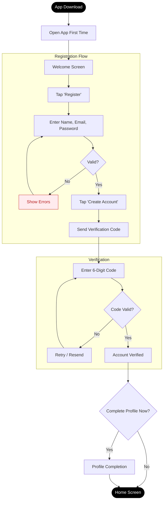

---

## Flow: Forgot Password (J1a)

### Flow Steps

| Step | User Action | System Response | Objects Modified | Success Criteria |
|------|-------------|-----------------|------------------|------------------|
| 1 | Tap "Forgot password?" on Sign In | Show forgot password screen | - | Screen displays |
| 2 | Enter registered email | Validate email exists | - | Email valid |
| 3 | Tap "Send Reset Code" | Send verification code | - | Code sent |
| 4 | Enter verification code | Verify code | - | Code accepted |
| 5 | Enter new password + confirm | Validate password match | User: password updated | Password saved |
| 6 | Auto sign-in | Navigate to home | Auth: authenticated | Home displays |

### Flow Diagram

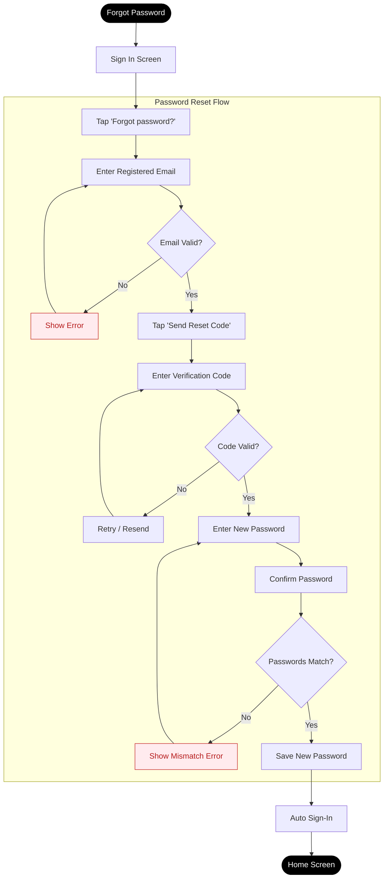

---

## Flow: Profile Completion (J2)

### Flow Steps

| Step | User Action | System Response | Objects Modified | Success Criteria |
|------|-------------|-----------------|------------------|------------------|
| 1 | View profile form | Show fields (name, insurance, address) | - | Form loads |
| 2 | Enter insurance details (GKV/PKV) | Validate insurance | Insurance: set | Insurance saved |
| 3 | Enter EGK number (optional) | Save EGK | User: egkNumber | EGK saved |
| 4 | Enter address | Save address | Address: created | Address saved |
| 5 | (Optional) Add family members | Show family form | - | Form displays |
| 6 | Enter family member details | Validate, save member | FamilyMember: created | Member added |
| 7 | Accept GDPR consent | Record consent | User: gdprConsent | Consent saved |
| 8 | Tap "Save" | Show success | User: profileComplete | Success message |

### Flow Diagram

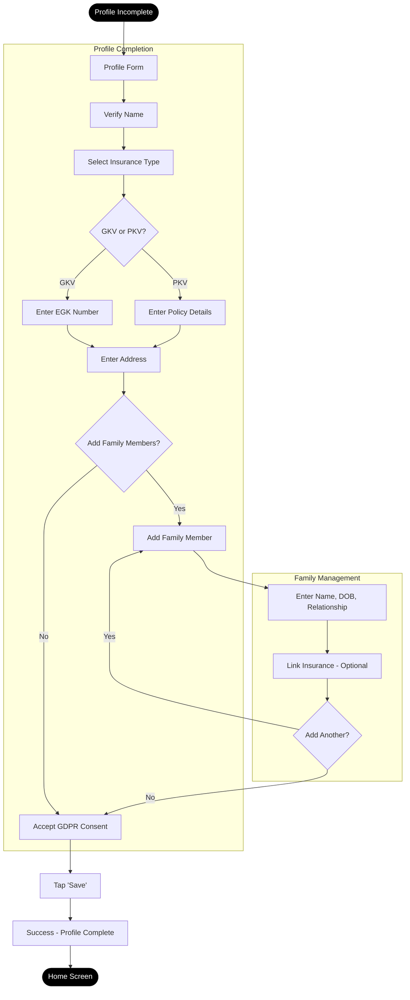

---

## Flow: Follow-up → Fast-Lane Booking (J3a)

### Flow Steps

| Step | User Action | System Response | Objects Modified | Success Criteria |
|------|-------------|-----------------|------------------|------------------|
| 1 | Tap "Book Appointment" | Show booking type selection | - | Screen loads |
| 2 | Select "Follow-up visit" type | Redirect based on recent doctor | BookingFlow: fast_lane | Flow set |
| 3a | (Has recent doctor) | Auto-select doctor + next slot | Booking: doctor, slot | Confirm screen |
| 3b | (No recent doctor) | Show Fast-Lane form | - | Form displays |
| 4 | Select patient (self/family) | Update patient field | Booking: forUser | Patient selected |
| 5 | Select specialty | Update specialty | Booking: specialty | Specialty set |
| 6 | Select city | Update location | Booking: city | City set |
| 7 | Select insurance type | Update insurance | Booking: insurance | Insurance set |
| 8 | Tap "Find Appointment" | Create matching appointment | Appointment: matching | Request sent |
| 9 | View Request Sent screen | Show confirmation | - | Confirmation shown |
| 10 | Background matching runs | Update status in real-time | Appointment: status | Matching progresses |
| 11a | (Success) Doctor matched | Show success screen | Appointment: confirmed | Doctor assigned |
| 11b | (No Match) No doctors | Show alternatives | Appointment: cancelled | Alternatives shown |

### Decision Points

| Branch Point | Condition | Path A | Path B | Path C |
|--------------|-----------|--------|--------|--------|
| Recent Doctor | Has My Doctors? | Quick rebook to Confirm | Show Fast-Lane form | - |
| Patient | Who needs care? | Self | Family member | - |
| Matching result | Doctor found? | Success screen | No Match screen | - |
| No Match action | User choice? | Retry | Change specialty | Browse doctors |

### Flow Diagram

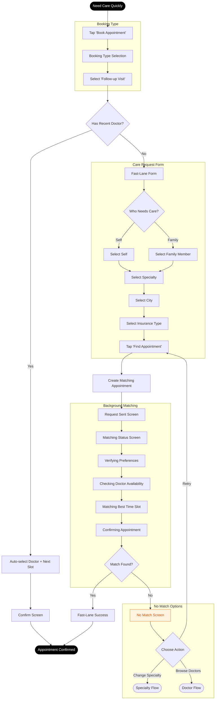

---

## Flow: Acute / Urgent → Specialty-First Booking (J3b) [CHANGED in v4]

> **v4 Implementation:** User does NOT select doctor or time slot. User provides specialty + availability preferences, then system matches doctor and slot asynchronously via backend.

### Flow Steps

| Step | User Action | System Response | Objects Modified | Success Criteria |
|------|-------------|-----------------|------------------|------------------|
| 1 | Tap "Book Appointment" | Show booking type selection | - | Screen loads |
| 2 | Select "Acute / Urgent" type | Show specialty search | BookingFlow: by_specialty | Form displays |
| 3 | Search/select specialty | Update specialty | Booking: specialty | Specialty set |
| 4 | Select city | Update location | Booking: city | City set |
| 5 | Select insurance type | Update insurance | Booking: insurance | Insurance set |
| 6 | Tap "Continue" | Show availability screen | - | Screen loads |
| 7 | Set availability (flexible or specific days/times) | Update preferences | AvailabilityPrefs: set | Prefs saved |
| 8 | Tap "Continue" | Show confirm screen | - | Confirm displays |
| 9 | Review specialty + availability | Verify selection | - | Details correct |
| 10 | Tap "Confirm" | Create matching appointment | Appointment: matching | Request submitted |
| 11 | Background matching runs | Backend finds doctor + slot | Appointment: status | Matching progresses |
| 12a | (Success) Match found | Show success screen | Appointment: confirmed | Doctor + slot assigned |
| 12b | (No Match) No availability | Show no match screen | Appointment: cancelled | Alternatives shown |

### Decision Points

| Branch Point | Condition | Path A | Path B |
|--------------|-----------|--------|--------|
| Availability | User preference? | Fully flexible | Specific days/times |
| Matching result | Match found? | Success screen | No Match screen |

### Key Implementation Details

- **User does NOT select doctor** - Backend matches based on specialty
- **User does NOT select time slot** - Backend matches based on availability preferences
- **Appointment status starts as `matching`** - Updates when backend finds match

### Flow Diagram

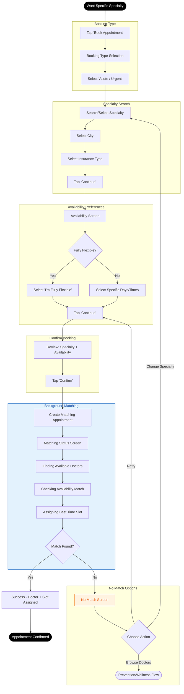

---

## Flow: Prevention / Wellness → Doctor-First Booking (J3c) [CHANGED in v4]

> **v4 Implementation:** User selects doctor but NOT time slot. User provides availability preferences (day/time ranges), then system matches specific slot asynchronously via backend.

### Flow Steps

| Step | User Action | System Response | Objects Modified | Success Criteria |
|------|-------------|-----------------|------------------|------------------|
| 1 | Tap "Book Appointment" | Show booking type selection | - | Screen loads |
| 2 | Select "Prevention / Wellness" | Show doctor results | BookingFlow: by_doctor | Screen displays |
| 3 | Search by name or specialty | Filter results | - | Results shown |
| 4 | (Optional) Filter by specialty chip | Update filters | - | Filtered |
| 5 | (Optional) Sort by name/rating/distance | Update sort | - | Sorted |
| 6 | Select a doctor | Navigate to availability screen | Booking: selectedDoctor | Doctor set |
| 7 | Set availability (flexible or specific days/times) | Update preferences | AvailabilityPrefs: set | Prefs saved |
| 8 | Tap "Continue" | Show confirm screen | - | Confirm displays |
| 9 | Review doctor + availability | Verify selection | - | Details correct |
| 10 | Tap "Confirm" | Create matching appointment | Appointment: matching | Request submitted |
| 11 | Background matching runs | Backend finds time slot | Appointment: status | Matching progresses |
| 12a | (Success) Slot found | Show success screen | Appointment: confirmed | Slot assigned |
| 12b | (No Match) No availability | Show no match screen | Appointment: cancelled | Alternatives shown |

### Decision Points

| Branch Point | Condition | Path A | Path B |
|--------------|-----------|--------|--------|
| Search | How to find? | By name | By specialty filter |
| Sort | Sort order? | Name A-Z | Rating / Distance |
| Availability | User preference? | Fully flexible | Specific days/times |
| Matching result | Slot found? | Success screen | No Match screen |

### Key Implementation Details

- **User DOES select doctor** - Browses and chooses specific doctor
- **User does NOT select time slot** - Provides availability preferences (day/time ranges)
- **Backend matches specific slot** - Finds available slot within user's preferences
- **Appointment status starts as `matching`** - Updates when backend finds slot

### Flow Diagram

```mermaid
flowchart TD
    START([Want Specific Doctor]) --> ENTRY[Tap 'Book Appointment']

    subgraph TYPE_SELECT["Booking Type"]
        ENTRY --> TYPE[Booking Type Selection]
        TYPE --> PREVENTION[Select 'Prevention / Wellness']
    end

    subgraph DOCTOR_SEARCH["Doctor Search"]
        PREVENTION --> RESULTS[Doctor Results Screen]
        RESULTS --> SEARCH[Search by Name or Specialty]
        SEARCH --> FILTER{Apply Filters?}
        FILTER -->|Yes| CHIPS[Specialty Filter Chips]
        CHIPS --> SORT
        FILTER -->|No| SORT{Sort Results?}
        SORT -->|Name| NAME_SORT[Sort by Name A-Z]
        SORT -->|Rating| RATING_SORT[Sort by Rating]
        SORT -->|Distance| DIST_SORT[Sort by Distance]
        NAME_SORT --> VIEW_RESULTS
        RATING_SORT --> VIEW_RESULTS
        DIST_SORT --> VIEW_RESULTS
        VIEW_RESULTS[View Doctor Cards]
        VIEW_RESULTS --> SELECT_DOC[Select a Doctor]
    end

    subgraph AVAILABILITY["Availability Preferences"]
        SELECT_DOC --> AVAIL_SCREEN[Availability Screen]
        AVAIL_SCREEN --> FLEX{Fully Flexible?}
        FLEX -->|Yes| FLEXIBLE[Select 'I'm Fully Flexible']
        FLEX -->|No| SPECIFIC[Select Specific Days/Times]
        FLEXIBLE --> CONTINUE
        SPECIFIC --> CONTINUE[Tap 'Continue']
    end

    subgraph CONFIRM["Confirm Booking"]
        CONTINUE --> REVIEW[Review: Doctor + Availability]
        REVIEW --> CONFIRM_BTN[Tap 'Confirm']
    end

    CONFIRM_BTN --> CREATE[Create Matching Appointment]

    subgraph MATCHING["Background Matching"]
        CREATE --> PROGRESS[Matching Status Screen]
        PROGRESS --> STEP1[Checking Doctor Availability]
        STEP1 --> STEP2[Matching Time Preferences]
        STEP2 --> STEP3[Assigning Best Time Slot]
        STEP3 --> RESULT{Slot Found?}
    end

    RESULT -->|Yes| SUCCESS[Success - Slot Assigned]
    RESULT -->|No| NO_MATCH[No Match Screen]

    subgraph ALTERNATIVES["No Match Options"]
        NO_MATCH --> ALT{Choose Action}
        ALT -->|Retry| AVAIL_SCREEN
        ALT -->|Different Doctor| RESULTS
        ALT -->|Try Specialty Flow| SPEC_FLOW([Acute/Urgent Flow])
    end

    SUCCESS --> DONE([Appointment Confirmed])

    style START fill:#000000,stroke:#000000,color:#ffffff
    style DONE fill:#000000,stroke:#000000,color:#ffffff
    style NO_MATCH fill:#fff3e0,stroke:#ef6c00,color:#e65100
    style MATCHING fill:#e3f2fd,stroke:#1565c0,color:#0d47a1
```

---

## Flow: Appointment Management (J4) [CHANGED in v4]

> **v4 Change:** History "Others" section now shows filter chips underneath the label. "Doctor rescheduled" renamed to "Modified by practice" with IconRefresh.

### Flow Steps

| Step | User Action | System Response | Objects Modified | Success Criteria |
|------|-------------|-----------------|------------------|------------------|
| 1 | Open "History" tab | Show appointments list | - | List loads |
| 2 | View Upcoming section | Show confirmed appointments (max 3) | - | Upcoming shown |
| 3 | View Others section | Show filtered appointments | - | Others shown |
| 4 | (Optional) Select filter chip | Filter Others list | - | List filtered |
| 5 | Tap appointment card | Show appointment details | - | Details shown |
| 6a | (Optional) Tap "Reschedule" | Start reschedule flow | - | Flow starts |
| 6b | (Optional) Tap "Cancel" | Show cancel confirmation | Appointment: cancelled | Status updated |
| 6c | (Optional) Tap "Book Again" | Start book again flow | - | Flow starts |
| 7 | (Optional) Add to calendar | Create calendar event | Appointment: calendarSynced | Event added |

### Status Filter Chips (v4 Order)

| Order | Chip | Icon | Status Filter |
|-------|------|------|---------------|
| 1 | All | IconFilter | `all` |
| 2 | Await Confirm | IconClock | `await_confirm` |
| 3 | Matching | IconSearch | `matching` |
| 4 | Modified by practice | IconRefresh | `modified_by_practice` |
| 5 | Doctor Canceled | IconX | `cancelled_doctor` |

### Flow Diagram

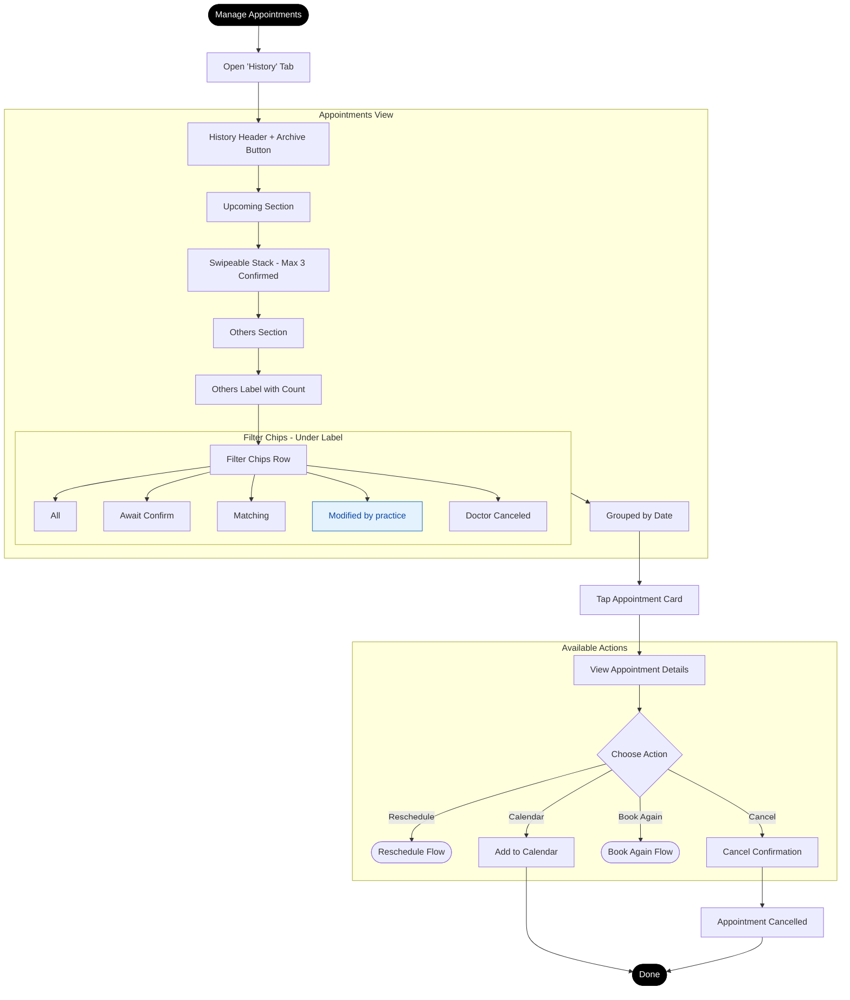

---

## Flow: Reschedule Appointment (J4a)

### Flow Steps

| Step | User Action | System Response | Objects Modified | Success Criteria |
|------|-------------|-----------------|------------------|------------------|
| 1 | Tap "Reschedule" on detail | Show reason screen | - | Screen loads |
| 2 | Select reason | Update reason | Reschedule: reason | Reason set |
| 3 | Tap "Continue" | Show suggested slots | - | Slots display |
| 4 | Select new time slot | Update selection | Reschedule: newSlot | Slot selected |
| 5 | Tap "Continue" | Show confirm screen | - | Confirm displays |
| 6 | Review old vs new details | Verify changes | - | Details correct |
| 7 | Tap "Confirm Reschedule" | Process reschedule | Appointment: rescheduled | Success |
| 8 | View success screen | Show confirmation | - | Success shown |

### Flow Diagram

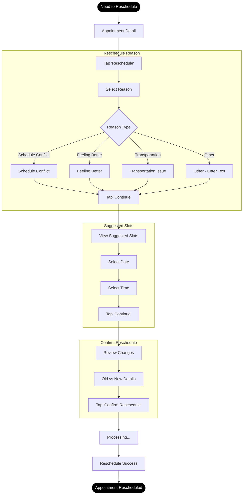

---

## Flow: Book Again (J4b)

### Flow Steps

| Step | User Action | System Response | Objects Modified | Success Criteria |
|------|-------------|-----------------|------------------|------------------|
| 1 | Tap "Book Again" on past appointment | Show context screen | BookAgain: context | Screen loads |
| 2 | Review original appointment | Display details | - | Details shown |
| 3a | (Available) Same doctor available | Show slot selection | Booking: selectedDoctor | Slots display |
| 3b | (Unavailable) Doctor not available | Show alternatives | - | Alternatives shown |
| 4 | Select alternative (if needed) | Update doctor | Booking: selectedDoctor | Doctor set |
| 5 | Select time slot | Update slot | Booking: selectedSlot | Slot set |
| 6 | Confirm booking | Process booking | Appointment: confirmed | Success |

### Decision Points

| Branch Point | Condition | Path A | Path B |
|--------------|-----------|--------|--------|
| Doctor availability | Same doctor available? | Direct to slot selection | Show alternatives |

### Flow Diagram

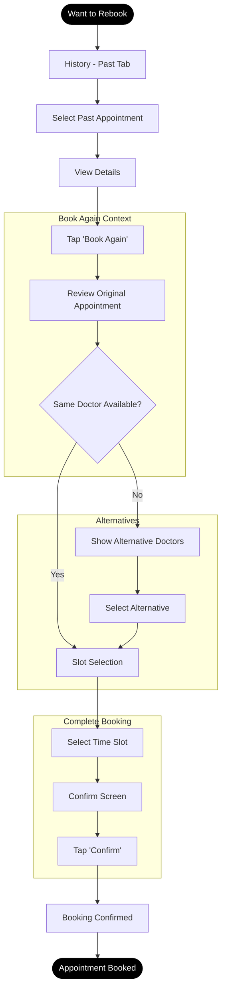

---

## Flow: History Tracking (J5)

### Flow Steps

| Step | User Action | System Response | Objects Modified | Success Criteria |
|------|-------------|-----------------|------------------|------------------|
| 1 | Tap "History" tab | Show history list | - | List loads |
| 2 | View Upcoming confirmed | Display swipeable stack | - | Stack shown |
| 3 | View Others section | Display filtered list | - | List shown |
| 4 | (Optional) Tap filter chip | Filter Others list | - | Filtered |
| 5 | Tap item for details | Show detail view | - | Details shown |
| 6 | (Optional) Tap archive icon | Show archive view | - | Archive shown |
| 7 | (Optional) Book again | Start booking flow | - | Flow starts |

### Flow Diagram

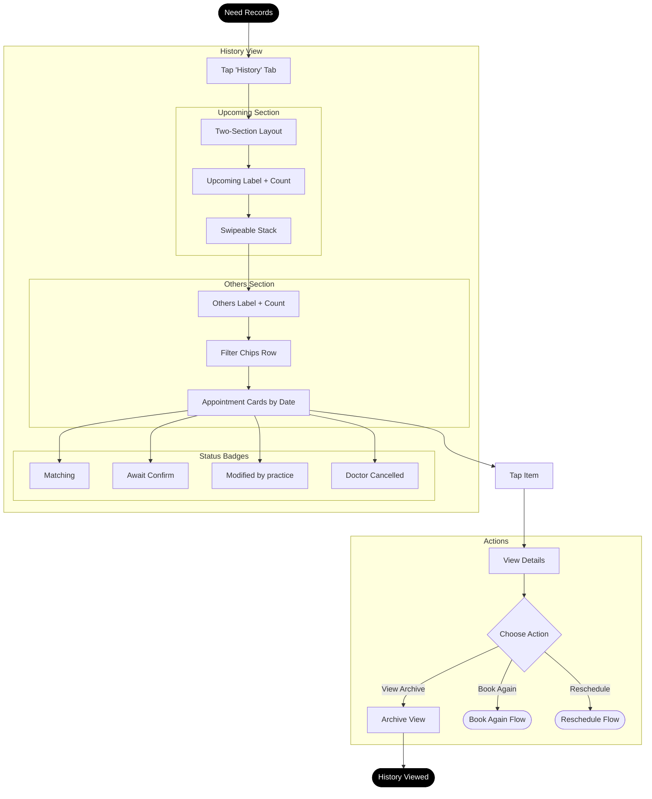

---

## Flow: In-App Notifications (J6)

### Flow Steps

| Step | User Action | System Response | Objects Modified | Success Criteria |
|------|-------------|-----------------|------------------|------------------|
| 1 | Appointment status changes | Detect change | Appointment: status | Change detected |
| 2 | System shows toast | Display notification | - | Toast appears |
| 3 | (Optional) Tap "View" | Navigate to appointment | - | Detail opens |
| 4 | (Optional) Dismiss | Toast auto-dismisses | - | Toast gone |

### Notification Types

| Type | Trigger | Content | Deep Link |
|------|---------|---------|-----------|
| Confirmed | Matching → Confirmed | "Appointment confirmed" | Appointment Detail |
| No Match | Matching → Cancelled | "No match found" | No Match Screen |
| Cancelled by Doctor | Doctor cancels | "Appointment cancelled by doctor" | Appointment Detail |
| Cancelled | User cancels | "Appointment cancelled" | History |
| Modified by Practice | Doctor reschedules | "Appointment modified by practice" | Appointment Detail |
| Completed | Appointment done | "Appointment completed" | History |

### Flow Diagram

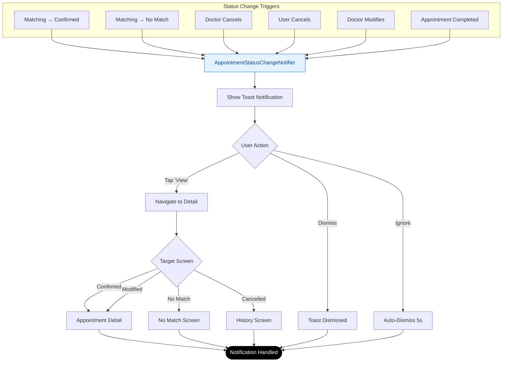

---

## Flow: News & Content (J7)

### Flow Steps

| Step | User Action | System Response | Objects Modified | Success Criteria |
|------|-------------|-----------------|------------------|------------------|
| 1 | Tap bell icon on Home | Show Notifications Center | - | Screen loads |
| 2 | Tap "News Feed" tab | Show news content | - | Content displays |
| 3 | View Short Guides carousel | Display video cards | - | Carousel shows |
| 4 | View Featured Story | Display featured card | - | Card shows |
| 5 | View Latest Health News | Display article cards | - | Articles show |
| 6 | Tap article | Show article detail | - | Article opens |
| 7 | Read article | Display full content | - | Content readable |
| 8 | (Optional) Share/Save | Trigger action | - | Action complete |
| 9 | Back button | Return to News Feed tab | - | Tab preserved |

### Flow Diagram

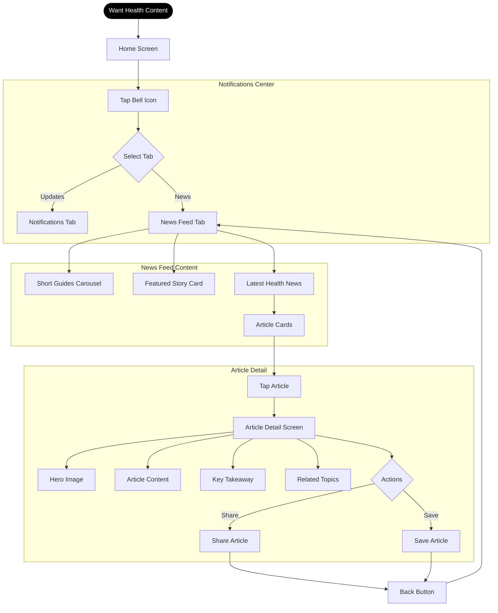

---

## Flow: Home Screen (J8) [NEW in v4]

> **v4 New Features:** Follow-up Visit Card, My Doctors horizontal scroll section

### Flow Steps

| Step | User Action | System Response | Objects Modified | Success Criteria |
|------|-------------|-----------------|------------------|------------------|
| 1 | Open app | Load home screen | - | Screen loads |
| 2 | View greeting | Display personalized greeting | - | Greeting shows |
| 3 | View Today's Focus | Show next confirmed appointment (verified users) | - | Card displays |
| 4 | View Pending Stack | Show swipeable matching/await_confirm appointments | - | Stack displays |
| 5 | Swipe appointment cards | Navigate through pending | - | Cards swipe |
| 6 | Tap appointment | Navigate to detail | - | Detail opens |
| 7 | View Quick Actions | Show Book + Family shortcuts | - | Actions display |
| 8 | View Follow-up Card | Show "Continue with Dr. X" card | - | Card displays |
| 9 | Tap Follow-up Card | Quick book with recent doctor | Booking: doctor, slot | Confirm screen |
| 10 | View My Doctors | Show horizontal scroll of favorited doctors | - | Doctors display |
| 11 | Tap doctor card | Quick book with that doctor | Booking: doctor, slot | Confirm screen |
| 12 | View Latest Health News | Show article previews | - | News displays |

### Home Screen Sections (v4)

| Section | Content | Visibility |
|---------|---------|------------|
| Header | Avatar, Greeting, Bell icon | Always |
| Today's Focus | Next confirmed appointment | Verified users with confirmed appointment |
| Pending Appointments | Swipeable stack of matching/await_confirm | When pending appointments exist |
| Quick Actions | Book Appointment + Family | Always |
| Follow-up Visit Card | "Continue with Dr. X" | When has recent doctor or My Doctors |
| My Doctors | Horizontal scroll of favorites | When My Doctors > 0 |
| Latest Health News | Article previews | Always |

### Flow Diagram

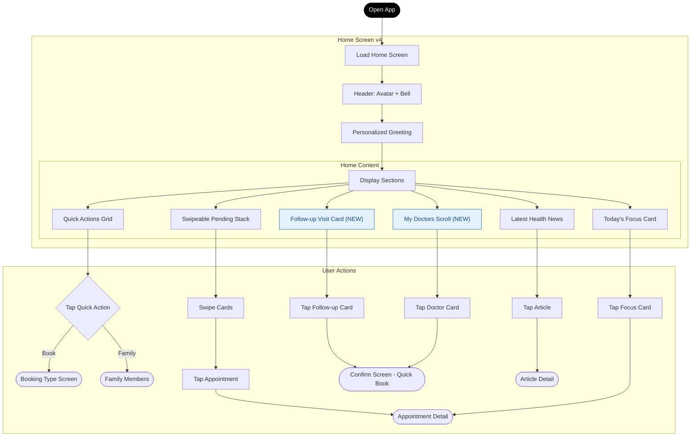

---

## Flow Metrics

| Flow | Primary Metric | Target | Fallback Metric |
|------|----------------|--------|-----------------|
| Registration | Completion rate | >90% | Time to complete <1 min |
| Profile | Profile completion rate | >70% | Fields completed |
| Fast-Lane Booking | Match success rate | >75% | Time to match <20s |
| Specialty Booking | Booking completion rate | >60% | Time to book <3 min |
| Doctor Booking | Booking completion rate | >65% | Search success rate |
| Reschedule | Reschedule completion rate | >80% | Time to reschedule <1 min |
| Book Again | Rebook conversion rate | >50% | Alternative selection rate |
| History | Page views per session | >2 | Status filter usage |
| Notifications | Toast tap-through rate | >30% | Auto-dismiss rate |
| News Feed | Article read rate | >25% | Scroll depth |
| Home Quick Book | Quick book usage | >40% | Follow-up card taps |

---
