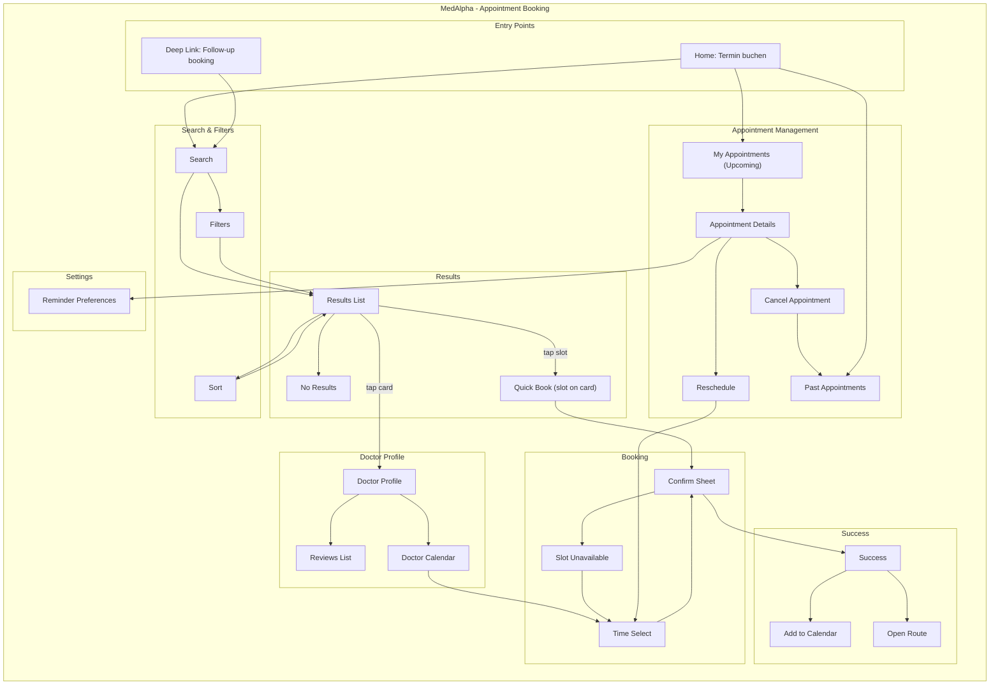

# IA Map - Appointment Booking (MEDA-BOOK)

## Current Information Architecture



---

## Route Structure

| Route | Screen Name | Protection | Purpose |
|-------|-------------|------------|---------|
| `/booking/search` | Search | Logged in only | Specialty, location, insurance input |
| `/booking/results` | Results List | Logged in only | Compare doctors and slots |
| `/booking/doctor/:id` | Doctor Profile | Logged in only | Profile, services, reviews |
| `/booking/doctor/:id/calendar` | Doctor Calendar | Logged in only | Week view and slot selection |
| `/booking/confirm` | Confirm Sheet | Logged in only | Confirm booking details |
| `/booking/success` | Success | Logged in only | Confirmation, calendar, route |
| `/appointments` | My Appointments | Logged in only | Upcoming appointments |
| `/appointments/:id` | Appointment Details | Logged in only | Details, cancel, reschedule |
| `/appointments/:id/reschedule` | Reschedule | Logged in only | Rebook with same doctor |
| `/appointments/history` | Past Appointments | Logged in only | Appointment history |
| `/settings/reminders` | Reminder Preferences | Logged in only | Notification settings |

---

## Object Location Mapping

| Object | Primary Location | Secondary Location(s) | Access From |
|--------|------------------|----------------------|-------------|
| **Doctor** | Results List | Doctor Profile | Search results, deep link |
| **Appointment** | My Appointments | Success, Details, History | Home, profile |
| **Time Slot** | Doctor Calendar | Results (quick slot) | Results list, profile |
| **Insurance Type** | Search | Confirm Sheet | Profile pre-fill, filter |
| **Location** | Search | Results List | Saved locations, GPS |
| **Review** | Doctor Profile | Reviews List | Profile |
| **Patient (Self/Child)** | Confirm Sheet | Appointment Details | Family selector |
| **Reminder Settings** | Reminder Preferences | Success (calendar add) | Settings |

---

## Navigation Paths

### Primary Paths

| Task | Primary Path | Alternative Path(s) |
|------|--------------|---------------------|
| Book appointment (standard) | Home → Search → Results → Profile → Time Select → Confirm → Success | Home → Search → Results → Quick Book → Confirm → Success |
| Book for child | Search → Results → Profile → Time Select → Confirm (select child) → Success | Results → Quick Book → Confirm (select child) |
| View upcoming appointment | Home → My Appointments → Appointment Details | Profile → Appointment Details |
| Reschedule appointment | Appointment Details → Reschedule → Time Select → Confirm → Success | - |
| Cancel appointment | Appointment Details → Cancel → Confirmation → History | - |

### Support Paths

| Action | Path |
|--------|------|
| Add to calendar | Success → Add to Calendar |
| Get directions | Success → Open Route |
| Adjust filters | Search → Filters → Results |
| Sort results | Results → Sort → Results |
| View reviews | Doctor Profile → Reviews List |

---

## Screen Sections

### Search Screen Sections

```
┌─────────────────────────────────────┐
│ Header: "Termin buchen"             │
├─────────────────────────────────────┤
│ Specialty (autocomplete + chips)   │
├─────────────────────────────────────┤
│ Location (GPS / saved / manual)    │
├─────────────────────────────────────┤
│ Date preference (optional)         │
├─────────────────────────────────────┤
│ Insurance (prefilled)              │
├─────────────────────────────────────┤
│ CTA: Search                         │
└─────────────────────────────────────┘
```

### Results Screen Sections

```
┌─────────────────────────────────────┐
│ Header: results count + sort        │
├─────────────────────────────────────┤
│ Filters (distance, rating, etc.)   │
├─────────────────────────────────────┤
│ Doctor cards (slots + tags)        │
├─────────────────────────────────────┤
│ Empty state (if no results)        │
└─────────────────────────────────────┘
```

### Appointment Details Sections

```
┌─────────────────────────────────────┐
│ Doctor + Specialty + Location       │
├─────────────────────────────────────┤
│ Date / Time / Duration              │
├─────────────────────────────────────┤
│ Actions: Reschedule / Cancel        │
├─────────────────────────────────────┤
│ Add to calendar / Route             │
└─────────────────────────────────────┘
```
