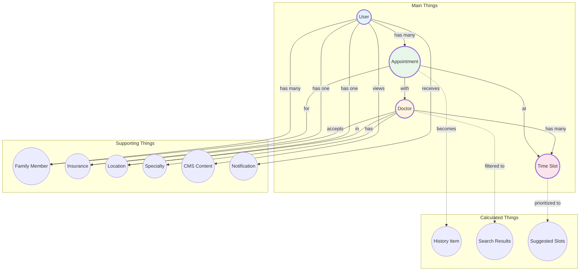

# Dot Map: Appointment Booking N3

> **What things exist in the app?**
> This document defines the core concepts, their details, actions, and connections.

---

## 1. Things & Actions

### 1.1 Main Things (Core Objects)

| Thing | Description | User Actions |
|-------|-------------|--------------|
| **User** | Person using the app (patient) | sign in, sign out, register, verify email, update profile |
| **Appointment** | Scheduled doctor visit | book, view, reschedule, cancel, add to calendar |
| **Doctor** | Healthcare provider | view profile, search, filter, select |
| **Time Slot** | Available booking time | view, select, compare |

### 1.2 Supporting Things

| Thing | Description | User Actions |
|-------|-------------|--------------|
| **Family Member** | Dependents user can book for | add, edit, remove, select as patient |
| **Insurance** | User's health coverage (GKV/PKV) | select type, enter eGK number |
| **Location** | City/address for appointment | set, change, use current |
| **Specialty** | Medical specialty (e.g., General Practice) | search, select, browse recent |
| **CMS Content** | Deals, health tips, announcements | view, dismiss |
| **Notification** | Reminders and alerts | enable, disable, view |

### 1.3 Calculated/Derived Things

| Thing | Description | Derived From |
|-------|-------------|--------------|
| **History Item** | Past or upcoming appointment record | Appointment + status + date |
| **Search Results** | Filtered list of doctors | Doctor + Specialty + Location + Insurance |
| **Suggested Slots** | Smart reschedule options | Time Slot + original appointment time |

---

## 2. Details for Each Thing

### User
| Detail | Type | Required? |
|--------|------|-----------|
| id | text | Yes |
| fullName | text | Yes |
| email | text | Yes |
| phone | text | No |
| insuranceType | choice (GKV/PKV) | Yes |
| egkNumber | text | Yes |
| address.street | text | Yes |
| address.postalCode | text | Yes |
| address.city | text | Yes |
| gdprConsent.dataProcessing | boolean | Yes |
| gdprConsent.marketing | boolean | No |

### Appointment
| Detail | Type | Required? |
|--------|------|-----------|
| id | text | Yes |
| doctorId | reference | Yes |
| doctorName | text | Yes |
| specialty | text | Yes |
| dateISO | date | Yes |
| time | text | Yes |
| status | choice (confirmed/completed/cancelled) | Yes |
| forUserId | reference | Yes |
| forUserName | text | Yes |
| reminderSet | boolean | No |
| calendarSynced | boolean | No |
| confirmationNumber | text | Yes |

### Doctor
| Detail | Type | Required? |
|--------|------|-----------|
| id | text | Yes |
| name | text | Yes |
| specialty | text | Yes |
| city | text | Yes |
| address | text | Yes |
| rating | number | No |
| reviewCount | number | No |
| accepts | list (GKV/PKV) | Yes |
| nextAvailableISO | date | No |
| imageUrl | url | No |
| about | text | No |
| languages | list | No |

### Time Slot
| Detail | Type | Required? |
|--------|------|-----------|
| dateISO | date | Yes |
| time | text | Yes |
| available | boolean | Yes |
| priority | text | No (for suggested slots) |
| label | text | No (e.g., "Same time", "Soonest") |

### Family Member
| Detail | Type | Required? |
|--------|------|-----------|
| id | text | Yes |
| name | text | Yes |
| dateOfBirth | date | Yes |
| relationship | choice (child/spouse/parent/other) | Yes |
| insuranceType | choice (GKV/PKV) | No |
| egkNumber | text | No |

### Insurance
| Detail | Type | Required? |
|--------|------|-----------|
| type | choice (GKV/PKV) | Yes |
| egkNumber | text | Yes |

### Location
| Detail | Type | Required? |
|--------|------|-----------|
| city | text | Yes |
| postalCode | text | No |
| radius | number | No |

### Specialty
| Detail | Type | Required? |
|--------|------|-----------|
| name | text | Yes |
| icon | text | No |

### CMS Content
| Detail | Type | Required? |
|--------|------|-----------|
| id | text | Yes |
| type | choice (deal/health-tip/payback/announcement) | Yes |
| title | text | Yes |
| description | text | No |
| imageUrl | url | No |
| link | url | No |
| targetInsurance | choice (GKV/PKV/all) | No |
| validFrom | date | No |
| validTo | date | No |

### Suggested Slot
| Detail | Type | Required? |
|--------|------|-----------|
| dateISO | date | Yes |
| time | text | Yes |
| priority | text | Yes |
| label | text | Yes |
| reasoning | text | No |

---

## 3. Connections Diagram

---

## 4. Connection Details

| From | Relationship | To | Notes |
|------|--------------|-----|-------|
| User | has many | Appointment | All appointments (past & future) |
| User | has many | Family Member | Up to 5 family members |
| User | has one | Insurance | GKV or PKV type |
| User | has one | Location | Primary city/address |
| Appointment | with | Doctor | Single doctor per appointment |
| Appointment | at | Time Slot | Specific date and time |
| Appointment | for | Family Member | Optional, defaults to self |
| Doctor | has | Specialty | One primary specialty |
| Doctor | in | Location | Practice location |
| Doctor | accepts | Insurance | GKV, PKV, or both |
| Doctor | has many | Time Slot | Available booking times |
| Appointment | becomes | History Item | When confirmed/completed/cancelled |
| Doctor | filtered to | Search Results | Based on filters |
| Time Slot | prioritized to | Suggested Slots | For reschedule |

---

## 5. Things by Screen Area

| App Area | Primary Things | Supporting Things |
|----------|----------------|-------------------|
| **Home** | User, Appointment, CMS Content | Notification |
| **Search & Results** | Doctor, Specialty, Location | Insurance, Search Results |
| **Doctor Profile** | Doctor, Time Slot | Insurance, Specialty |
| **Booking** | Appointment, Time Slot, Doctor | Family Member, Insurance |
| **History** | History Item, Appointment | Family Member |
| **Reschedule** | Appointment, Suggested Slots | Time Slot, Doctor |
| **Book Again** | Appointment, Doctor, Time Slot | Family Member, Insurance |
| **Profile** | User, Insurance, Family Member | Location |
| **Settings** | User, Notification | - |

---

## 6. Summary Statistics

| Category | Count |
|----------|-------|
| Main Things | 4 |
| Supporting Things | 6 |
| Calculated Things | 3 |
| **Total Things** | **13** |
| Total Connections | 14 |
| User Actions | 25+ |
