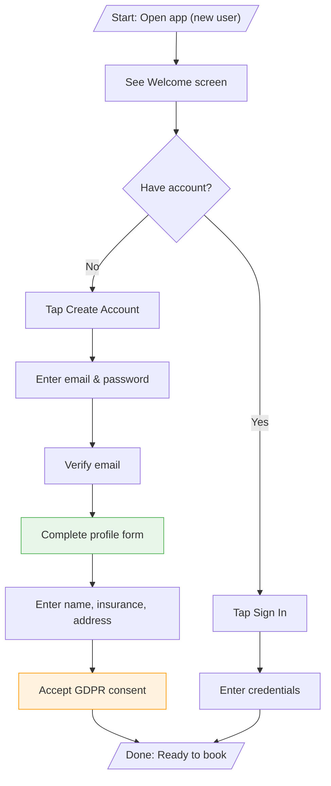
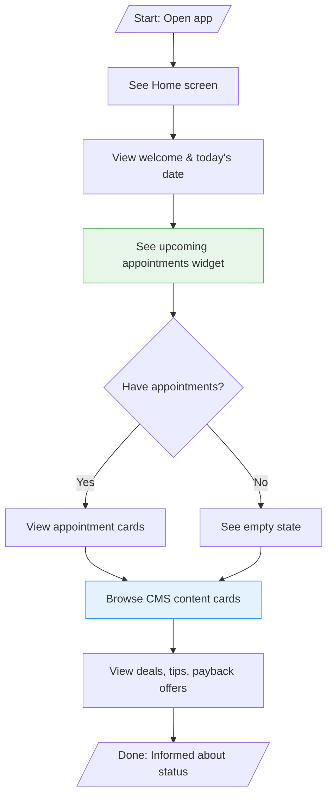
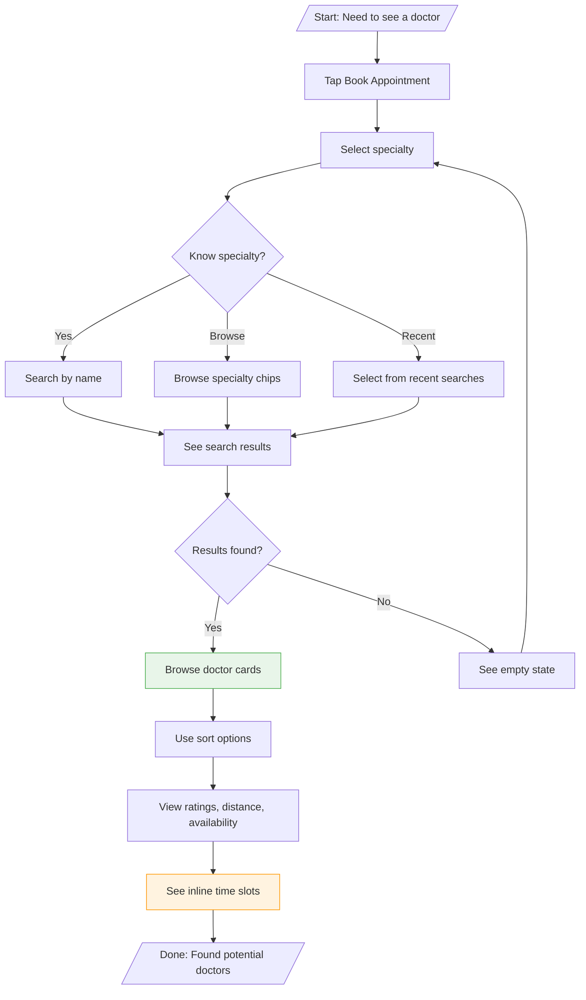
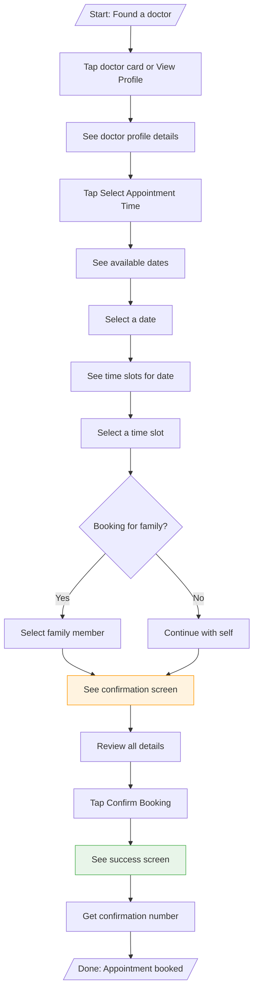
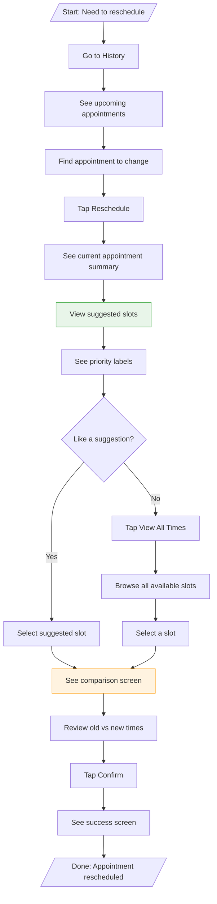
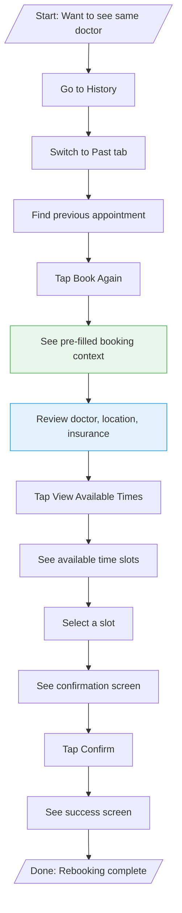
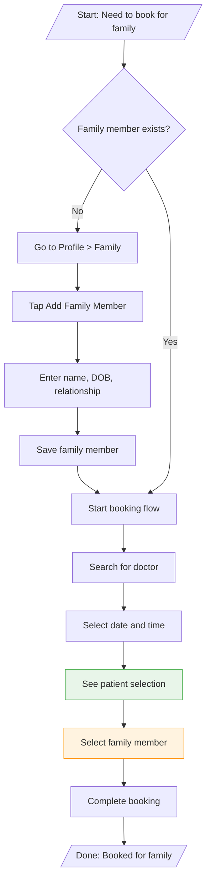
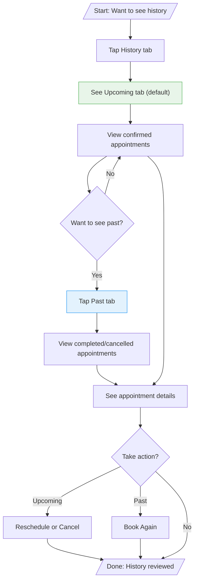
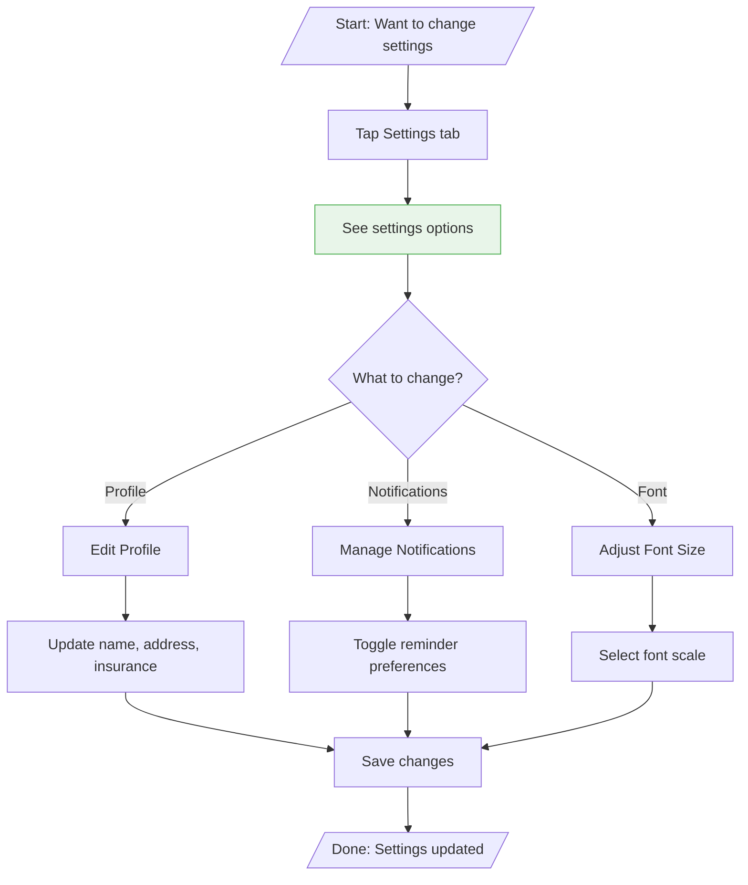
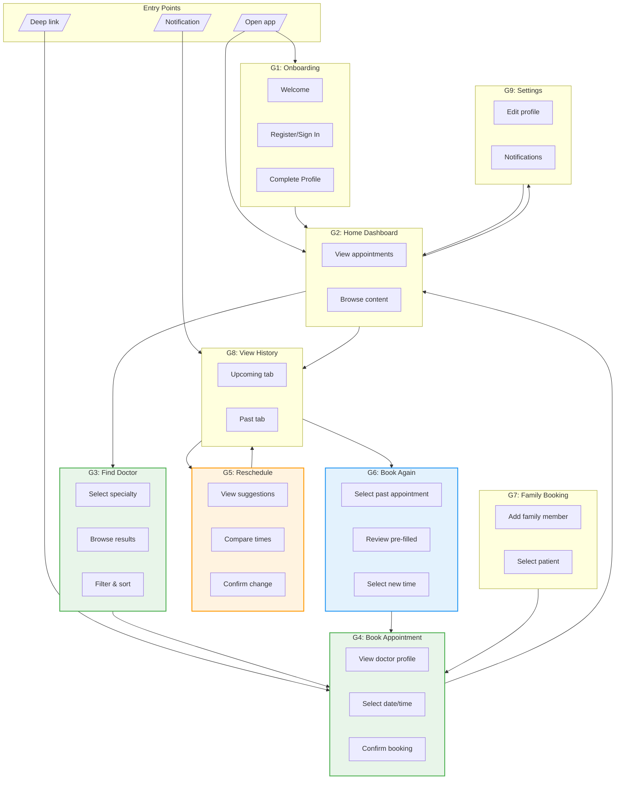

# User Journeys: Appointment Booking N3

> **What do users want to accomplish?**
> This document defines user goals and how they achieve them BEFORE determining structure.

---

## 1. User Goals

| Goal ID | Goal Statement | Things Involved | Key Actions |
|---------|----------------|-----------------|-------------|
| G1 | When I'm new to the app, I want to create an account and complete my profile, so that I can start booking appointments | User, Insurance | register, verify, complete profile |
| G2 | When I open the app, I want to see my upcoming appointments and relevant content, so that I stay informed | User, Appointment, CMS Content | view |
| G3 | When I need to see a doctor, I want to find one that matches my needs, so that I get appropriate care | Doctor, Specialty, Location, Insurance | search, filter, browse |
| G4 | When I find a suitable doctor, I want to book an appointment at a convenient time, so that I secure my visit | Appointment, Doctor, Time Slot, Family Member | select, book, confirm |
| G5 | When my plans change, I want to reschedule my appointment, so that I don't miss my visit | Appointment, Suggested Slots | view, compare, reschedule |
| G6 | When I had a good experience, I want to book again with the same doctor, so that I save time | Appointment, Doctor, Time Slot | view history, book again |
| G7 | When I need to book for family, I want to manage family members and book on their behalf, so that I can care for dependents | Family Member, Appointment | add, select, book |
| G8 | When I need to review my medical visits, I want to see my appointment history, so that I track my healthcare | History Item, Appointment | view, filter |
| G9 | When I want to customize my experience, I want to update my settings and profile, so that the app works for me | User, Notification | edit, toggle |

---

## 2. Individual Journey Diagrams

### G1: Onboarding Journey
**Goal:** Create account and complete profile



**Steps:** 6-9 | **Decisions:** 1

---

### G2: View Home Dashboard
**Goal:** See upcoming appointments and relevant content



**Steps:** 5-6 | **Decisions:** 1

---

### G3: Find a Doctor
**Goal:** Search and find a suitable doctor



**Steps:** 5-8 | **Decisions:** 2

---

### G4: Book an Appointment
**Goal:** Select time and confirm booking



**Steps:** 10-11 | **Decisions:** 1

---

### G5: Reschedule Appointment
**Goal:** Change appointment to a different time



**Steps:** 10-12 | **Decisions:** 1

---

### G6: Book Again
**Goal:** Quickly rebook with a previous doctor



**Steps:** 12 | **Decisions:** 0

---

### G7: Book for Family Member
**Goal:** Add family and book on their behalf



**Steps:** 6-10 | **Decisions:** 1

---

### G8: View Appointment History
**Goal:** Review past and upcoming appointments



**Steps:** 4-6 | **Decisions:** 2

---

### G9: Manage Settings
**Goal:** Update profile and preferences



**Steps:** 4-5 | **Decisions:** 1

---

## 3. Complete Journey Map



---

## 4. Journey Summary

| Goal | Steps | Decisions | Start Point | End Point | Frequency |
|------|-------|-----------|-------------|-----------|-----------|
| G1: Onboarding | 6-9 | 1 | App launch | Home | Once |
| G2: Home Dashboard | 5-6 | 1 | App launch | Home | Every session |
| G3: Find Doctor | 5-8 | 2 | Home | Results | High |
| G4: Book Appointment | 10-11 | 1 | Results | Success | High |
| G5: Reschedule | 10-12 | 1 | History | Success | Medium |
| G6: Book Again | 12 | 0 | History | Success | Medium |
| G7: Family Booking | 6-10 | 1 | Profile/Booking | Success | Low |
| G8: View History | 4-6 | 2 | Tab bar | History | Medium |
| G9: Settings | 4-5 | 1 | Tab bar | Settings | Low |

---

## 5. Primary User Paths

### Happy Path: First-time Booking
```
Open App → Onboard → Home → Search Specialty → Browse Results → View Doctor → Select Time → Confirm → Success
```

### Repeat User: Quick Booking
```
Open App → Home → Quick Action → Search → Select Doctor → Select Time → Confirm → Success
```

### Reschedule Path
```
Open App → History → Find Appointment → Reschedule → View Suggestions → Select New Time → Confirm → Success
```

### Book Again Path
```
Open App → History → Past Tab → Find Previous → Book Again → Pre-filled Context → Select Time → Confirm → Success
```

---

## 6. Journey Touchpoints

| Journey | Entry Touchpoints | Exit Touchpoints |
|---------|-------------------|------------------|
| G1 Onboarding | App icon, Marketing | Home screen |
| G2 Home | App icon, Tab bar | Any other screen |
| G3 Find Doctor | Home CTA, Tab bar | Results, Doctor profile |
| G4 Book | Doctor card, Profile | Success, Home |
| G5 Reschedule | History card action | Success, History |
| G6 Book Again | History card action | Success, History |
| G7 Family | Profile, Booking flow | Profile, Success |
| G8 History | Tab bar, Notification | Detail, Reschedule, Book Again |
| G9 Settings | Tab bar | Previous screen |
