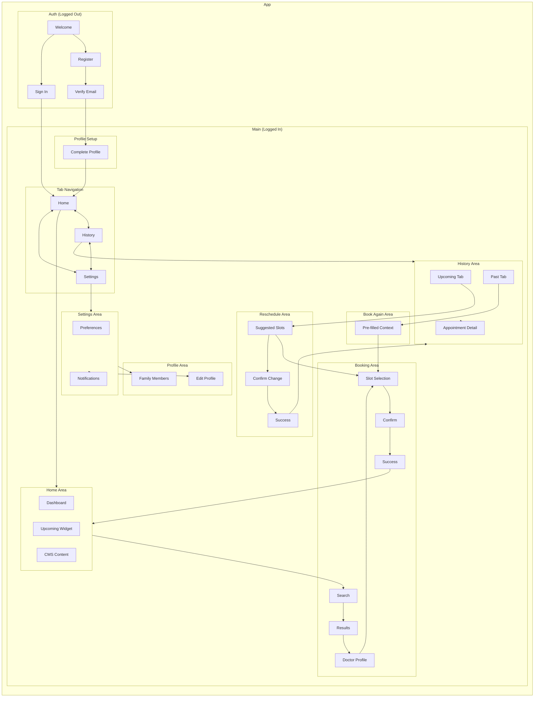
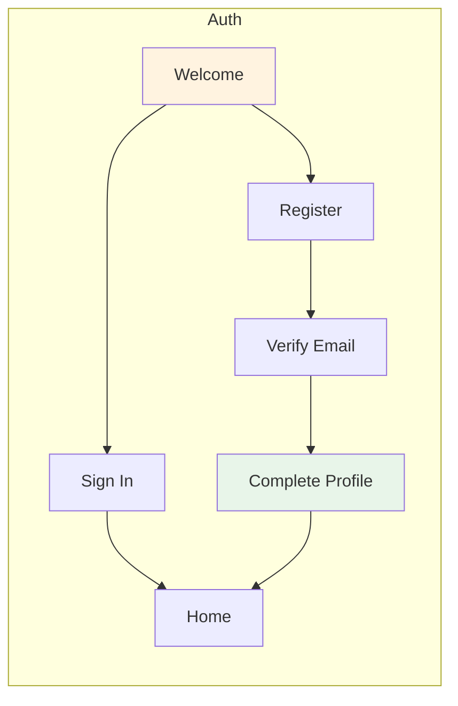
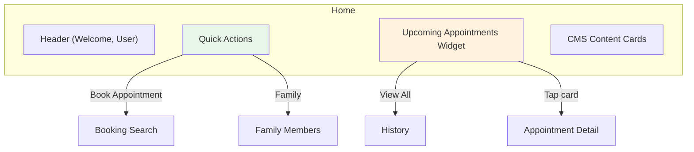
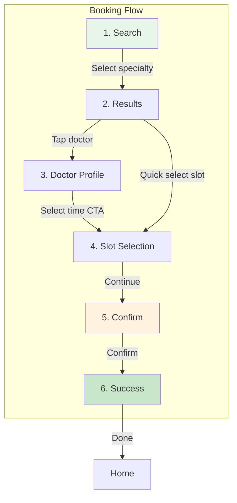
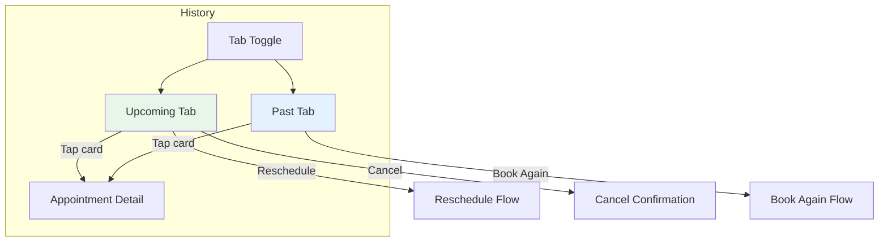
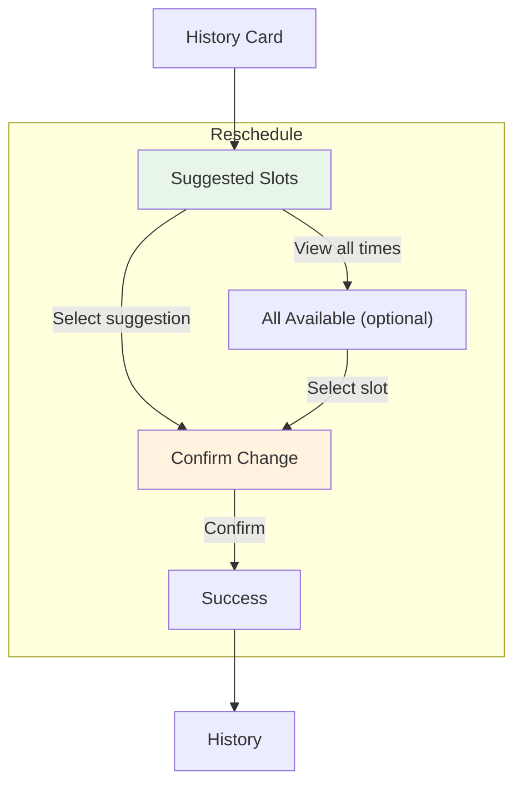
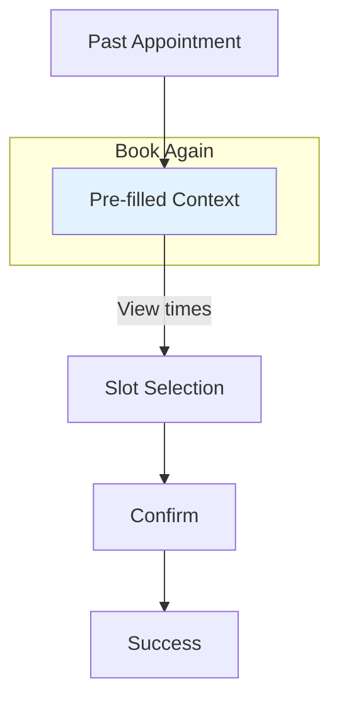
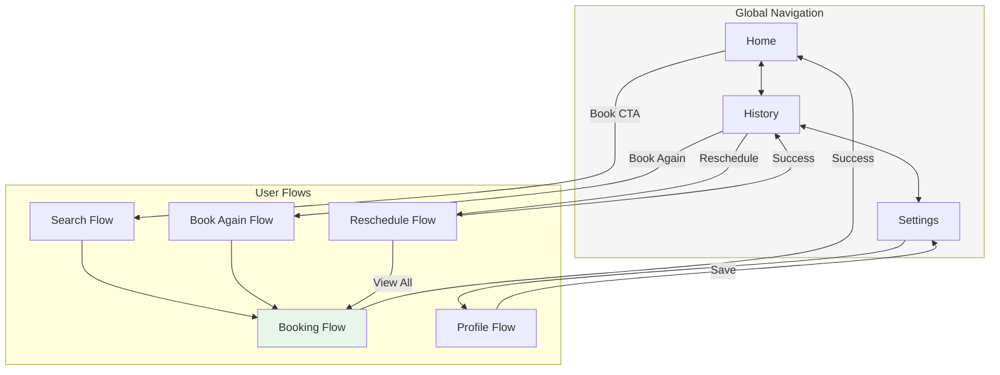

# IA Map: Appointment Booking N3

> **Where should things live to support user journeys?**
> This document shows how structure emerges from behavior - organizing the app to serve user goals.

---

## 1. Journey-to-Structure Analysis

| Journey | Areas Needed | Why |
|---------|--------------|-----|
| G1: Onboarding | Auth, Profile | Separate pre-login flow, mandatory profile setup |
| G2: Home Dashboard | Home | Central hub, first screen after login |
| G3: Find Doctor | Booking > Search, Booking > Results | Multi-step search needs dedicated screens |
| G4: Book Appointment | Booking > Doctor, Booking > Slots, Booking > Confirm | Progressive disclosure of booking steps |
| G5: Reschedule | Reschedule flow | Context-aware with original appointment |
| G6: Book Again | Book Again flow | Pre-filled from past appointment |
| G7: Family Booking | Profile > Family, Booking | Family management + patient selection |
| G8: View History | History | Dual-tab for upcoming/past |
| G9: Settings | Settings, Profile | Preferences and account management |

---

## 2. Group Related Actions by Area

| Area | Journeys Supported | Things Shown | Primary Actions |
|------|-------------------|--------------|-----------------|
| **Auth** | G1 | User | sign in, register, verify |
| **Home** | G2, G3, G4 | User, Appointment, CMS Content | view dashboard, start booking |
| **Booking - Search** | G3 | Specialty, Location | search, select specialty |
| **Booking - Results** | G3 | Doctor, Search Results | browse, filter, sort |
| **Booking - Doctor** | G3, G4 | Doctor, Time Slot | view profile, see availability |
| **Booking - Slots** | G4, G6 | Time Slot, Family Member | select date/time, choose patient |
| **Booking - Confirm** | G4 | Appointment | review, confirm |
| **History** | G5, G6, G8 | History Item, Appointment | view, reschedule, book again |
| **Reschedule** | G5 | Appointment, Suggested Slots | compare, select, confirm |
| **Book Again** | G6 | Appointment, Doctor | review pre-filled, proceed |
| **Profile** | G1, G7, G9 | User, Insurance, Family Member | edit, add family |
| **Settings** | G9 | User, Notification | toggle preferences |

---

## 3. Thing Locations Table

| Thing | Primary Location | Secondary Location(s) | Access From |
|-------|------------------|----------------------|-------------|
| User | Profile | Home (header), Settings | Tab bar, Avatar |
| Appointment | History | Home (widget) | Tab bar, Home widget |
| Doctor | Results, Doctor Profile | Booking confirm, Reschedule | Search results tap |
| Time Slot | Slot Selection | Results (preview), Reschedule | Doctor profile CTA |
| Family Member | Profile > Family | Slot Selection (selector) | Profile, Booking |
| Insurance | Profile | Results (filter badge) | Profile edit |
| Location | Profile | Search (selector) | Profile, Booking |
| Specialty | Search | Results (badge), Home (recent) | Search screen |
| CMS Content | Home | - | Home scroll |
| Notification | Settings > Notifications | - | Settings |
| History Item | History | - | Tab bar |
| Search Results | Results | - | Search completion |
| Suggested Slots | Reschedule | - | Reschedule action |

---

## 4. Current IA Structure

---

## 5. IA by Feature Area

### 5.1 Auth Area

### 5.2 Home Area

### 5.3 Booking Area

### 5.4 History Area

### 5.5 Reschedule Area

### 5.6 Book Again Area

---

## 6. IA Decision Table

| Location | Status | Rationale | Journeys Supported |
|----------|--------|-----------|-------------------|
| Auth screens | EXISTING | Required for account security | G1 |
| Home | EXISTING | Central dashboard for all users | G2, G3 |
| Booking Search | EXISTING | Entry point for finding doctors | G3 |
| Booking Results | EXISTING | Browse and compare doctors | G3 |
| Doctor Profile | EXISTING | Detailed doctor info for decision | G3, G4 |
| Slot Selection | EXISTING | Choose appointment time | G4, G5, G6, G7 |
| Booking Confirm | EXISTING | Final review before booking | G4 |
| Booking Success | EXISTING | Confirmation and next steps | G4 |
| History | EXISTING | View all appointments | G5, G6, G8 |
| Appointment Detail | EXISTING | Full appointment info | G8 |
| Reschedule Suggested | EXISTING | Smart slot recommendations | G5 |
| Reschedule Confirm | EXISTING | Compare old vs new | G5 |
| Book Again Context | EXISTING | Pre-filled rebooking | G6 |
| Profile Edit | EXISTING | Update personal info | G1, G9 |
| Family Members | EXISTING | Manage dependents | G7 |
| Settings | EXISTING | App preferences | G9 |
| Notifications | EXISTING | Alert preferences | G9 |

---

## 7. Navigation Paths

### 7.1 Primary Navigation (Tab Bar)

| Tab | Icon | Destination | Default View |
|-----|------|-------------|--------------|
| Home | Home | /home | Dashboard |
| History | Calendar | /history | Upcoming tab |
| Settings | Gear | /settings | Preferences |

### 7.2 Navigation Paths by Thing

| Thing | Primary Path | Alternative Path(s) |
|-------|--------------|---------------------|
| User Profile | Settings → Edit Profile | Home → Avatar |
| Appointment (upcoming) | History → Upcoming tab | Home → Widget |
| Appointment (past) | History → Past tab | - |
| Doctor | Home → Book → Search → Results | History → Detail |
| Time Slot | Booking → Doctor → Select Time | Reschedule → Suggestions |
| Family Member | Settings → Family Members | Booking → Patient selector |
| Suggested Slots | History → Reschedule | - |
| CMS Content | Home → Scroll | - |
| Notifications | Settings → Notifications | - |

### 7.3 Deep Links

| Deep Link | Destination | Use Case |
|-----------|-------------|----------|
| /home | Home screen | Default entry |
| /booking/doctor/:id | Doctor profile | Marketing link |
| /history/:id | Appointment detail | Push notification |
| /reschedule/:id | Reschedule flow | Reminder notification |

---

## 8. Navigation Flow Diagram

---

## 9. Screen Depth Analysis

| Depth | Screens | Access Pattern |
|-------|---------|----------------|
| 0 | Home, History, Settings | Tab bar (always accessible) |
| 1 | Search, Appointment Detail, Edit Profile, Family, Notifications | One tap from tab |
| 2 | Results, Reschedule Suggested, Book Again | Two taps |
| 3 | Doctor Profile, Reschedule Confirm | Three taps |
| 4 | Slot Selection | Four taps |
| 5 | Confirm | Five taps |
| 6 | Success | Six taps |

**Note:** The booking flow is intentionally deep (6 levels) to ensure users make informed decisions with proper confirmation steps.

---

## 10. Summary

### Areas by Journey Priority

| Priority | Area | Journeys | Frequency |
|----------|------|----------|-----------|
| 1 | Booking (Search → Success) | G3, G4 | High |
| 2 | Home | G2 | Every session |
| 3 | History | G5, G6, G8 | Medium |
| 4 | Reschedule | G5 | Medium |
| 5 | Book Again | G6 | Medium |
| 6 | Profile/Settings | G7, G9 | Low |
| 7 | Auth/Onboarding | G1 | Once |

### Key IA Principles

1. **Tab bar for primary areas** - Home, History, Settings always accessible
2. **Progressive disclosure** - Booking flow reveals information step by step
3. **Context preservation** - Reschedule and Book Again maintain appointment context
4. **Shallow depth for frequent tasks** - Upcoming appointments visible from Home
5. **Deep confirmation for important actions** - Booking requires explicit confirmation
