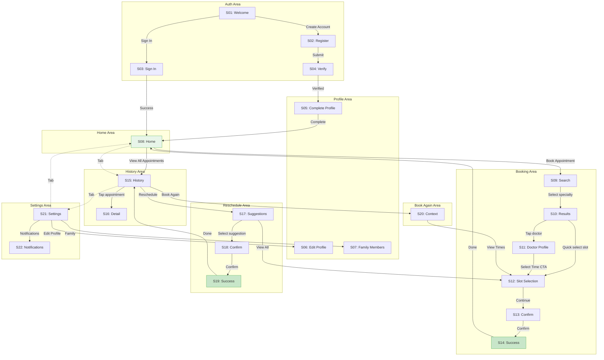

# Screen List: Appointment Booking N3

> **What screens do we need to build?**
> This document maps journeys to concrete screens for design and development.

---

## 1. Journey-to-Screen Mapping

| Journey Step | Goal | Type | Needs Screen? | Why |
|--------------|------|------|---------------|-----|
| See welcome message | G1 | View | Yes | First impression, CTA |
| Enter registration info | G1 | Input | Yes | Form submission |
| Verify email | G1 | Confirm | Yes | Security step |
| Complete profile | G1 | Input | Yes | Required data collection |
| View dashboard | G2 | View | Yes | Main content hub |
| Tap Book Appointment | G3 | Action | No | Button triggers navigation |
| Search specialty | G3 | Input | Yes | Search + selection |
| Browse doctor results | G3 | Choose | Yes | List to compare |
| View doctor profile | G3/G4 | View | Yes | Detailed information |
| Select date | G4 | Choose | Yes | Date grid |
| Select time slot | G4 | Choose | Yes (combined) | Time grid |
| Select patient | G4/G7 | Choose | No (inline) | Part of slot screen |
| Review booking | G4 | Confirm | Yes | Final check |
| See confirmation | G4 | Feedback | Yes | Success + next steps |
| View upcoming appointments | G8 | View | Yes | List view |
| View past appointments | G8 | View | Yes (tab) | Same screen, different tab |
| View appointment detail | G8 | View | Yes | Full details |
| See reschedule suggestions | G5 | Choose | Yes | Smart alternatives |
| Compare old vs new | G5 | Confirm | Yes | Side-by-side |
| Reschedule success | G5 | Feedback | Yes | Confirmation |
| See pre-filled booking | G6 | View | Yes | Context review |
| Edit profile | G9 | Input | Yes | Form |
| Manage family | G7 | View/Input | Yes | List + add form |
| Update notifications | G9 | Choose | Yes | Toggle preferences |

---

## 2. Consolidated Screen List by Area

### Auth Area (4 screens)

| ID | Screen | Type | Supports Goals | Purpose |
|----|--------|------|----------------|---------|
| S01 | Welcome | View | G1 | Introduce app, sign in/register CTAs |
| S02 | Register | Input | G1 | Create new account |
| S03 | Sign In | Input | G1 | Authenticate existing user |
| S04 | Verify Email | Confirm | G1 | Email verification flow |

### Profile Area (3 screens)

| ID | Screen | Type | Supports Goals | Purpose |
|----|--------|------|----------------|---------|
| S05 | Complete Profile | Input | G1 | Mandatory first-time setup |
| S06 | Edit Profile | Input | G9 | Update personal information |
| S07 | Family Members | View/Input | G7 | Manage family members |

### Home Area (1 screen)

| ID | Screen | Type | Supports Goals | Purpose |
|----|--------|------|----------------|---------|
| S08 | Home | View | G2, G3, G4 | Dashboard with widgets and CTAs |

### Booking Area (6 screens)

| ID | Screen | Type | Supports Goals | Purpose |
|----|--------|------|----------------|---------|
| S09 | Search | Input | G3 | Select specialty, location |
| S10 | Results | Choose | G3 | Browse and filter doctors |
| S11 | Doctor Profile | View | G3, G4 | Full doctor information |
| S12 | Slot Selection | Choose | G4, G5, G6, G7 | Select date, time, patient |
| S13 | Confirm Booking | Confirm | G4 | Review and confirm |
| S14 | Booking Success | Feedback | G4 | Confirmation details |

### History Area (2 screens)

| ID | Screen | Type | Supports Goals | Purpose |
|----|--------|------|----------------|---------|
| S15 | History | View | G5, G6, G8 | Upcoming/Past tabs |
| S16 | Appointment Detail | View | G8 | Full appointment info |

### Reschedule Area (3 screens)

| ID | Screen | Type | Supports Goals | Purpose |
|----|--------|------|----------------|---------|
| S17 | Suggested Slots | Choose | G5 | Smart reschedule options |
| S18 | Reschedule Confirm | Confirm | G5 | Compare old vs new |
| S19 | Reschedule Success | Feedback | G5 | Confirmation |

### Book Again Area (1 screen)

| ID | Screen | Type | Supports Goals | Purpose |
|----|--------|------|----------------|---------|
| S20 | Book Again Context | View | G6 | Pre-filled booking review |

### Settings Area (2 screens)

| ID | Screen | Type | Supports Goals | Purpose |
|----|--------|------|----------------|---------|
| S21 | Settings | View | G9 | Preferences hub |
| S22 | Notifications | Choose | G9 | Toggle notification prefs |

---

## 3. Screen Types: Full Screen vs Pop-up

| Screen | Type | Why |
|--------|------|-----|
| S01 Welcome | Full screen | Entry point, marketing content |
| S02 Register | Full screen | Form with multiple fields |
| S03 Sign In | Full screen | Form with fields |
| S04 Verify Email | Full screen | Instructions + verification |
| S05 Complete Profile | Full screen | Form with many fields |
| S06 Edit Profile | Full screen | Form with many fields |
| S07 Family Members | Full screen | List + add form |
| S08 Home | Full screen | Main dashboard |
| S09 Search | Full screen | Search interface |
| S10 Results | Full screen | Scrollable list |
| S11 Doctor Profile | Full screen | Detailed content |
| S12 Slot Selection | Full screen | Date + time grids |
| S13 Confirm Booking | Full screen | Review all details |
| S14 Booking Success | Full screen | Celebration + next steps |
| S15 History | Full screen | Tab-based list |
| S16 Appointment Detail | Full screen | Full information |
| S17 Suggested Slots | Full screen | Comparison interface |
| S18 Reschedule Confirm | Full screen | Side-by-side comparison |
| S19 Reschedule Success | Full screen | Confirmation |
| S20 Book Again Context | Full screen | Review + proceed |
| S21 Settings | Full screen | List of options |
| S22 Notifications | Full screen | Toggle list |

### Pop-ups/Overlays (Non-screen UI)

| Component | Type | Triggered From | Purpose |
|-----------|------|----------------|---------|
| Sort Menu | Bottom sheet | Results | Sort options |
| Filter Panel | Bottom sheet | Results | Filter options |
| Cancel Confirmation | Modal | History card | Confirm cancel |
| Patient Selector | Inline | Slot Selection | Choose patient |
| Add Family Member | Bottom sheet | Family Members | Quick add form |

---

## 4. Screen Flow Diagram



---

## 5. Screen Wireframe References

### Auth Screens

```
┌─────────────────────┐  ┌─────────────────────┐  ┌─────────────────────┐
│ S01: Welcome        │  │ S02: Register       │  │ S03: Sign In        │
├─────────────────────┤  ├─────────────────────┤  ├─────────────────────┤
│                     │  │ ← Back              │  │ ← Back              │
│    [App Logo]       │  │                     │  │                     │
│                     │  │ Create Account      │  │ Sign In             │
│  Welcome to         │  │                     │  │                     │
│  MedAlpha           │  │ ┌─────────────────┐ │  │ ┌─────────────────┐ │
│                     │  │ │ Email           │ │  │ │ Email           │ │
│  [Feature 1]        │  │ └─────────────────┘ │  │ └─────────────────┘ │
│  [Feature 2]        │  │ ┌─────────────────┐ │  │ ┌─────────────────┐ │
│  [Feature 3]        │  │ │ Password        │ │  │ │ Password        │ │
│                     │  │ └─────────────────┘ │  │ └─────────────────┘ │
│                     │  │ ┌─────────────────┐ │  │                     │
│ [Create Account]    │  │ │ Confirm         │ │  │ [Sign In]           │
│                     │  │ └─────────────────┘ │  │                     │
│ Already have...     │  │                     │  │ Don't have...       │
│ [Sign In]           │  │ [Create Account]    │  │ [Create Account]    │
└─────────────────────┘  └─────────────────────┘  └─────────────────────┘
```

### Home Screen

```
┌─────────────────────────────────────┐
│ S08: Home                           │
├─────────────────────────────────────┤
│ Welcome, [Name]          [Avatar]   │
│ Monday, January 26                  │
├─────────────────────────────────────┤
│ ┌───────────┐ ┌───────────┐         │
│ │ Book      │ │ Family    │         │
│ │ Appt      │ │ Members   │         │
│ └───────────┘ └───────────┘         │
├─────────────────────────────────────┤
│ Upcoming Appointments    [View All] │
│ ┌─────────────────────────────────┐ │
│ │ [Doctor Avatar]                 │ │
│ │ Dr. Name - Specialty            │ │
│ │ Jan 28, 2025 • 10:00 AM         │ │
│ │ [Reschedule] [Cancel]           │ │
│ └─────────────────────────────────┘ │
├─────────────────────────────────────┤
│ Health & Deals                      │
│ ┌─────────────────────────────────┐ │
│ │ [CMS Card 1]                    │ │
│ └─────────────────────────────────┘ │
│ ┌─────────────────────────────────┐ │
│ │ [CMS Card 2]                    │ │
│ └─────────────────────────────────┘ │
├─────────────────────────────────────┤
│ [Home]     [History]    [Settings]  │
└─────────────────────────────────────┘
```

### Booking Flow

```
┌───────────────────┐  ┌───────────────────┐  ┌───────────────────┐
│ S09: Search       │  │ S10: Results      │  │ S11: Doctor       │
├───────────────────┤  ├───────────────────┤  ├───────────────────┤
│ ← Step 1 of 4     │  │ ← Results    [⋮]  │  │ ← Doctor Profile  │
│                   │  │                   │  │                   │
│ What type of      │  │ 5 doctors found   │  │ [Doctor Photo]    │
│ doctor?           │  │                   │  │ Dr. Sarah Miller  │
│                   │  │ ┌───────────────┐ │  │ General Practice  │
│ ┌───────────────┐ │  │ │ [Avatar]      │ │  │ ★ 4.8 (124 reviews)│
│ │ 🔍 Search...  │ │  │ │ Dr. Name      │ │  │                   │
│ └───────────────┘ │  │ │ ★ 4.8 • 1.2km │ │  │ ─────────────────│
│                   │  │ │ [09:00][10:30]│ │  │ About             │
│ Recent Searches   │  │ └───────────────┘ │  │ [Bio text...]     │
│ • General Practice│  │ ┌───────────────┐ │  │                   │
│ • Dermatology     │  │ │ [Avatar]      │ │  │ Languages: DE, EN │
│                   │  │ │ Dr. Name 2    │ │  │ Accepts: GKV, PKV │
│ Popular           │  │ │ ★ 4.6 • 2.1km │ │  │                   │
│ [GP] [Derm] [Eye] │  │ │ [10:00][14:00]│ │  │ ─────────────────│
│                   │  │ └───────────────┘ │  │ Next available:   │
│                   │  │                   │  │ Tomorrow, Jan 27  │
│                   │  │                   │  │                   │
│                   │  │                   │  │ [Select Time]     │
└───────────────────┘  └───────────────────┘  └───────────────────┘

┌───────────────────┐  ┌───────────────────┐  ┌───────────────────┐
│ S12: Slots        │  │ S13: Confirm      │  │ S14: Success      │
├───────────────────┤  ├───────────────────┤  ├───────────────────┤
│ ← Step 3 of 4     │  │ ← Step 4 of 4     │  │                   │
│                   │  │                   │  │      ✓            │
│ Select Date       │  │ Confirm Booking   │  │                   │
│ ┌──┬──┬──┬──┬──┐  │  │                   │  │ Appointment       │
│ │27│28│29│30│31│  │  │ ┌───────────────┐ │  │ Confirmed!        │
│ └──┴──┴──┴──┴──┘  │  │ │ Dr. Miller    │ │  │                   │
│                   │  │ │ General Pract.│ │  │ Confirmation #:   │
│ Morning           │  │ │ Berlin        │ │  │ APT-2025-001234   │
│ [09:00] [09:30]   │  │ └───────────────┘ │  │                   │
│ [10:00] [10:30]   │  │                   │  │ Dr. Sarah Miller  │
│ [11:00] [11:30]   │  │ Date & Time       │  │ Jan 28, 2025      │
│                   │  │ Jan 28, 2025      │  │ 10:00 AM          │
│ Afternoon         │  │ 10:00 AM          │  │                   │
│ [14:00] [14:30]   │  │                   │  │ ☑ Reminder set    │
│ [15:00] [15:30]   │  │ Patient           │  │ ☐ Add to calendar │
│                   │  │ John Doe (Self)   │  │                   │
│ Patient: Self ▼   │  │                   │  │ [Done]            │
│                   │  │ [Confirm]         │  │                   │
│ [Continue]        │  │                   │  │                   │
└───────────────────┘  └───────────────────┘  └───────────────────┘
```

### History & Reschedule

```
┌───────────────────┐  ┌───────────────────┐  ┌───────────────────┐
│ S15: History      │  │ S17: Suggestions  │  │ S18: Confirm      │
├───────────────────┤  ├───────────────────┤  ├───────────────────┤
│ Appointments      │  │ ← Reschedule      │  │ ← Confirm Change  │
│                   │  │                   │  │                   │
│ [Upcoming] [Past] │  │ Current Appt      │  │ Old Appointment   │
│                   │  │ ┌───────────────┐ │  │ ┌───────────────┐ │
│ ┌───────────────┐ │  │ │ ⚠ Jan 28, 10AM│ │  │ │ ✗ Jan 28      │ │
│ │ [Avatar]      │ │  │ │ Dr. Miller    │ │  │ │   10:00 AM    │ │
│ │ Dr. Miller    │ │  │ └───────────────┘ │  │ │ Will be       │ │
│ │ Jan 28, 10 AM │ │  │                   │  │ │ cancelled     │ │
│ │ ● Confirmed   │ │  │ Suggested Times   │  │ └───────────────┘ │
│ │ [Reschedule]  │ │  │                   │  │         ↓         │
│ └───────────────┘ │  │ ┌───────────────┐ │  │ New Appointment   │
│                   │  │ │ ★ Same time   │ │  │ ┌───────────────┐ │
│ ┌───────────────┐ │  │ │ Jan 29, 10:00 │ │  │ │ ✓ Jan 29      │ │
│ │ [Avatar]      │ │  │ │ [Select]      │ │  │ │   10:00 AM    │ │
│ │ Dr. Weber     │ │  │ └───────────────┘ │  │ │ Dr. Miller    │ │
│ │ Jan 15 (Past) │ │  │ ┌───────────────┐ │  │ └───────────────┘ │
│ │ ● Completed   │ │  │ │ Soonest       │ │  │                   │
│ │ [Book Again]  │ │  │ │ Jan 28, 14:00 │ │  │ [Confirm]         │
│ └───────────────┘ │  │ │ [Select]      │ │  │ [Cancel]          │
│                   │  │ └───────────────┘ │  │                   │
│ [Book Appt]       │  │ [View All Times]  │  │                   │
└───────────────────┘  └───────────────────┘  └───────────────────┘
```

---

## 6. Screen Count Summary

| Area | Count | Screens |
|------|-------|---------|
| Auth | 4 | Welcome, Register, Sign In, Verify |
| Profile | 3 | Complete, Edit, Family |
| Home | 1 | Dashboard |
| Booking | 6 | Search, Results, Doctor, Slots, Confirm, Success |
| History | 2 | List, Detail |
| Reschedule | 3 | Suggestions, Confirm, Success |
| Book Again | 1 | Context |
| Settings | 2 | Main, Notifications |
| **Total** | **22** | |

---

## 7. Implementation Priority

| Priority | Screens | Rationale |
|----------|---------|-----------|
| P0 (Core) | S01, S02, S03, S05, S08, S09, S10, S12, S13, S14 | MVP booking flow |
| P1 (Essential) | S04, S06, S15, S16, S21 | Account & history |
| P2 (Enhanced) | S17, S18, S19, S20 | Reschedule & book again |
| P3 (Complete) | S07, S11, S22 | Family, doctor detail, notifications |

---

## 8. Quality Checklist

- [x] Every thing from Dot Map appears in at least one screen
- [x] Every journey has a corresponding screen sequence
- [x] IA structure maps to screen organization
- [x] Every screen traces back to a journey step
- [x] All screens are full screens (no unnecessary pop-ups for core flows)
- [x] Navigation between screens is documented
- [x] Screen names are user-friendly (no tech jargon)
- [x] Screen types are appropriate for their purpose
