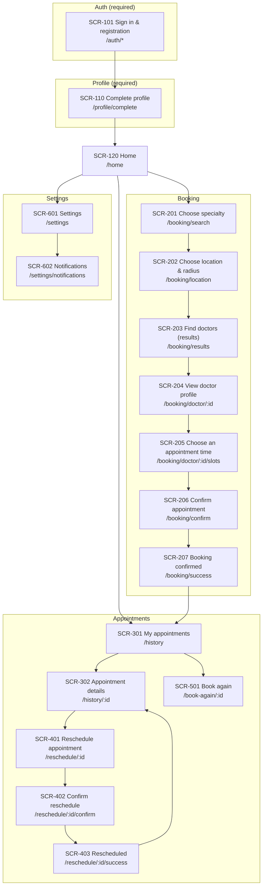
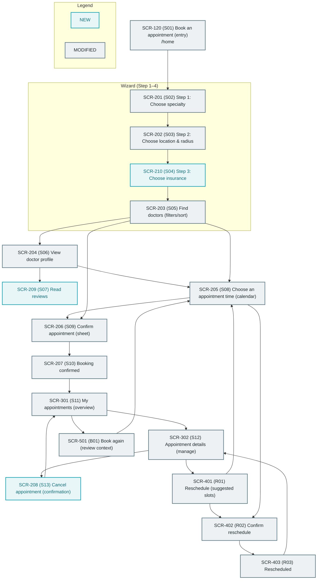

# IA Map — Current vs Target v2 (Booking N3)

This file compares the **current** Booking N3 IA (as implemented in routes) with the **target** IA from the v2 design-lite plans. It intentionally stays **high-level** (≤ 20 nodes/diagram).

## Screen ID mapping (reference only)

| Ref (SCR) | Current route/screen | Target design-lite screen |
|---|---|---|
| SCR-120 | Home (`/home`) | S01 Entry (“Book an appointment”) |
| SCR-201 | Choose specialty (`/booking/search`) | S02 Step 1: Specialty |
| SCR-202 | Choose location & radius (`/booking/location`) | S03 Step 2: Location & radius |
| SCR-210 | (no route today) | S04 Step 3: Insurance (**NEW**) |
| SCR-203 | Find doctors (`/booking/results`) | S05 Results list (**MODIFIED**) |
| SCR-204 | View doctor profile (`/booking/doctor/:id`) | S06 Doctor profile (**MODIFIED**) |
| SCR-209 | (no route today) | S07 Reviews list (**NEW**) |
| SCR-205 | Choose an appointment time (`/booking/doctor/:id/slots`) | S08 Slot picker (**MODIFIED**) |
| SCR-206 | Confirm appointment (`/booking/confirm`) | S09 Confirm sheet (**MODIFIED** shape: modal vs route TBD) |
| SCR-207 | Booking confirmed (`/booking/success`) | S10 Success (**MODIFIED**) |
| SCR-301 | My appointments (`/history`) | S11 My appointments (**MODIFIED**) |
| SCR-302 | Appointment details (`/history/:id`) | S12 Appointment details (**MODIFIED**) |
| SCR-208 | (no route today) | S13 Cancel confirmation (**NEW**) |
| SCR-401 | Reschedule appointment (`/reschedule/:id`) | R01 Suggested slots (**MODIFIED**) |
| SCR-402 | Confirm reschedule (`/reschedule/:id/confirm`) | R02 Reschedule confirm (**MODIFIED**) |
| SCR-403 | Rescheduled (`/reschedule/:id/success`) | R03 Reschedule success (**MODIFIED**) |
| SCR-501 | Book again (`/book-again/:id`) | B01 Pre-filled context (**MODIFIED**) |

## Current IA Map (as implemented today)

## Target IA Map (design-lite v2)

Legend:
- **NEW** = not present as a dedicated screen/modal today
- **MODIFIED** = present today but behavior/content/position changes

## Summary of differences (IA-level)

| Type | What changes |
|---|---|
| NEW | S04 Insurance step (`SCR-210`), S07 Reviews list (`SCR-209`), S13 Cancel confirmation (`SCR-208`) |
| MODIFIED | Wizard order (S02→S03→S04→S05), results behavior (filters/sort/cards), confirm as sheet (S09), appointments management (S11/S12), reschedule flow (R01–R03), book again context review (B01) |
| Unchanged (not shown) | Auth, profile, settings (structure remains; styling/copy may still change) |
