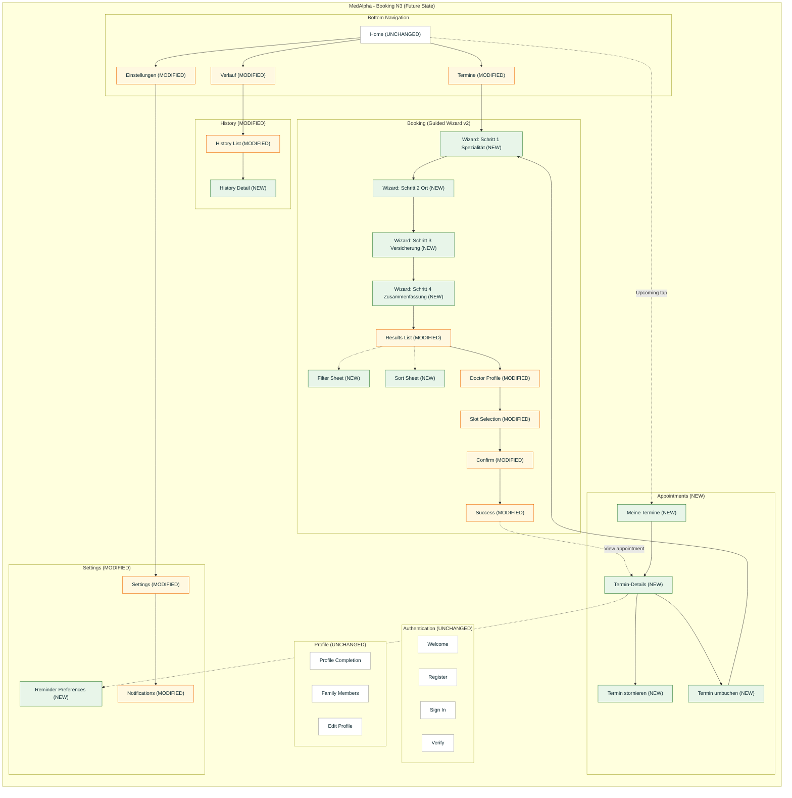

# IA Map - MedAlpha Booking N3 with Guided Wizard (v2)

This is a **feature impact analysis** for adding **Guided Wizard (v2)** booking to the current Booking N3 app. Changes are relative to the current routing + navigation defined in the sources above.

Legend:
- `NEW` = new surface/route/object
- `MODIFIED` = existing surface/route/object changed

## Updated Information Architecture (Future State)



---

## Summary of Changes

### NEW Elements

| Component | Location | Purpose |
|-----------|----------|---------|
| Booking wizard step screens | `/booking/wizard/*` | Step-by-step narrowing (Specialty → Location → Insurance → Summary) |
| Filter sheet + sort sheet | Results UI | Make refinement explicit, persistent, and reversible |
| Appointments list + detail | `/appointments/*` | Post-booking management (cancel, reschedule, reminders) |
| Reminder preferences | Settings | Centralize reminder policy and user control |
| History detail screen | `/history/:id` | Detail view + reuse for appointments/purchases/redemptions |

### MODIFIED Elements

| Component | Change | Impact |
|-----------|--------|--------|
| `/booking/search` | Becomes wizard entry (or redirects to Step 1) | Tab entry now starts the guided funnel |
| Results list | Adds chips/summary, filter count, deterministic empty states | Changes layout + persistence expectations |
| Confirm | Adds explicit “review” requirements + slot availability handling | More validation states, clearer outcomes |
| Success | Adds clear next actions (Meine Termine, reminders, calendar, route) | Drives post-booking completion |
| History | Splits list vs detail; aligns terminology to appointments | Enables richer management + deep links |
| Settings | Adds reminder settings surface | Introduces notification policy controls |

### Navigation Changes

| Navigation | Current | After Feature |
|------------|---------|---------------|
| Start booking | Home → `/booking/search` | Home → `/booking/wizard/specialty` (via Book tab) |
| Refine results | Back to search | Results → Filter/Sort (sheet) → Results |
| Post-booking | Success → History | Success → Termin-Details / Meine Termine |
| Reschedule | Not supported | Termin-Details → Umbuchen → Wizard Step 1 |

### Data Model Additions

```
BookingWizardState (NEW)
  - step: 1..4
  - specialtyQuery + selectedSpecialty
  - location: { city, postalCode, radiusKm, source }
  - insuranceType: GKV | PKV | Selbstzahler
  - summary: derived “Your choices”
  - persistKey + lastUpdatedAt

ResultRefinements (NEW)
  - filters: { distanceKm, ratingMin, languages[], videoOnly }
  - sort: soonest | distance | rating

AppointmentActions (NEW)
  - cancelReason (optional)
  - rescheduleFromAppointmentId
  - reminderPrefs: { pushEnabled, timings[] }
```

---

## Route Structure Updates

| Route | Screen Name | Protection | Change | Purpose |
|-------|-------------|------------|--------|---------|
| `/auth/welcome` | Welcome | Public | Unchanged | Entry |
| `/auth/register` | Register | Public | Unchanged | Create account |
| `/auth/sign-in` | Sign In | Public | Unchanged | Authenticate |
| `/auth/verify` | Verify | Public | Unchanged | Verification |
| `/profile/complete` | Profile Completion | Auth | Unchanged | Required setup |
| `/profile/family` | Family Members | Auth | Unchanged | Patient management |
| `/profile/edit` | Edit Profile | Auth | Unchanged | Profile edits |
| `/home` | Home | Auth + Profile complete | Unchanged | Dashboard + entry points |
| `/booking/search` | Booking Entry | Auth + Profile complete | MODIFIED | Redirect/start wizard |
| `/booking/wizard/specialty` | Wizard Step 1 | Auth + Profile complete | NEW | Specialty selection |
| `/booking/wizard/location` | Wizard Step 2 | Auth + Profile complete | NEW | Location + radius |
| `/booking/wizard/insurance` | Wizard Step 3 | Auth + Profile complete | NEW | Insurance selection |
| `/booking/wizard/review` | Wizard Step 4 | Auth + Profile complete | NEW | Summary + edit/back |
| `/booking/results` | Results List | Auth + Profile complete | MODIFIED | Shows list + filter/sort sheets |
| `/booking/doctor/:id` | Doctor Profile | Auth + Profile complete | MODIFIED | Shows suitability + slot entry |
| `/booking/doctor/:id/slots` | Slot Selection | Auth + Profile complete | MODIFIED | Slot picking rules |
| `/booking/confirm` | Confirm | Auth + Profile complete | MODIFIED | Final review + availability checks |
| `/booking/success` | Success | Auth + Profile complete | MODIFIED | Confirmation + next actions |
| `/appointments` | Meine Termine | Auth + Profile complete | NEW | Upcoming + past appointments |
| `/appointments/:id` | Termin-Details | Auth + Profile complete | NEW | Manage (cancel/reschedule/reminders) |
| `/appointments/:id/cancel` | Termin stornieren | Auth + Profile complete | NEW | Cancellation flow |
| `/appointments/:id/reschedule` | Termin umbuchen | Auth + Profile complete | NEW | Rebook with context |
| `/history` | History List | Auth + Profile complete | MODIFIED | Cross-domain history list |
| `/history/:id` | History Detail | Auth + Profile complete | NEW | Detail view (type-specific) |
| `/settings` | Settings | Auth | MODIFIED | Adds reminders entry |
| `/settings/notifications` | Notifications | Auth | MODIFIED | Notification channel control |
| `/settings/reminders` | Reminder Preferences | Auth | NEW | Reminder timing policies |

---

## Object Location Mapping Updates

| Object | Primary Location | Secondary Location(s) | Change | Access From |
|--------|------------------|----------------------|--------|-------------|
| Doctor | Results List | Doctor Profile | MODIFIED | Wizard → Results |
| Time Slot | Slot Selection | Doctor Profile | MODIFIED | Doctor → Slots |
| Booking Wizard State | Wizard steps | Results | NEW | Book tab entry |
| Result Filters | Filter sheet | Results header | NEW | Results |
| Result Sort | Sort sheet | Results header | NEW | Results |
| Appointment | Meine Termine | History, Success | MODIFIED | Success, Home, History |
| Appointment Cancellation | Termin stornieren | Termin-Details | NEW | Termin-Details |
| Reminder Preferences | Settings → Reminders | Termin-Details | NEW | Settings, Termin-Details |

---

## Screen Sections Updates (key surfaces)

### Wizard Step Screen (NEW)

```
┌─────────────────────────────┐
│ Termine                      │
│ Schritt 1 von 4              │
├─────────────────────────────┤
│ [ Eingabe / Auswahl ]        │
│                              │
│ [ Weiter ]                   │
└─────────────────────────────┘
```

### Results List (MODIFIED)

```
┌─────────────────────────────┐
│ Ergebnisse                   │
│ Spezialität · Ort · Kasse    │
├─────────────────────────────┤
│ [ Filter (2) ] [ Sortieren ] │
├─────────────────────────────┤
│ [ Arztkarte + Slots ]        │
│ [ Arztkarte + Slots ]        │
└─────────────────────────────┘
```

### Termin-Details (NEW)

```
┌─────────────────────────────┐
│ Termin-Details               │
├─────────────────────────────┤
│ Arzt · Ort                   │
│ Datum · Uhrzeit              │
├─────────────────────────────┤
│ [ Umbuchen ] [ Stornieren ]  │
│ [ Erinnerung ]               │
└─────────────────────────────┘
```

---

## Key Features Delivered

1. Guided booking funnel with explicit progress (Schritt 1–4)
2. Persistent, reversible refinements (filters/sort) on results
3. Deterministic handling for “no results” and “slot taken”
4. Post-booking appointment management (cancel/reschedule/reminders)

---

## MEDA-BOOK Guided Wizard (v2) Implementation Notes

- **Routing:** Keep `/booking/search` for backwards compatibility, but redirect to `/booking/wizard/specialty`.
- **Persistence:** Store `BookingWizardState` + `ResultRefinements` locally (e.g., localStorage) and restore on app restart until user resets.
- **i18n:** Default German (“Sie”), EU date formatting, and 30–40% text expansion resilience for all new/modified screens.
- **Availability:** Confirm step must re-check slot availability immediately before creating appointment; present non-alarming, actionable fallback when taken.
- **Appointments:** Create a dedicated appointments surface (`/appointments/*`) to avoid overloading History and to match user mental model (“Meine Termine”).

