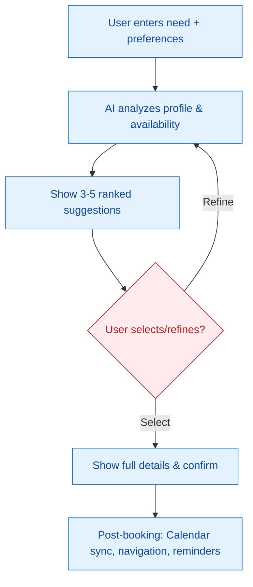
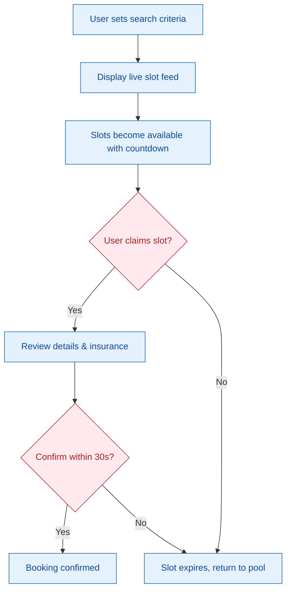
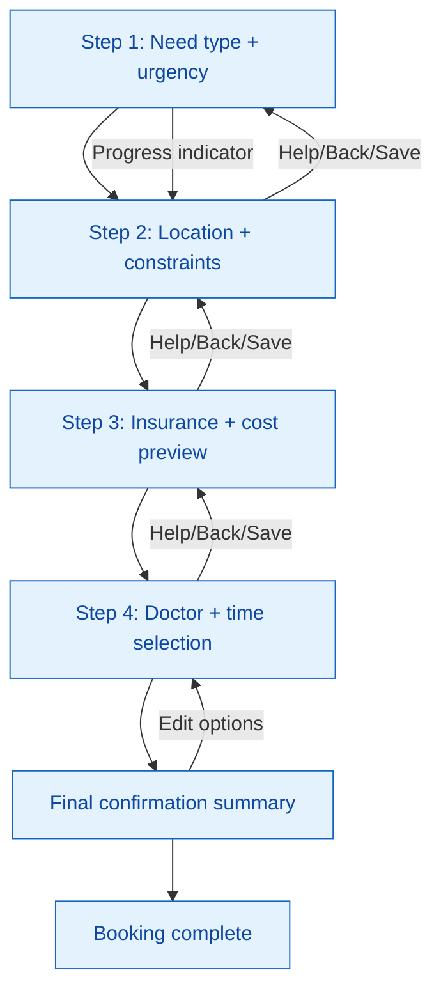
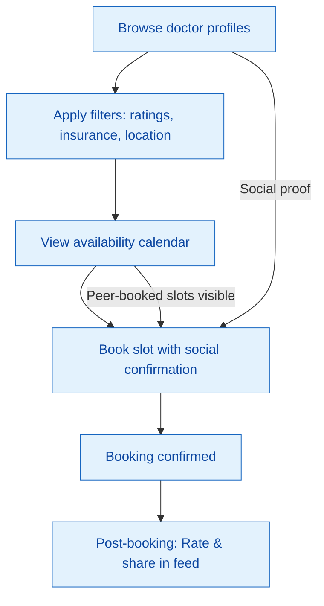
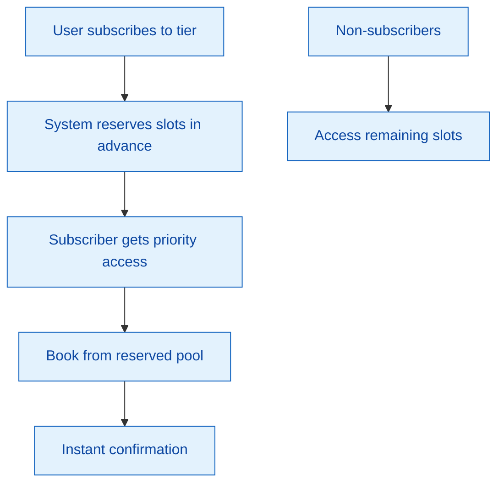
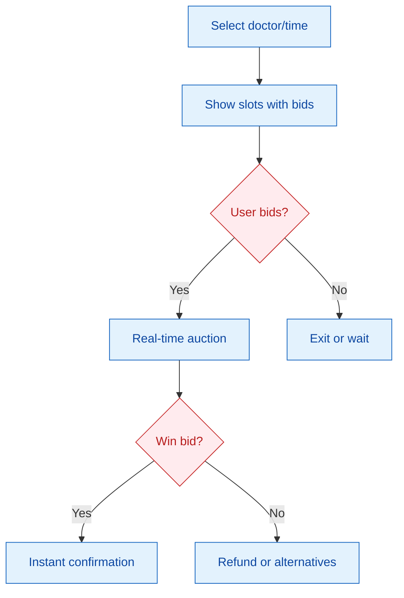
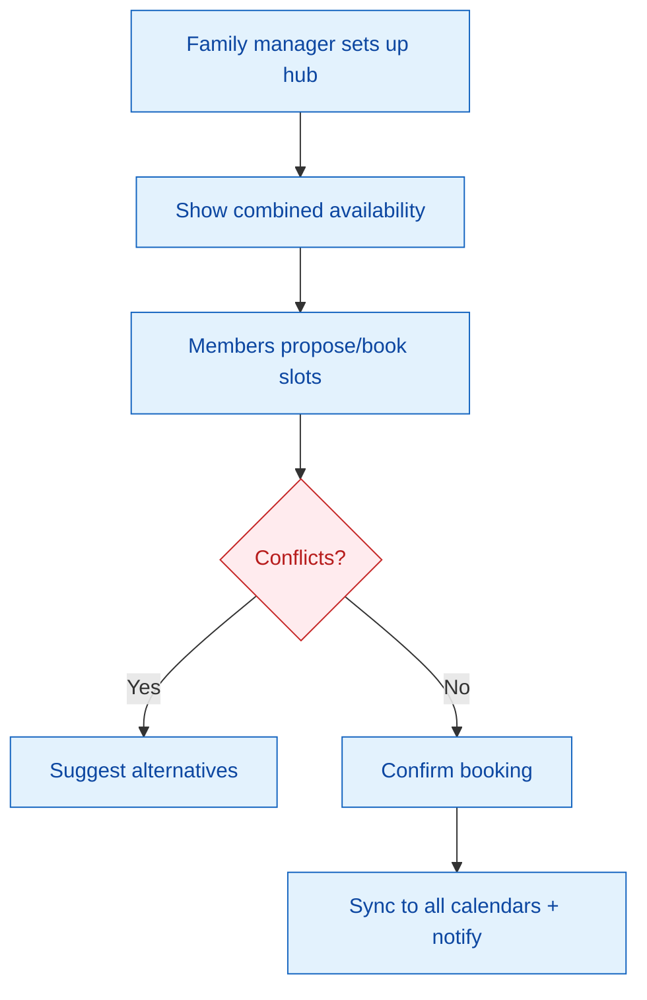
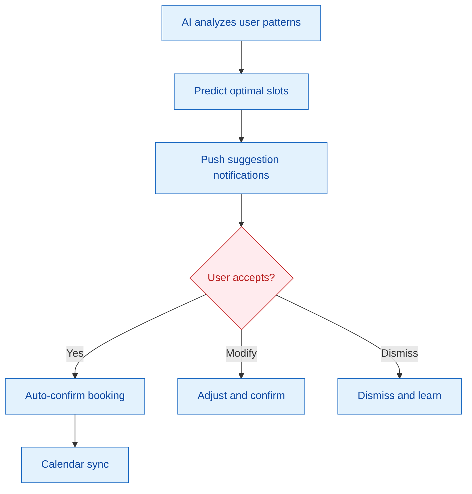

# Solution Approaches - Full Details

**CR-ID:** MEDA-BOOK-001  
**Problem Framing:** Reduce Booking Friction - Users can't quickly find and lock available slots without extra steps or uncertainty due to fragmented availability discovery, phone-based processes, and slot uncertainty during selection/confirmation.  
**Evaluation Criteria:** Clarity (🔴 must-have, weight 5), Speed (🟡 should-have, weight 5), Effort (🟡 should-have, weight 4), Implementation Complexity (🔵 feasibility, weight 4), Business Impact (🟣 viability, weight 4).

## Approach A: Assisted Discovery

### Core Concept
An AI-powered recommendation engine that learns user preferences and proactively suggests appointments based on past bookings, insurance coverage, and availability patterns. Users describe their need in natural language, and the system matches them with optimal doctor/time combinations, reducing search friction while ensuring clarity through explicit confirmation steps.

### Cross-Domain Inspiration
Inspired by Netflix's recommendation algorithm (entertainment) — Netflix solves content discovery overwhelm by analyzing user behavior to surface personalized suggestions that feel serendipitous but actually maximize engagement. Key pattern: Passive personalization that reduces choice paralysis while maintaining user control through overrides.

### How It Works
- User enters symptom/specialty + preferences (location, time range, insurance)
- AI analyzes profile history + availability data to suggest 3-5 ranked options
- Each suggestion shows doctor details, coverage estimate, time slot with hold duration
- User can refine suggestions or select directly; confirmation shows full details
- Post-booking: Calendar sync + navigation + reminder setup



### Trade-Offs
| Pros | Cons |
|------|------|
| Minimizes user effort in discovery phase | Requires robust AI/ML infrastructure |
| Handles complex preferences (family, insurance) | Initial suggestions may miss edge cases |
| Scales with user data for better recommendations | Privacy concerns with personal health data usage |
| Reduces time-to-book through pre-filtering | Dependency on accurate availability data from Curaay |

### Best Suited For
Marc (42, health-conscious professional) - Values efficiency and personalization; Helga (68, senior) - Benefits from simplified, guided experience.

## Approach B: Slot Racing

### Core Concept
Time-sensitive appointment slots are released in "flash sale" style batches, creating gentle urgency to encourage quick decisions. Users monitor a live availability feed and claim slots immediately when they appear, with guaranteed holds for a short period to allow review and confirmation.

### Cross-Domain Inspiration
Inspired by stock market trading platforms (finance) — Trading apps handle high-stakes, time-sensitive decisions by showing real-time price feeds with immediate action buttons, creating engagement through scarcity without overwhelming users. Key pattern: Live updates with clear action states (available → claimed → confirmed).

### How It Works
- User sets up search criteria + preferred time windows
- System shows live "slot feed" with upcoming releases (next 30 min, hour, day)
- When slots match criteria, they flash available with countdown timer (30s hold)
- User claims slot → review screen shows details + insurance check
- Confirm within hold period; expired slots return to pool



### Trade-Offs
| Pros | Cons |
|------|------|
| Extremely fast booking once slots appear | Creates anxiety for users who miss opportunities |
| High completion rates through urgency | May disadvantage slower users (accessibility issues) |
| Real-time engagement increases app usage | Requires live backend infrastructure |
| Clear scarcity signals reduce hesitation | Not suitable for planned, non-urgent bookings |

### Best Suited For
Elena (23, young wellness enthusiast) - Thrives on gamified urgency; Marc (42, professional) - Appreciates speed for time management.

## Approach C: Guided Wizard

### Core Concept
A step-by-step wizard that progressively narrows options through contextual questions, building user confidence at each stage. Starting with broad needs, it guides users through specialty selection, location preferences, insurance verification, and final slot choice with explicit confirmations and recovery options.

### Cross-Domain Inspiration
Inspired by TurboTax's tax filing wizard (finance software) — TurboTax guides users through complex tax scenarios with progressive disclosure, providing help at each step and allowing saves/resumes. Key pattern: Question-answer flow that reduces cognitive load while ensuring completeness.

### How It Works
- Step 1: Need type (symptom/specialty) + urgency level
- Step 2: Location preferences + travel constraints
- Step 3: Insurance/coverage confirmation + cost preview
- Step 4: Doctor selection from filtered results + time slot choice
- Each step shows progress indicator, help options, and back/save ability
- Final confirmation summarizes everything with edit options



### Trade-Offs
| Pros | Cons |
|------|------|
| Extremely clear process with high user confidence | May feel slower for experienced users |
| Supports accessibility (large steps, help text) | Linear flow doesn't support exploration |
| Easy to implement progressive enhancements | Requires careful question design to avoid confusion |
| Strong for family/dependent booking contexts | May need customization for different user types |

### Best Suited For
Helga (68, senior with chronic conditions) - Values clarity and step-by-step guidance; Sarah (34, busy mother) - Needs structured process for family bookings.

## Approach D: Social Matching

### Core Concept
A community-driven booking platform where doctors have profiles with patient reviews, ratings, and availability transparency. Users can browse doctor "profiles" like social media, see peer experiences, and book directly with confidence built through social proof and transparent scheduling.

### Cross-Domain Inspiration
Inspired by Airbnb's host profiles (hospitality) — Airbnb solved trust in peer-to-peer rentals by showing detailed host profiles with reviews, verification badges, and transparent availability calendars. Key pattern: Social proof through user-generated content that builds trust without direct relationships.

### How It Works
- Browse doctor profiles with photos, specialties, patient reviews, wait times
- Filter by ratings, insurance acceptance, location
- View live availability calendar with peer-booked slots
- Book directly with social confirmation (review average, badges)
- Post-booking: Rate experience, share in community feed



### Trade-Offs
| Pros | Cons |
|------|------|
| Builds trust through peer reviews and transparency | Requires critical mass of reviews to be effective |
| Encourages community and repeat usage | Privacy concerns with doctor/patient review sharing |
| Differentiates from standard booking apps | Higher implementation complexity for review system |
| Appeals to younger users seeking "best" options | May not suit urgent care or anonymous booking needs |

### Best Suited For
Elena (23, wellness enthusiast) - Values social proof and modern experience; Thomas (51, value-driven pragmatist) - Makes decisions based on reviews and transparency.

## Scoring Rationale
- **Clarity (5)**: All approaches address explicit confirmations; A/C strongest with guided flows
- **Speed (5)**: B fastest through urgency; A/C balance speed with confidence
- **Effort (4)**: C/A minimize backtracking; B requires monitoring
- **Complexity (4)**: C simplest for MVP; A/D require more infrastructure
- **Impact (4)**: C/A have broadest appeal; B/D more niche

## Recommendation
Approach C (Guided Wizard) is recommended as it directly addresses the core problem of booking friction while meeting all must-have criteria. It leverages proven UX patterns, supports accessibility and family use cases, and can be implemented within MVP constraints while delivering strong business impact.

---

## Approach E: Subscription Slots

### Core Concept
Users subscribe to priority access for doctor slots, paying a small recurring fee for guaranteed early booking windows or reserved slots. This creates a predictable revenue stream while reducing friction through pre-allocated availability, similar to premium services that bypass general queues.

### Cross-Domain Inspiration
Inspired by Spotify Premium subscriptions (music streaming) — Spotify solved ad interruptions and offline access through tiered subscriptions, creating loyal users willing to pay for enhanced convenience. Key pattern: Predictable value exchange for priority access that builds habit and reduces decision friction.

### How It Works
- User subscribes to tier (e.g., €5/month for early access to top doctors)
- System reserves slots in advance based on user preferences
- Subscriber gets first access to new slots, bypassing public queue
- Book directly from reserved pool with instant confirmation
- Non-subscribers access remaining slots on a first-come basis



### Trade-Offs
| Pros | Cons |
|------|------|
| Predictable revenue for business | Requires subscription management |
| Reduces user friction through priority | May create inequality between subscribers |
| Builds loyalty and repeat usage | Initial adoption challenge for paid model |
| Clear value proposition for frequent users | Additional complexity in billing integration |

### Best Suited For
Marc (42, health-conscious professional) - Values priority access for efficiency; Thomas (51, value-driven pragmatist) - Sees clear ROI in subscription.

## Approach F: Auction Bidding

### Core Concept
Appointment slots are auctioned in real-time, allowing users to bid for premium slots with immediate availability. Higher bids secure faster access, creating a market-driven system that prioritizes urgent needs while generating revenue from willingness to pay.

### Cross-Domain Inspiration
Inspired by eBay auctions (e-commerce) — eBay created a dynamic marketplace where bid urgency drives engagement and fair pricing, handling high-value transactions with clear rules. Key pattern: Auction mechanics that balance supply/demand through competitive bidding.

### How It Works
- User selects desired doctor/time window
- System shows available slots with starting bids
- Users place bids in real-time auction format
- Winning bidder gets confirmed slot immediately
- Losers get refunded or offered alternative slots



### Trade-Offs
| Pros | Cons |
|------|------|
| Generates revenue from urgency | May disadvantage lower-income users |
| Fast resolution for willing payers | High risk of user confusion in auctions |
| Market-driven pricing | Complex implementation with real-time bidding |
| Clear for competitive users | May not suit standard healthcare expectations |

### Best Suited For
Marc (42, professional) - Willing to pay for immediate access; Elena (23, student) - May participate in competitive bidding for convenience.

## Approach G: Voice Guided Booking

### Core Concept
Conversational voice interface guides users through booking via natural language, using AI to interpret requests and confirm details verbally. This hands-free approach reduces visual interaction, supporting accessibility while providing step-by-step guidance through spoken dialogue.

### Cross-Domain Inspiration
Inspired by Amazon Alexa skills (smart home) — Alexa enables complex tasks through natural voice commands, providing conversational assistance that feels intuitive and accessible. Key pattern: Voice-first interactions that reduce friction for hands-busy or visually impaired users.

### How It Works
- User says "Book a doctor appointment" to trigger voice mode
- AI asks clarifying questions: "What type of doctor?" "When?" "Where?"
- System confirms details verbally and shows visual summary
- User voice-confirms booking; system handles calendar integration
- Fallback to text if voice fails

```mermaid
flowchart TD
    A[Voice trigger: "Book appointment"] --> B[AI asks: specialty, time, location]
    B --> C[User responds verbally]
    C --> D[AI confirms details verbally + visual summary]
    D --> E{User confirms?}
    E -->|Yes| F[Booking complete + calendar sync]
    E -->|No| B
    classDef default fill:#e3f2fd,stroke:#1565c0,color:#0d47a1
    classDef decision fill:#ffebee,stroke:#c62828,color:#b71c1c
    class E decision
```

### Trade-Offs
| Pros | Cons |
|------|------|
| Excellent for accessibility (voice-only) | Requires reliable voice recognition |
| Hands-free booking for multitasking | Privacy concerns with voice data |
| Natural conversation reduces confusion | May be slower than visual interfaces |
| Supports multiple languages easily | Dependent on device voice capabilities |

### Best Suited For
Helga (68, senior) - Benefits from voice guidance without complex screens; Sarah (34, busy mother) - Can book while driving or cooking.

## Approach H: Collaborative Family Booking

### Core Concept
A shared family scheduling hub where authorized members can view, propose, and book appointments collaboratively. Family manager sets permissions, and the system suggests coordinated slots considering multiple calendars, enabling seamless booking for dependents without separate accounts.

### Cross-Domain Inspiration
Inspired by Google Calendar sharing (productivity) — Google Calendar enables collaborative scheduling across teams/families with shared visibility and permissions, reducing coordination friction. Key pattern: Shared calendar views that facilitate group decision-making.

### How It Works
- Family manager creates shared hub with member profiles
- System shows combined availability across family calendars
- Members propose slots or book directly with permission
- Conflicts flagged; system suggests alternatives
- Bookings sync to all relevant calendars with notifications



### Trade-Offs
| Pros | Cons |
|------|------|
| Excellent for family coordination | Requires family account management |
| Reduces duplicate bookings | Privacy concerns with shared health data |
| Supports dependents seamlessly | Higher complexity in permissions |
| Builds family engagement | May overwhelm single users |

### Best Suited For
Sarah (34, busy mother) - Manages health for entire family; Helga (68, senior) - Could have adult children help coordinate.

## Approach I: Predictive Booking

### Core Concept
AI predicts optimal booking times based on user patterns, health history, and doctor availability trends, proactively suggesting slots before users initiate searches. This reduces decision paralysis by presenting "perfect" options based on learned preferences and historical success rates.

### Cross-Domain Inspiration
Inspired by Google Maps predictive routing (navigation) — Maps anticipates user needs by learning patterns and suggesting routes before requests, reducing friction through proactive assistance. Key pattern: Predictive suggestions based on behavioral data that anticipate user intent.

### How It Works
- AI analyzes user booking history and patterns
- System predicts optimal slots based on trends (e.g., "Tuesday mornings work best")
- Push notifications suggest slots: "Book now for Dr. X at 10 AM?"
- User can accept, modify, or dismiss suggestions
- Accepted bookings auto-confirm with calendar sync



### Trade-Offs
| Pros | Cons |
|------|------|
| Minimizes user effort through proactivity | Requires extensive user data |
| Fast booking with personalized suggestions | Privacy concerns with pattern analysis |
| Learns to optimize over time | May suggest unwanted notifications |
| Reduces search friction entirely | Initial suggestions may be inaccurate |

### Best Suited For
Marc (42, professional) - Values personalized efficiency; Thomas (51, pragmatist) - Appreciates data-driven optimization.

## Scoring Rationale
- **Clarity (5)**: H/I strongest with explicit confirmations; F weakest due to auction complexity
- **Speed (5)**: I fastest through prediction; F slowest due to bidding
- **Effort (4)**: G/I minimize steps; F requires active participation
- **Complexity (4)**: H simplest for MVP; E/F require more infrastructure
- **Impact (4)**: H/I broadest appeal; F more niche/revenue-focused

## Recommendation
Approach H (Collaborative Family Booking) is recommended for this iteration as it offers a fresh perspective on family healthcare coordination, scoring high on clarity and impact while maintaining feasibility. It directly addresses the family-centric personas in the MedAlpha context and provides differentiation from standard booking apps.
