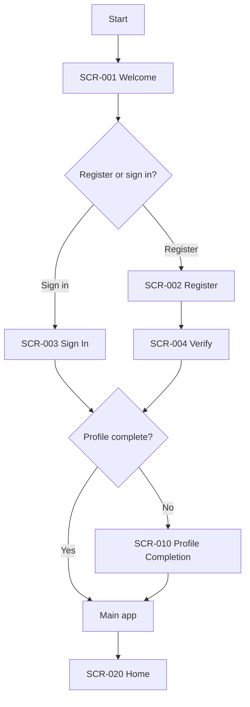
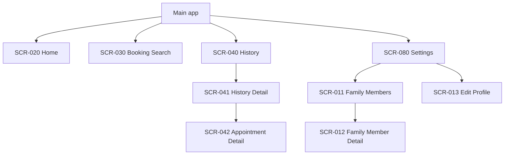
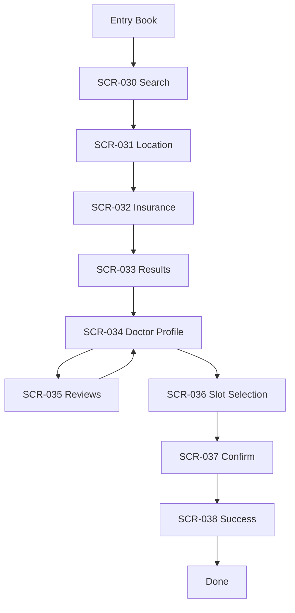
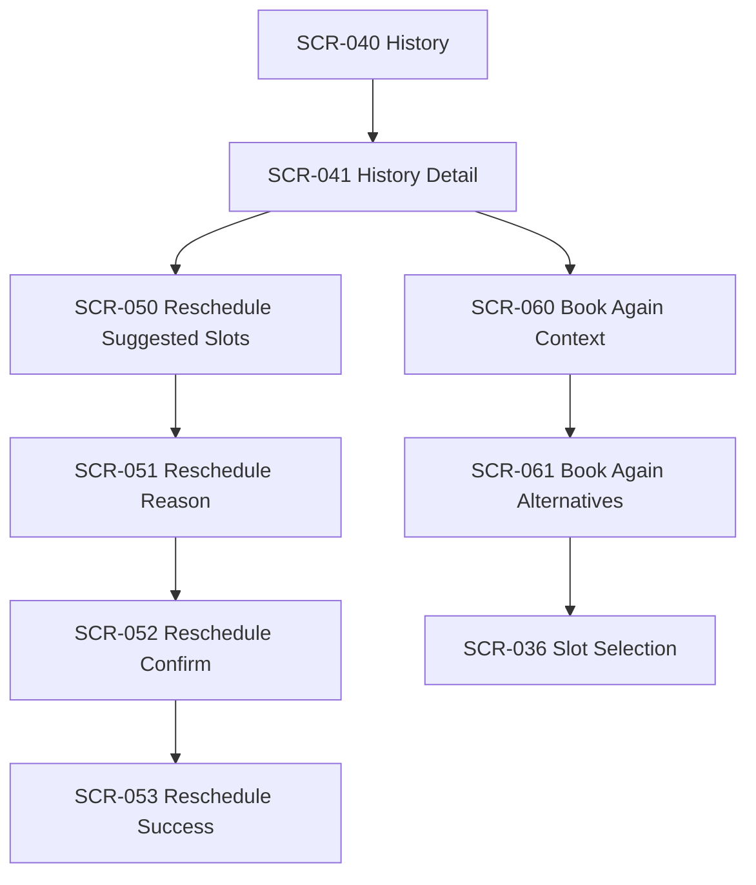

# IA Map (Canonical) - Appointment Booking N3

**Related spec:** [[0-APPOINTMENT-BOOKING-SCOPE]]
**Related artifacts:** [[1-dot-map]] · [[2-user-journeys]] · [[SCREENS]]

This is the canonical IA map entry point referenced by `docs/z.guidelines/visual-artifacts-rules.md`.

---

## Navigation Model (N3)

- **Auth:** Welcome → Register/Sign In → Verify (email) → (optional) Verify Identity
- **Main:** Bottom navigation conceptually exposes **Home**, **Book**, **History**, **Settings**
  - Booking screens are under `/booking/*` routes.
  - History screens are under `/history/*` routes.
  - Settings screens are under `/settings/*` routes.
- **Gating:** Booking + History require **Auth + Profile complete**; Home requires **Auth**.

---

## IA Diagram — Auth & Gate (≤ 20 nodes)

---

## IA Diagram — Main Areas (≤ 20 nodes)

---

## IA Diagram — Booking (Detail) (≤ 20 nodes)

---

## IA Diagram — Appointment Actions (≤ 20 nodes)

---

## Screen IDs

The full canonical list lives in: [[SCREENS]]
