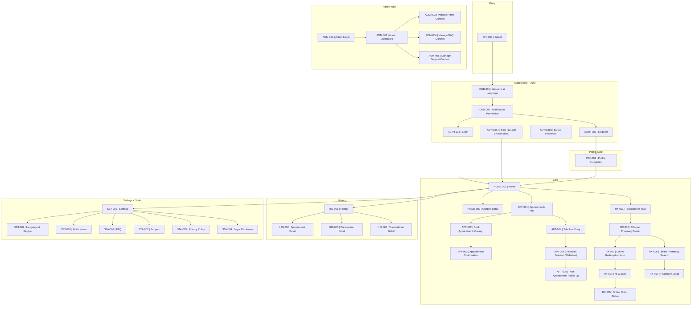

# MedAlpha Connect IA Map

Last Updated: 2026-01-16
Screen Count: 41

```mermaid
graph TD
    %% Entry
    subgraph Tier0[Entry]
        SPL001["SPL-001 | Splash"]
    end

    %% Onboarding + Auth
    subgraph Tier1[Onboarding + Auth]
        ONB001["ONB-001 | Welcome & Language"]
        ONB002["ONB-002 | Notification Permission"]
        AUTH001["AUTH-001 | Login"]
        AUTH002["AUTH-002 | Register"]
        AUTH003["AUTH-003 | Forgot Password"]
        AUTH004["AUTH-004 | SSO Handoff (Placeholder)"]
    end

    %% Profile Gate
    subgraph Tier2[Profile Gate]
        PRF001["PRF-001 | Profile Completion"]
    end

    %% Core
    subgraph Tier3[Core]
        HOME001["HOME-001 | Home"]
        HOME002["HOME-002 | Content Detail"]
        APT001["APT-001 | Appointments Hub"]
        APT002["APT-002 | Book Appointment (Curaay)"]
        APT003["APT-003 | Appointment Confirmation"]
        APT004["APT-004 | Teleclinic Entry"]
        APT005["APT-005 | Teleclinic Session (WebView)"]
        APT006["APT-006 | Post-Appointment Follow-up"]
        RX001["RX-001 | Prescriptions Hub"]
        RX002["RX-002 | Choose Pharmacy Mode"]
        RX003["RX-003 | Online Redemption Intro"]
        RX004["RX-004 | NFC Scan"]
        RX005["RX-005 | Online Order Status"]
        RX006["RX-006 | Offline Pharmacy Search"]
        RX007["RX-007 | Pharmacy Detail"]
    end

    %% History
    subgraph Tier4[History]
        HIS001["HIS-001 | History"]
        HIS002["HIS-002 | Appointment Detail"]
        HIS003["HIS-003 | Prescription Detail"]
        HIS004["HIS-004 | Telemedicine Detail"]
    end

    %% Settings + Static
    subgraph Tier5[Settings + Static]
        SET001["SET-001 | Settings"]
        SET002["SET-002 | Language & Region"]
        SET003["SET-003 | Notifications"]
        STA001["STA-001 | FAQ"]
        STA002["STA-002 | Support"]
        STA003["STA-003 | Privacy Policy"]
        STA004["STA-004 | Legal Disclosure"]
    end

    %% Admin Web
    subgraph Tier6[Admin Web]
        ADM001["ADM-001 | Admin Login"]
        ADM002["ADM-002 | Admin Dashboard"]
        ADM003["ADM-003 | Manage Home Content"]
        ADM004["ADM-004 | Manage FAQ Content"]
        ADM005["ADM-005 | Manage Support Content"]
    end

    %% Entry to Onboarding
    SPL001 --> ONB001
    ONB001 --> ONB002
    ONB002 --> AUTH001
    ONB002 --> AUTH002

    %% Auth + Profile
    AUTH001 --> HOME001
    AUTH002 --> PRF001
    AUTH004 --> HOME001
    PRF001 --> HOME001

    %% Home and Content
    HOME001 --> HOME002
    HOME001 --> APT001
    HOME001 --> RX001
    HOME001 --> HIS001
    HOME001 --> SET001

    %% Appointments
    APT001 --> APT002
    APT002 --> APT003
    APT001 --> APT004
    APT004 --> APT005
    APT005 --> APT006

    %% Prescriptions
    RX001 --> RX002
    RX002 --> RX003
    RX003 --> RX004
    RX004 --> RX005
    RX002 --> RX006
    RX006 --> RX007

    %% History
    HIS001 --> HIS002
    HIS001 --> HIS003
    HIS001 --> HIS004

    %% Settings + Static
    SET001 --> SET002
    SET001 --> SET003
    SET001 --> STA001
    SET001 --> STA002
    SET001 --> STA003
    SET001 --> STA004

    %% Admin Web
    ADM001 --> ADM002
    ADM002 --> ADM003
    ADM002 --> ADM004
    ADM002 --> ADM005
```
