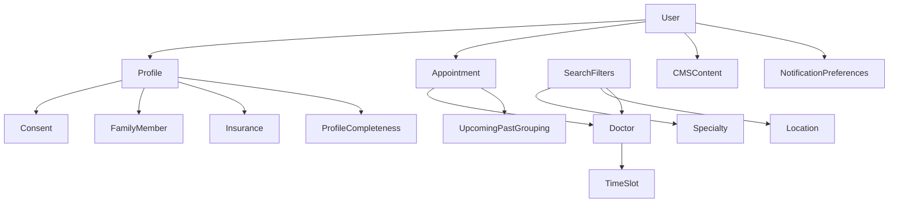

# OOUX Dot Map - Appointment Booking N3

**Related spec:** [[0-APPOINTMENT-BOOKING-SCOPE]]

This document follows `docs/z.guidelines/visual-artifacts-rules.md` and its linked constraints.

---

## 1) Things (Objects)

| Type | Thing | Description |
|------|-------|-------------|
| Main | User | The authenticated person using the app. |
| Main | User Profile | The user’s identity, insurance, address, and consent needed to book. |
| Main | Family Member | A dependent the user can book for. |
| Main | Appointment | A booked time with a doctor for a specific patient. |
| Main | Doctor | A provider returned by the booking partner (Curaay). |
| Supporting | Specialty | A medical specialty used to search doctors. |
| Supporting | Location | City + optional radius used for search. |
| Supporting | Search Filters | Additional criteria (insurance type, language, rating, sort). |
| Supporting | Time Slot | A date+time availability option for a doctor. |
| Supporting | Insurance | Eligibility context (GKV/PKV; + “Selbstzahler” in Book Again context). |
| Supporting | Consent | GDPR consent required before enabling booking flows. |
| Supporting | CMS Content | Informational/promotional cards targeted by insurance. |
| Supporting | Notification Preferences | Reminders and other notification toggles. |
| Calculated | Profile Completeness | Derived gate: profile fields + consent must be satisfied. |
| Calculated | Upcoming vs Past | Derived grouping of appointments/history by date/status. |

---

## 2) Key Details (Attributes)

### User

| Detail | Type | Required? | Source |
|--------|------|-----------|--------|
| id | text | Yes | `AppState.auth.userId` |
| email | text | Yes | `UserProfile.email` |
| verified | boolean | Yes | `AuthState.verified` |

### User Profile

| Detail | Type | Required? | Source |
|--------|------|-----------|--------|
| fullName | text | Yes | `UserProfile.fullName` |
| insuranceType | enum (GKV, PKV) | Yes | `UserProfile.insuranceType` |
| egkNumber | text | Yes | `UserProfile.egkNumber` |
| address.street | text | Yes | `UserProfile.address.street` |
| address.postalCode | text | Yes | `UserProfile.address.postalCode` |
| address.city | text | Yes | `UserProfile.address.city` |
| gdprConsent.dataProcessing | boolean | Yes | `UserProfile.gdprConsent.dataProcessing` |
| gdprConsent.marketing | boolean | No | `UserProfile.gdprConsent.marketing` |
| gdprConsent.consentDate | datetime | System | `UserProfile.gdprConsent.consentDate` |

### Family Member

| Detail | Type | Required? |
|--------|------|-----------|
| id | text | Yes |
| name | text | Yes |
| dateOfBirth | date (YYYY-MM-DD) | Yes |
| relationship | enum | Yes |
| insuranceType | enum | No |
| egkNumber | text | No |
| verified | boolean | No |

### Doctor

| Detail | Type | Required? |
|--------|------|-----------|
| id | text | Yes |
| name | text | Yes |
| specialty | text | Yes |
| address, city | text | Yes |
| rating, reviewCount | number | Yes |
| accepts | list | Yes |
| nextAvailableISO | datetime | Yes |
| languages | list | Yes |

### Appointment

| Detail | Type | Required? |
|--------|------|-----------|
| id | text | Yes |
| doctorId | text | Yes |
| dateISO, time | datetime/text | Yes |
| forUserId, forUserName | text | Yes |
| status | enum (confirmed, completed, cancelled) | Yes |
| reminderSet | boolean | Yes |
| calendarSynced | boolean | Yes |

---

## 3) What Users Can Do (Actions)

| Thing | User Actions |
|-------|--------------|
| User | sign in, sign out, verify identity |
| User Profile | complete profile, edit profile, manage consent |
| Family Member | add, view, edit, remove |
| Doctor | search, filter, view profile, read reviews |
| Time Slot | browse, select |
| Appointment | confirm booking, view details, reschedule, cancel, book again |
| Notification Preferences | enable/disable reminders |
| CMS Content | view, open link |

---

## 4) Connections (Relationships)

