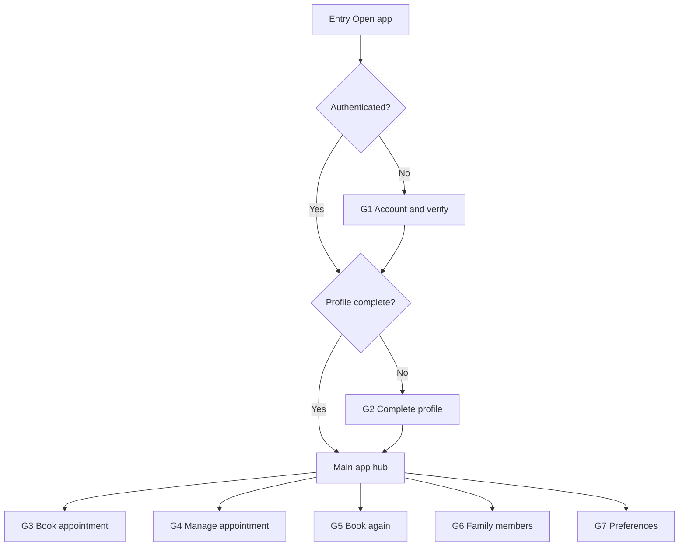
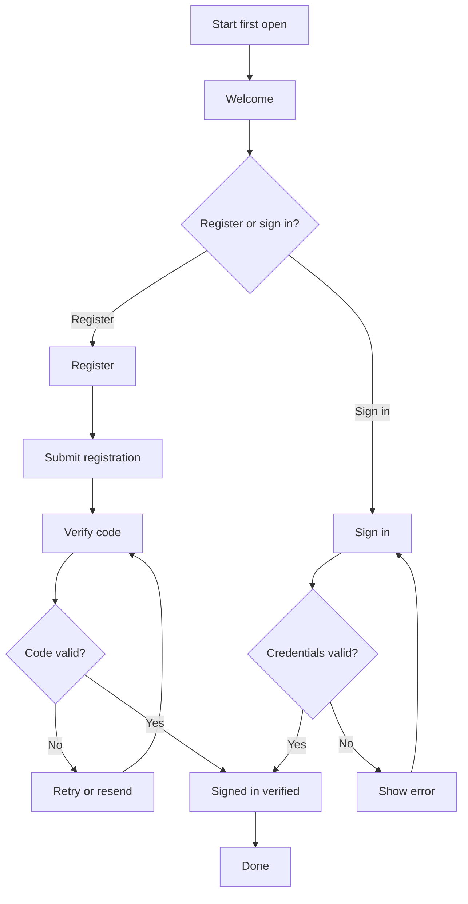
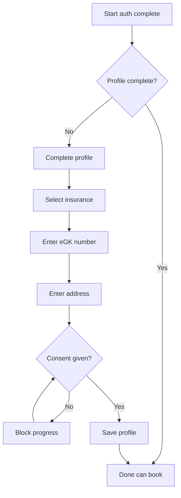
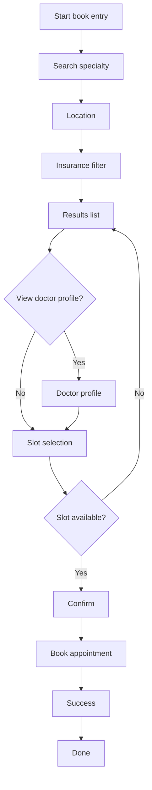
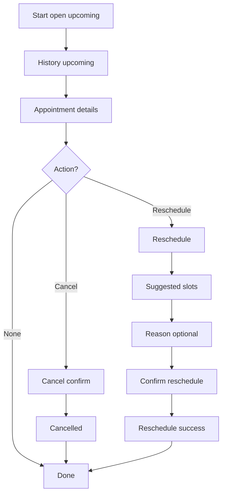
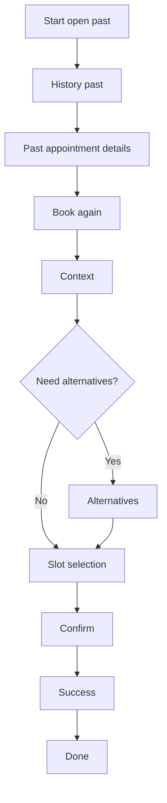
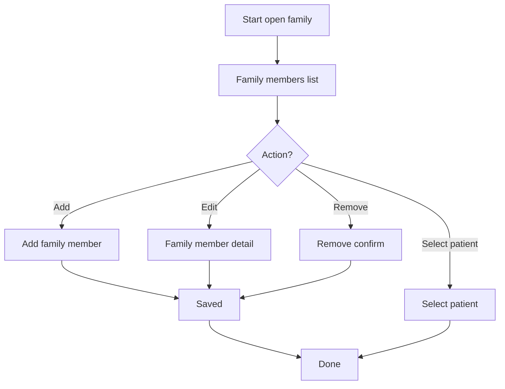
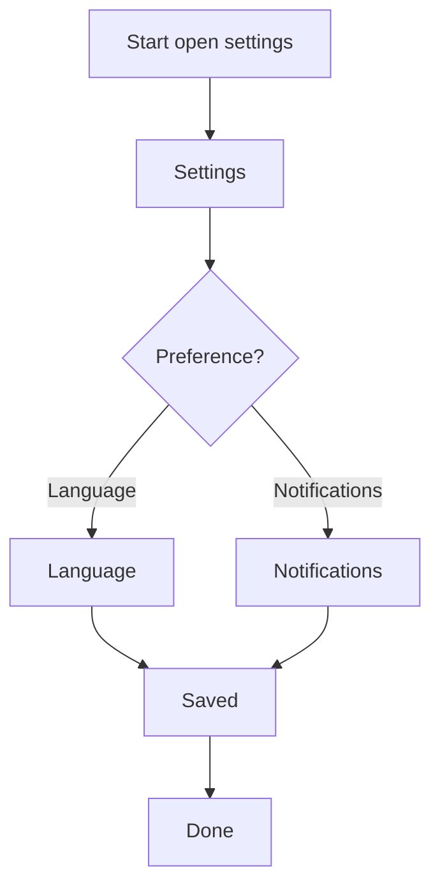

# User Journeys - Appointment Booking N3

**Related spec:** [[0-APPOINTMENT-BOOKING-SCOPE]]
**Related artifacts:** [[1-dot-map]] · [[IA]] · [[SCREENS]]

This document follows `docs/z.guidelines/visual-artifacts-rules.md` and its linked constraints.

---

## 1) User Goals (Behavior First)

| Goal ID | Goal statement | Things involved | Key actions |
|--------|-----------------|----------------|------------|
| G1 | When I install the app, I want to create an account and verify it, so that I can access booking features. | User, User Profile | register, verify, sign in |
| G2 | When I want to book care, I want to complete my profile (insurance, address, consent), so that eligibility and reminders work. | User Profile, Consent, Insurance | complete profile, consent |
| G3 | When I need an appointment, I want to find a suitable doctor and time slot, so that I can book quickly. | Doctor, Search Filters, Time Slot, Appointment | search, filter, select, confirm |
| G4 | When I have an upcoming appointment, I want to view details and take actions, so that I stay in control (cancel/reschedule). | Appointment | view, cancel, reschedule |
| G5 | When I had a past visit, I want to book again using the prior context, so that I save time. | Appointment, Doctor, Location, Insurance | book again, select slot |
| G6 | When I book for my child or dependent, I want to manage family members, so that the booking uses the right patient details. | Family Member, User Profile | add/edit/remove, select patient |
| G7 | When I change preferences, I want to update language and notification settings, so that the app fits my needs. | Notification Preferences | configure |

---

## 2) Goal Map (How Goals Connect)

---

## 3) Journey Diagrams (Per Goal)

### G1 — Account + Verify

### G2 — Profile Completion Gate

### G3 — Book Appointment (Core Booking)

### G4 — Manage Upcoming Appointment (View / Cancel / Reschedule)

### G5 — Book Again (From Past Appointment)

### G6 — Family Members (Manage + Select Patient)

### G7 — Preferences (Language + Notifications)

---

## 4) Paths and Decision Points (Summary)

| Goal | Key decision(s) | Primary alternate path(s) |
|------|------------------|---------------------------|
| G1 | Register vs sign in; code valid? | Retry/resend; credential error |
| G2 | Profile complete? consent given? | Block until consent |
| G3 | View profile vs quick slot; slot available? | Back to results |
| G4 | Cancel vs reschedule | No action |
| G5 | Alternatives needed? | Direct slot selection |
| G6 | Add/edit/remove vs select patient | Confirm remove |
| G7 | Language vs notifications | - |
