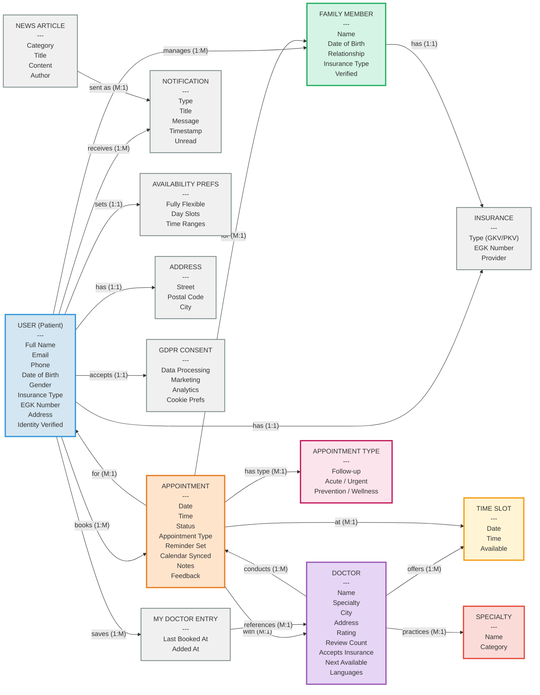
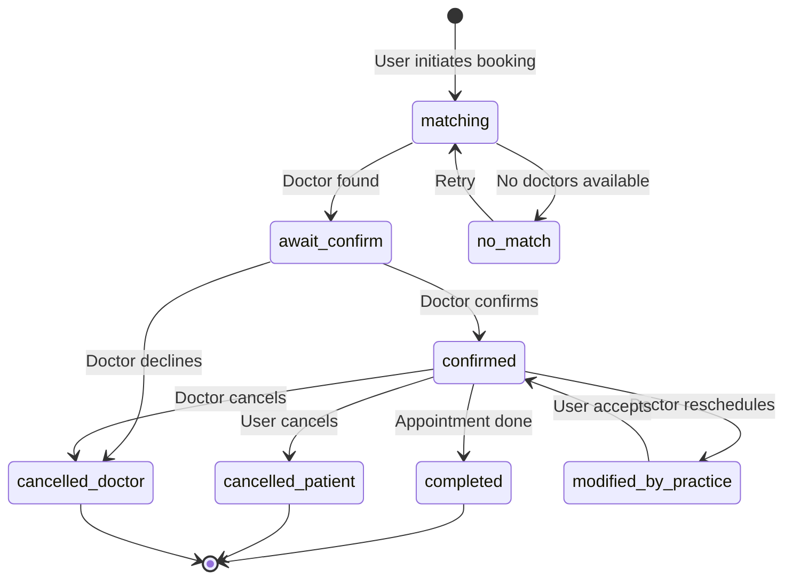

# DocliQ Mobile - OOUX Dot Map

**Version:** 4.0
**Date:** 2026-02-05
**Purpose:** Object-Oriented UX analysis of the DocliQ healthcare appointment booking app

---

## Mermaid Diagram



---

## Object Descriptions

### Core Objects (7)

| Object | Color | Key Attributes |
|--------|-------|----------------|
| **USER (Patient)** | Blue | Full Name, Email, Phone, DOB, Gender, Insurance, Identity Verified |
| **DOCTOR** | Purple | Name, Specialty, City, Rating, Reviews, Accepts Insurance, Languages |
| **APPOINTMENT** | Orange | Date, Time, Status (7 values), Appointment Type, Feedback |
| **FAMILY MEMBER** | Green | Name, DOB, Relationship, Insurance, Verified |
| **TIME SLOT** | Yellow | Date, Time, Available |
| **SPECIALTY** | Red | Name, Category (12 types) |
| **APPOINTMENT TYPE** | Pink | Follow-up, Acute/Urgent, Prevention/Wellness |

---

**USER (Patient)** (Blue)
- Primary persona using the app to book medical appointments
- Attributes: Full Name, Email, Phone, Phone Country Code, Date of Birth, Gender, Insurance Type, EGK Number, Address, Photo URL, Identity Verified, Phone Verified, Auth Provider
- Actions: Register, Sign In, Book Appointment, Manage Family, Save Doctor, Accept Consent

**DOCTOR** (Purple)
- Healthcare provider offering appointments through the platform
- Attributes: Name, Specialty, City, Address, Rating, Review Count, Accepts (Insurance Types), Next Available ISO, Image URL, About, Languages
- Actions: Offer Slots, Confirm Appointment, Reschedule, Cancel

**APPOINTMENT** (Orange)
- Scheduled meeting between patient/family member and doctor
- Attributes: Doctor ID, Doctor Name, Specialty, Date ISO, Time, For User ID, For User Name, Status, Reminder Set, Calendar Synced, Appointment Type, Notes, Location Name, Feedback Rating, Feedback Comment, Cancel Reason, Change History
- Appointment Types: `follow_up`, `acute_urgent`, `prevention_wellness`
- Status Values: `matching`, `await_confirm`, `confirmed`, `modified_by_practice`, `completed`, `cancelled_patient`, `cancelled_doctor`
- Actions: Create, Reschedule, Cancel, Complete, Add Feedback

**FAMILY MEMBER** (Green)
- Dependent linked to user's profile for booking appointments
- Attributes: Name, Date of Birth, Relationship (child/spouse/parent/other), Insurance Type, EGK Number, Verified, Photo URL, Emergency Contact, Medical Notes
- Actions: Add, Edit, Remove, Verify

**TIME SLOT** (Yellow)
- Available booking window for a doctor
- Attributes: Date ISO, Time, Available (boolean)
- Actions: Select, Reserve

**SPECIALTY** (Red)
- Medical specialty category for filtering and routing
- Attributes: ID, Label Key (i18n), Value
- Examples: Primary Care, Cardiology, Dermatology, Orthopedics, Gynecology, Ophthalmology, Pediatrics, Neurology, Psychiatry, Dentistry, ENT (HNO), Gastroenterology

**APPOINTMENT TYPE** (Pink)
- Category defining the booking flow and urgency level
- Values:
  - `follow_up` - Return visit with known doctor (Fast-Lane flow)
  - `acute_urgent` - Immediate care needed (Specialty-First flow)
  - `prevention_wellness` - Routine checkup or screening (Doctor-First flow)

---

### Supporting Objects (7)

| Object | Purpose |
|--------|---------|
| **NOTIFICATION** | System alerts and updates |
| **NEWS ARTICLE** | Health content for newsfeed |
| **AVAILABILITY PREFS** | User schedule preferences for Acute/Urgent and Prevention/Wellness booking |
| **INSURANCE** | GKV/PKV insurance details |
| **ADDRESS** | Location information |
| **GDPR CONSENT** | Privacy settings |
| **MY DOCTOR ENTRY** | Saved/favorited doctors for Follow-up booking |

---

**NOTIFICATION** (Gray)
- System alerts and updates for the user
- Attributes: Type (Booking Update, Cancellation Alert, Upcoming, Security, Family Profile), Category, Title, Message, Timestamp, Unread, Action Label, Action Path
- Actions: Mark Read, Dismiss, Navigate

**NEWS ARTICLE** (Gray)
- Health content for the newsfeed section
- Attributes: Category (Cardiology, Nutrition, Mental Health, Fitness, General), Title, Read Time Minutes, Image URL, Published At, Author, Content, Key Takeaway, Related Topics
- Actions: Read, Share, Save

**AVAILABILITY PREFERENCES** (Gray)
- User's schedule preferences for Acute/Urgent (Specialty-First) and Prevention/Wellness (Doctor-First) booking
- Used instead of direct time slot selection; backend matches specific slot asynchronously
- Attributes: Fully Flexible (boolean), Slots (array of Day + Time Range)
- Day of Week: mon, tue, wed, thu, fri
- Time Range: morning, afternoon, evening

**INSURANCE** (Gray)
- Insurance information for user or family member
- Attributes: Type (GKV/PKV), EGK Number, Provider, Is Default
- Actions: Add, Edit, Verify

**ADDRESS** (Gray)
- Location information for user
- Attributes: Street, Postal Code, City, Type (residential/work/other), Label, Is Default
- Actions: Add, Edit, Set Default

**GDPR CONSENT** (Gray)
- Privacy and data consent settings
- Attributes: Data Processing, Marketing, Analytics, Third Party Sharing, Consent Date, Policy Version, Cookie Preferences (Essential, Functional, Analytics, Marketing)
- Actions: Accept, Update, Withdraw

**MY DOCTOR ENTRY** (Gray)
- Saved/favorited doctor reference in user profile (enables Follow-up quick booking)
- Attributes: Doctor Snapshot, Last Booked At, Added At
- Actions: Save, Remove, Quick Book

---

## Relationships

| From | Relationship | To | Cardinality | Description |
|------|-------------|-----|-------------|-------------|
| User | books | Appointment | 1:M | User creates one or more appointments |
| User | manages | Family Member | 1:M | User can have multiple family members |
| User | saves | My Doctor Entry | 1:M | User can save favorite doctors |
| User | has | Insurance | 1:1 | User has one primary insurance |
| User | has | Address | 1:1 | User has one primary address |
| User | accepts | GDPR Consent | 1:1 | User has one consent record |
| User | sets | Availability Prefs | 1:1 | User has one availability preference set |
| User | receives | Notification | 1:M | User receives multiple notifications |
| Doctor | offers | Time Slot | 1:M | Doctor has multiple available slots |
| Doctor | practices | Specialty | M:1 | Multiple doctors per specialty |
| Doctor | conducts | Appointment | 1:M | Doctor has multiple appointments |
| Appointment | for | User | M:1 | Appointments belong to a user |
| Appointment | for | Family Member | M:1 | Appointments can be for family member |
| Appointment | with | Doctor | M:1 | Appointments are with one doctor |
| Appointment | at | Time Slot | M:1 | Appointments use one time slot |
| Appointment | has type | Appointment Type | M:1 | Appointments have one type |
| Family Member | has | Insurance | 1:1 | Family member can have insurance |
| My Doctor Entry | references | Doctor | M:1 | Entry points to a doctor |
| News Article | sent as | Notification | M:1 | Articles can trigger notifications |

---

## Appointment Types & Booking Flows

| Appointment Type | User Intent | Flow Name | Route | User Selects Doctor? | User Selects Time Slot? | Uses Matching? |
|------------------|-------------|-----------|-------|---------------------|------------------------|----------------|
| **Follow-up** (with recent) | "See my doctor again" | Fast-Lane | `/booking/fast-lane` | Auto-selected | Auto-selected | No |
| **Follow-up** (no recent) | "See my doctor again" | Fast-Lane | `/booking/fast-lane` | No | No | Yes |
| **Acute / Urgent** | "I need care now" | Specialty-First | `/booking/specialty` | No | No | Yes |
| **Prevention / Wellness** | "Routine checkup" | Doctor-First | `/booking/results` | **Yes** | No (Availability Prefs) | Yes |

### Follow-up → Fast-Lane Booking

```
User → selects "Follow-up" → checks My Doctor Entry
  ├─ Has recent doctor → Auto-select Doctor + next Time Slot → Confirm → Appointment (status: confirmed)
  └─ No recent doctor → Care Request Form (Specialty, City, Insurance) → Matching → Appointment (status: matching)
```

**Objects involved:** User, My Doctor Entry, Specialty, Doctor, Time Slot, Appointment
**Key behavior:** Only path where user can skip matching (if has recent doctor)

### Acute / Urgent → Specialty-First Booking

```
User → selects "Acute / Urgent" → selects Specialty → sets Availability Prefs → Confirm → Matching → Appointment (status: matching)
```

**Objects involved:** User, Specialty, Availability Prefs, Appointment
**Key behavior:** User does NOT select doctor or time slot. Backend matches doctor asynchronously based on specialty and availability preferences.

### Prevention / Wellness → Doctor-First Booking

```
User → selects "Prevention / Wellness" → browses/searches Doctors → selects Doctor → sets Availability Prefs → Confirm → Matching → Appointment (status: matching)
```

**Objects involved:** User, Doctor, Availability Prefs, Appointment
**Key behavior:** User selects doctor but NOT time slot. User provides availability preferences (day/time ranges), backend matches specific time slot asynchronously.

---

## Appointment Status Lifecycle



| Status | Display Label | Description |
|--------|---------------|-------------|
| `matching` | Matching | Finding a doctor/slot (all flows except Follow-up with recent doctor) |
| `await_confirm` | Await Confirm | Doctor found, awaiting confirmation |
| `confirmed` | Confirmed | Appointment confirmed |
| `modified_by_practice` | Modified by practice | Doctor/practice rescheduled |
| `completed` | Completed | Appointment finished |
| `cancelled_patient` | Patient canceled | Cancelled by patient |
| `cancelled_doctor` | Doctor canceled | Cancelled by doctor |

---

