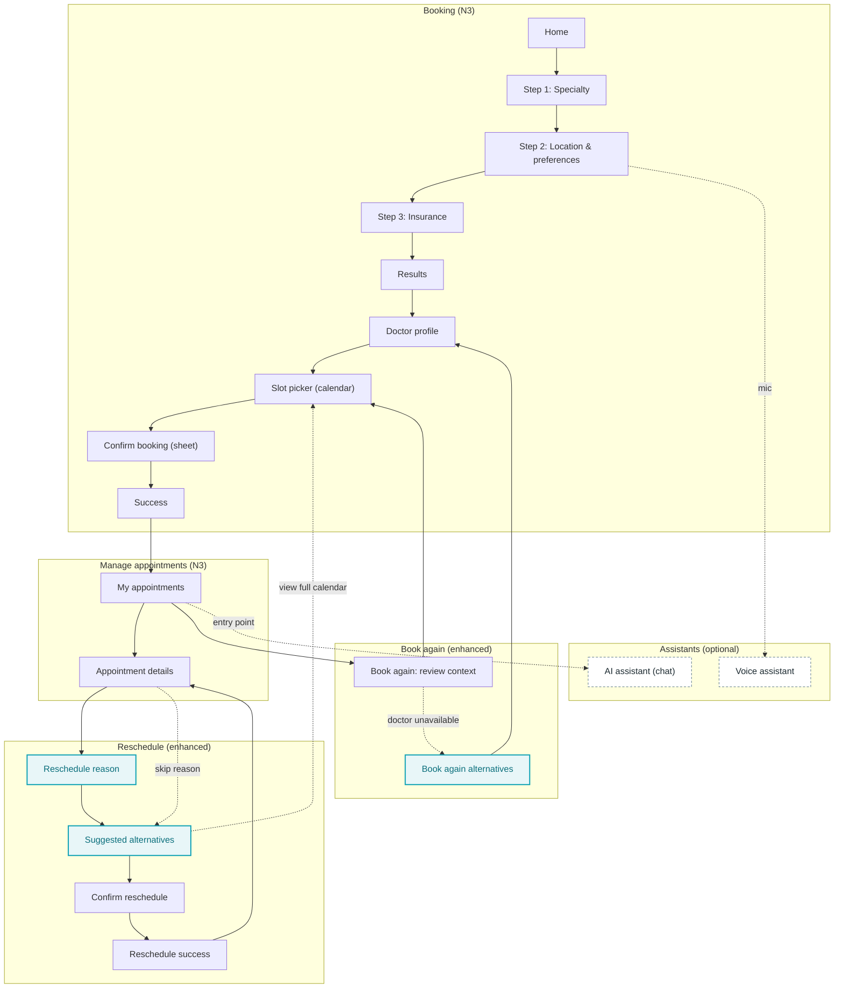

# Plan — Import “Appointment Manager” enhancement flows into Booking N3

## 1) What’s in the source folder (extracted)

Source: `/Users/nganpham/Downloads/MedAlpha Appointment Manager`

### A) Booking (enhanced)

- Step 1: Specialty selection (`/book/step1`)
- Step 2: Location & Preferences (`/book/step2`)
  - Visit type toggle: In-clinic vs Home visit
  - Location text input + “Change”
  - Radius slider (1–50 km)
  - Urgency: Routine vs Urgent
  - Shortcut to voice assistant (mic button)
- Results (`/book/results`)
  - Filter icon with badge, “Sorted by …” affordance
  - Doctor cards show: rating, distance, tags, availability pills
- Doctor profile (`/doctor/:id`)
  - AI “insight” block (Gemini) explaining why doctor is a match
  - Calendar + slot grid with “best fit” slot highlighting
  - Primary CTA “Select this slot” → opens **Confirm Appointment** bottom sheet modal
- Confirm booking modal (bottom sheet) → success

### B) Reschedule (enhanced)

- Reason selection (AI-assisted label): `/reschedule/:id/reason`
- Suggested alternatives list: `/reschedule/:id/alternatives`
- Confirm reschedule sheet: `/reschedule/:id/confirm`
  - Safety copy: old slot held until new confirmed

### C) Book again (enhanced)

- Rebook context screen (includes AI “timing hint”): `/rebook/:id`
- Similar specialists / alternatives: `/rebook/:id/alternatives`
  - “Recommended” choice can deep-link into doctor profile with auto-open confirm modal

### D) Assistants (new entry points)

- AI chat assistant: `/ai-assistant` (Gemini + optional web grounding links)
- Voice assistant: `/voice-assistant` (placeholder view)

## 2) Target baseline (Booking N3 today)

Target app: `apps/appointment-booking-N3`

Already present (prototype level):
- Wizard: `/booking/search` → `/booking/location` → `/booking/insurance` → `/booking/results`
- Doctor: `/booking/doctor/:id` (+ reviews route) → slots → confirm sheet → success
- Reschedule: `/reschedule/:id` → confirm → success (+ calendar handoff)
- Book again: `/book-again/:id` → slots (via query param) → confirm → success

## 3) Integration approach (keep current N3 UI style)

We implement the *behaviors and IA* of the source folder while keeping:
- Existing DocliQ-aligned visual system (tokens + current Tailwind utility patterns)
- Existing navigation model (`BrowserRouter`, `PATHS`, `Header`, `Page`, bottom-sheet patterns already used in N3)
- Existing data mocks (doctors/timeSlots) unless the enhancement requires new fields

We **do not** copy source UI classes/components directly (source uses a different design language + Material icons).

## 4) Route & screen mapping (source → N3)

| Source route | Meaning | N3 equivalent / new route |
|---|---|---|
| `/book/step1` | Specialty step | `/booking/search` (already) |
| `/book/step2` | Location & preferences | `/booking/location` (already) |
| `/book/results` | Results | `/booking/results` (already) |
| `/doctor/:id` | Doctor profile + slot selection | `/booking/doctor/:id` + `/booking/doctor/:id/slots` (split today) |
| (modal) confirm booking | Confirm sheet | `/booking/confirm` (already a sheet) |
| `/reschedule/:id/reason` | Reschedule reason | **NEW** `/reschedule/:id/reason` (or implement as optional step inside `/reschedule/:id`) |
| `/reschedule/:id/alternatives` | Suggested alternatives | map to existing `/reschedule/:id` (SuggestedSlotsScreen) or **NEW** route |
| `/rebook/:id` | Rebook context | `/book-again/:id` (already) |
| `/rebook/:id/alternatives` | Similar specialists | **NEW** `/book-again/:id/alternatives` (fallback path) |
| `/ai-assistant` | AI assistant | **NEW** `/assistant` (name TBD) |
| `/voice-assistant` | Voice assistant | **NEW** `/assistant/voice` (name TBD) |

## 5) Implementation plan (phased)

## User Flow diagram (high-level)

### Phase 0 — Decide scope and safety constraints

- Confirm which enhancements are in-scope for N3:
  - (Must-have) Reschedule reason step?
  - (Must-have) Book-again alternatives if doctor unavailable?
  - (Optional) AI assistant + AI “insights” + timing hint?
  - (Optional) Voice assistant entry point?
- Define compliance posture (Germany + healthcare):
  - Hard requirement: clear disclaimer, no medical diagnosis language
  - Decide whether AI calls are allowed in prototype (keys, logging, user consent)
  - If not allowed: ship **stubbed** insights/hints (deterministic text)

### Phase 1 — Booking enhancements (Doctor profile + confirm)

Goal: replicate the *experience* (AI insight + best-fit slot highlighting + confirm sheet) without changing N3 style.

- Add “AI insight” card (optional/feature-flag):
  - Input: selected doctor + booking context
  - Output: 1–2 bullets explaining “why this doctor matches”
  - Fallback text if AI unavailable/offline
- Add “best fit” slot highlight rule (prototype):
  - Deterministic heuristic using booking preferences (urgency, visit type) + next available slots
  - Mark one slot pill as “Recommended”
- Decide how to model the source “DoctorProfile includes calendar + slots”:
  - Option A (minimal churn): keep `/booking/doctor/:id/slots` as calendar/slot selection and add “Recommended” labeling there
  - Option B (more aligned to source): move compact calendar preview into `/booking/doctor/:id`, keep full selection in `/slots`
- Confirm sheet:
  - Ensure confirm sheet can show “recommended” rationale text (if available)
  - Ensure success shows confirmation number + calendar export (already partially done)

### Phase 2 — Reschedule enhancements (reason + alternatives)

Goal: incorporate the source’s explicit “reason” step and “why recommended” explanation while keeping the existing reschedule scaffold.

- Add `RescheduleReasonScreen` (NEW route) or optional section at top of SuggestedSlotsScreen:
  - Radio list reasons (time conflict, earlier, later, other)
  - “Next” disabled until chosen; optional “Skip”
  - Store `rescheduleReason` in reschedule context (extended state)
- Suggested alternatives:
  - Reuse current `SuggestedSlotsScreen` but:
    - show “AI-assisted” badge only if reason provided
    - show “Recommended” slot card with “Why this slot” bullets
- Confirm reschedule:
  - Ensure safety copy matches: old slot held until new confirmed (already present)
  - Ensure origin navigation works (suggestions vs calendar) (already present)

### Phase 3 — Book-again enhancements (timing hint + alternatives)

Goal: avoid dead-ends when the doctor is not available and match the “alternatives” experience.

- Add “Timing hint” section to `/book-again/:id`:
  - If AI enabled: generate short hint
  - Else: deterministic hint (based on date difference)
- Add fallback path `/book-again/:id/alternatives`:
  - Trigger when doctor is “unavailable” OR when user taps “See alternatives”
  - Show 1 recommended option + a small list of alternatives with quick CTA
  - Support deep-link to a doctor and optionally auto-open confirm sheet (use `navigate(..., { state: { autoOpenConfirm: true } })`)

### Phase 4 — Assistants (AI + Voice)

Goal: add assistant entry points without affecting core booking UX.

- Add `/assistant` screen:
  - Chat UI using existing N3 components/styles
  - Guardrails: disclaimer, no personal health data storage, no web links unless explicitly allowed
  - If Gemini integration is allowed: implement via backend proxy or secure key handling (never expose keys in client)
- Add `/assistant/voice` screen:
  - If true voice is out-of-scope: placeholder + “coming soon”
  - If in-scope: Web Speech API for prototype (browser-only)
- Entry points:
  - Floating button in `/history` (similar to source)
  - Mic button on `/booking/location` (optional)

### Phase 5 — QA + polish

- Add minimal e2e “happy path” smoke checks (manual checklist is fine for prototype):
  - Booking: search → location → insurance → results → doctor → slots → confirm → success
  - Reschedule: details → reason → suggestions → confirm → success
  - Book again: history → context → slots → confirm → success; plus alternatives path
- Accessibility:
  - Focus order for sheets, escape/close behavior, keyboard operation where applicable
- i18n notes:
  - The source folder is English-heavy; N3 target is Germany-first per docs.
  - Keep strings i18n-ready (allow 30–40% expansion).

## 6) Impact notes (what will change in N3)

### Routes
- Add 2–4 new routes:
  - reschedule reason (if separated)
  - book-again alternatives (fallback)
  - assistant chat (+ optional voice)

### State & types
- Extend booking context minimally:
  - `BookingState` / `SearchFilters`: already supports visitType/radius/urgency
- Extend reschedule context:
  - `rescheduleReason?: string`
  - “recommended rationale” strings for suggested slots (optional)
- Extend book-again context:
  - `timingHint?: string`
  - `alternatives?: Doctor[]` (optional)

### Components
- New UI pieces needed (styled to match N3):
  - “AI insight” card (doctor profile)
  - “Timing hint” card (book again)
  - “Recommended slot” badge + rationale list
  - Assistant chat message bubble component (if implemented)

### Data layer
- Current N3 data is local mocks; enhancements require:
  - deterministic “recommended” logic OR mock AI text
  - optional “similar specialists” query (can be local filter by specialty + city + accepts)

### Risks / cautions
- AI features introduce:
  - privacy/compliance risk (health data)
  - reliability issues (offline, latency)
  - key management risk (client exposure)
- Recommendation language must remain non-diagnostic and calm (healthcare sensibility).
