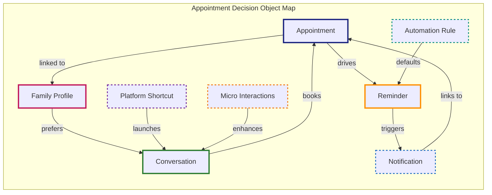
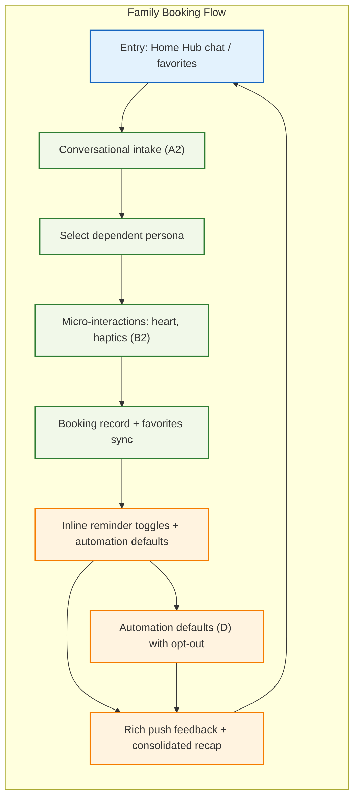
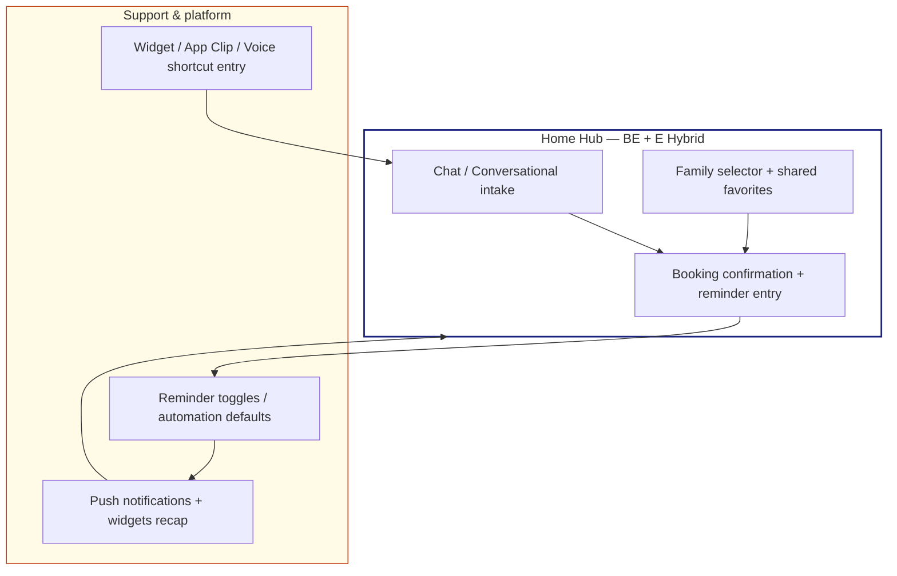
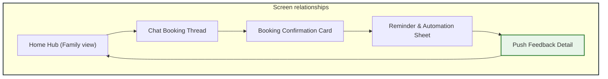

# Decision UX Artifacts (Flows First) — Appointment Management

Based on the decision captured in `3-decisions-extracted.md`, these artifacts follow the flows-first order defined in `docs/z.command/7-user-flows-ia.md`: start with objects (OOUX), derive jobs and flows, sketch the IA that supports them, and list the screens that bring the flows to life.

---

## Part 1: OOUX Dot Map

### 1.1 Primary Objects

| Object | Description |
|--------|-------------|
| **Appointment** | A scheduled visit for a family member or the primary account holder. |
| **Conversation** | The chat-based booking assistant that guides users through availability and reminders. |
| **Family Profile** | Dependent records, favorites, and shared preferences tied to the household. |
| **Reminder** | Push or in-app notification settings attached to an appointment. |
| **Notification** | Rich push message that delivers feedback requests, reminders, and consolidated status. |

### 1.2 Secondary & Derived Objects

| Object | Description |
|--------|-------------|
| **Automation Rule** | Default behaviors (auto-favorites, reminder toggles, smart backoff) influencing reminders and notifications. |
| **Platform Shortcut** | Widget, App Clip, or voice shortcut surface that launches chat or booking quick actions. |
| **Micro Interaction** | Atomic UI feedback (heart tap, haptic confirmation) that reinforces conversational actions. |

### 1.3 Attributes per Object

| Object | Key Attributes |
|--------|----------------|
| Appointment | id, familyMember, doctorId, slot, status, reminderSettings |
| Conversation | lastMessage, suggestedActions, intent, contextPersona |
| Family Profile | memberName, relation, favoriteDoctors, reminderPreferences |
| Reminder | type (24h/72h), channel, enabled, autoOverride |
| Notification | id, title, body, actionButtons, relatedAppointment |
| Automation Rule | name, trigger, defaultState, optOutAction |
| Platform Shortcut | type, targetFlow, availability (widget, clip, voice) |
| Micro Interaction | label, feedbackType, successState |

### 1.4 Actions per Object

| Object | User Actions |
|--------|--------------|
| Appointment | create, update (reschedule), add reminder, invite dependent, mark completed |
| Conversation | send message, confirm suggestion, request alternative, add micro interaction |
| Family Profile | switch persona, add favorite doctor, adjust reminder preferences |
| Reminder | toggle on/off, choose interval, acknowledge push |
| Notification | tap action, dismiss, rate visit, expand recap |
| Automation Rule | enable, disable, view summary |
| Platform Shortcut | tap widget, launch App Clip, speak voice command |
| Micro Interaction | tap heart, confirm with haptic, undo action |

### 1.5 Relationships Mermaid Diagram

---

## Part 2: User Flows

### 2.1 Jobs-to-be-Done

| Job ID | Job Statement | Primary Objects | Actions | Outcome |
|--------|---------------|-----------------|---------|---------|
| J1 | When I need to book for someone in my family, I want to do it through a chat that remembers who they are and keeps their doctors handy, so that I can finish quickly without toggling multiple tabs. | Conversation, Family Profile, Appointment, Micro Interaction | start chat, select member, confirm times, heart favorite | Appointment booked with dependent context |
| J2 | When an appointment is confirmed, I want to manage reminders and automation defaults from the same flow, so that notifications arrive without me digging into settings. | Reminder, Automation Rule, Notification | toggle reminders, enable automation, quick opt-out via push | Reminder settings reflect my preference |

### 2.2 Flow Steps for J1

| Step | User Action | System Response | Objects Modified | Success Criteria |
|------|-------------|-----------------|------------------|------------------|
| 1 | Open home hub and tap chat or favorite doctor | Show welcome message with pending family appointments and quick chat CTA | Conversation | Chat prompt appears |
| 2 | Type “Book Emma’s checkup” or tap child | System loads conversation state + family selector | Conversation, Family Profile | Family persona selected |
| 3 | Confirm suggested slot with micro interaction (heart, haptic) | Slot reserved, appointment record updated, favorites refreshed | Appointment, Micro Interaction, Family Profile | Appointment status = confirmed |
| 4 | Present reminder toggles inline | Show 24h/72h options and automation defaults | Reminder, Automation Rule | Reminder toggles reflect defaults |
| 5 | Send consolidated push feedback after visit | Push notification with feedback buttons, summary of family appointments | Notification | Push tapped or dismissed |

### 2.3 Decision Points & Recovery

| Branch | Condition | Yes Path | No Path | Objects |
|--------|-----------|----------|---------|---------|
| Confirm micro suggestion | User taps heart/confirm | Proceed to slot selection | Offer alternative slot suggestions | Appointment, Conversation |
| Reminder toggle | User accepts default | Save automation rule | Offer quick opt-out from push | Reminder, Automation Rule |
| Push feedback | Notification tapped | Navigate to appointment detail | Dismiss, re-push later | Notification |

### 2.4 Error States

| Error | Experience | Recovery | Objects |
|-------|------------|----------|---------|
| Slot conflict | Chat replies “That time is taken” | Suggest next availability with retry button | Appointment, Conversation |
| Reminder push fails | Notification shows gentle alert | Retry send or lower frequency | Notification, Reminder |

### 2.5 Flow Mermaid Diagram

---

## Part 3: IA Map

### 3.1 Flow to IA Mapping

| Flow Step | Required Objects | IA Location | Access Pattern |
|-----------|------------------|-------------|----------------|
| Chat entry | Conversation, Family Profile, Appointment | Home Hub > Chat panel | Thumb-friendly card or FAB |
| Booking review | Appointment, Micro Interaction | Chat thread + confirmation card | Inline within conversation |
| Reminder controls | Reminder, Automation Rule | Confirmation card + Reminders section | Toggled inline, also via Settings |
| Push recap | Notification, Reminder | Notification center/Home hub banner | Push action → appointment list |

### 3.2 Object to IA Locations

| Object | Primary Location | Secondary Location | Flow Context |
|--------|------------------|--------------------|--------------|
| Appointment | Chat confirmation card | Appointments list | Booking flow |
| Conversation | Home hub chat panel | Widgets/App clips | Chat-first flow |
| Family Profile | Family selector chips | Appointment detail | Persona-aware booking |
| Reminder | Inline toggles | Settings > Notifications | Post-booking |
| Notification | Push center | Summary banner | Engagement + feedback |
| Automation Rule | Reminder reminder summary | Settings > Automation | Defaults management |
| Platform Shortcut | Home widget | App Clip | Shortcut entry |
| Micro Interaction | Chat reply chips | Animations within chat | Feedback |

### 3.3 IA Mermaid Diagram

### 3.4 IA Decision Table

| Location | Change Type | Rationale | Flow Support |
|----------|-------------|-----------|--------------|
| `/home` | Modified | Embed chat/family entry to surface primary flows | Supports booking job J1 |
| `/settings/notifications` | Modified | Surface automation defaults close to reminders | Supports job J2 |
| `/widgets` | New | Provide platform shortcut to chat quickly | Extends multi-channel reach |

### 3.5 Navigation Paths

| Flow | Primary Path | Alternative |
|------|--------------|-------------|
| Family booking | Home Hub → Chat → Select Dependent → Confirm | Widget/App Clip → Chat → Booking |
| Reminder tuning | Booking confirmation → Reminder toggles | Settings > Notifications |

---

## Part 4: Screen List

| Screen ID | Screen Name | Primary Flow | IA Location | Key Objects | Entry Points |
|-----------|-------------|--------------|-------------|-------------|--------------|
| S1 | Home Hub (Family view) | Family booking | /home | Conversation snippet, Family Profile, Favorites | Launch, widget tap |
| S2 | Chat Booking Thread | Family booking | /home > chat | Conversation, Appointment, Micro Interaction | Home chat card, widget |
| S3 | Booking Confirmation Card | Family booking | Inline in chat | Appointment, Reminder | Chat flow |
| S4 | Reminder & Automation Sheet | Reminder tuning | /home/chat/fallback /settings | Reminder, Automation Rule | Confirmation card, settings link |
| S5 | Push Feedback Detail | Engagement recap | Notification center | Notification, Appointment | Rich push action |

### Screen Relationships

### Screen Details (Example: S3)

**Purpose:** Confirm the chosen appointment, spotlight the dependent, and quick-access reminder toggles.

**Primary Objects:**
- Appointment: shows slot + doctor
- Reminder: inline toggle
- Family Profile: tags the dependent

**Key Actions:** Confirm slot, add favorite, toggle reminders.

**Success:** Confirms and schedules appointment; toggles persist.

**Errors:** Slot conflict message + alternative suggestions.

---

*Document generated: 2026-01-30*  
*Based on decisions from `3-decisions-extracted.md` and guide `docs/z.command/7-user-flows-ia.md`*
