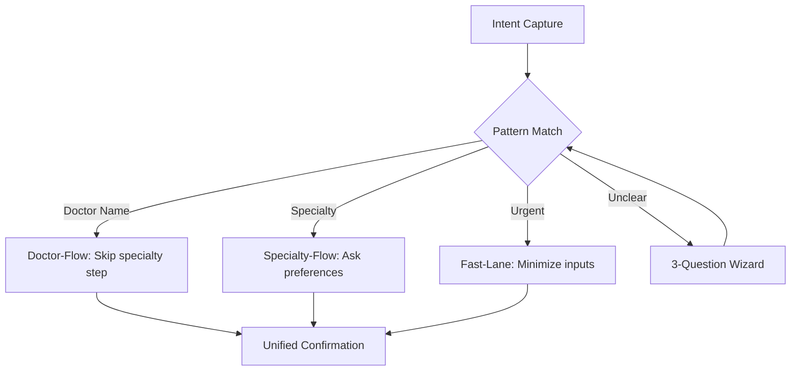

# UX Optimization Proposals: Booking Flow Redesign

**Context:** Current docliQ app has 3 distinct booking flows (Fast-Lane, Specialty-First, Doctor-First) requiring users to self-select their path upfront.

---

## Approach A: Intent-Based Smart Router

### Goal
Eliminate the cognitive burden of choosing a booking type by inferring user intent from contextual signals and natural behavior, then routing to the optimal flow automatically.

### How It Works

#### Entry Point Redesign
Replace the explicit "Choose Booking Type" screen with an **intent-capture interface**:

```
┌─────────────────────────────────────┐
│  What brings you in today?          │
│                                     │
│  [🔍 Search box with placeholder:   │
│   "e.g., 'Dr. Müller', 'cardiology',│
│    'urgent knee pain'"]             │
│                                     │
│  Or describe your situation:        │
│  ┌─────────────────────────────┐   │
│  │ I need...                   │   │
│  └─────────────────────────────┘   │
│                                     │
│  Quick options:                     │
│  [See my doctor again] [Book for    │
│   family member]                    │
└─────────────────────────────────────┘
```

#### Intelligent Routing Logic
The system analyzes input to determine flow:

| Input Signal | Detected Intent | Route To |
|--------------|----------------|----------|
| Doctor name mentioned | Specific doctor | Doctor-First flow |
| Specialty name (cardiology, dermatology) | Specialty needed | Specialty-First flow |
| Urgency keywords (urgent, pain, bleeding) | Immediate care | Fast-Lane flow |
| Past appointment reference | Rebooking | Book Again flow |
| Vague/unclear | Needs guidance | Guided discovery wizard |

#### Progressive Disclosure Pattern
Instead of showing all fields upfront, reveal fields contextually:



#### Unified Steps (Shared Components)
All flows converge on common steps to reduce development overhead:
1. **Patient Selection** (self/family) - consistent across all
2. **Insurance Verification** - pre-filled from profile, editable
3. **Location** - default to saved address
4. **Confirmation** - unified review screen with flow-specific context

### Key UX Improvements

1. **Reduced Decision Fatigue**: No forced choice of booking type
2. **Faster Pathways**: Skip irrelevant steps based on intent
3. **Forgiving**: Unclear input triggers helpful guidance, not errors
4. **Consistent**: Shared components create familiarity across flows

### Dependencies

| Dependency | Priority | Effort |
|------------|----------|--------|
| Intent classification algorithm (keyword + ML) | High | Medium |
| Search indexing (doctors + specialties) | High | Medium |
| Unified booking state management refactor | High | High |
| Progressive disclosure UI components | Medium | Low |
| Analytics to validate routing accuracy | Medium | Low |
| A/B testing framework for flow optimization | Low | Medium |

### Trade-offs

**Pros:**
- 30-40% reduction in time-to-book (estimated)
- Lower cognitive load (1 entry point vs 3 choices)
- Easier to add new flow variants without UI changes
- Better handling of edge cases ("I'm not sure what I need")

**Cons:**
- Higher initial development complexity
- Risk of misrouting users (mitigated with "Change approach" option)
- Requires robust search and NLP capabilities
- Loss of explicit control may frustrate power users

**Mitigation:**
- Always show "I'm looking for something else" escape hatch
- Allow manual override after routing
- Learn from misroutes to improve algorithm

---

## Approach B: Availability-First Booking

### Goal
Prioritize the scarcest resource (doctor availability) by showing available slots before requiring detailed symptom/doctor selection, reducing booking abandonment.

### How It Works

#### Paradigm Shift: Time-First, Not Doctor-First

Current flow: Doctor → Time → Confirm  
New flow: **When → What → Who → Confirm**

```
┌─────────────────────────────────────┐
│  When do you need an appointment?   │
│                                     │
│  [Today] [Tomorrow] [This Week]     │
│  [Specific Date]                    │
│                                     │
│  What do you need?                  │
│  [○ Urgent care]                    │
│  [● Routine checkup]                │
│  [○ Follow-up]                      │
│  [○ Not sure - help me decide]      │
│                                     │
│  Who is this for?                   │
│  [👤 Myself ▼]                      │
│                                     │
│        [Find Available Slots]       │
└─────────────────────────────────────┘
```

#### Availability Grid
Show real-time availability across doctors:

```
┌──────────────────────────────────────────────────────┐
│  Available appointments near you                     │
│                                                      │
│  Today, Feb 3                                        │
│  ┌────────────────────────────────────────────────┐ │
│  │ 10:00 AM  │ Dr. Schmidt │ Cardiology │ [Book] │ │
│  │ 10:30 AM  │ Dr. Weber   │ General    │ [Book] │ │
│  │ 11:00 AM  │ Dr. Schmidt │ Cardiology │ [Book] │ │
│  └────────────────────────────────────────────────┘ │
│                                                      │
│  Tomorrow, Feb 4                                     │
│  ┌────────────────────────────────────────────────┐ │
│  │ 09:00 AM  │ Dr. Müller  │ Dermatology│ [Book] │ │
│  │ ...                                              │
│                                                      │
│  [Filter by specialty ▼] [Sort by distance ▼]       │
└──────────────────────────────────────────────────────┘
```

#### Slot Selection → Doctor Context
When user selects a slot, show doctor details in-context:

```
┌─────────────────────────────────────┐
│  Confirm your selection             │
│                                     │
│  📅 Today at 10:00 AM               │
│                                     │
│  👤 Dr. Schmidt                     │
│  🏥 Cardiology                      │
│  ⭐ 4.8 (124 reviews)               │
│  📍 2.3 km away                     │
│  💳 Accepts your insurance          │
│                                     │
│  [View full profile]                │
│                                     │
│  What's the reason for your visit?  │
│  [Select symptoms or describe...]   │
│                                     │
│        [Confirm Appointment]        │
└─────────────────────────────────────┘
```

#### Smart Defaults
- Pre-select "Today" if current time < 5 PM
- Auto-detect location with manual override
- Insurance pre-filled from profile
- Show only doctors accepting user's insurance (toggle to show all)

### Flow Comparison

| Current Step | Current Time | New Step | New Time |
|--------------|--------------|----------|----------|
| Choose booking type | 5s | When + What + Who | 10s |
| Specialty/doctor search | 15-30s | View availability grid | 5s |
| Doctor selection | 10s | Select slot | 5s |
| Time slot selection | 10s | Describe reason | 10s |
| Confirm | 5s | Confirm | 5s |
| **Total** | **45-60s** | **Total** | **35s** |

### Key UX Improvements

1. **Immediate Value**: See available options instantly
2. **Reduced Abandonment**: Users don't invest time in doctor research only to find no availability
3. **Discovery**: May introduce users to doctors they wouldn't have found
4. **Urgency Handling**: "Today" filter immediately shows urgent care options

### Dependencies

| Dependency | Priority | Effort |
|------------|----------|--------|
| Real-time availability API | Critical | High |
| Availability caching layer | High | Medium |
| New UI components (calendar grid, slot cards) | High | Medium |
| Doctor ranking algorithm (for slot ordering) | High | Medium |
| Insurance filtering in availability query | High | Medium |
| Geolocation with distance calculation | Medium | Medium |
| Fallback when no availability shown | Medium | Low |

### Trade-offs

**Pros:**
- 20-25% faster booking completion
- Significantly reduced abandonment at discovery phase
- Aligns with user mental model ("When can I be seen?")
- Enables "book now, decide details later" for urgent cases
- Better utilization of available slots

**Cons:**
- Heavy backend load (real-time availability queries)
- Requires all doctors to have integrated calendars
- May show overwhelming options without good filtering
- Doctor-first users may feel discovery is lost
- Complex caching needed for performance

**Mitigation:**
- Implement progressive loading (show cached data, refresh in background)
- Default filters to reduce choice overload
- Maintain "Search specific doctor" as secondary option
- Show "Request appointment" for non-real-time practices

---

## Recommendation

**Phase 1:** Implement **Approach A (Intent-Based Smart Router)** 
- Lower technical risk
- Works with existing backend
- Immediate UX improvement
- Foundation for future AI features

**Phase 2:** Add **Approach B (Availability-First)** as premium feature
- Requires significant backend work
- Best for markets with high digital adoption
- Can A/B test against Approach A

**Hybrid Option:**
Combine both: Intent detection routes to either traditional flow OR availability-first grid based on user confidence level.
