# Booking Flow IA Diagram - DocliQ App v3

## Overview

This diagram documents the **current booking flow** with **3 divergent paths** in the docliQ app (v3).

---

## Booking Flow Mermaid Diagram

```mermaid
flowchart TB
    subgraph BOOKING_FLOW["📱 DocliQ Booking Flow v3"]
        direction TB

        %% Entry Points
        subgraph ENTRY["Entry Points"]
            E1["🏠 Home → Book Button"]
            E2["📋 History → Book Again"]
            E3["🔔 Notification Tap"]
        end

        %% Type Selection - The Fork
        subgraph TYPE_SELECT["Step 0: Choose Booking Type"]
            TS0["Booking Type Selection"]
            TS0_DESC["User must choose one of 3 paths"]
        end

        %% Path 1: Fast-Lane
        subgraph FASTLANE["🚀 Path 1: Fast-Lane"]
            direction TB
            FL_DESC["Optimized for: Speed & Simplicity"]

            FL1["Care Request"]
            FL1_FIELDS["• Symptoms<br/>• Specialty<br/>• City<br/>• Insurance"]

            FL2["Request Sent"]
            FL2_DESC["Confirmation + matching starts"]

            FL3["Matching Status"]
            FL3_DESC["Live progress animation<br/>60s polling"]

            FL4["✅ Success"]
            FL4_DESC["Doctor matched!<br/>Calendar export"]

            FL5["❌ No Match"]
            FL5_DESC["No doctors available"]

            FL5_ALT1["🔄 Retry Fast-Lane"]
            FL5_ALT2["🏥 Switch to Specialty"]
            FL5_ALT3["👨‍⚕️ Browse Doctors"]
        end

        %% Path 2: Specialty-First
        subgraph SPECIALTY["🔍 Path 2: Specialty-First"]
            direction TB
            SP_DESC["Optimized for: Discovery"]

            SP1["Specialty Search"]
            SP1_FIELDS["• Search specialties<br/>• Popular/Recent list"]

            SP2["Set Preferences"]
            SP2_FIELDS["• City<br/>• Insurance type<br/>• Radius"]

            SP3["Availability Preferences"]
            SP3_FIELDS["• Preferred days<br/>• Time of day<br/>• Urgency"]

            SP4["Matched Doctors"]
            SP4_DESC["List of available doctors"]

            SP5["Doctor Detail Sheet"]
            SP5_FIELDS["• Profile<br/>• Reviews<br/>• Availability"]
        end

        %% Path 3: Doctor-First
        subgraph DOCTOR["👨‍⚕️ Path 3: Doctor-First"]
            direction TB
            DR_DESC["Optimized for: Specific Doctor"]

            DR1["Doctor Search/Browse"]
            DR1_FIELDS["• Search by name<br/>• Filter by specialty<br/>• My Doctors (last 5)"]

            DR2["Describe Symptoms"]
            DR2_FIELDS["• Symptom chips<br/>• Free text notes<br/>• Photo upload"]

            DR3["Doctor Profile"]
            DR3_FIELDS["• Full profile<br/>• Reviews<br/>• Location"]
        end

        %% Common Booking Screens (Convergence)
        subgraph COMMON["Common Booking Screens"]
            direction TB
            C_DESC["All paths converge here"]

            C1["Doctor Profile"]
            C1_FIELDS["• Photo<br/>• Specialty<br/>• Rating<br/>• Address"]

            C2["Reviews"]
            C2_FIELDS["• Star rating<br/>• Patient comments<br/>• Verified badges"]

            C3["Slot Selection"]
            C3_FIELDS["• Calendar view<br/>• Available slots<br/>• Alternative dates"]

            C4["Confirm"]
            C4_FIELDS["• Summary card<br/>• Patient selection<br/>• Insurance check"]

            C5["✅ Success"]
            C5_FIELDS["• Confirmation #<br/>• Calendar CTA<br/>• View appointments"]
        end

        %% Post-Booking Actions
        subgraph POST["📬 Post-Booking Status"]
            direction TB

            PB1["Matching"]
            PB1_DESC["Finding doctor..."]

            PB2["Await Confirm"]
            PB2_DESC["Doctor assigned<br/>Waiting confirmation"]

            PB3["Confirmed"]
            PB3_DESC["✓ Appointment set<br/>Calendar event created"]

            PB4["Cancelled"]
            PB4_DESC["By patient or doctor"]

            PB5["Completed"]
            PB5_DESC["Past appointment"]
        end

        %% Alternative Actions
        subgraph ALT["🔄 Alternative Actions"]
            direction TB

            ALT1["Reschedule"]
            ALT1_FLOW["Reason → Slots → Confirm → Success"]

            ALT2["Cancel"]
            ALT2_FLOW["Confirm → Cancelled status"]

            ALT3["Book Again"]
            ALT3_FLOW["Context → Alternatives → Slot → Confirm"]
        end
    end

    %% === ENTRY FLOWS ===
    E1 --> TS0
    E2 -.->|Pre-filled| SP4
    E2 -.->|Pre-filled| DR1
    E3 -.->|Deep link| C3

    %% === TYPE SELECTION ===
    TS0 -->|Fast-Lane| FL1
    TS0 -->|Specialty| SP1
    TS0 -->|Doctor| DR1

    %% === FAST-LANE FLOW ===
    FL1 --> FL2
    FL2 --> FL3
    FL3 -->|Success| FL4
    FL3 -->|No Match| FL5

    FL5 -.-> FL5_ALT1
    FL5 -.-> FL5_ALT2
    FL5 -.-> FL5_ALT3

    FL5_ALT1 -.-> FL1
    FL5_ALT2 -.-> SP1
    FL5_ALT3 -.-> DR1

    FL4 -.->|View| HI1

    %% === SPECIALTY FLOW ===
    SP1 --> SP2
    SP2 --> SP3
    SP3 --> SP4
    SP4 --> SP5
    SP5 --> C4

    SP4 -.->|Skip profile| C4

    %% === DOCTOR FLOW ===
    DR1 --> DR2
    DR2 --> DR3
    DR3 --> C3

    DR1 -.->|Quick book| C3

    %% === COMMON SCREENS FLOW ===
    C1 --> C2
    C1 --> C3
    C3 --> C4
    C4 --> C5

    %% === STATUS LIFECYCLE ===
    C4 -.->|Submit| PB1
    FL4 -.->|Auto| PB2

    PB1 -->|Match found| PB2
    PB1 -->|No match| FL5
    PB2 -->|Doctor confirms| PB3
    PB2 -->|Doctor declines| PB1
    PB3 -->|Appointment done| PB5
    PB3 -.->|Cancel| PB4

    %% === ALTERNATIVE ACTIONS ===
    PB3 -.-> ALT1
    PB3 -.-> ALT2
    PB3 -.-> ALT3
    PB5 -.-> ALT3

    %% === CROSS-FLOW CONNECTIONS ===
    C5 -.->|View| HI1
    SP5 -.->|Other doctors| SP4
    DR3 -.->|Back to search| DR1

    %% Styles
    style BOOKING_FLOW fill:#ffffff,stroke:#333,stroke-width:2px

    style ENTRY fill:#e3f2fd,stroke:#1565c0,stroke-width:2px
    style TYPE_SELECT fill:#fff3e0,stroke:#f57c00,stroke-width:3px

    style FASTLANE fill:#e8f5e9,stroke:#2e7d32,stroke-width:2px
    style SPECIALTY fill:#fce4ec,stroke:#c2185b,stroke-width:2px
    style DOCTOR fill:#f3e5f5,stroke:#7b1fa2,stroke-width:2px

    style COMMON fill:#fff8e1,stroke:#ff8f00,stroke-width:2px
    style POST fill:#e0f2f1,stroke:#00695c,stroke-width:2px
    style ALT fill:#fce4ec,stroke:#d32f2f,stroke-width:2px
```



---

## Path Comparison Matrix

| Path | Best For | Steps | Time | Cognitive Load |
|------|----------|-------|------|----------------|
| **🚀 Fast-Lane** | Quick bookings, urgent needs | 3-4 | ~2 min | Low |
| **🔍 Specialty-First** | Exploring options, new users | 5-7 | ~4 min | Medium |
| **👨‍⚕️ Doctor-First** | Specific doctor in mind | 4-6 | ~3 min | Medium |

---

## Flow Decision Tree

```
                    ┌─────────────────────────────────────┐
                    │     User taps "Book Appointment"    │
                    └───────────────┬─────────────────────┘
                                    │
                                    ▼
            ┌───────────────────────────────────────────────┐
            │         Choose Booking Type?                  │
            └───────┬──────────────┬──────────────┬─────────┘
                    │              │              │
         ┌──────────┘              │              └──────────┐
         ▼                         ▼                         ▼
┌──────────────────┐   ┌────────────────────┐   ┌──────────────────┐
│  🚀 Fast-Lane    │   │  🔍 Specialty      │   │  👨‍⚕️ Doctor      │
│                  │   │                    │   │                  │
│  Quick symptom   │   │  Explore options   │   │  Specific doctor │
│  matching        │   │  then match        │   │  in mind         │
└────────┬─────────┘   └────────┬───────────┘   └────────┬─────────┘
         │                      │                        │
         ▼                      ▼                        ▼
┌──────────────────┐   ┌────────────────────┐   ┌──────────────────┐
│ Enter symptoms   │   │ Choose specialty   │   │ Search/browse    │
│ + preferences    │   │ → Set preferences  │   │ → Describe       │
│ → Auto-match     │   │ → See doctors      │   │   symptoms       │
└────────┬─────────┘   └────────┬───────────┘   └────────┬─────────┘
         │                      │                        │
         │                      ▼                        ▼
         │              ┌──────────────────┐    ┌──────────────────┐
         │              │ Review doctors   │    │ View profile     │
         │              │ → Select doctor  │    │ → Select slot    │
         │              └────────┬─────────┘    └────────┬─────────┘
         │                       │                       │
         └───────────────────────┼───────────────────────┘
                                 │
                                 ▼
                    ┌─────────────────────────┐
                    │   Converge:             │
                    │   • Slot Selection      │
                    │   • Confirm Booking     │
                    │   • Success Screen      │
                    └─────────────────────────┘
```

---

## Screen Inventory by Path

### 🚀 Fast-Lane Path (3-4 screens)
| Screen | Route | Purpose |
|--------|-------|---------|
| Care Request | `/booking/fast-lane` | Collect symptoms + preferences |
| Request Sent | `/booking/request-sent` | Confirmation, matching starts |
| Matching Status | `/booking/fast-lane/matching` | Live progress |
| Success | `/booking/fast-lane/success` | Matched appointment |
| No Match | `/booking/fast-lane/no-match` | Retry options |

### 🔍 Specialty-First Path (5-7 screens)
| Screen | Route | Purpose |
|--------|-------|---------|
| Specialty Search | `/booking/specialty` | Browse/search specialties |
| Set Preferences | `/booking/availability` | City, insurance, radius |
| Availability Prefs | (inline) | Days, times, urgency |
| Matched Doctors | `/booking/results` | Filtered doctor list |
| Doctor Detail | `/booking/doctor/:id` | Full profile + reviews |
| Confirm | `/booking/confirm` | Review + submit |
| Success | `/booking/success` | Confirmation |

### 👨‍⚕️ Doctor-First Path (4-6 screens)
| Screen | Route | Purpose |
|--------|-------|---------|
| Doctor Search | `/booking/doctor` | Search/browse all doctors |
| Describe Symptoms | `/booking/symptoms` | Symptom chips + notes |
| Doctor Profile | `/booking/doctor/:id` | Detailed profile |
| Slot Selection | `/booking/doctor/:id/slots` | Pick time |
| Confirm | `/booking/confirm` | Review + submit |
| Success | `/booking/success` | Confirmation |

### Common Screens (All paths)
| Screen | Route | Purpose |
|--------|-------|---------|
| Doctor Profile | `/booking/doctor/:id` | View doctor details |
| Reviews | `/booking/doctor/:id/reviews` | Patient reviews |
| Slot Selection | `/booking/doctor/:id/slots` | Choose time |
| Confirm | `/booking/confirm` | Final review |
| Success | `/booking/success` | Booking confirmed |

---

## Key Design Principles

### 1. Progressive Disclosure
- Information revealed exactly when needed
- No overwhelming forms upfront

### 2. Path Flexibility
- 3 distinct paths serve different user intents
- Easy to switch paths from No Match state

### 3. Common Convergence
- All paths lead to same final screens
- Consistent confirmation experience

### 4. Status Transparency
- Real-time matching progress
- Clear state transitions

---

## Technical Notes

- **Routes:** 15+ booking-related routes
- **API Calls:** Specialty list, doctor matching, slot availability
- **State Management:** Booking context with session persistence
- **Error Handling:** Retry logic for API failures, graceful fallbacks

---

*Generated: 2026-01-30*  
*Based on: INFO-MAP-v3.md*
