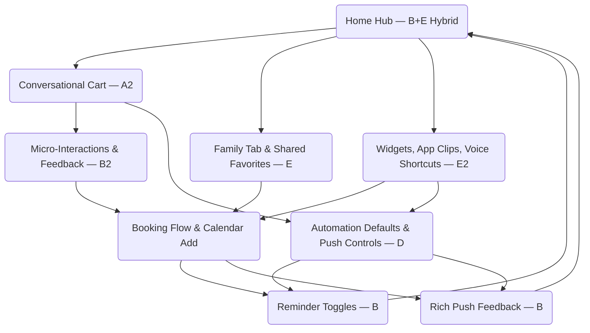
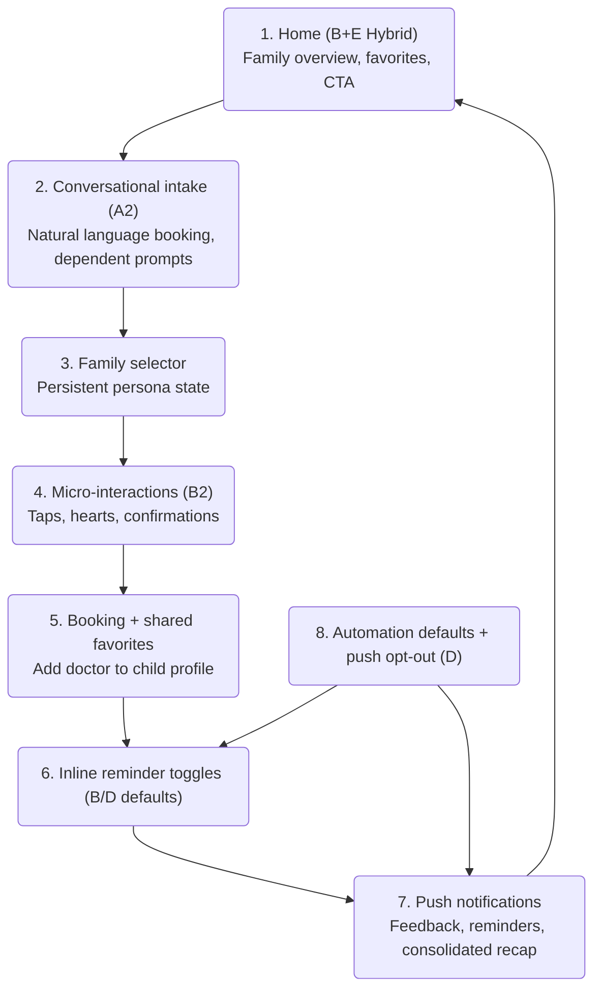

### Extracted decision context — iteration 1 (3-ideations.md)

│                                                                 │
│ 1. Best of both: Mobile-native patterns (B) + Family value (E)  │
│    • Progressive disclosure = proven mobile UX                  │
│    • Family-first features = high value for DocliQ users        │
│                                                                 │
│ 2. Leverages existing infrastructure:                           │
│    • 75% dependent booking already implemented                  │
│    • Contextual engagement proven in mobile apps                │
│    • Shared favorites build on existing "My Doctors"            │
│                                                                 │
│ 3. Differentiation: No competitor combines family-centric       │
│    engagement with mobile-native UX                             │
│                                                                 │
│ 4. Universal appeal: Works for families (Sarah) AND single      │
│    users (Marc, Elena) - single users just skip family features │
│                                                                 │
│ 5. Balanced risk: Medium effort (not high like AI/gamification) │
│    with low risk (proven patterns, not experimental)            │
│                                                                 │
│ ⚠️ Why NOT pure B or pure E:                                  │
│ • Pure B = Misses family opportunity (75% dependent coverage)   │
│ • Pure E = Niche for families only, misses universal patterns   │
│ • Hybrid BE = Family-first without sacrificing mobile UX        │
│                                                                 │
│ 🎯 Recommended Path:                                            │
│ • Primary: Approach BE (B+E Hybrid) for MVP                     │
│ • Single users: See streamlined B (family UI hidden)            │
│ • Families: See full BE (shared favorites, consolidated pushes) │
│ • Phase 2: Layer C (Gamification) for young professionals       │
│ • Phase 3: Add D (Automation) for power users post-GDPR review  │
├─────────────────────────────────────────────────────────────────┤
│ ✅ DECISION: [ ]A [ ]B [ ]C [ ]D [ ]E [ ]BE Hybrid              │
│ [x]A2+B+B2+E+E2 COMBINED (Iteration 1 + 2 merged)              │
│ Notes: COMBINED APPROACH selected - merges:                     │
│ • Iteration 1: B (Progressive Disclosure) + E (Family-Centric)  │
│ • Iteration 2: A2 (Conversational) + B2 (Micro-interactions)    │
│ • Iteration 2: E2 (Platform: Widget + App Clips)                │
│ Result: Family-first conversational UI with atomic interactions │
│ and platform ecosystem. 6-week phased implementation.           │
└─────────────────────────────────────────────────────────────────┘

### Extracted decision context — iteration 2 (3-ideations-iteration-2.md)

│ └─────────┴────────┴────────┴────────┴────────┴────────┴────────┘│
│                                                                 │
│ Cross-domain inspiration count: 5/5 (Iteration 2 explores       │
│ different domains from Iteration 1)                             │
├─────────────────────────────────────────────────────────────────┤
│ 👉 AI: Recommend A2 (CONVERSATIONAL UI) because:                │
│                                                                 │
│ 1. Highest mobile fit: Chat is THE native mobile pattern        │
│    (WhatsApp, iMessage, Instagram DMs trained 4B+ users)        │
│                                                                 │
│ 2. Validates hypothesis: Natural conversation drives            │
│    engagement through relationship (not transaction)            │
│                                                                 │
│ 3. Universal appeal: Works for elderly (simple) AND young       │
│    (fast) users simultaneously                                  │
│                                                                 │
│ 4. Competitive differentiation: No German health app uses       │
│    conversational UI (Doctolib, TeleClinic are form-based)      │
│                                                                 │
│ 5. Future-proof: Voice input ready, AI assistant extensible     │
│                                                                 │
│ Alternative strong options:                                     │
│ • B2 (Micro-interactions) = Lower effort, good for MVP          │
│ • Hybrid A2+B2 = Chat core + atomic actions where fit           │
│ • ⭐ TRIPLE HYBRID A2+B2+E2 = Ultimate mobile ecosystem         │
│   (Chat + Micro-interactions + Widgets/App Clips)               │
│                                                                 │
│ ⚠️ Risk mitigation for A2:                                       │
│ • Start with hybrid: 70% chat, 30% traditional forms            │
│ • Fallback to forms if chat confuses                            │
│ • A/B test elderly segment specifically                           │
├─────────────────────────────────────────────────────────────────┤
│ ✅ DECISION: [ ]A2 [ ]B2 [ ]C2 [ ]D2 [ ]E2 [ ]A2+B2 [ ]A2+B2+E2│
│ [x]A2+B+B2+E+E2 COMBINED (Iteration 1 + 2 merged)              │
│ [ ]New [ ]Return to ideation                                    │
│                                                                 │
│ Notes: COMBINED APPROACH selected - merges:                     │
│ • Iteration 2: A2 (Conversational) + B2 (Micro) + E2 (Platform) │
│ • Iteration 1: B (Progressive Disclosure) + E (Family-Centric)  │
│ Result: Family-first chat with contextual prompts + atomic UX   │
│ + platform ecosystem. 6-week phased implementation plan.        │
└─────────────────────────────────────────────────────────────────┘


### Detailed Implementation Notes — iteration 1 (3-ideations.md)

## Detailed Implementation Notes by Approach (Mobile-First)

### Approach A: ENGAGEMENT HUB ⚠️ WEB-CENTRIC

**⚠️ NOT RECOMMENDED FOR MOBILE** - This layout assumes desktop/tablet screen real estate.

**Why It Doesn't Work on Mobile**:
- Horizontal "My Doctors" carousel requires sideways swipe (anti-pattern on mobile)
- Multiple widgets create scroll fatigue (3+ screen heights)
- Dense information overwhelms on small screens
- Netflix model assumes passive browsing; mobile users are task-oriented

**Web/Tablet Version (Future)**:
```
┌──────────────────────────────────────────────────────┐
│ Good morning, Sarah                    🔔      ⚙️   │ Desktop/Tablet
├──────────────────────────────────────────────────────┤
│ 📋 My Doctors              [👤][👤][👤][👤]  →       │ Horizontal OK
├──────────────────────────────────────────────────────┤
│ ⏰ Upcoming    │  ⭐ Feedback                       │ Side-by-side
│ 👤 Cardiology  │  Rate Dr. Müller?                  │ widgets
│ Tomorrow 10:30 │  [★★★★★]                            │
│ [🔔] [✏️]      │                                     │
├──────────────────────────────────────────────────────┤
│ [Book New Appointment]                               │
└──────────────────────────────────────────────────────┘
```

**Mobile Adaptation (If Forced)**:
```
┌─────────────────────────────────────────┐
│ Good morning, Sarah              🔔    │
├─────────────────────────────────────────┤
│ ⏰ Upcoming Appointment                 │
│ 👤 Cardiology - Tomorrow 10:30       │
│ [🔔 Reminders ON] [Book Again]        │
├─────────────────────────────────────────┤
│ 📋 My Doctors (3)            [See All] │
│ 👤 Dr. Schmidt                          │
│ 👤 Dr. Weber                            │
│ 👤 Dr. Müller                           │
├─────────────────────────────────────────┤
│ ⭐ Rate your last visit?               │
│ [★★★★★] [Not Now]                       │
├─────────────────────────────────────────┤
│ [+ Book Appointment]                    │
└─────────────────────────────────────────┘
```

**Key Implementation Files**:
- `src/screens/home/HomeScreen.tsx` - Major redesign (NOT recommended for mobile)
- `src/components/sections/MyDoctorsSection.tsx` - New
- `src/components/cards/UpcomingAppointmentCard.tsx` - Enhanced

---

### Approach B: PROGRESSIVE DISCLOSURE ⭐ MOBILE-NATIVE

**Home Screen Layout**:
```
┌─────────────────────────────────────────┐
│ Good morning, Sarah              🔔    │
├─────────────────────────────────────────┤
│ ⏰ Tomorrow, 10:30 AM                  │
│ 👤 Dr. Schmidt • Cardiology            │
│ 📍 Berlin Medical Center               │
│                                         │
│ [View Details] [Book Another]          │
├─────────────────────────────────────────┤
│ 📋 Quick Book                          │
│ [Search Doctors] [My Doctors]          │
├─────────────────────────────────────────┤
│ 📰 Health News               [3 new]   │
│ • Flu season updates...                │
└─────────────────────────────────────────┘
```

**Contextual Feature Placement (Mobile-Native)**:

| Feature | Location | Mobile Pattern |
|---------|----------|----------------|
| **Favorites** | Booking Success → Bottom sheet | Native iOS/Android share sheet pattern |
| **Reminders** | Confirmation → Inline toggle | Settings toggle inline (not separate screen) |
| **Feedback** | Push notification (1h post) | Rich push with action buttons |
| **My Doctors** | Booking Flow → Before search | Vertical list with peek cards |

**Implementation Flow (Mobile)**:

**1. Favorites (Contextual)**:
```
Booking Success Screen
├─ Shows appointment details
├─ [Done] button
└─ Bottom sheet slides up:
   "Add Dr. Schmidt to My Doctors?"
   [Add] [Not Now]
   Swipe down to dismiss
```

**2. Reminders (Inline)**:
```
Confirmation Screen
├─ Appointment summary card
├─ Inline toggle row:
│  "Remind me before appointment"
│  [Toggle ON] 24h before • 72h before
├─ Expands when toggled ON
└─ [Confirm Booking] button
```

**3. Feedback (Push-Driven)**:
```
Rich Push Notification (1h post-appointment):
┌─────────────────────────────────────────┐
│ 🏥 DocliQ                              │
│ How was your visit with Dr. Schmidt?   │
│                                         │
│ [Rate Now] [Remind Me Later] [Dismiss] │
└─────────────────────────────────────────┘

Tap [Rate Now] → Deep link to rating screen
```

**Key Implementation Files**:
- `src/screens/home/HomeScreen.tsx` - Minimal changes (clean home)
- `src/screens/booking/SuccessScreen.tsx` - Add bottom sheet for favorites
- `src/screens/booking/ConfirmScreen.tsx` - Add inline reminder toggle
- `src/components/notifications/RichPushHandler.tsx` - **NEW**
- `src/screens/booking/SearchScreen.tsx` - Add "My Doctors" section in flow
- `src/screens/appointments/AppointmentDetailScreen.tsx` - Per-appointment settings

---

### Approach BE: B+E HYBRID ⭐⭐⭐ RECOMMENDED

**Family-First Mobile UX**:
```
┌─────────────────────────────────────────┐
│ Good morning, Sarah              🔔    │
├─────────────────────────────────────────┤
│ 👨‍👩‍👧 Family Appointments This Week       │
│ Emma: Mon 10am • Max: Wed 2pm          │
│ You: Fri 4pm                           │
│ [View All 3]                           │
├─────────────────────────────────────────┤
│ 📋 My Family Doctors                    │
│ 👤 Dr. Schmidt [Emma's doctor]         │
│ 👤 Dr. Weber [Your doctor]             │
│ [Book for... ▼]                        │
├─────────────────────────────────────────┤
│ ⭐ Feedback Pending (2)                 │
│ Rate Emma's visit with Dr. Schmidt     │
│ [👍] [👎] [Later]                       │
└─────────────────────────────────────────┘
```

**Family Booking Flow**:
```
Step 1: Who is this for?
├─ [Me 👤] [Emma 👧] [Max 👦]
└─ Selection persists for session

Step 2: Booking confirmation
├─ "Booked for Emma"
├─ Bottom sheet: "Add Dr. Schmidt to Emma's favorites?"
└─ [Add] [Not Now]

Step 3: Reminder setup
├─ Toggle: "Remind Emma 24h before" [ON]
├─ Toggle: "Remind me (parent)" [ON]
└─ Consolidated: 1 push for parent about Emma's appointment

Step 4: Post-visit feedback
├─ Push: "How was Emma's visit?"
├─ [👍 Great] [👎 Could be better]
└─ Tap → Rating screen with family member context
```

**Consolidated Family Push**:
```
┌─────────────────────────────────────────┐
│ 🏥 DocliQ - 3 Family Appointments      │
│                                         │
│ This week:                              │
│ 👧 Emma: Mon 10am - Dr. Schmidt        │
│ 👦 Max: Wed 2pm - Dr. Weber            │
│ 👤 You: Fri 4pm - Dr. Müller           │
│                                         │
│ [View All] [Dismiss]                    │
└─────────────────────────────────────────┘
```

**Key Implementation Files (Hybrid)**:
- `src/components/family/FamilyMemberSelector.tsx` - **NEW** Dropdown/chips
- `src/components/family/TaggedDoctorCard.tsx` - **NEW** Shows [Emma's doctor]
- `src/components/notifications/ConsolidatedPush.tsx` - **NEW** Multi-appointment
- `src/screens/booking/SuccessScreen.tsx` - Modified: "Add to [Name]'s favorites"
- `src/screens/appointments/AppointmentDetailScreen.tsx` - Family context + toggles
- `src/screens/history/HistoryScreen.tsx` - Family filter chips
- `src/screens/settings/NotificationsScreen.tsx` - Consolidated vs individual toggle

**Single User Mode (Automatic)**:
- If no dependents: Hide family UI, show pure B
- If 1+ dependents: Show full BE hybrid
- Zero configuration required

---

### Approach C: GAMIFICATION LAYER 🎮 Mobile-Adapted

**⚠️ Layer on Approach B, Not Standalone**

Gamification works on mobile when it's subtle and secondary:

**Mobile Badge Display**:
```
Profile Tab (not Home)
├─ User avatar and name
├─ "Health Streak: 3 months" (small, below name)
├─ Badges: [🏥] [⭐] [🔥] (horizontal scroll, 3 visible)
└─ Tap badge → Detail modal with unlock criteria
```

**Mobile-Specific Constraints**:
- No leaderboard (privacy + screen space)
- One badge per push notification max
- Simple Lottie animations (not complex)
- Profile tab location (not prominent home placement)

**Badge System**:
| Badge | Criteria | Mobile Display |
|-------|----------|----------------|
| 🏥 First Steps | First booking | Small icon on profile |
| ⭐ Feedback Hero | 5 reviews | Push: "You earned Feedback Hero!" |
| 🔥 3-Month Streak | 3 consecutive months | Profile + weekly push |

**Key Implementation Files**:
- `src/components/gamification/BadgeDisplay.tsx` - Compact for mobile
- `src/screens/profile/ProfileScreen.tsx` - Badge section (not home)
- `src/utils/pushNotifications.tsx` - Badge unlock pushes

---

### Approach D: INTELLIGENT AUTOMATION 🤖 Mobile-Optimized

**Perfect for Mobile: Zero UI Clutter**

Mobile users accept defaults more readily because:
- Settings are buried (2-3 taps away)
- Push notifications are primary engagement
- Less expectation of granular control

**Mobile Default Behaviors**:
```typescript
// All auto-enabled (no user action required)
const mobileDefaults = {
  favorites: 'auto-add-last-5',    // Silent, no UI
  reminders72h: true,              // Push notification
  reminders24h: true,              // Push notification  
  feedbackAuto: true,              // Rich push 1h post
  smartBackoff: true,              // Auto-disable if dismissed 3x
}

// Opt-out via push action (not settings)
const pushActions = {
  reminder: '[Dismiss] [Disable All Reminders]',
  feedback: '[Rate] [Remind Later] [Stop Asking]'
}

// Settings for power users (2 taps deep)
const settingsScreen = {
  notificationPreferences: 'Toggle all on/off',  // Not granular
  dataManagement: 'Clear favorites, reset'
}
```

**Mobile UX Flow**:
```
User books appointment
├─ Doctor auto-added to favorites (silent)
├─ Reminders auto-enabled (silent)
├─ User receives first push:
│  "We'll remind you before your appointment"
│  [OK] [Don't Remind Me]
└─ If user taps [Don't Remind Me] → One-tap disable
```

**Key Implementation Files**:
- `src/state/AppContext.tsx` - Default state (silent)
- `src/components/notifications/PushActions.tsx` - Opt-out in push
- `src/screens/settings/NotificationsScreen.tsx` - Bulk settings only

---

### Approach E: FAMILY-CENTRIC 👨‍👩‍👧 Mobile-Niche

**Family Features on Mobile: Use Filters, Not Separate Views**

**Challenge**: Mobile screens can't accommodate household dashboards

**Mobile-Adapted Data Model**:
```typescript
// No separate "Household" tab - use filters instead
interface FamilyFeatures {
  // "My Doctors" shows family doctors (tagged)
  sharedFavorites: Doctor[]  // Shows "Added by Emma's mom"
  
  // Consolidated reminder as rich push (160 char limit)
  consolidatedPush: {
    title: "3 family appointments this week",
    body: "Emma: Mon 10am, Max: Wed 2pm, You: Fri 4pm",
    actions: ["View All", "Dismiss"]
  }
  
  // Family streak: Badge on profile (not prominent)
  familyStreak: number  // "Family Health Champion"
}
```

**Mobile Family UX**:
```
Booking Flow
├─ "Who is this appointment for?"
├─ Dropdown: [Me] [Emma (child)] [Max (child)]
└─ Selected profile persists for session

My Doctors List
├─ Dr. Schmidt [Added for Emma's checkup]
├─ Dr. Weber [Your cardiologist]
└─ Tap doctor → Shows all family appointments with them

Rich Push (Consolidated)
├─ "This week: 3 family appointments"
├─ Tap → Appointment list (filtered by family)
└─ Not individual detail views
```

**Key Implementation Files**:
- `src/components/booking/PatientSelector.tsx` - Family member dropdown
- `src/components/doctors/FamilyDoctorList.tsx` - Tagged favorites
- `src/components/notifications/ConsolidatedPush.tsx` - Multi-appointment push
```

---

## Mobile UX Patterns Used

### Core Mobile Patterns in Recommended Approach (B)

| Pattern | Implementation | Why It Works on Mobile |
|---------|----------------|------------------------|
| **Bottom Sheets** | Favorite add, quick actions | Native iOS/Android share sheet pattern |
| **Inline Toggles** | Reminder enable in confirmation | No navigation, immediate feedback |
| **Rich Push Notifications** | Feedback request, reminders | Primary mobile engagement channel |
| **Deep Linking** | Push → specific screen | Reduces navigation friction |
| **Progressive Disclosure** | Show on demand, not all at once | Respects limited attention |
| **Vertical Lists** | My Doctors in booking flow | Natural mobile scroll direction |
| **One Primary Action** | One CTA per screen | Thumb-friendly, clear intent |
| **Contextual Toasts** | Success, undo actions | Non-blocking feedback |
| **Haptic Feedback** | Favorite add, toggle on | Physical confirmation |
| **Skeleton Loaders** | Async operations | Perceived performance |

### Mobile Anti-Patterns Avoided

| Anti-Pattern | Why Avoided | Mobile Alternative |
|--------------|-------------|-------------------|
| Horizontal carousels | Swipe fatigue, poor discoverability | Vertical lists with peek |
| Dashboard widgets | Information overload, scroll fatigue | Single focus per screen |
| Dense home screen | Cognitive overload on small screens | Clean home, contextual features |
| Modals for everything | Blocks flow, hard to dismiss on mobile | Bottom sheets, inline actions |
| Multi-column layouts | Doesn't fit mobile viewport | Single column, full width |
| Hover interactions | No hover on touch devices | Tap, long-press, swipe |

---

## Cross-Domain Inspiration Details

### 1. Netflix (Streaming) → Approach A (Web/Tablet Only)
**What we stole**: "Continue Watching" row on home screen
**Why it works**: Reduces friction to resume activity
**Mobile problem**: Horizontal carousel = poor mobile UX
**How we adapted for mobile**: Use Approach B (contextual) instead

### 2. Duolingo (EdTech) → Approach C (Mobile-Native)
**What we stole**: Daily streaks with push notification
**Why it works**: Creates habit formation through loss aversion
**Mobile adaptation**: Badge on profile (not home), push-driven

### 3. Superhuman (Productivity) → Approach D (Mobile-Optimized)
**What we stole**: Aggressive defaults with elegant opt-out
**Why it works**: Power users get speed, beginners get help
**Mobile adaptation**: Opt-out via push actions (not buried settings)

---

## Risk Assessment Summary (Mobile Context)

| Risk | A | B | C | D | E |
|------|---|---|---|---|---|
| GDPR non-compliance | Low | Low | Med | **High** | Med |
| Elderly exclusion | **High** | Low | Med | Med | Low |
| Development delay | Med | Low | **High** | Low | Med |
| Low adoption | **High** | Low | Low | Med | Med |
| Technical complexity | Med | Low | **High** | Low | Med |
| Mobile performance | **Poor** | Excellent | Good | Excellent | Good |
| Screen clutter | **High** | Low | Med | Low | Med |

**Key**: Approach B (Progressive Disclosure) minimizes mobile-specific risks

---

## Recommended Path Forward (Mobile-First)

### Phase 1: MVP (Approach B - Progressive Disclosure)
**Target**: All users, immediate implementation
**Features**:
- Contextual favorites (bottom sheet after booking)
- Inline reminder toggle (confirmation screen)
- Rich push notifications (feedback request)
- "My Doctors" in booking flow (not home)

**Success Metrics**:
- 7-day retention >25%
- Favorites adoption >40%
- Push opt-out rate <15%

### Phase 2: Enhancement (Layer Approach C - Gamification)
**Target**: Young professionals (Marc, Elena)
**Features**:
- Health streak badge on profile
- Achievement notifications
- Weekly streak pushes

**Timing**: After Phase 1 validates core engagement

### Phase 3: Power Users (Approach D - Automation)
**Target**: Tech-savvy users who want zero friction
**Features**:
- Auto-enable all features by default
- Smart backoff (auto-disable if ignored)
- One-tap opt-out in push notifications

**Timing**: After GDPR compliance review

### Deferred: Approach A (Engagement Hub)
**Reason**: Web-centric design, poor mobile fit
**Future**: Tablet version or web dashboard only

---

## Implementation Priority (Mobile)

| Priority | Feature | Approach | Files | Time |
|----------|---------|----------|-------|------|
| **P0** | Contextual favorites | B | 3 | 2 days |
| **P0** | Inline reminder toggle | B | 2 | 1 day |
| **P0** | Rich push notifications | B | 2 | 2 days |
| **P1** | "My Doctors" in booking flow | B | 2 | 2 days |
| **P2** | Health streak badge | C | 3 | 3 days |
| **P3** | Auto-enable defaults | D | 2 | 2 days (post-GDPR review) |

**Total MVP Time**: ~10 days (Approach B)

---

*Document Version: 2.0 (Mobile-First Update) | 
Next Step: Gate FILTER (MANDATORY) for Approach B selection | 
Created: 2026-01-30 | Updated: 2026-01-30 | 
Command: prototype-gated:3-ideations*

### Detailed Implementation Notes — iteration 2 (3-ideations-iteration-2.md)

## Implementation Comparison

| Feature | Iteration 1 (B) | A2+B2 Hybrid | A2+B2+E2 Triple Hybrid |
|---------|-----------------|--------------|------------------------|
| **Favorites** | Bottom sheet after booking | Chat: "Add?" [Yes] + Heart tap | Chat + Heart tap + Widget quick-add |
| **Reminders** | Inline toggle | Chat: "Remind you?" [24h] [72h] | Chat + Widget glance + Push [Confirm] |
| **Feedback** | Rich push | Chat: "How was it? 👍👎" | Chat + Widget + Push [👍] [👎] |
| **Home screen** | Clean, single appointment | Chat interface (messages) | Chat + Widget + App Clip |
| **Booking flow** | Wizard steps | Conversational state machine | Chat + Voice + App Clip (NFC) |
| **Engagement** | In-app only | In-app + Push | In-app + Widget + Push + Voice + NFC |

## Risk Mitigation for A2 (Conversational)

| Risk | Mitigation |
|------|------------|
| Elderly confusion | Hybrid: Traditional form as fallback option |
| Dev complexity | Start with rule-based, add NLP later |
| Accessibility | Voice input + screen reader optimized |
| State management | Use xstate or similar state machine |
| Testing | Conversation flow unit tests |

## Recommended Path Forward

### Phase 1: Hybrid MVP (A2 + B2)
- Core: Conversational interface (A2)
- Refinement: Micro-interactions for satisfaction (B2)
- Fallback: Traditional forms for elderly/confused users

### Phase 2: AI Enhancement (C2)
- Add predictive suggestions to chat
- "You usually book cardiologist in March..."

### Phase 3: Platform Integration (E2)
- Widgets for visibility without opening app
- App Clips for zero-friction booking

### Phase 3: Platform Integration (E2)
- Widgets for visibility without opening app
- App Clips for zero-friction booking

### Deferred: Gesture-First (D2)
- Too niche, high learning curve
- Consider for Gen Z segment later

---

## A2+B2+E2 TRIPLE HYBRID ⭐⭐⭐ RECOMMENDED

### Ultimate Mobile-Native Approach

**Combines**: Conversational UI + Micro-interactions + Platform Ecosystem

#### The Vision

```
┌─────────────────────────────────────────────────────────────────┐
│ 📱 IN-APP: Conversational + Micro-interactions                  │
├─────────────────────────────────────────────────────────────────┤
│ Chat interface                                                │
│ ├─ "Hi Sarah! Emma's cardiologist is tomorrow 10am"           │
│ ├─ [👍 Confirm] [✏️ Reschedule] [🔔 Remind]                   │
│ └─ Swipe message left = quick actions (micro-interaction)     │
│                                                                 │
│ Booking flow                                                  │
│ ├─ "Who is this for?" [Me 👤] [Emma 👧] [Max 👦]              │
│ ├─ Tap Emma → "Emma's favorites:" Dr. Schmidt [❤️]           │
│ └─ Heart tap = haptic + scale 1.2x (B2 micro-interaction)     │
├─────────────────────────────────────────────────────────────────┤
│ 📲 WIDGET: Glanceable without opening app                       │
├─────────────────────────────────────────────────────────────────┤
│ ┌─────────────────────────────────────────┐                    │
│ │ 🏥 DocliQ                               │                    │
│ │ 👧 Emma: Tomorrow 10am - Dr. Schmidt    │                    │
│ │ 👦 Max: Wed 2pm - Dr. Weber             │                    │
│ │ [Book Another]                          │                    │
│ └─────────────────────────────────────────┘                    │
│                                                                 │
│ Tap widget → Deep link to chat message                        │
│ Long-press widget → Quick book for specific family member     │
├─────────────────────────────────────────────────────────────────┤
│ 🎯 APP CLIP: Zero-friction booking                              │
├─────────────────────────────────────────────────────────────────┤
│ NFC tap at doctor's office                                      │
│ ├─ Opens App Clip (no full app install needed)                │
│ ├─ "Check in for Emma's appointment?" [Yes] [No]              │
│ └─ Completes in <10 seconds, data syncs to full app           │
│                                                                 │
│ QR code on pharmacy bag                                         │
│ ├─ Opens App Clip → "Track prescription delivery"             │
│ └─ Real-time tracking without opening full app                │
├─────────────────────────────────────────────────────────────────┤
│ 🗣️ SIRI/ASSISTANT: Voice-first interaction                      │
├─────────────────────────────────────────────────────────────────┤
│ "Hey Siri, book Emma's cardiologist"                          │
│ ├─ Siri opens DocliQ chat with booking flow started           │
│ ├─ "Booking for Emma. When?" [This week] [Next week]          │
│ └─ Voice + chat hybrid (A2 conversational core)               │
└─────────────────────────────────────────────────────────────────┘
```

#### How the Three Approaches Integrate

| Component | From Approach | Role in Triple Hybrid |
|-----------|---------------|----------------------|
| **Core UX** | A2 (Conversational) | Chat interface as primary interaction model |
| **Interactions** | B2 (Micro-interactions) | Atomic actions within chat (heart tap, swipe) |
| **Outside App** | E2 (Platform) | Widgets, App Clips, Shortcuts for zero-friction |
| **Engagement** | All three | Multi-touchpoint: In-app + Widget + Push + Voice |

#### Multi-Touchpoint Engagement Flow

**Scenario: Family with 3 appointments this week**

```
Sunday Evening (Widget glance)
├─ User sees widget: "3 appointments this week"
├─ No action needed, awareness created
└─ Zero friction engagement

Monday Morning 8am (72h reminder - Push)
├─ Rich push: "Emma's cardiologist Wed 10am"
├─ [Confirm] [Reschedule] [Dismiss]
├─ User taps [Confirm]
└─ Engagement: 3 seconds

Tuesday Evening (In-app chat)
├─ User opens app → Chat shows:
│  "Emma's appointment tomorrow! Ready?"
├─ User swipes message left → [👍 Ready] [📋 Prep list]
├─ Taps [👍] → Haptic feedback
└─ Engagement: Satisfying micro-interaction

Wednesday Morning 9am (24h reminder - Push)
├─ Push: "Emma's appointment in 1 hour"
├─ [View Map] [Running Late]
├─ User taps [View Map]
└─ Deep link to map with practice location

Wednesday 11am (Post-appointment)
├─ Push: "How was Emma's visit? 👍👎"
├─ User taps [👍]
├─ Immediate toast: "Thanks! Added to Emma's records"
└─ Engagement: 1 tap, instant feedback

Wednesday 2pm (Widget update)
├─ Widget auto-updates: "✓ Emma done, Max tomorrow 2pm"
└─ Family visibility without opening app
```

#### Technical Architecture

```typescript
// Triple Hybrid Architecture

// Core: Conversational state machine (A2)
const chatEngine = {
  states: ['greeting', 'booking', 'reminder', 'feedback'],
  transitions: {
    'greeting.booking': { type: 'user_intent', value: 'book' },
    'booking.reminder': { type: 'appointment_confirmed' },
    'reminder.feedback': { type: 'appointment_completed' }
  },
  render: (state) => <ChatMessage state={state} />
}

// Interactions: Micro-interactions (B2)
const microInteractions = {
  heartTap: { scale: [1, 1.2, 1], haptic: 'light', duration: 200 },
  swipeLeft: { action: 'quick_reply', haptic: 'medium' },
  toggle: { slide: true, colorTransition: 150 }
}

// Platform: Widget + App Clip + Shortcuts (E2)
const platformLayer = {
  widget: {
    refresh: 'on_appointment_change',
    deepLink: 'docliq://chat/{messageId}',
    quickActions: ['book_for_emma', 'book_for_max']
  },
  appClip: {
    trigger: 'nfc_qr_geo',
    experiences: ['check_in', 'track_prescription'],
    maxDuration: 10 // seconds
  },
  shortcuts: {
    'Book for Emma': { intent: 'book', patient: 'emma' },
    'Upcoming appointments': { intent: 'view_upcoming' }
  }
}

// Engagement Orchestration
const engagement = {
  inApp: chatEngine,           // A2
  interactions: microInteractions,  // B2
  outsideApp: platformLayer,   // E2
  
  // Smart routing based on context
  route: (context) => {
    if (context.isWidget) return platformLayer.widget
    if (context.isAppClip) return platformLayer.appClip
    if (context.isVoice) return chatEngine.voiceMode
    return { chat: chatEngine, micro: microInteractions }
  }
}
```

#### User Journey by Persona

**Sarah (Parent with 2 kids)**:
- **Widget**: Glances every morning, sees all family appointments
- **Chat**: Books for Emma/Max through conversational flow
- **Micro-interactions**: Hearts favorite doctors, swipes to confirm
- **Voice**: "Book Emma's checkup" while driving
- **App Clip**: NFC check-in at practice (no app open)

**Marc (Young professional)**:
- **Chat**: Quick booking for himself
- **Micro-interactions**: Rapid-fire interactions, satisfying haptics
- **Widget**: Minimal use (single appointments)
- **Shortcuts**: "Book my cardiologist" from home screen

**Helga (Elderly)**:
- **Voice**: Primary input method ("Book doctor for Tuesday")
- **Chat**: Simplified mode (larger text, fewer options)
- **Widget**: Not used (doesn't know how)
- **Fallback**: Traditional form if chat confuses

#### Platform-Specific Implementation

**iOS**:
- WidgetKit for home screen widget
- App Clips for NFC/QR experiences
- Siri Intents for voice commands
- Live Activities for real-time appointment status
- CoreML for on-device prediction (Phase 2)

**Android**:
- App Widgets for home screen
- Instant Apps for lightweight experiences
- Shortcuts API for voice/actions
- Rich notifications with actions
- ML Kit for prediction (Phase 2)

#### Effort Breakdown

| Component | Effort | Files |
|-----------|--------|-------|
| A2 Chat Engine | 5 days | Chat state machine, message components |
| B2 Micro-interactions | 3 days | Animation library, haptic utils |
| E2 Widget | 3 days | iOS WidgetKit + Android Widget |
| E2 App Clip | 2 days | Lightweight booking flow |
| E2 Shortcuts | 1 day | Siri/Assistant intents |
| Integration | 3 days | Routing, orchestration |
| **Total** | **17 days** | **~25 files** |

#### Why Triple Hybrid Wins

| Factor | A2 Only | B2 Only | E2 Only | A2+B2+E2 |
|--------|---------|---------|---------|----------|
| **Mobile fit** | ⭐⭐⭐⭐⭐ | ⭐⭐⭐⭐⭐ | ⭐⭐⭐⭐ | ⭐⭐⭐⭐⭐ |
| **Engagement channels** | 1 | 1 | 2 | **4** |
| **Friction** | Low | Lowest | Zero | **Zero+** |
| **Differentiation** | High | Medium | Medium | **Very High** |
| **Effort** | 🔴 High | 🟢 Low | 🟡 Med | 🔴 High |
| **Future-proof** | Yes | No | Yes | **Yes** |

**Conclusion**: Triple hybrid creates an ecosystem, not just an app. Maximum engagement through multi-channel, multi-touchpoint UX that meets users wherever they are (widget, voice, chat, tap).

---

*Document Version: 2.0 (Iteration 2 + Triple Hybrid) | 
Next Step: Gate FILTER (MANDATORY) for approach selection | 
Created: 2026-01-30 | Updated: 2026-01-30 | 
Command: prototype-gated:3-ideations (Iteration 2)* 

## IA Diagram

The IA diagram synthesizes the combined BE + A2+B2+E2 decision: a single hub routes users from the hybrid home experience into chat, family services, or platform shortcuts while keeping automation/notifications orchestrated centrally. Exported as `BE-HYBRID-IA.md` for standalone reference.



## User Flow Diagram

This flow focuses on Sarah’s family booking journey plus the automation/notification touchpoints, reflecting the multi-channel engagement path that drove the final decision.



Each diagram obeys the Germany + i18n-first + mobile-first + white-label + healthcare constraints by keeping structure modular, textual, and focused on decision-making rather than embellishment. Let me know if you want these exported as separate artifact files (Mermaid IA map / D2 flow) per the visual-rules doc.
