# MedAlpha Connect - UX Artifacts

**Version:** 1.0
**Last Updated:** 2026-01-20
**Generated From:** Scope for Exploration Documents

---

## Table of Contents

1. [Part 1: OOUX Dot Map](#part-1-ooux-dot-map)
2. [Part 2: User Flows](#part-2-user-flows)
3. [Part 3: IA Map](#part-3-ia-map)
4. [Part 4: Screen List](#part-4-screen-list)

---

# Part 1: OOUX Dot Map

## 1.1 Identify Objects

| Type | Object | Description |
|------|--------|-------------|
| **Primary** | User | Person using the app; has profile, insurance info, addresses |
| **Primary** | Appointment | Scheduled in-person doctor visit |
| **Primary** | Consultation | Telemedicine video session with a doctor |
| **Primary** | Prescription | E-prescription retrieved from health card or telemedicine |
| **Primary** | Order | Medication order placed with online pharmacy |
| **Primary** | Pharmacy | Physical pharmacy location |
| **Secondary** | Doctor | Healthcare provider available for appointments/consultations |
| **Secondary** | Specialty | Medical specialty (Dermatology, Allgemeinmedizin, etc.) |
| **Secondary** | Time Slot | Available booking slot for appointment or consultation |
| **Secondary** | Medication | Individual medication on a prescription |
| **Secondary** | Address | Delivery address for orders |
| **Secondary** | Insurance | User's health insurance (GKV/PKV) |
| **Secondary** | Symptom | Pre-consultation symptom description |
| **Derived** | Appointment History | Past appointments for user |
| **Derived** | Prescription History | Past/redeemed prescriptions |
| **Derived** | Order History | Past medication orders |
| **Derived** | Consultation Summary | Post-consultation diagnosis and notes |

## 1.2 Map Attributes per Object

### User

| Attribute | Type | Status |
|-----------|------|--------|
| id | string | Required |
| name | string | Required |
| email | string | Required |
| phone | string | Optional |
| insurance | Insurance | Required |
| addresses | Address[] | Optional |
| paymentMethods | PaymentMethod[] | Optional |
| familyMembers | User[] | Optional |
| language | string | Required (default: de) |
| favoritePharmacies | Pharmacy[] | Optional |

### Appointment

| Attribute | Type | Status |
|-----------|------|--------|
| id | string | Required |
| doctor | Doctor | Required |
| dateTime | datetime | Required |
| duration | number (minutes) | Required |
| status | enum (confirmed, cancelled, completed) | Required |
| visitReason | string | Optional |
| patient | User | Required |
| confirmationNumber | string | Required |
| address | Address | Required |

### Consultation

| Attribute | Type | Status |
|-----------|------|--------|
| id | string | Required |
| doctor | Doctor | Required |
| specialty | Specialty | Required |
| dateTime | datetime | Required |
| duration | number (minutes) | Required |
| status | enum (scheduled, waiting, in_progress, completed, cancelled) | Required |
| type | enum (now, scheduled) | Required |
| symptoms | Symptom[] | Required |
| patient | User | Required |
| queuePosition | number | Optional (for on-demand) |
| estimatedWait | number (minutes) | Optional |
| summary | ConsultationSummary | Optional (after completion) |
| prescriptions | Prescription[] | Optional |

### Prescription

| Attribute | Type | Status |
|-----------|------|--------|
| id | string | Required |
| medications | Medication[] | Required |
| issuedDate | date | Required |
| expirationDate | date | Required |
| status | enum (active, redeemed, expired) | Required |
| source | enum (doctor_visit, telemedicine, external) | Required |
| prescribingDoctor | Doctor | Required |
| patient | User | Required |
| redemptionType | enum (online, local) | Optional |

### Order

| Attribute | Type | Status |
|-----------|------|--------|
| id | string | Required |
| prescription | Prescription | Required |
| medications | Medication[] | Required |
| deliveryAddress | Address | Required |
| status | enum (placed, verified, preparing, shipped, delivered) | Required |
| totalCost | number | Required |
| paymentMethod | PaymentMethod | Required |
| trackingNumber | string | Optional |
| carrier | string | Optional |
| estimatedDelivery | date | Optional |
| orderDate | datetime | Required |

### Pharmacy

| Attribute | Type | Status |
|-----------|------|--------|
| id | string | Required |
| name | string | Required |
| address | Address | Required |
| phone | string | Required |
| openingHours | OpeningHours[] | Required |
| services | Service[] | Required |
| hasEPrescription | boolean | Required |
| isEmergency | boolean | Required |
| distance | number (km) | Computed |
| isOpen | boolean | Computed |

### Doctor

| Attribute | Type | Status |
|-----------|------|--------|
| id | string | Required |
| name | string | Required |
| specialty | Specialty | Required |
| address | Address | Required (for in-person) |
| rating | number (1-5) | Optional |
| reviewCount | number | Optional |
| insuranceAccepted | enum[] (gkv, pkv, both) | Required |
| languages | string[] | Required |
| hasVideoConsultation | boolean | Required |
| availableSlots | TimeSlot[] | Computed |

### Medication

| Attribute | Type | Status |
|-----------|------|--------|
| id | string | Required |
| name | string | Required |
| dosage | string | Required |
| quantity | number | Required |
| pzn | string | Required |
| copayAmount | number | Optional |
| isPrivate | boolean | Required |
| estimatedPrice | number | Optional |

## 1.3 Define Actions per Object

| Object | User Actions (Verbs) |
|--------|---------------------|
| User | create account, update profile, add address, add payment method, add family member, set language |
| Appointment | search doctors, view doctor profile, select time slot, book, confirm, cancel, reschedule, add to calendar, get directions |
| Consultation | select mode (now/scheduled), select specialty, enter symptoms, upload photos, join queue, wait, join call, end call, view summary, rate |
| Prescription | scan card (NFC), enter PIN, scan QR code, view details, select medications, choose redemption path |
| Order | enter address, select payment, place order, track delivery, view history, reorder |
| Pharmacy | search by location, filter by services, view details, get directions, call, reserve prescription, favorite |
| Doctor | search, filter, view profile, view reviews, view calendar |

## 1.4 Object Relationships Diagram

---

# Part 2: User Flows

## 2.1 Jobs-to-be-Done

| Job ID | Job Statement | Primary Objects | Key Actions | Expected Outcome |
|--------|---------------|-----------------|-------------|------------------|
| J1 | When I need to see a doctor, I want to find and book an available appointment, so that I can get care without phone calls | Appointment, Doctor, Time Slot | search, select, book, confirm | Confirmed appointment with calendar entry |
| J2 | When I have a health concern, I want to consult a doctor via video, so that I get advice without leaving home | Consultation, Doctor, Symptom | select mode, describe symptoms, wait, consult | Diagnosis and recommendations (possibly prescription) |
| J3 | When I have an e-prescription, I want to redeem it for medication, so that I receive my treatment | Prescription, Medication, Order/Pharmacy | scan, view, choose path, complete | Medication delivered or reserved for pickup |
| J4 | When I need medication urgently, I want to find a nearby pharmacy, so that I can get what I need quickly | Pharmacy | search, filter, navigate | Arrive at open pharmacy with needed services |

## 2.2 Flow 1: Book Appointment (J1)

### Flow Steps

| Step | User Action | System Response | Objects Modified | Success Criteria |
|------|-------------|-----------------|------------------|------------------|
| 1 | Tap "Termin buchen" | Show search screen | - | Search screen loads |
| 2 | Enter specialty | Show autocomplete suggestions | - | Matching specialties appear |
| 3 | Enter location | Show location autocomplete, GPS option | - | Location set |
| 4 | Tap "Ärzte finden" | Show filtered doctor results | - | Doctor cards display with slots |
| 5 | Browse doctor cards | Display name, rating, distance, 3 slots | - | User can compare options |
| 6 | Tap time slot on card | Show confirmation bottom sheet | - | Confirmation details shown |
| 7 | (Optional) Enter visit reason | Accept text input | - | Reason captured |
| 8 | Tap "Termin bestätigen" | Process booking, show success | Appointment: created | Confirmation number shown |
| 9 | Tap "Zum Kalender" | Open device calendar with event | - | Calendar event created |
| 10 | Tap "Route öffnen" | Open Maps with directions | - | Navigation starts |

### Decision Points & Branching

| Branch Point | Condition | Path A | Path B | Objects Involved |
|--------------|-----------|--------|--------|------------------|
| Slot availability | Slot still free? | Proceed to confirm | Show "Nicht mehr verfügbar", return to list | Time Slot |
| Quick book vs. profile | Tap slot vs. card | Direct to confirm sheet | Show doctor profile first | Doctor, Time Slot |
| Calendar sync | User wants calendar? | Add to calendar | Skip to done | Appointment |
| Insurance match | Doctor accepts user's insurance? | Show in results | Filter out or warn | Doctor, Insurance |

### Error States & Recovery

| Error Scenario | User Experience | Recovery Path | Objects Affected |
|----------------|-----------------|---------------|------------------|
| No results found | "Keine Ärzte gefunden" message | Suggest adjusting filters or location | - |
| Slot taken during booking | "Termin nicht mehr verfügbar" | Return to doctor profile to select another | Time Slot |
| Network error | "Verbindungsfehler" with retry | Tap "Erneut versuchen" | - |
| GPS permission denied | Prompt for manual location | Enter address manually | - |

### Flow Diagram

```mermaid
flowchart TD
    START([User needs appointment]) --> ENTRY[Tap 'Termin buchen']
    ENTRY --> SEARCH[Search Screen]

    subgraph SEARCH_FLOW["Search & Filter"]
        SEARCH --> SPECIALTY[Enter Specialty]
        SPECIALTY --> LOCATION[Enter Location]
        LOCATION --> FIND[Tap 'Ärzte finden']
    end

    FIND --> RESULTS{Results found?}
    RESULTS -->|No| NO_RESULTS[Show 'Keine Ärzte gefunden']
    NO_RESULTS --> ADJUST[Adjust filters]
    ADJUST --> SEARCH

    RESULTS -->|Yes| LIST[Doctor Results List]

    subgraph SELECT_FLOW["Selection"]
        LIST --> QUICK{Quick book or Profile?}
        QUICK -->|Tap slot| CONFIRM_SHEET[Confirmation Sheet]
        QUICK -->|Tap card| PROFILE[Doctor Profile]
        PROFILE --> CALENDAR_VIEW[Calendar View]
        CALENDAR_VIEW --> SELECT_SLOT[Select Time Slot]
        SELECT_SLOT --> CONFIRM_SHEET
    end

    CONFIRM_SHEET --> REASON[Optional: Enter Reason]
    REASON --> BOOK[Tap 'Termin bestätigen']

    BOOK --> AVAIL{Slot available?}
    AVAIL -->|No| TAKEN[Show 'Nicht mehr verfügbar']
    TAKEN --> LIST

    AVAIL -->|Yes| SUCCESS[Success Screen]

    subgraph POST_BOOK["Post-Booking"]
        SUCCESS --> CAL_CHOICE{Add to calendar?}
        CAL_CHOICE -->|Yes| ADD_CAL[Add Calendar Event]
        CAL_CHOICE -->|No| SKIP_CAL[Skip]
        ADD_CAL --> ROUTE_CHOICE{Get directions?}
        SKIP_CAL --> ROUTE_CHOICE
        ROUTE_CHOICE -->|Yes| MAPS[Open Maps]
        ROUTE_CHOICE -->|No| DONE([Appointment Booked])
        MAPS --> DONE
    end

    style START fill:#e3f2fd
    style DONE fill:#e8f5e9
    style SUCCESS fill:#e8f5e9
    style TAKEN fill:#ffebee
    style NO_RESULTS fill:#ffebee
```

## 2.3 Flow 2: Telemedicine Consultation (J2)

### Flow Steps

| Step | User Action | System Response | Objects Modified | Success Criteria |
|------|-------------|-----------------|------------------|------------------|
| 1 | Tap "Telemedizin" | Show mode selection | - | Mode options displayed |
| 2 | Choose "Jetzt sprechen" or "Termin planen" | Navigate to respective path | - | Correct path initiated |
| 3 | Select specialty | Show symptom check | - | Specialty set |
| 4 | Describe symptoms (chips + text) | Capture symptoms | Symptom: created | Symptoms recorded |
| 5 | Upload photos (optional) | Attach to consultation | Symptom: updated | Photos attached |
| 6 | Confirm insurance | Validate coverage | - | Insurance verified |
| 7a | (Now) Enter waiting room | Show queue position, wait time | Consultation: waiting | User sees position |
| 7b | (Scheduled) Select slot | Book consultation | Consultation: scheduled | Slot confirmed |
| 8 | (Now) Wait for doctor | Update queue in real-time | Consultation: updated | Position decreases |
| 9 | Doctor ready notification | Show "Beitreten" prompt | Consultation: in_progress | User can join |
| 10 | Join video call | Connect video/audio | - | Call connected |
| 11 | Consult with doctor | Video session | - | Communication happening |
| 12 | End call | Show summary screen | Consultation: completed | Summary displayed |
| 13 | View summary/diagnosis | Display consultation notes | ConsultationSummary: created | User sees diagnosis |
| 14 | (If Rx) Tap "E-Rezept öffnen" | Navigate to E-Rezept flow | Prescription: created | Prescription available |
| 15 | Rate consultation | Submit rating | Consultation: rated | Feedback captured |

### Decision Points & Branching

| Branch Point | Condition | Path A | Path B | Objects Involved |
|--------------|-----------|--------|--------|------------------|
| Mode selection | Now vs. Scheduled | Enter waiting room | Book slot | Consultation |
| Emergency symptoms | Red flags detected? | Show emergency warning + 112 | Continue flow | Symptom |
| Long wait time | Wait > 30 min? | Offer to schedule instead | Continue waiting | Consultation |
| Prescription issued | Doctor issues Rx? | Show "E-Rezept öffnen" | Show summary only | Prescription |
| Follow-up needed | Doctor recommends? | Show "Folgetermin buchen" | End flow | Consultation |

### Error States & Recovery

| Error Scenario | User Experience | Recovery Path | Objects Affected |
|----------------|-----------------|---------------|------------------|
| Video connection fails | "Verbindung unterbrochen" | Auto-reconnect, fallback to audio | Consultation |
| Doctor cancels | "Arzt nicht verfügbar" | Offer next available doctor | Consultation |
| User misses turn | "Sie haben Ihren Platz verpasst" | Rejoin queue with priority | Consultation |
| Insurance not accepted | "Versicherung nicht akzeptiert" | Show private pricing option | Insurance |

### Flow Diagram

```mermaid
flowchart TD
    START([User has health concern]) --> ENTRY[Tap 'Telemedizin']
    ENTRY --> MODE{Select Mode}

    MODE -->|Jetzt sprechen| NOW_PATH
    MODE -->|Termin planen| SCHEDULE_PATH

    subgraph NOW_PATH["On-Demand Path"]
        NOW[Select 'Jetzt sprechen'] --> SPEC1[Select Specialty]
    end

    subgraph SCHEDULE_PATH["Scheduled Path"]
        SCHED[Select 'Termin planen'] --> SPEC2[Select Specialty]
        SPEC2 --> SLOT_SELECT[Select Time Slot]
        SLOT_SELECT --> SCHED_CONFIRM[Confirm Booking]
    end

    SPEC1 --> SYMPTOMS
    SCHED_CONFIRM -.->|At scheduled time| READY_PROMPT

    subgraph SYMPTOM_FLOW["Symptom Collection"]
        SYMPTOMS[Symptom Check Screen]
        SYMPTOMS --> CHIPS[Select Symptom Chips]
        CHIPS --> FREE_TEXT[Describe in Text]
        FREE_TEXT --> PHOTOS{Add photos?}
        PHOTOS -->|Yes| UPLOAD[Upload Photos]
        PHOTOS -->|No| INS_CHECK
        UPLOAD --> INS_CHECK[Confirm Insurance]
    end

    INS_CHECK --> EMERGENCY{Emergency symptoms?}
    EMERGENCY -->|Yes| WARNING[Show Emergency Warning + 112]
    WARNING --> CONTINUE{Continue anyway?}
    CONTINUE -->|No| EXIT([Seek Emergency Care])
    CONTINUE -->|Yes| WAIT_ROOM
    EMERGENCY -->|No| WAIT_ROOM

    subgraph WAITING["Waiting Room"]
        WAIT_ROOM[Enter Waiting Room]
        WAIT_ROOM --> QUEUE[Show Position + Wait Time]
        QUEUE --> WAIT_UPDATE[Real-time Updates]
        WAIT_UPDATE --> LONG_WAIT{Wait > 30 min?}
        LONG_WAIT -->|Yes| OFFER_SCHED[Offer to Schedule]
        LONG_WAIT -->|No| WAIT_UPDATE
        OFFER_SCHED --> WAIT_UPDATE
    end

    WAIT_UPDATE --> READY_PROMPT[Doctor Ready Notification]

    subgraph VIDEO_CALL["Video Consultation"]
        READY_PROMPT --> JOIN[Tap 'Beitreten']
        JOIN --> CALL_ACTIVE[Video Call Active]
        CALL_ACTIVE --> CALL_END[End Call]
    end

    CALL_END --> SUMMARY[Summary Screen]

    subgraph POST_CONSULT["Post-Consultation"]
        SUMMARY --> RX_ISSUED{Prescription issued?}
        RX_ISSUED -->|Yes| RX_CTA[Show 'E-Rezept öffnen']
        RX_ISSUED -->|No| FOLLOWUP
        RX_CTA --> E_REZEPT([Go to E-Rezept Flow])
        FOLLOWUP{Follow-up needed?}
        FOLLOWUP -->|Yes| FOLLOWUP_CTA[Show 'Folgetermin buchen']
        FOLLOWUP -->|No| RATE
        FOLLOWUP_CTA --> BOOK_FOLLOWUP([Book Follow-up])
        RATE[Rate Consultation]
        RATE --> DONE([Consultation Complete])
    end

    style START fill:#e3f2fd
    style DONE fill:#e8f5e9
    style E_REZEPT fill:#fce4ec
    style BOOK_FOLLOWUP fill:#e8f5e9
    style WARNING fill:#ffebee
    style EXIT fill:#ffebee
```

## 2.4 Flow 3: Redeem E-Prescription (J3)

### Flow Steps

| Step | User Action | System Response | Objects Modified | Success Criteria |
|------|-------------|-----------------|------------------|------------------|
| 1 | Tap "E-Rezept" | Show retrieval options | - | Options displayed |
| 2a | (NFC) Tap "Scan starten" | Prompt NFC scan | - | NFC activated |
| 2b | (In-app) Tap "Bereits im App" | Show telemedicine prescriptions | - | Prescriptions listed |
| 2c | (QR) Tap "QR scannen" | Open camera | - | Camera active |
| 3 | Hold health card to phone | Detect NFC, show success | - | Card recognized |
| 4 | Enter 6-digit PIN | Validate PIN | - | PIN accepted |
| 5 | Wait for retrieval | Show progress bar | Prescription: retrieved | Prescriptions loaded |
| 6 | View prescription details | Show medications, costs | - | Details clear |
| 7 | Select medications to redeem | Toggle checkboxes | - | Selection made |
| 8 | Choose redemption path | Show Online vs. Local | - | Path selected |
| 9a | (Online) Enter/confirm address | Show checkout | - | Address set |
| 9b | (Local) Search pharmacies | Show map + list | - | Pharmacies shown |
| 10a | (Online) Select payment | Show payment options | - | Payment selected |
| 10b | (Local) Select pharmacy | Show reservation confirm | - | Pharmacy chosen |
| 11a | (Online) Tap "Bestellen" | Process order | Order: created | Order confirmed |
| 11b | (Local) Tap "Reservieren" | Process reservation | Prescription: reserved | Reservation confirmed |
| 12a | (Online) Track delivery | Show timeline | Order: updated | Tracking visible |
| 12b | (Local) Get directions | Open Maps | - | Navigation started |

### Decision Points & Branching

| Branch Point | Condition | Path A | Path B | Objects Involved |
|--------------|-----------|--------|--------|------------------|
| Retrieval method | NFC vs. In-app vs. QR | NFC scan flow | Show existing / Camera | Prescription |
| NFC card detected | Card has NFC? | Continue to PIN | Show "Karte nicht NFC-fähig" help | - |
| Redemption path | Online vs. Local | Checkout flow | Pharmacy search | Order, Pharmacy |
| Multiple prescriptions | >1 prescription? | Allow selection | Single prescription flow | Prescription |
| Free shipping | Order > €29? | Free shipping | Show shipping cost | Order |

### Error States & Recovery

| Error Scenario | User Experience | Recovery Path | Objects Affected |
|----------------|-----------------|---------------|------------------|
| NFC not detected | "Karte nicht erkannt" | Retry or show help | - |
| Wrong PIN | "PIN falsch" (attempts remaining) | Retry with correct PIN | - |
| PIN locked | "PIN gesperrt" | Contact insurance | - |
| Prescription expired | "Rezept abgelaufen" | Remove from list | Prescription |
| Medication out of stock | "Nicht verfügbar" | Offer alternative pharmacy | Order |

### Flow Diagram

## 2.5 Flow 4: Find Pharmacy (J4)

### Flow Steps

| Step | User Action | System Response | Objects Modified | Success Criteria |
|------|-------------|-----------------|------------------|------------------|
| 1 | Tap "Apotheken" | Show map with pharmacies | - | Map loads with pins |
| 2 | View current location | Center on GPS location | - | Location shown |
| 3 | Apply filters (optional) | Filter pharmacy results | - | Results filtered |
| 4 | Browse map or list | Display pharmacy cards | - | Options visible |
| 5 | Tap pharmacy pin/card | Show pharmacy preview | - | Preview displayed |
| 6 | Tap "Details" | Show full pharmacy info | - | Details shown |
| 7 | View hours and services | Display information | - | Info clear |
| 8a | Tap "Route" | Open Maps with directions | - | Navigation starts |
| 8b | Tap "Anrufen" | Initiate phone call | - | Call started |
| 8c | Tap "Termin buchen" | Open booking (if available) | - | Booking flow |
| 9 | (Optional) Tap favorite | Save to favorites | Pharmacy: favorited | Favorite saved |

### Decision Points & Branching

| Branch Point | Condition | Path A | Path B | Objects Involved |
|--------------|-----------|--------|--------|------------------|
| GPS available | Permission granted? | Use GPS | Manual location entry | - |
| View mode | Map vs. List | Show map | Show list | - |
| Emergency needed | Notdienst filter on? | Show emergency pharmacies | Show all open | Pharmacy |
| From E-Rezept | Context is prescription? | Show "E-Rezept einlösen" CTA | Standard details | Prescription, Pharmacy |

### Error States & Recovery

| Error Scenario | User Experience | Recovery Path | Objects Affected |
|----------------|-----------------|---------------|------------------|
| GPS denied | "Standort nicht verfügbar" | Manual location entry | - |
| No pharmacies found | "Keine Apotheken gefunden" | Expand search radius | - |
| All closed | "Alle geschlossen" | Show next opening times | Pharmacy |
| Network error | "Karte konnte nicht laden" | Retry button | - |

### Flow Diagram

## 2.6 Flow Metrics & Success Criteria

| Flow | Primary Metric | Success Threshold | Fallback Metric |
|------|----------------|-------------------|-----------------|
| Book Appointment | Booking completion rate | >60% | Time to book <2 min |
| Telemedicine | Consultation completion rate | >80% | Wait time accuracy ±3 min |
| E-Prescription | Prescription redemption rate | >70% | NFC scan success >85% |
| Find Pharmacy | Route action rate | >50% | Search to selection <3 taps |

---

# Part 3: IA Map (Information Architecture)

## 3.1 Design Structure Around Flows

| Flow Step | Required Objects | IA Location | Access Pattern |
|-----------|------------------|-------------|----------------|
| Appointment Search | Doctor, Specialty, Location | /appointments/search | Tab → Search |
| Doctor Results | Doctor, Time Slot | /appointments/results | Search → Results |
| Doctor Profile | Doctor, Reviews, Calendar | /appointments/doctor/:id | Results → Profile |
| Booking Confirm | Appointment, Doctor | /appointments/confirm | Profile → Confirm |
| Telemedicine Entry | Consultation | /telemedicine | Tab → Entry |
| Waiting Room | Consultation, Queue | /telemedicine/waiting | Entry → Wait |
| Video Call | Consultation, Doctor | /telemedicine/call | Wait → Call |
| E-Rezept Entry | Prescription | /e-rezept | Tab → Entry |
| Prescription Details | Prescription, Medication | /e-rezept/details | Scan → Details |
| Online Checkout | Order, Address, Payment | /e-rezept/checkout | Details → Checkout |
| Pharmacy Search | Pharmacy | /pharmacies | Tab → Map |
| Pharmacy Details | Pharmacy | /pharmacies/:id | Map → Details |

## 3.2 Map Objects to IA Locations

| Object | Primary Location | Secondary Location(s) | Flow Context |
|--------|------------------|----------------------|--------------|
| User | /profile | /settings, (global header) | Account management |
| Appointment | /appointments | /home (upcoming), /profile/history | Booking flow |
| Consultation | /telemedicine | /home (upcoming), /profile/history | Telemedicine flow |
| Prescription | /e-rezept | /home (active), /profile/history | E-Rezept flow |
| Order | /e-rezept/orders | /profile/orders | E-Rezept flow |
| Pharmacy | /pharmacies | /e-rezept/local (in flow) | Pharmacy search, E-Rezept |
| Doctor | /appointments/doctor/:id | /telemedicine (assigned doctor) | Booking, Telemedicine |

## 3.3 Full IA Map

```mermaid
flowchart TB
    subgraph ROOT["📱 MedAlpha Connect"]
        direction TB

        subgraph AUTH["Authentication (Logged Out)"]
            WELCOME[Welcome Screen]
            LOGIN[Sign In]
            REGISTER[Create Account]
            FORGOT[Forgot Password]
        end

        subgraph MAIN["Main App (Logged In)"]
            direction TB

            subgraph NAV["🔽 Bottom Navigation"]
                TAB_HOME["🏠 Home"]
                TAB_APPT["📅 Termine"]
                TAB_TELE["📹 Telemedizin"]
                TAB_RX["💊 E-Rezept"]
                TAB_PHARM["🏪 Apotheken"]
            end

            subgraph HOME["Home Tab"]
                HOME_DASH[Dashboard]
                HOME_UPCOMING[Upcoming Appointments]
                HOME_ACTIVE_RX[Active Prescriptions]
                HOME_QUICK[Quick Actions]
            end

            subgraph APPOINTMENTS["Termine Tab"]
                APPT_SEARCH[Search Doctors]
                APPT_RESULTS[Doctor Results]
                APPT_PROFILE[Doctor Profile]
                APPT_CALENDAR[Doctor Calendar]
                APPT_CONFIRM[Booking Confirmation]
                APPT_SUCCESS[Booking Success]
                APPT_LIST[My Appointments]
                APPT_DETAIL[Appointment Details]
            end

            subgraph TELEMEDICINE["Telemedizin Tab"]
                TELE_ENTRY[Mode Selection]
                TELE_SPECIALTY[Select Specialty]
                TELE_SYMPTOMS[Symptom Check]
                TELE_INSURANCE[Insurance Confirmation]
                TELE_SLOT[Select Time Slot]
                TELE_WAITING[Waiting Room]
                TELE_CALL[Video Call]
                TELE_SUMMARY[Consultation Summary]
                TELE_LIST[My Consultations]
            end

            subgraph E_REZEPT["E-Rezept Tab"]
                RX_ENTRY[Retrieval Options]
                RX_NFC[NFC Scan]
                RX_PIN[PIN Entry]
                RX_QR[QR Scan]
                RX_DETAILS[Prescription Details]
                RX_CHOICE[Redemption Choice]
                RX_CHECKOUT[Online Checkout]
                RX_ORDER_CONFIRM[Order Confirmation]
                RX_TRACKING[Delivery Tracking]
                RX_PHARM_SEARCH[Pharmacy Search]
                RX_RESERVE[Pharmacy Reservation]
                RX_LIST[My Prescriptions]
                RX_ORDERS[My Orders]
            end

            subgraph PHARMACIES["Apotheken Tab"]
                PHARM_MAP[Map View]
                PHARM_LIST[List View]
                PHARM_FILTERS[Filters]
                PHARM_DETAIL[Pharmacy Details]
                PHARM_EMERGENCY[Emergency Pharmacies]
            end

            subgraph PROFILE["👤 Profile (Header)"]
                PROF_MAIN[Profile Overview]
                PROF_PERSONAL[Personal Info]
                PROF_INSURANCE[Insurance Details]
                PROF_ADDRESSES[Addresses]
                PROF_PAYMENT[Payment Methods]
                PROF_FAMILY[Family Members]
                PROF_HISTORY[Activity History]
                PROF_FAVORITES[Favorite Pharmacies]
                PROF_SETTINGS[Settings]
                PROF_HELP[Help & Support]
            end
        end
    end

    %% Navigation connections
    TAB_HOME --> HOME_DASH
    TAB_APPT --> APPT_SEARCH
    TAB_TELE --> TELE_ENTRY
    TAB_RX --> RX_ENTRY
    TAB_PHARM --> PHARM_MAP

    %% Flow connections - Appointments
    APPT_SEARCH --> APPT_RESULTS
    APPT_RESULTS --> APPT_PROFILE
    APPT_PROFILE --> APPT_CALENDAR
    APPT_CALENDAR --> APPT_CONFIRM
    APPT_CONFIRM --> APPT_SUCCESS

    %% Flow connections - Telemedicine
    TELE_ENTRY --> TELE_SPECIALTY
    TELE_SPECIALTY --> TELE_SYMPTOMS
    TELE_SYMPTOMS --> TELE_INSURANCE
    TELE_INSURANCE --> TELE_WAITING
    TELE_INSURANCE --> TELE_SLOT
    TELE_SLOT --> TELE_WAITING
    TELE_WAITING --> TELE_CALL
    TELE_CALL --> TELE_SUMMARY

    %% Flow connections - E-Rezept
    RX_ENTRY --> RX_NFC
    RX_ENTRY --> RX_QR
    RX_NFC --> RX_PIN
    RX_PIN --> RX_DETAILS
    RX_QR --> RX_DETAILS
    RX_DETAILS --> RX_CHOICE
    RX_CHOICE --> RX_CHECKOUT
    RX_CHOICE --> RX_PHARM_SEARCH
    RX_CHECKOUT --> RX_ORDER_CONFIRM
    RX_ORDER_CONFIRM --> RX_TRACKING
    RX_PHARM_SEARCH --> RX_RESERVE

    %% Flow connections - Pharmacies
    PHARM_MAP <--> PHARM_LIST
    PHARM_MAP --> PHARM_FILTERS
    PHARM_LIST --> PHARM_FILTERS
    PHARM_MAP --> PHARM_DETAIL
    PHARM_LIST --> PHARM_DETAIL

    %% Cross-flow connections
    TELE_SUMMARY -.->|If Rx issued| RX_DETAILS
    RX_CHOICE -.->|Local path| PHARM_MAP
    HOME_UPCOMING -.-> APPT_DETAIL
    HOME_ACTIVE_RX -.-> RX_DETAILS

    style ROOT fill:#f5f5f5
    style NAV fill:#e3f2fd,stroke:#1976d2,stroke-width:2px
    style HOME fill:#e8f5e9,stroke:#4caf50
    style APPOINTMENTS fill:#fff3e0,stroke:#ff9800
    style TELEMEDICINE fill:#fce4ec,stroke:#e91e63
    style E_REZEPT fill:#f3e5f5,stroke:#9c27b0
    style PHARMACIES fill:#e0f7fa,stroke:#00bcd4
    style PROFILE fill:#fff8e1,stroke:#ffc107
```

## 3.4 IA Decision Table

| Location | Type | Rationale | Flow Support |
|----------|------|-----------|--------------|
| /home | HUB | Central dashboard showing upcoming items and quick actions | All flows entry |
| /appointments | FLOW | Linear booking flow from search to confirmation | J1: Book Appointment |
| /telemedicine | FLOW | Linear consultation flow from entry to summary | J2: Telemedicine |
| /e-rezept | FLOW | Branching flow for online vs. local redemption | J3: E-Prescription |
| /pharmacies | UTILITY | Map-based discovery, also embedded in E-Rezept | J4: Find Pharmacy |
| /profile | SETTINGS | Account management, history access | Cross-cutting |

## 3.5 Navigation Paths Optimized for Flows

| Flow | Primary Path | Optimized For | Alternative Path(s) |
|------|--------------|---------------|---------------------|
| Book Appointment | Tab → Search → Results → Profile → Book | Discovery | Home → Upcoming → Rebook |
| Telemedicine | Tab → Mode → Symptoms → Wait → Call | Speed (Now) | Tab → Mode → Slot → Book (Scheduled) |
| E-Prescription (Online) | Tab → Scan → Details → Checkout → Track | Delivery | Home → Active Rx → Redeem |
| E-Prescription (Local) | Tab → Scan → Details → Pharmacy → Reserve | Pickup | Pharmacy Tab → Details → Reserve |
| Find Pharmacy | Tab → Map → Filter → Details → Route | Discovery | E-Rezept → Local → Search |

---

# Part 4: Screen List

## 4.1 Derive Screens from Flow Moments

| Screen ID | Screen Name | Primary Flow | IA Location | Key Objects | Entry Points |
|-----------|-------------|--------------|-------------|-------------|--------------|
| S01 | Welcome | Onboarding | /welcome | - | App launch (first time) |
| S02 | Sign In | Auth | /login | User | Welcome, Sign Out |
| S03 | Create Account | Auth | /register | User | Welcome |
| S04 | Home | All | /home | Appointment, Prescription | Tab, App launch |
| S05 | Search Doctors | Booking | /appointments/search | Doctor, Specialty | Tab, Home quick action |
| S06 | Doctor Results | Booking | /appointments/results | Doctor, Time Slot | Search |
| S07 | Doctor Profile | Booking | /appointments/doctor/:id | Doctor, Reviews | Results card tap |
| S08 | Doctor Calendar | Booking | /appointments/calendar | Time Slot | Profile |
| S09 | Booking Confirmation | Booking | /appointments/confirm | Appointment | Calendar slot tap |
| S10 | Booking Success | Booking | /appointments/success | Appointment | Confirm button |
| S11 | My Appointments | Booking | /appointments/list | Appointment[] | Tab, Profile |
| S12 | Appointment Details | Booking | /appointments/:id | Appointment | List tap |
| S13 | Telemedicine Entry | Telemedicine | /telemedicine | - | Tab, Home quick action |
| S14 | Select Specialty | Telemedicine | /telemedicine/specialty | Specialty | Entry |
| S15 | Symptom Check | Telemedicine | /telemedicine/symptoms | Symptom | Specialty |
| S16 | Insurance Confirmation | Telemedicine | /telemedicine/insurance | Insurance | Symptoms |
| S17 | Select Time Slot | Telemedicine | /telemedicine/slots | Time Slot | Insurance (scheduled) |
| S18 | Waiting Room | Telemedicine | /telemedicine/waiting | Consultation | Insurance (now), Slot |
| S19 | Video Call | Telemedicine | /telemedicine/call | Consultation, Doctor | Waiting room |
| S20 | Consultation Summary | Telemedicine | /telemedicine/summary | ConsultationSummary, Prescription | Call end |
| S21 | My Consultations | Telemedicine | /telemedicine/list | Consultation[] | Tab, Profile |
| S22 | E-Rezept Entry | E-Prescription | /e-rezept | - | Tab, Summary CTA |
| S23 | NFC Scan | E-Prescription | /e-rezept/nfc | - | Entry |
| S24 | PIN Entry | E-Prescription | /e-rezept/pin | - | NFC success |
| S25 | QR Scan | E-Prescription | /e-rezept/qr | - | Entry |
| S26 | Prescription Details | E-Prescription | /e-rezept/details | Prescription, Medication | PIN/QR/In-app |
| S27 | Redemption Choice | E-Prescription | /e-rezept/choice | - | Details |
| S28 | Online Checkout | E-Prescription | /e-rezept/checkout | Order, Address, Payment | Choice (online) |
| S29 | Order Confirmation | E-Prescription | /e-rezept/order-confirm | Order | Checkout |
| S30 | Delivery Tracking | E-Prescription | /e-rezept/tracking | Order | Order confirmation |
| S31 | Pharmacy Search (E-Rezept) | E-Prescription | /e-rezept/pharmacies | Pharmacy | Choice (local) |
| S32 | Pharmacy Reservation | E-Prescription | /e-rezept/reserve | Pharmacy, Prescription | Pharmacy select |
| S33 | My Prescriptions | E-Prescription | /e-rezept/list | Prescription[] | Tab, Profile |
| S34 | My Orders | E-Prescription | /e-rezept/orders | Order[] | Profile |
| S35 | Pharmacy Map | Pharmacy Search | /pharmacies | Pharmacy | Tab |
| S36 | Pharmacy List | Pharmacy Search | /pharmacies/list | Pharmacy[] | Map toggle |
| S37 | Pharmacy Filters | Pharmacy Search | /pharmacies/filters | - | Map/List |
| S38 | Pharmacy Details | Pharmacy Search | /pharmacies/:id | Pharmacy | Map/List tap |
| S39 | Emergency Pharmacies | Pharmacy Search | /pharmacies/emergency | Pharmacy | Notdienst filter |
| S40 | Profile Overview | Profile | /profile | User | Header icon |
| S41 | Personal Information | Profile | /profile/personal | User | Profile |
| S42 | Insurance Details | Profile | /profile/insurance | Insurance | Profile |
| S43 | My Addresses | Profile | /profile/addresses | Address[] | Profile |
| S44 | Payment Methods | Profile | /profile/payment | PaymentMethod[] | Profile |
| S45 | Family Members | Profile | /profile/family | User[] | Profile |
| S46 | Activity History | Profile | /profile/history | Appointment[], Consultation[], Order[] | Profile |
| S47 | Favorite Pharmacies | Profile | /profile/favorites | Pharmacy[] | Profile |
| S48 | Settings | Profile | /profile/settings | - | Profile |
| S49 | Help & Support | Profile | /profile/help | - | Profile |

## 4.2 Screen Relationships Diagram

## 4.3 Screen Details (Key Screens)

### Screen: Home (S04)

**Purpose:** Central dashboard providing overview and quick access to all flows

**Primary Objects:**
- Appointment (upcoming): Shows next scheduled appointments
- Prescription (active): Shows unredeemed prescriptions
- Consultation (upcoming): Shows scheduled telemedicine

**Key Actions:**
- Tap upcoming appointment → Appointment Details
- Tap active prescription → E-Rezept Details
- Tap quick action → Start respective flow
- Tap profile icon → Profile Overview

**Success States:**
- Dashboard loads with personalized content
- Upcoming items clearly displayed
- Quick actions accessible

**Error States:**
- No upcoming items: Show empty state with CTAs
- Load failure: Show retry option

---

### Screen: Doctor Results (S06)

**Purpose:** Display searchable list of doctors matching criteria with quick booking

**Primary Objects:**
- Doctor: Card with name, specialty, rating, distance
- Time Slot: 3 next available slots per doctor

**Key Actions:**
- Tap time slot → Booking Confirmation (quick book)
- Tap doctor card → Doctor Profile
- Apply filters → Update results
- Change sort → Reorder results

**Success States:**
- Results match search criteria
- Insurance filtering accurate
- Slots reflect real availability

**Error States:**
- No results: "Keine Ärzte gefunden" with filter adjustment suggestions
- Slot taken: "Nicht mehr verfügbar" when tapped

---

### Screen: Waiting Room (S18)

**Purpose:** Show queue position and preparation tips while waiting for doctor

**Primary Objects:**
- Consultation: Status, queue position, estimated wait
- Doctor: Assigned doctor info (when available)

**Key Actions:**
- View queue position and wait time
- Test camera/microphone
- Cancel and leave queue
- Join call when ready

**Success States:**
- Queue position updates in real-time
- Wait time estimates are accurate
- Doctor ready notification received

**Error States:**
- Long wait (>30 min): Offer to schedule instead
- Missed turn: Option to rejoin with priority

---

### Screen: Prescription Details (S26)

**Purpose:** Display retrieved prescription medications with costs and redemption options

**Primary Objects:**
- Prescription: Overall prescription info
- Medication: Individual items with name, dosage, cost

**Key Actions:**
- View medication details
- Select/deselect items to redeem
- Proceed to redemption choice
- View medication information

**Success States:**
- All medications clearly displayed
- Costs accurate and transparent
- Expiration date visible

**Error States:**
- Expired prescription: Marked as expired, cannot redeem
- Partial retrieval: Show what was retrieved, option to retry

---

### Screen: Pharmacy Map (S35)

**Purpose:** Map-based pharmacy discovery with location services

**Primary Objects:**
- Pharmacy: Pins on map with preview cards
- User location: Current position marker

**Key Actions:**
- Pan/zoom map
- Tap pharmacy pin → Preview card
- Apply filters (open now, e-rezept, emergency)
- Switch to list view
- Recenter on current location

**Success States:**
- Map loads with pharmacies in view
- Current location accurate
- Filters work correctly

**Error States:**
- GPS denied: Prompt for manual location
- No pharmacies: Suggest expanding radius
- Map load failure: Show list view fallback

---

## Summary

This document provides the complete UX artifact set for MedAlpha Connect:

| Artifact | Contents |
|----------|----------|
| **OOUX Dot Map** | 17 objects (6 primary, 7 secondary, 4 derived) with attributes, actions, and relationships |
| **User Flows** | 4 complete flows with steps, decision points, error states, and Mermaid diagrams |
| **IA Map** | 49 screens organized into 6 main sections with navigation paths |
| **Screen List** | 49 screens with flow context, objects, and entry points |

**Total Screens:** 49
**Primary Flows:** 4
**Objects:** 17
