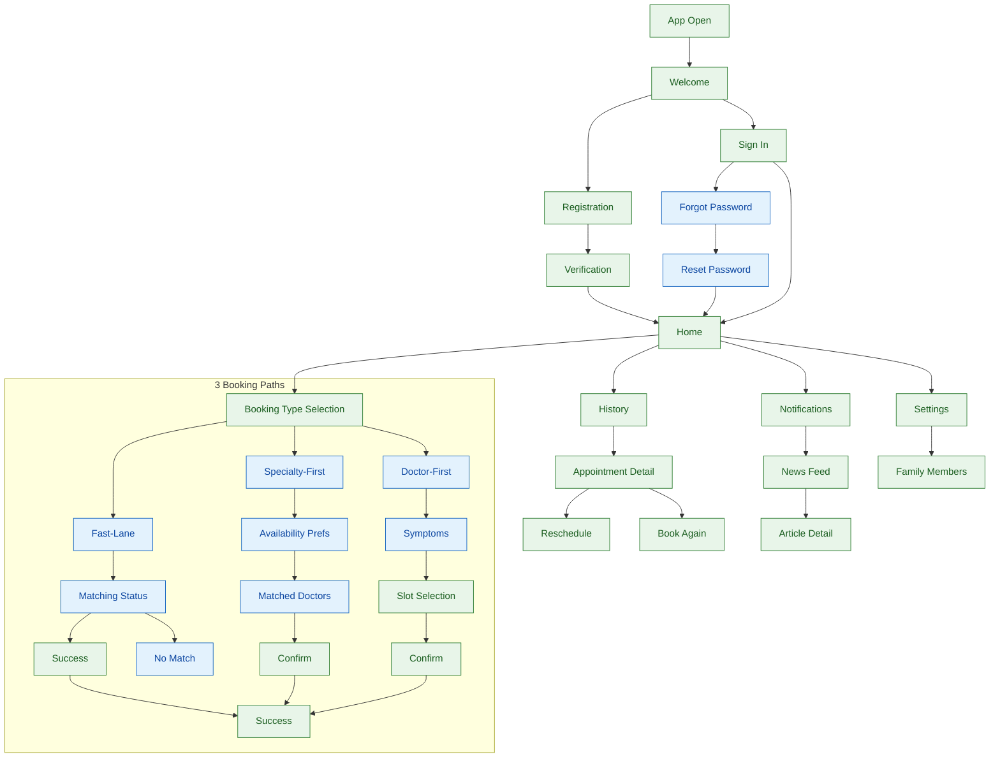

# Scope Index - v3

**Version:** 3.0
**Last Updated:** 2026-01-29
**Status:** Active

---

## Overview

This document indexes the scope defined in the exploration and requirements documents, and aligns it with USER-FLOWS-v3.md, INFO-MAP-v3.md, and product context/persona research.

**v3 Focus:** Curaay doctor appointments with 3 booking paths (Fast-Lane, Specialty-First, Doctor-First)

---

## Core Features Summary

| # | Feature | ID | JTBD Summary | Primary Personas | Status |
|---|---------|----|--------------|------------------|--------|
| 1 | [Registration](#registration) | J1 | When I download the app, I want to register quickly so that I can access booking features | All | Implemented |
| 2 | [Forgot Password](#forgot-password) | J1a | When I forget my password, I want to reset it via email so that I can regain access | All | **NEW in v3** |
| 3 | [Profile Completion](#profile-completion) | J2 | When I need to book, I want to complete my profile so that insurance/family are set up | Sarah, Helga | Implemented |
| 4 | [Fast-Lane Booking](#fast-lane-booking) | J3a | When I need care quickly, I want to describe symptoms so that I get matched with an available doctor | Marc, Sarah | **NEW in v3** |
| 5 | [Specialty-First Booking](#specialty-first-booking) | J3b | When I want a specific specialty, I want to set my preferences so that I see matching doctors | Sarah, Helga | **NEW in v3** |
| 6 | [Doctor-First Booking](#doctor-first-booking) | J3c | When I want a specific doctor, I want to search by name so that I can book directly | Helga, Thomas | **NEW in v3** |
| 7 | [Appointment Management](#appointment-management) | J4 | When I have appointments, I want to view/reschedule/cancel so that I stay organized | All | Implemented |
| 8 | [History Tracking](#history-tracking) | J5 | When I need records, I want to view history so that I track past appointments | Sarah, Helga | Implemented |
| 9 | [In-App Notifications](#in-app-notifications) | J6 | When appointments change status, I want alerts so that I stay informed | All | **NEW in v3** |
| 10 | [News & Content](#news-content) | J7 | When I open the app, I want health news so that I stay informed about wellness | Elena, All | Implemented |
| 11 | [Home Screen](#home-screen) | J8 | When I open the app, I want personalized content so that I see relevant actions | All | Enhanced |

---

## Booking Paths Comparison

| Aspect | Fast-Lane | Specialty-First | Doctor-First |
|--------|-----------|-----------------|--------------|
| **User Need** | Quick care, any doctor | Specific specialty | Specific doctor |
| **Steps** | 2-3 | 4-5 | 4 |
| **Doctor Selection** | System chooses | Choose from matches | User searches |
| **Time to Book** | Fastest (~20s match) | Medium (~2-3 min) | Slowest (~3+ min) |
| **User Control** | Low | Medium | High |
| **Best For** | Urgent needs | Specialty care | Returning patients |

---

## User Flow Summary

---

## Appointment Status System

| Status | Display | Description |
|--------|---------|-------------|
| `matching` | "Matching" | Finding a doctor, no doctor assigned yet |
| `await_confirm` | "Await confirm" | Doctor found, awaiting confirmation |
| `confirmed` | "Confirmed" | Appointment confirmed |
| `completed` | "Completed" | Appointment finished |
| `cancelled_patient` | "Patient canceled" | Cancelled by patient |
| `cancelled_doctor` | "Doctor canceled" | Cancelled by doctor |

---

## Feature Integration Points

| From | To | Integration |
|------|----|-------------|
| Fast-Lane No Match | Specialty/Doctor Booking | Alternative paths offered |
| Home Quick Actions | Booking Type Selection | Direct entry to booking |
| Home Pending Stack | Appointment Detail | Tap to view details |
| Notifications Toast | Appointment Detail | "View" deep link |
| Book Again | Slot Selection | Context prefill from past appointment |
| News Feed | Article Detail | Article reading experience |

---

## Persona Coverage Matrix

| Persona | Primary Needs | Preferred Booking Path | Digital Proficiency |
|---------|---------------|------------------------|---------------------|
| Sarah (34) | Quick booking, family appointments | Fast-Lane, Specialty-First | High |
| Marc (42) | Urgent care, specific specialists | Fast-Lane | Very High |
| Helga (68) | Familiar doctors, simple flow | Doctor-First | Moderate |
| Elena (23) | Dermatology, specific doctors | Specialty-First, Doctor-First | Very High |
| Thomas (51) | Simple booking, local doctors | Doctor-First | Moderate |

---

## Key Dependencies Summary

| Dependency | Features Affected | Status |
|------------|-------------------|--------|
| Curaay Booking API | All booking flows | Mock |
| Background Matching | Fast-Lane, Specialty-First | Mock (configurable timing) |
| Toast Notifications | Status change alerts | Implemented |
| i18n (EN/DE) | All screens | Implemented |
| localStorage | State persistence | Implemented |

---

## Success Metrics Summary

| Feature | Primary Metric | Target | Fallback Metric |
|---------|----------------|--------|-----------------|
| Registration | Completion rate | >90% | Time to complete &lt;1 min |
| Profile | Profile completion rate | >70% | Fields completed |
| Fast-Lane Booking | Match success rate | >75% | Time to match &lt;20s |
| Specialty Booking | Booking completion rate | >60% | Time to book &lt;3 min |
| Doctor Booking | Booking completion rate | >65% | Search success rate |
| Reschedule | Reschedule completion rate | >80% | Time to reschedule &lt;1 min |
| Book Again | Rebook conversion rate | >50% | Alternative selection rate |
| History | Page views per session | >2 | Status filter usage |
| Notifications | Toast tap-through rate | >30% | Auto-dismiss rate |
| News Feed | Article read rate | >25% | Scroll depth |

---

## Cross-Cutting Requirements

### UX Principles
- Trust, Clarity, Efficiency, Accessibility
- Mobile-first (320px minimum width)
- German-first with English support

### i18n Support
- 7 translation namespaces: auth, home, appointments, notifications, booking, profile, settings
- Full EN/DE coverage

### Design Constraints
- Tailwind CSS with shared token preset
- Tabler Icons library
- Status-aware appointment cards
- Toast notification system

---

## Document Links

### v3 Documents (Current)
- [User Flows v3](./USER-FLOWS-v3.md)
- [Info Map v3](./INFO-MAP-v3.md)
- [Scope for Exploration v3](./scope-for-exploration-v3.mdx)

### Archived Documents
- [User Flows v2](./z.archive/USER-FLOWS-v2.md)
- [User Flows (Original)](./z.archive/USER-FLOWS.md)
- [Info Map v2](./z.archive/INFO-MAP-v2.md)
- [Info Map (Original)](./z.archive/INFO-MAP.md)
- [Scope for Exploration (Original)](./z.archive/scope-for-exploration.md)

### Reference Documents
- [Product Context](./z.product-context-personas/product-context.md)
- [Personas Detail](./z.product-context-personas/personas-details.json)

---

## Change Log

| Version | Date | Changes |
|---------|------|---------|
| 3.0 | 2026-01-29 | Added 3 booking paths (Fast-Lane, Specialty-First, Doctor-First), Forgot Password flow, 6-state appointment status system, In-app toast notifications, Swipeable pending stack |
| 2.0 | 2026-01-27 | v2 scope alignment |
| 1.0 | 2026-01-21 | Initial version |
