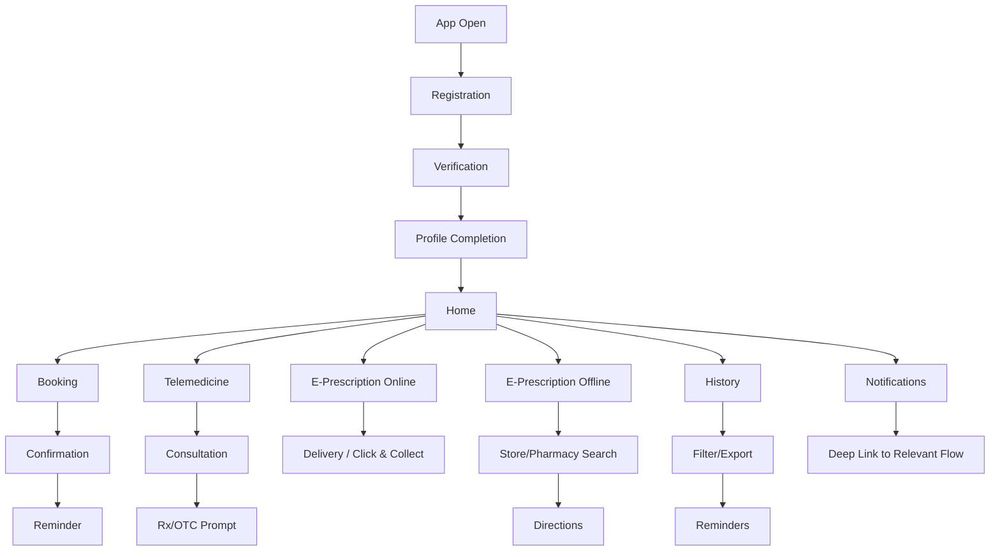

# Scope Index

**Version:** 1.0
**Last Updated:** 2026-01-21
**Status:** Draft

---

## Overview

This document indexes the scope defined in SCOPE-FOR-EXPLORATION.md and aligns it with USER-FLOWS.md, INFO-MAP.md, and product context/persona research.

---

## Core Features Summary

| # | Feature | ID | JTBD Summary | Primary Personas | Prototype |
|---|---------|----|--------------|------------------|-----------|
| 1 | [Registration](./SCOPE-FOR-EXPLORATION.md#1-user-registration-and-profile-management) | J1 | When I download the app, I want to register quickly so that I can access healthcare + shopping features | Elena, All | TBD |
| 2 | [Profile Completion](./SCOPE-FOR-EXPLORATION.md#1-user-registration-and-profile-management) | J2 | When I need to use core features, I want to complete my profile so that insurance/family are set up | Helga, Sarah | TBD |
| 3 | [Appointment Booking](./SCOPE-FOR-EXPLORATION.md#2-appointment-booking-in-person-via-curaay--in-store-health-checks) | J3 | When I need care, I want to book doctor/in-store appointments so that I get confirmed slots | Sarah, Marc, Elena | TBD |
| 4 | [Telemedicine Consultation](./SCOPE-FOR-EXPLORATION.md#3-telemedicine-consultation-via-teleclinic) | J4 | When I have a health concern, I want video consultation so that I avoid travel | Marc, Sarah, Helga | TBD |
| 5 | [Online Prescription Redemption](./SCOPE-FOR-EXPLORATION.md#4-prescription-redemption--online-via-cardlink-and-apo-group) | J5 | When I have a prescription, I want to redeem online so that meds come to me | Helga, Sarah, Elena | TBD |
| 6 | [Offline Prescription Redemption (Pharmacy Search + Store Locator)](./SCOPE-FOR-EXPLORATION.md#5-prescription-redemption--offline-pharmacy-search--dm-store-locator) | J6 | When I prefer pickup, I want to find dm/pharmacies so that I get meds locally | Thomas, Sarah | TBD |
| 7 | [History Tracking](./SCOPE-FOR-EXPLORATION.md#6-history-tracking) | J7 | When I need records, I want to view history so that I track everything | Sarah, Helga | TBD |
| 8 | [Home Screen (CMS-Driven)](./SCOPE-FOR-EXPLORATION.md#7-home-screen-cms-driven) | J8 | When I open the app, I want personalized content so that I see relevant actions/deals | Elena, All | TBD |
| 9 | [Push Notifications](./SCOPE-FOR-EXPLORATION.md#8-push-notifications-and-post-appointment-follow-up) | J9 | When something needs attention, I want alerts so that I don't miss important actions | All | TBD |

---

## User Flow Summary

---

## Feature Integration Points

| From | To | Integration |
|------|----|-------------|
| Telemedicine | Online/Offline Prescription Redemption | Post-consultation Rx or OTC redemption prompt |
| Home | Booking / Telemedicine / E-Prescription / Stores | Quick actions and CMS entry points |
| Home | Booking | Upcoming appointment card linking to details |
| Notifications | All flows | Deep links from reminders and deals |
| Online Prescription Redemption | Stores | Click & Collect store selection |
| Offline Prescription Redemption | Stores / Pharmacy Search | Store locator and directions |
| History | Notifications | Reminders for refills and follow-up |

---

## Key dm Integration Points (from Info Map)

- SSO for existing dm accounts during registration.
- Click & Collect for E-Rezept pickup.
- In-store health checks and beauty services for booking.
- Payback loyalty points on orders.
- dm deals on the home screen via CMS.
- Store Finder for dm + pharmacy locations.

---

## Persona Coverage Matrix

| Persona | Primary Needs (from personas-details.json) | Digital Proficiency |
|---------|-------------------------------------------|---------------------|
| Sarah (34) | Prescription ordering, telemedicine, appointment booking | High |
| Marc (42) | Telemedicine, in-store preventive checks, OTC/supplements for pickup | Very High |
| Helga (68) | Prescription ordering, telemedicine follow-ups, easy in-store booking | Moderate |
| Elena (23) | Cosmetic appointment booking, dermatology telemedicine, discreet ordering | Very High |
| Thomas (51) | In-store booking, OTC ordering, simple health info | Moderate |

---

## Key Dependencies Summary

| Dependency | Features Affected | Partner | Status |
|------------|-------------------|---------|--------|
| Curaay Booking API | Appointment Booking | Curaay | TBD |
| Teleclinic Video API | Telemedicine | Teleclinic | TBD |
| CardLink NFC SDK | E-Prescription Online | Cardlink/gematik | TBD |
| Apo Group Order API | E-Prescription Online | Apo Group | TBD |
| Google Maps | Store and pharmacy search | Google | TBD |
| dm Store API | Booking (in-store), Store Locator | dm | TBD |

---

## Success Metrics Summary

Note: Targets are taken from USER-FLOWS.md (some are inferred there).

| Feature | Primary Metric | Target |
|---------|----------------|--------|
| Registration | Completion rate | >90% |
| Profile | Profile completion rate | >80% |
| Appointment Booking | Booking completion rate | >60% |
| Telemedicine | Session completion rate | >85% |
| Online Prescription Redemption | Redemption rate | >70% |
| Offline Prescription Redemption | Store selection rate | >60% |
| History | Export/reminder usage | >20% |
| Home | Quick action tap rate | >40% |
| Notifications | Tap-through rate | >25% |

---

## Cross-Cutting Requirements

## UX Axis and Principles (from product-context.md)

Primary UX axis: Trust, Clarity, Efficiency, Accessibility.

Design constraints:
- German-first with 14+ localizations planned
- Mobile-first (320px minimum width)
- Partner co-branding visible
- dm brand alignment (clinical trust with dm accents)
- White-label ready (future)

Content principles:
- Professional, not clinical
- Clear over clever
- Formal address (Sie)
- Discreet for sensitive topics

---

## Document Links

- [Scope for Exploration](./SCOPE-FOR-EXPLORATION.md)
- [User Flows](./USER-FLOWS.md)
- [Info Map](./INFO-MAP.md)
- [Product Context](./z.product-context-research/product-context.md)
- [Personas Detail](./z.product-context-research/personas-details.json)
