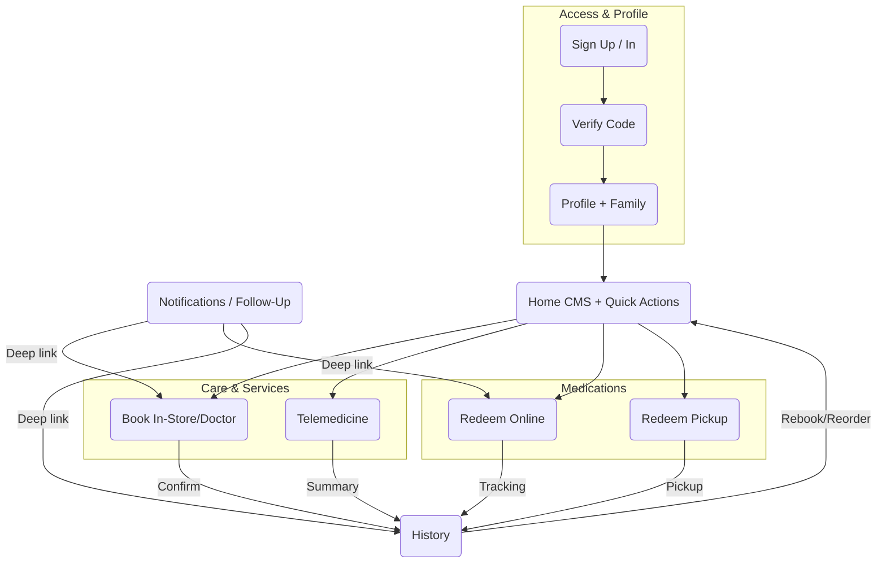

# User Flows — MedAlpha Connect (dm-style retail partner)
Date: January 20, 2026  
Source: `scope-for-exploration.md` (MedAlpha Connect – dm-like retail partner)

## Flow List (Jobs-to-be-Done)
- **J1 Complete Profile & Family** — Sign up, verify, add insurance/address, add family, confirm consent, reach Home.
- **J2 Book In-Store Health Check / Doctor** — Search by specialty/location/in-store, filter, pick slot, confirm for a family member, calendar sync, reminder.
- **J3 Start Telemedicine** — Symptom input, match, device check, video consult, summary, prompt for prescription/OTC, set reminder.
- **J4 Redeem Prescription Online** — Choose online, NFC eGK scan, verify, select delivery or Click & Collect, confirm, tracking, reminder.
- **J5 Redeem Offline (Store/Pharmacy Pickup)** — Location permission, search dm/pharmacies, select, get directions, pickup confirmation, history update.
- **J6 History & Reminders** — View combined history (bookings/redemptions/purchases), filter, export PDF, set refill reminders.
- **J7 Home Content & Quick Actions** — Personalized CMS feed (deals, tips, Payback), quick actions to key flows, deep-links refresh.
- **J8 Notifications & Follow-Up** — Triggered push (reminder/deal/follow-up), tap to feedback form, suggested next action (redeem, book, reorder), history update.

## Overview Diagram

## Detailed Steps per Flow
### J1 Complete Profile & Family
1. Open app → Sign Up / Sign In (email, phone, or dm SSO).  
2. Verify code (email/SMS).  
3. Complete profile: insurance type (GKV/PKV) + eGK details, address.  
4. Add/switch family members; capture consent for minors.  
5. Confirm privacy + compliance; success message → Home.

### J2 Book In-Store Health Check / Doctor
1. Home quick action or Book tab → Profile check (insurance, family).  
2. Search by specialty/location/in-store dm service; filters for availability, beauty, preventive.  
3. Select doctor/service + slot; show details, reviews, price if applicable.  
4. Confirm for chosen family member; payment method if required.  
5. Binding confirmation (Curaay + dm); calendar sync; push reminder set.

### J3 Start Telemedicine
1. Home quick action or Book tab → Telemedicine.  
2. Symptom input; match to doctor.  
3. Device check (camera/mic), large controls for accessibility.  
4. Live video session (Teleclinic).  
5. End summary; prompt for prescription/OTC redemption and follow-up reminder.

### J4 Redeem Prescription Online
1. Prompt from History/Notification → Redeem Online.  
2. NFC eGK scan (CardLink) or code entry; verify insurance.  
3. Choose delivery or Click & Collect via dm/Apo Group.  
4. Confirm order; discreet packaging option; show tracking.  
5. Update history; set refill reminder.

### J5 Redeem Offline (Store/Pharmacy Pickup)
1. Prompt → Redeem Offline.  
2. Request location permission (with manual address fallback).  
3. Search dm stores + neutral pharmacies; filters: open hours, distance, in-store stock.  
4. Select location; open directions (Maps).  
5. Pickup confirmation; history update.

### J6 History & Reminders
1. History tab → unified list (appointments, telemed, redemptions, shopping).  
2. Filters: date, type, family member; search.  
3. View detail; export PDF.  
4. Set or edit reminders (refills, follow-ups).

### J7 Home Content & Quick Actions
1. App open → CMS-driven feed (deals, health tips, Payback).  
2. Quick actions: Book, Telemedicine, Redeem Online, Redeem Pickup, Shop/Deals.  
3. Personalized ordering of cards; refresh on pull.

### J8 Notifications & Follow-Up
1. Event triggers: appointment end, prescription ready, deals, refills.  
2. Push notification → user taps.  
3. Feedback form (short), then suggested action (redeem, book, reorder).  
4. Result logged to history; reminders updated.

## Decision Points & Branching
- Profile verified? If not, redirect to J1 before flows.  
- Availability: in-store vs telemedicine; offer alternative slots or waitlist.  
- Location permission granted? If denied, use manual address entry.  
- Delivery vs Click & Collect; show nearest dm by default.  
- Family member selection at booking/redeem.  
- Payment required? If yes, capture payment method.

## Error States & Recovery
- Verification failure → retry, switch channel (email/SMS).  
- No slots → nearby stores/virtual option + notify when available.  
- NFC scan fails → manual code upload or photo.  
- Video fails → fall back to async chat or reschedule.  
- Location lookup fails → manual entry; offer support number.  
- Payment decline → retry or alternative method.

## Success Metrics (per flow)
- J1 Profile completion rate; time-to-complete < 2 min.  
- J2 Slot conversion (search → book); time-to-first booking.  
- J3 Telemed completion rate; drop-off at device check.  
- J4 Redemption success (scan → confirm); delivery vs Click & Collect split.  
- J5 Pickup completion; navigation launches.  
- J6 History export success; reminder adherence.  
- J7 Home quick-action click-through; CMS card engagement.  
- J8 Push open → action rate; feedback response rate.
