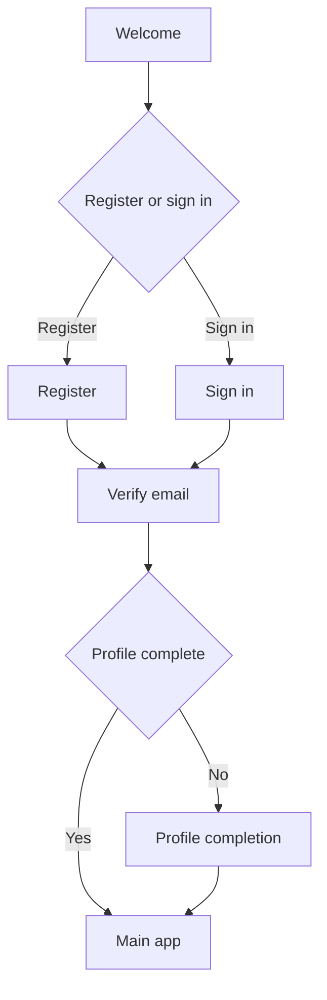

# IA Map - MedAlpha Connect v1 (Curaay Appointments)

**Generated From:** N3 App Implementation + SCOPE-FOR-EXPLORATION.md
**Date:** 2026-01-27
**Purpose:** Document v1 Information Architecture showing future state with NEW/MODIFIED indicators relative to full vision

---

## Summary of Changes

### Scope Comparison

| Full Vision | v1 Scope |
|-------------|----------|
| 6 Bottom Tabs | 4 Bottom Tabs |
| Telemedicine | OUT |
| E-Rezept (Prescriptions) | OUT |
| Stores Section | OUT |
| Health Checks / Beauty Booking | OUT |
| SSO / dm Account Link | OUT |
| Payback Integration | OUT |

### NEW Elements (v1 Implementation)

| Element | Type | Description |
|---------|------|-------------|
| Profile Completion Gate | Flow | Mandatory profile completion before accessing core features |
| Location Step | Screen | Dedicated location + preferences (city, radius, visit type, urgency) in booking flow |
| Insurance Step | Screen | Dedicated insurance selection step (GKV/PKV/Self-pay) before results |
| Slot Selection | Screen | Dedicated time slot picker with date carousel |
| Booking Confirmation Modal | Component | Bottom sheet confirmation with patient selector |
| Results Filters | Component | Filter sheet + sort selector in results (radius, rating, languages, only public) |
| Reviews Screen | Screen | Doctor reviews screen reachable from doctor profile |
| Tab Toggle (Upcoming/Past) | Component | History filtering via toggle instead of filters |
| Quick Actions | Component | Home screen shortcuts to Book and Family |
| Notifications Center | Screen | Notifications + Newsfeed tabs (bell icon entry) |
| Article Detail | Screen | Read a news/article item from the newsfeed |
| Today's Focus | Component | Next appointment spotlight (shown only if user is verified) |
| Reschedule Flow | Flow | Dedicated reschedule screens: reason → suggested slots → confirm → success |
| Book Again Flow | Flow | Dedicated re-book screens: context → alternatives → slots → confirm → success |
| Assistant Routes | Flow | Assistant booking routes (recommendations, doctor detail, confirm) |
| Settings Subpages | Screen | Language, privacy, FAQ, contact support, help centre screens added |

### MODIFIED Elements (Reduced from Full Vision)

| Element | Full Vision | v1 Scope | Change |
|---------|-------------|----------|--------|
| Bottom Navigation | 6 tabs (Home, Termine, Tele, E-Rezept, Stores, Verlauf) | 4 tabs (Home, Book, History, Settings) | Simplified |
| Booking Types | Doctor + Health Check + Beauty | Doctor only (Curaay) | Reduced |
| History | All types (appointments, orders, purchases) with export | Appointments only (upcoming/past) | Reduced |
| Profile Section | Dedicated section with Payback, dm Link, Help | Settings screen with family & notifications | Simplified |
| Home Content | Deals, Payback, Health Tips, Active Rx, Quick Actions | Quick Actions, Upcoming, Newsfeed, Notifications | Reduced |
| Verification | Email + SMS options | Email only | Simplified |

### Navigation Changes

| Navigation | Full Vision | v1 (N3) |
|------------|-------------|---------|
| Primary Nav | 6 tabs | 4 tabs |
| Profile Access | Dedicated tab or section | Via Settings screen |
| Booking Entry | Termine tab → Type selection | Book tab → Specialty search |
| History Entry | Verlauf tab with filters | History tab with toggle |

### Data Model (v1)

```
User
├── id, fullName, email, phone
├── insuranceType (GKV | PKV)
├── egkNumber
├── address { street, postalCode, city }
├── familyMembers[]
│   ├── id, name, dateOfBirth
│   ├── relationship (child | spouse | parent | other)
│   └── insuranceType, egkNumber (optional)
├── gdprConsent { dataProcessing, marketing, consentDate }
└── preferences { fontScale, notifications }

Appointment
├── id, doctorId, doctorName, specialty
├── dateISO, time
├── forUserId, forUserName (patient)
├── status (confirmed | completed | cancelled)
└── reminderSet, calendarSynced

Doctor (from Curaay API)
├── id, name, specialty, city, address
├── rating, reviewCount
├── accepts[] (GKV, PKV)
├── nextAvailableISO
└── imageUrl, about, languages

SearchFilters
├── specialty, city, insuranceType
├── radius, visitType, urgency
├── onlyPublic, minRating, languages
├── sortBy
└── includeStores (present but default false; stores UI remains OUT)

NewsArticle
├── id, title, subtitle/summary
├── category/tags
└── content (body)
```

---

## High-Level Structure (v1)

```
MedAlpha Connect v1
│
├── Authentication
│   ├── Welcome
│   ├── Sign In
│   ├── Register                         [NEW - simplified from Create Account]
│   ├── Verify (Email only)              [MODIFIED - no SMS option]
│   └── Verify Identity (optional)       [NEW - implemented route, not default path]
│
├── Profile Completion                   [NEW - mandatory gate]
│   └── Complete Profile Form
│
├── Main Application
│   │
│   ├── HOME                             [MODIFIED - simplified content]
│   │   ├── User Greeting
│   │   ├── Quick Actions (Book, Family)
│   │   ├── Today's Focus                [NEW - verified users only]
│   │   ├── Upcoming Appointments
│   │   ├── Notifications Center         [NEW - notifications + newsfeed tabs]
│   │   └── Latest Health News           [NEW - newsfeed preview + Article Detail]
│   │
│   ├── BOOK (Appointments)              [MODIFIED - Curaay only]
│   │   ├── Search (Specialty)           [MODIFIED - no type selection]
│   │   ├── Location & Preferences       [NEW - city, radius, visit type, urgency]
│   │   ├── Insurance                    [NEW - dedicated step]
│   │   ├── Results List                 [NEW - filters/sort]
│   │   ├── Doctor Details
│   │   ├── Reviews                      [NEW - separate screen]
│   │   ├── Slot Selection               [NEW - dedicated screen]
│   │   ├── Confirm (Modal)              [NEW - bottom sheet]
│   │   └── Success
│   │
│   ├── HISTORY                          [MODIFIED - appointments only]
│   │   ├── Upcoming Tab
│   │   ├── Past Tab
│   │   └── Appointment Actions (Reschedule, Cancel, Book Again) [NEW - dedicated flows]
│   │
│   └── SETTINGS                         [MODIFIED - replaces Profile section]
│       ├── Profile Card
│       ├── Family Members
│       ├── Notification Preferences
│       ├── Language                     [NEW]
│       ├── Privacy & Data               [NEW]
│       ├── FAQ                          [NEW]
│       ├── Contact Support              [NEW]
│       ├── Help Centre                  [NEW]
│       └── Account Actions (Sign Out, Reset)
│
├── Family Management                    [NEW - accessible from Settings & Home]
│   ├── Family Members List
│   └── Add/Edit Family Member
│
├── Assistant (Optional)                 [NEW - routed in N3]
│   ├── Assistant
│   ├── Voice Assistant
│   ├── Recommendations
│   ├── Assistant Doctor Detail
│   └── Assistant Confirm
│
└── NOT IN v1 (Full Vision Only)
    ├── TELEMEDIZIN (entire section)
    ├── E-REZEPT (entire section)
    ├── STORES (entire section)
    ├── Health Checks booking
    ├── Beauty Services booking
    ├── Payback integration
    ├── dm Account Link / SSO
    ├── History export
    └── Forgot Password
```

---

## Master IA Diagram (v1 Future State)



**Legend:**
- “(NEW)” indicates newly added in v1 implementation (or since last N3 update)
- Items without marker are existing, but may be reduced vs full vision

### IA Diagram — Main Areas (≤ 20 nodes)

```mermaid
flowchart TD
  A[Main app] --> B[Home]
  A --> C[Book]
  A --> D[History]
  A --> E[Settings]

  B --> F[Notifications center (NEW)]
  F --> G[Article detail (NEW)]

  D --> H[Appointment detail (NEW)]

  E --> I[Family members]
  E --> J[Notification preferences]
  E --> K[Settings subpages (NEW)]

  B -.-> L[Assistant (optional) (NEW)]
```

### IA Diagram — Booking (Detail) (≤ 20 nodes)

```mermaid
flowchart TD
  A[Entry (Book)] --> B[Specialty search]
  B --> C[Location & preferences (NEW)]
  C --> D[Insurance (NEW)]
  D --> E[Results (filters + sort) (NEW)]
  E --> F[Doctor profile]
  F --> G[Reviews (NEW)]
  G --> F
  F --> H[Slot selection (NEW)]
  H --> I[Confirm (bottom sheet) (NEW)]
  I --> J[Success]
```

### IA Diagram — Appointment Actions (≤ 20 nodes)

```mermaid
flowchart TD
  A[Appointment detail] --> B{Action}
  B -->|Reschedule| C[Reschedule (reason) (NEW)]
  C --> D[Reschedule (suggested slots) (NEW)]
  D --> E[Reschedule (confirm) (NEW)]
  E --> F[Reschedule (success) (NEW)]

  B -->|Book again| G[Book again (context) (NEW)]
  G --> H[Book again (alternatives) (NEW)]
  H --> I[Slot selection]
  I --> J[Confirm]
  J --> K[Success]
```

---

## Route Structure (v1)

| Route | Screen | Change | Notes |
|-------|--------|--------|-------|
| `/auth/welcome` | Welcome | - | Entry point |
| `/auth/sign-in` | Sign In | - | Email/password |
| `/auth/register` | Register | NEW | Simplified registration |
| `/auth/verify` | Verify | MODIFIED | Email only (no SMS) |
| `/auth/verify-identity` | Verify Identity | NEW | Implemented route (not default path) |
| `/profile/complete` | Profile Completion | NEW | Mandatory gate |
| `/profile/edit` | Edit Profile | - | Update profile |
| `/profile/family` | Family Members | - | Manage family |
| `/home` | Home | MODIFIED | Simplified content |
| `/notifications` | Notifications Center | NEW | Notifications + Newsfeed tabs |
| `/news/:articleId` | Article Detail | NEW | Newsfeed article detail |
| `/booking/search` | Specialty Search | MODIFIED | No type selection |
| `/booking/location` | Location & Preferences | NEW | City, radius, visit type, urgency |
| `/booking/insurance` | Insurance | NEW | GKV/PKV/Self-pay + only-public toggle |
| `/booking/results` | Results List | NEW | Doctor cards + filters/sort |
| `/booking/doctor/:id` | Doctor Details | - | Profile view |
| `/booking/doctor/:id/reviews` | Reviews | NEW | Reviews list |
| `/booking/doctor/:id/slots` | Slot Selection | NEW | Time picker |
| `/booking/confirm` | Confirm Modal | NEW | Bottom sheet |
| `/booking/success` | Success | - | Confirmation |
| `/history` | History | MODIFIED | Appointments only, tab toggle |
| `/settings` | Settings | MODIFIED | Replaces Profile section |
| `/appointments/:id` | Appointment Detail | NEW | Deep link from Today’s Focus and other CTAs |
| `/reschedule/:id` | Reschedule (Suggested) | NEW | Suggested slots screen |
| `/reschedule/:id/reason` | Reschedule Reason | NEW | Select reason |
| `/reschedule/:id/confirm` | Reschedule Confirm | NEW | Confirm change |
| `/reschedule/:id/success` | Reschedule Success | NEW | Success state |
| `/book-again/:id` | Book Again (Context) | NEW | Context + prefill |
| `/book-again/:id/alternatives` | Book Again (Alternatives) | NEW | Alternative doctors/slots |
| `/assistant` | Assistant | NEW | Optional enhancement |
| `/assistant/voice` | Voice Assistant | NEW | Optional enhancement |
| `/assistant/recommendations` | Recommendations | NEW | Assistant recommendations |
| `/assistant/doctor/:id` | Assistant Doctor Detail | NEW | Assistant-linked doctor detail |
| `/assistant/confirm` | Assistant Confirm | NEW | Assistant confirmation |
| `/settings/notifications` | Notification Preferences | MODIFIED | Preferences toggles |
| `/settings/language` | Language | NEW | Locale settings |
| `/settings/privacy` | Privacy & Data | NEW | Privacy and data controls |
| `/settings/faq` | FAQ | NEW | FAQ list |
| `/settings/contact-support` | Contact Support | NEW | Contact options |
| `/settings/help-centre` | Help Centre | NEW | Help centre |

### Routes NOT in v1

| Full Vision Route | Reason |
|-------------------|--------|
| `/auth/forgot-password` | Deferred |
| `/telemedicine/*` | Feature OUT |
| `/e-rezept/*` | Feature OUT |
| `/stores/*` | Feature OUT |
| `/history/export` | Feature reduced |

---

## Screen Inventory (v1)

| Screen ID | Section | Screen Name | Change | Description |
|-----------|---------|-------------|--------|-------------|
| AUTH-001 | Auth | Welcome | - | Entry with Sign In / Register |
| AUTH-002 | Auth | Sign In | - | Email/password login |
| AUTH-003 | Auth | Register | NEW | New user registration |
| AUTH-004 | Auth | Verify | MODIFIED | Email verification only |
| AUTH-005 | Auth | Verify Identity | NEW | Optional identity verification route (not default path) |
| PROF-001 | Profile | Complete Profile | NEW | Mandatory completion gate |
| PROF-002 | Profile | Edit Profile | - | Update personal info |
| PROF-003 | Profile | Family Members | - | List and manage family |
| PROF-004 | Profile | Add/Edit Member | - | Family member form |
| HOME-001 | Home | Dashboard | MODIFIED | Greeting, Quick Actions, Today’s Focus (verified only), Upcoming, Newsfeed preview, Notifications entry |
| HOME-002 | Home | Notifications Center | NEW | Notifications + Newsfeed tabs (bell icon entry) |
| HOME-003 | Home | Article Detail | NEW | Read a newsfeed article |
| BOOK-001 | Book | Specialty Search | MODIFIED | Search without type selection |
| BOOK-002 | Book | Location & Preferences | NEW | City, radius, visit type, urgency |
| BOOK-003 | Book | Insurance | NEW | GKV/PKV/Self-pay + only-public toggle |
| BOOK-004 | Book | Results List | NEW | Doctor cards with quick slots + filters/sort |
| BOOK-005 | Book | Doctor Details | - | Full doctor profile |
| BOOK-006 | Book | Reviews | NEW | Separate reviews list from doctor profile |
| BOOK-007 | Book | Slot Selection | NEW | Date carousel + time grid |
| BOOK-008 | Book | Confirm (Bottom Sheet) | NEW | Patient selector + optional reason |
| BOOK-009 | Book | Success | - | Booking confirmation |
| HIST-001 | History | History | MODIFIED | Upcoming/Past toggle |
| HIST-002 | History | Appointment Detail | NEW | Single appointment view + actions |
| ACT-001 | Appointment Actions | Reschedule Reason | NEW | Choose reason before suggestions |
| ACT-002 | Appointment Actions | Reschedule Suggested Slots | NEW | Suggested alternative slots |
| ACT-003 | Appointment Actions | Reschedule Confirm | NEW | Confirm reschedule |
| ACT-004 | Appointment Actions | Reschedule Success | NEW | Success state |
| ACT-005 | Appointment Actions | Book Again Context | NEW | Context + prefill from past appointment |
| ACT-006 | Appointment Actions | Book Again Alternatives | NEW | Alternative doctors/slots |
| ASSIST-001 | Assistant | Assistant | NEW | Optional assistant entry point |
| ASSIST-002 | Assistant | Voice Assistant | NEW | Optional voice route |
| ASSIST-003 | Assistant | Recommendations | NEW | Assistant recommendations list |
| ASSIST-004 | Assistant | Assistant Doctor Detail | NEW | Assistant-linked doctor detail |
| ASSIST-005 | Assistant | Assistant Confirm | NEW | Assistant confirmation |
| SETT-001 | Settings | Settings | MODIFIED | Profile card + menu items |
| SETT-002 | Settings | Notification Preferences | MODIFIED | Preferences toggles |
| SETT-003 | Settings | Language | NEW | Locale settings |
| SETT-004 | Settings | Privacy & Data | NEW | Privacy and data controls |
| SETT-005 | Settings | FAQ | NEW | FAQ list |
| SETT-006 | Settings | Contact Support | NEW | Contact options |
| SETT-007 | Settings | Help Centre | NEW | Help centre |

### Screens NOT in v1

| Full Vision Screen | Reason |
|--------------------|--------|
| AUTH-005 Forgot Password | Deferred |
| HOME-002 Deals & Payback | Feature OUT |
| BOOK-005 Payment | Beauty services OUT |
| TELE-* (all) | Feature OUT |
| ERX-* (all) | Feature OUT |
| STORE-* (all) | Feature OUT |
| HIST-004 Export | Feature reduced |
| PROF-006 Payback | Feature OUT |
| PROF-007 dm Account Link | Feature OUT |

---

## Key Features Delivered (v1)

1. **User Authentication** - Email-based sign in/register with verification
2. **Profile Management** - Insurance, address, GDPR consent with mandatory completion gate
3. **Family Members** - Add and manage dependents for family appointments
4. **Appointment Booking** - Multi-step booking: Specialty → Location/Preferences → (optional) Insurance → Results → Confirm
5. **Doctor Discovery** - Filters/sort + doctor profiles + reviews + quick slot selection
6. **Appointment History** - Upcoming/Past toggle with appointment detail view
7. **Reschedule & Book Again** - Dedicated flows/screens for appointment actions
8. **Newsfeed + Article Detail** - Health news cards and article reader via Notifications Center
9. **Settings Subpages** - Language, privacy, FAQ, contact support, help centre
10. **Notification Preferences** - Toggle reminders/updates (where supported)
11. **Assistant Routes (Optional)** - Assistant-linked booking entry points

---

## Implementation Notes

### Integration Points (v1)

| Integration | Status | Notes |
|-------------|--------|-------|
| Curaay API | Required | Doctor search, availability, booking |
| Content / Newsfeed Backend | Required | Newsfeed cards + article detail content |
| FCM/APNs | Optional | Push notifications |
| Calendar | Optional | Add to device calendar |

### Technical Considerations

1. **Profile Gate** - RequireProfileComplete guard on all main routes
2. **Booking State** - Context-based state for multi-step flow
3. **Mock Data** - N3 uses mock APIs; production needs real Curaay integration
4. **Local Storage** - Auth state, preferences, recent searches persisted
5. **Responsive** - Mobile-first design with safe areas

### Post-v1 Roadmap

| Feature | Priority | Dependency |
|---------|----------|------------|
| Telemedicine | P1 | Teleclinic integration |
| E-Rezept | P1 | CardLink + Apo Group |
| Stores | P2 | dm Store API |
| Payback | P2 | Payback integration |
| SSO | P2 | dm OAuth |
| Health Checks | P3 | dm Services API |
