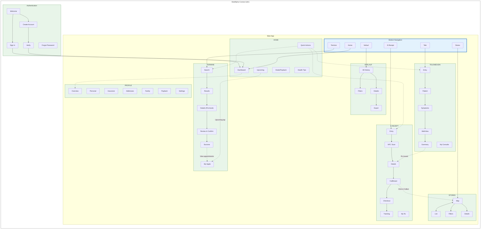

# Info Map

Notes: This document is derived from SCOPE-FOR-EXPLORATION.md. Items listed under Assumptions are inferred and not explicitly stated in the source.

## High-Level Structure

```
MedAlpha Connect (dm)
│
├── Authentication
│   ├── Welcome
│   ├── Sign In
│   ├── Create Account
│   ├── Verify (Email/SMS)
│   └── Forgot Password
│
├── Main Application
│   │
│   ├── HOME (Dashboard)
│   │   ├── Personalized Content (CMS)
│   │   ├── dm Deals & Payback
│   │   ├── Health Tips
│   │   ├── Upcoming Appointments
│   │   ├── Active Prescriptions
│   │   └── Quick Actions
│   │
│   ├── TERMINE (Booking)
│   │   ├── Search
│   │   │   ├── Doctor Search
│   │   │   ├── Health Check Search
│   │   │   └── Beauty Service Search
│   │   ├── Results List
│   │   ├── Provider/Service Details (pre-booking)
│   │   ├── Review & Confirm (patient selection)
│   │   ├── Payment (beauty only; optional)
│   │   ├── Booking Success
│   │   └── My Appointments
│   │       ├── Appointment Details
│   │       ├── Cancel / Reschedule
│   │       ├── Add to Calendar
│   │       └── Reminders
│   │
│   ├── TELEMEDIZIN
│   │   ├── Entry (Specialty Select)
│   │   ├── Patient Selection
│   │   ├── Symptom Input
│   │   ├── Teleclinic WebView
│   │   ├── Consultation Summary
│   │   └── My Consultations
│   │
│   ├── E-REZEPT
│   │   ├── Entry (Online/Offline Choice)
│   │   ├── NFC Scan
│   │   ├── Prescription Details
│   │   ├── Fulfillment Choice
│   │   │   ├── Delivery Checkout
│   │   │   └── Click & Collect (Store Select)
│   │   ├── Order Confirmation
│   │   ├── Order Tracking
│   │   └── My Prescriptions
│   │
│   ├── STORES (dm + Pharmacies)
│   │   ├── Map View
│   │   ├── List View
│   │   ├── Filters
│   │   ├── Store Details
│   │   └── Directions
│   │
│   ├── VERLAUF (History)
│   │   ├── All History
│   │   ├── Filters
│   │   ├── Item Details
│   │   └── Export
│   │
│   └── PROFILE
│       ├── Overview
│       ├── Personal Info
│       ├── Insurance
│       ├── Addresses
│       ├── Family Members
│       ├── Payback
│       ├── dm Account Link
│       ├── Notifications Settings
│       └── Help & Support
│
└── System Layer
    ├── Push Notifications
    ├── Deep Links
    ├── Bottom Sheets
    └── Modals
```

### Assumptions

- Bottom navigation exists with tabs: Home, Termine, Tele, E-Rezept, Stores, Verlauf.
- Dedicated Stores section exists separate from the E-Rezept flow.
- Dedicated Profile section includes Payback, dm Account Link, Notification Settings, Help & Support.
- Forgot Password screen exists in Authentication.
- System Layer grouping (Push Notifications, Deep Links, Bottom Sheets, Modals) exists.

## Master IA Diagram



Note: The diagram reflects the assumptions listed above.

## Navigation Paths

| Flow | Primary Path | Optimized For | Alternative |
|------|--------------|---------------|-------------|
| Registration | Welcome → Create → Verify → Profile | New users | SSO via dm account |
| Booking | Tab → Search → Results → Book → My Appts | Discovery | Home → Quick Action |
| Telemedicine | Tab → Specialty → Symptoms → Video | Speed | Post-appointment prompt |
| Online Rx | Tab → NFC → Details → Checkout | Convenience | Telemedicine → Rx CTA |
| Offline Rx | Tab → Map → Select → Directions | Local pickup | Click & Collect from E-Rezept |
| History | Tab → Filter → Details → Export | Records | Home → Upcoming tap |
| Home | App Open → Dashboard | Engagement | Notification deep link |


### Key dm Integration Points

- **SSO** - Link existing dm account at registration
- **Click & Collect** - Pickup at dm stores for E-Rezept
- **In-Store Services** - Health checks and beauty bookings
- **Payback** - Loyalty points on orders
- **Deals** - dm promotions on home screen via CMS
- **Store Finder** - dm + pharmacy locations unified

## Screen Inventory

| Screen ID | Section | Screen Name | Description |
|-----------|---------|-------------|-------------|
| AUTH-001 | Authentication | Welcome | App entry point with sign in/create account options |
| AUTH-002 | Authentication | Sign In | Email/password login form |
| AUTH-003 | Authentication | Create Account | Registration form for new users |
| AUTH-004 | Authentication | Verify | Email/SMS verification code entry |
| AUTH-005 | Authentication | Forgot Password | Password reset request flow |
| HOME-001 | Home | Dashboard | Main landing screen with personalized content |
| HOME-002 | Home | Deals & Payback | dm promotions and loyalty offers |
| HOME-003 | Home | Health Tips | CMS-driven health content |
| BOOK-001 | Termine | Search | Doctor/service search with filters |
| BOOK-002 | Termine | Results List | Search results with provider cards |
| BOOK-003 | Termine | Provider Details | Provider info, availability, reviews |
| BOOK-004 | Termine | Review & Confirm | Patient selection and booking summary |
| BOOK-005 | Termine | Payment | Beauty service payment (optional) |
| BOOK-006 | Termine | Booking Success | Confirmation with calendar add option |
| BOOK-007 | Termine | My Appointments | List of upcoming/past appointments |
| BOOK-008 | Termine | Appointment Details | Single appointment view with actions |
| BOOK-009 | Termine | Cancel/Reschedule | Appointment modification flow |
| TELE-001 | Telemedizin | Entry | Specialty selection screen |
| TELE-002 | Telemedizin | Patient Selection | Choose patient for consultation |
| TELE-003 | Telemedizin | Symptom Input | Symptom questionnaire |
| TELE-004 | Telemedizin | Teleclinic WebView | Video consultation (embedded) |
| TELE-005 | Telemedizin | Consultation Summary | Post-consultation notes and actions |
| TELE-006 | Telemedizin | My Consultations | Consultation history list |
| ERX-001 | E-Rezept | Entry | Online/Offline prescription choice |
| ERX-002 | E-Rezept | NFC Scan | eGK card scanning screen |
| ERX-003 | E-Rezept | Prescription Details | Medication info and options |
| ERX-004 | E-Rezept | Fulfillment Choice | Delivery vs Click & Collect selection |
| ERX-005 | E-Rezept | Delivery Checkout | Shipping and payment for delivery |
| ERX-006 | E-Rezept | Store Select | Click & Collect pharmacy selection |
| ERX-007 | E-Rezept | Order Confirmation | Order placed confirmation |
| ERX-008 | E-Rezept | Order Tracking | Delivery/pickup status tracking |
| ERX-009 | E-Rezept | My Prescriptions | Prescription history list |
| STORE-001 | Stores | Map View | dm + pharmacy locations on map |
| STORE-002 | Stores | List View | Store results in list format |
| STORE-003 | Stores | Filters | Store type/service filters |
| STORE-004 | Stores | Store Details | Individual store info and services |
| STORE-005 | Stores | Directions | Navigation to selected store |
| HIST-001 | Verlauf | All History | Unified activity timeline |
| HIST-002 | Verlauf | Filters | Filter by type, date, status |
| HIST-003 | Verlauf | Item Details | Single history item view |
| HIST-004 | Verlauf | Export | Export records (PDF/email) |
| PROF-001 | Profile | Overview | Profile summary and quick links |
| PROF-002 | Profile | Personal Info | Name, DOB, contact details |
| PROF-003 | Profile | Insurance | Insurance card and info |
| PROF-004 | Profile | Addresses | Delivery addresses management |
| PROF-005 | Profile | Family Members | Dependent profiles management |
| PROF-006 | Profile | Payback | Payback account linking |
| PROF-007 | Profile | dm Account Link | dm account connection |
| PROF-008 | Profile | Notifications | Push notification preferences |
| PROF-009 | Profile | Help & Support | FAQ, contact, legal info |
| SYS-001 | System | Bottom Sheet | Reusable modal sheet component |
| SYS-002 | System | Modal Dialog | Alert/confirmation dialogs |
| SYS-003 | System | Push Notification | Notification display handler |
