# User Flows - MedAlpha Connect v3

**Generated From:** N3 App Implementation Analysis
**Date:** 2026-01-29
**Focus:** Curaay doctor appointments with 3 booking paths (Fast-Lane, Specialty-First, Doctor-First)

---

## Jobs-to-be-Done Summary

| Job ID | Feature | Job Statement | Primary Personas |
|--------|---------|---------------|------------------|
| J1 | Registration | When I download the app, I want to register quickly so that I can access booking features | All |
| J2 | Profile | When I need to book, I want to complete my profile so that insurance/family are set up | Sarah, Helga |
| J3a | Fast-Lane Booking | When I need care quickly, I want to describe symptoms so that I get matched with an available doctor | Marc, Sarah |
| J3b | Specialty Booking | When I want a specific specialty, I want to set my preferences so that I see matching doctors | Sarah, Helga |
| J3c | Doctor Booking | When I want a specific doctor, I want to search by name so that I can book directly | Helga, Thomas |
| J4 | Appointment Mgmt | When I have appointments, I want to view/reschedule/cancel so that I stay organized | All |
| J5 | History | When I need records, I want to view history so that I track past appointments | Sarah, Helga |
| J6 | Notifications | When appointments change status, I want alerts so that I stay informed | All |
| J7 | Content | When I open the app, I want health news so that I stay informed about wellness | Elena, All |

---

## Flow: User Registration (J1)

### Flow Steps

| Step | User Action | System Response | Objects Modified | Success Criteria |
|------|-------------|-----------------|------------------|------------------|
| 1 | Open app (first time) | Show welcome screen | - | Welcome displays |
| 2 | Tap "Register" | Show registration form | - | Form displays |
| 3 | Enter name, email, password | Validate inputs | - | No errors |
| 4 | Tap "Create Account" | Send verification code | User: created (pending) | Code sent |
| 5 | Enter verification code | Verify code | User: verified | Code accepted |
| 6 | Navigate to home | Show home screen | - | Home displays |

### Decision Points

| Branch Point | Condition | Path A | Path B |
|--------------|-----------|--------|--------|
| Verification | Code valid? | Continue to home | Retry/Resend |
| Profile | Complete profile now? | Profile completion | Skip to home |

### Flow Diagram

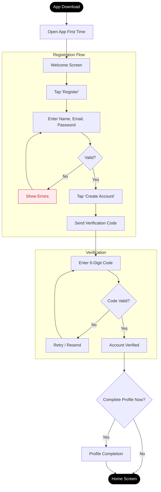

---

## Flow: Forgot Password (J1a) - NEW in v3

### Flow Steps

| Step | User Action | System Response | Objects Modified | Success Criteria |
|------|-------------|-----------------|------------------|------------------|
| 1 | Tap "Forgot password?" on Sign In | Show forgot password screen | - | Screen displays |
| 2 | Enter registered email | Validate email exists | - | Email valid |
| 3 | Tap "Send Reset Code" | Send verification code | - | Code sent |
| 4 | Enter verification code | Verify code | - | Code accepted |
| 5 | Enter new password + confirm | Validate password match | User: password updated | Password saved |
| 6 | Auto sign-in | Navigate to home | Auth: authenticated | Home displays |

### Flow Diagram

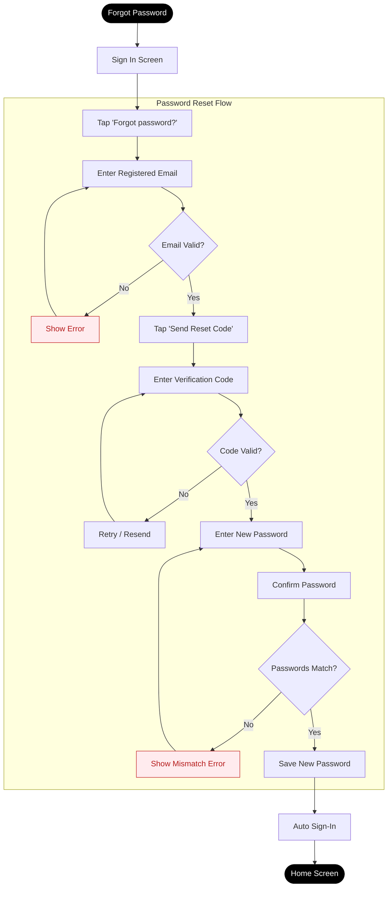

---

## Flow: Profile Completion (J2)

### Flow Steps

| Step | User Action | System Response | Objects Modified | Success Criteria |
|------|-------------|-----------------|------------------|------------------|
| 1 | View profile form | Show fields (name, insurance, address) | - | Form loads |
| 2 | Enter insurance details (GKV/PKV) | Validate insurance | Insurance: set | Insurance saved |
| 3 | Enter EGK number (optional) | Save EGK | User: egkNumber | EGK saved |
| 4 | Enter address | Save address | Address: created | Address saved |
| 5 | (Optional) Add family members | Show family form | - | Form displays |
| 6 | Enter family member details | Validate, save member | FamilyMember: created | Member added |
| 7 | Accept GDPR consent | Record consent | User: gdprConsent | Consent saved |
| 8 | Tap "Save" | Show success | User: profileComplete | Success message |

### Flow Diagram

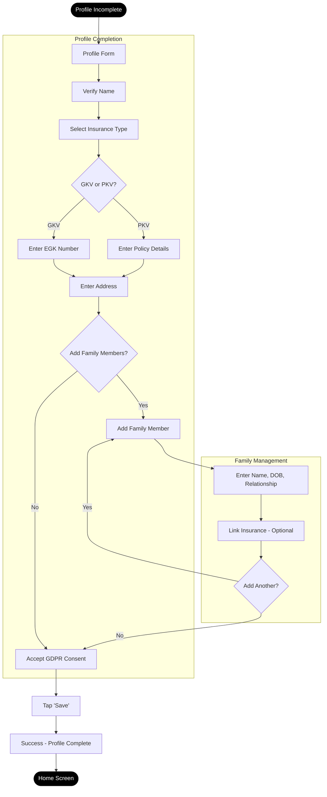

---

## Flow: Fast-Lane Booking (J3a) - NEW in v3

### Flow Steps

| Step | User Action | System Response | Objects Modified | Success Criteria |
|------|-------------|-----------------|------------------|------------------|
| 1 | Tap "Book Appointment" | Show booking type selection | - | Screen loads |
| 2 | Select "Fast-Lane" | Show care request form | BookingFlow: fast_lane | Form displays |
| 3 | Select patient (self/family) | Update patient field | Booking: forUser | Patient selected |
| 4 | Select specialty | Update specialty | Booking: specialty | Specialty set |
| 5 | Select symptoms (chips) | Update symptoms | Booking: symptoms | Symptoms selected |
| 6 | Select city | Update location | Booking: city | City set |
| 7 | Select insurance type | Update insurance | Booking: insurance | Insurance set |
| 8 | Tap "Find Appointment" | Create matching appointment | Appointment: matching | Request sent |
| 9 | View Request Sent screen | Show confirmation | - | Confirmation shown |
| 10 | Background matching runs | Update status in real-time | Appointment: status | Matching progresses |
| 11a | (Success) Doctor matched | Show success screen | Appointment: confirmed | Doctor assigned |
| 11b | (No Match) No doctors | Show alternatives | Appointment: cancelled | Alternatives shown |

### Decision Points

| Branch Point | Condition | Path A | Path B | Path C |
|--------------|-----------|--------|--------|--------|
| Patient | Who needs care? | Self | Family member | - |
| Matching result | Doctor found? | Success screen | No Match screen | - |
| No Match action | User choice? | Retry | Change specialty | Browse doctors |

### Flow Diagram

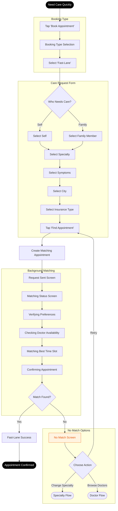

---

## Flow: Specialty-First Booking (J3b) - NEW in v3

### Flow Steps

| Step | User Action | System Response | Objects Modified | Success Criteria |
|------|-------------|-----------------|------------------|------------------|
| 1 | Tap "Book Appointment" | Show booking type selection | - | Screen loads |
| 2 | Select "Book by Specialty" | Show specialty search | BookingFlow: by_specialty | Form displays |
| 3 | Search/select specialty | Update specialty | Booking: specialty | Specialty set |
| 4 | Select city | Update location | Booking: city | City set |
| 5 | Select insurance type | Update insurance | Booking: insurance | Insurance set |
| 6 | Tap "Continue" | Show availability screen | - | Screen loads |
| 7 | Set availability (flexible or specific) | Update preferences | AvailabilityPrefs: set | Prefs saved |
| 8 | Tap "Continue" | Start matching, show doctors | - | Doctors display |
| 9 | View matched doctors | Show doctor cards | - | Cards display |
| 10 | (Optional) View doctor details | Show detail sheet | - | Sheet opens |
| 11 | Select a doctor OR skip | Process selection | Booking: selectedDoctor | Doctor set |
| 12 | Confirming with doctor | Show progress | Appointment: await_confirm | Progress shown |
| 13 | Appointment confirmed | Show success | Appointment: confirmed | Success shown |

### Decision Points

| Branch Point | Condition | Path A | Path B |
|--------------|-----------|--------|--------|
| Availability | User preference? | Fully flexible | Specific days/times |
| Doctor selection | User choice? | Select specific doctor | Skip - system chooses |

### Flow Diagram

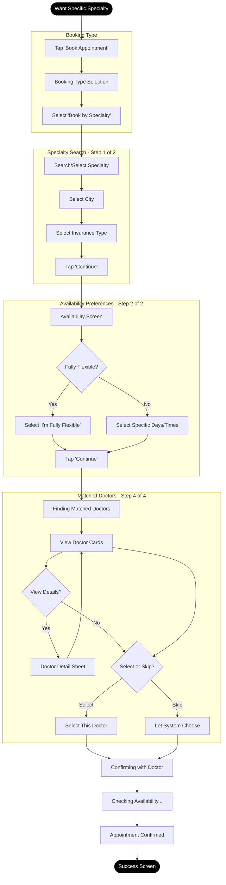

---

## Flow: Doctor-First Booking (J3c) - NEW in v3

### Flow Steps

| Step | User Action | System Response | Objects Modified | Success Criteria |
|------|-------------|-----------------|------------------|------------------|
| 1 | Tap "Book Appointment" | Show booking type selection | - | Screen loads |
| 2 | Select "Book by Doctor" | Show doctor search | BookingFlow: by_doctor | Screen displays |
| 3 | Search by name or specialty | Filter results | - | Results shown |
| 4 | (Optional) Filter by specialty chip | Update filters | - | Filtered |
| 5 | (Optional) Sort by name/rating/distance | Update sort | - | Sorted |
| 6 | Select a doctor | Show symptoms screen | Booking: selectedDoctor | Doctor set |
| 7 | Select symptom chips | Update symptoms | SymptomInfo: symptoms | Symptoms set |
| 8 | (Optional) Add notes | Update notes | SymptomInfo: notes | Notes saved |
| 9 | Tap "Continue" | Show slot selection | - | Slots display |
| 10 | Select date | Show times for date | - | Times shown |
| 11 | Select time slot | Update slot | Booking: selectedSlot | Slot set |
| 12 | Tap "Continue" | Show confirm screen | - | Confirm displays |
| 13 | Review details | Verify information | - | Details correct |
| 14 | Tap "Confirm Appointment" | Process booking | Appointment: confirmed | Success |

### Decision Points

| Branch Point | Condition | Path A | Path B |
|--------------|-----------|--------|--------|
| Search | How to find? | By name | By specialty filter |
| Sort | Sort order? | Name A-Z | Rating / Distance |

### Flow Diagram

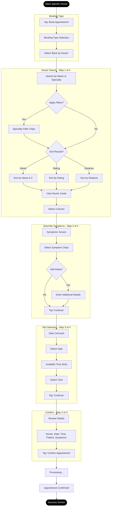

---

## Flow: Appointment Management (J4)

### Flow Steps

| Step | User Action | System Response | Objects Modified | Success Criteria |
|------|-------------|-----------------|------------------|------------------|
| 1 | Open "History" tab | Show appointments list | - | List loads |
| 2 | Toggle Upcoming/Past | Filter appointments | - | Filtered |
| 3 | Tap appointment card | Show appointment details | - | Details shown |
| 4a | (Optional) Tap "Reschedule" | Start reschedule flow | - | Flow starts |
| 4b | (Optional) Tap "Cancel" | Show cancel confirmation | Appointment: cancelled | Status updated |
| 4c | (Optional) Tap "Book Again" | Start book again flow | - | Flow starts |
| 5 | (Optional) Add to calendar | Create calendar event | Appointment: calendarSynced | Event added |

### Flow Diagram

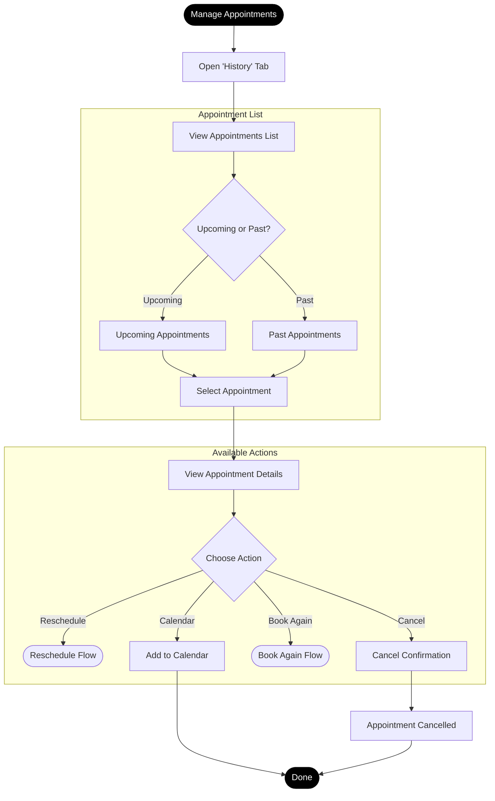

---

## Flow: Reschedule Appointment (J4a)

### Flow Steps

| Step | User Action | System Response | Objects Modified | Success Criteria |
|------|-------------|-----------------|------------------|------------------|
| 1 | Tap "Reschedule" on detail | Show reason screen | - | Screen loads |
| 2 | Select reason | Update reason | Reschedule: reason | Reason set |
| 3 | Tap "Continue" | Show suggested slots | - | Slots display |
| 4 | Select new time slot | Update selection | Reschedule: newSlot | Slot selected |
| 5 | Tap "Continue" | Show confirm screen | - | Confirm displays |
| 6 | Review old vs new details | Verify changes | - | Details correct |
| 7 | Tap "Confirm Reschedule" | Process reschedule | Appointment: rescheduled | Success |
| 8 | View success screen | Show confirmation | - | Success shown |

### Flow Diagram

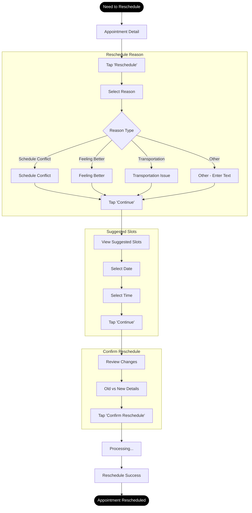

---

## Flow: Book Again (J4b)

### Flow Steps

| Step | User Action | System Response | Objects Modified | Success Criteria |
|------|-------------|-----------------|------------------|------------------|
| 1 | Tap "Book Again" on past appointment | Show context screen | BookAgain: context | Screen loads |
| 2 | Review original appointment | Display details | - | Details shown |
| 3a | (Available) Same doctor available | Show slot selection | Booking: selectedDoctor | Slots display |
| 3b | (Unavailable) Doctor not available | Show alternatives | - | Alternatives shown |
| 4 | Select alternative (if needed) | Update doctor | Booking: selectedDoctor | Doctor set |
| 5 | Select time slot | Update slot | Booking: selectedSlot | Slot set |
| 6 | Confirm booking | Process booking | Appointment: confirmed | Success |

### Decision Points

| Branch Point | Condition | Path A | Path B |
|--------------|-----------|--------|--------|
| Doctor availability | Same doctor available? | Direct to slot selection | Show alternatives |

### Flow Diagram

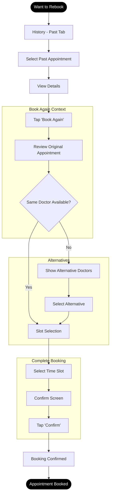

---

## Flow: History Tracking (J5)

### Flow Steps

| Step | User Action | System Response | Objects Modified | Success Criteria |
|------|-------------|-----------------|------------------|------------------|
| 1 | Tap "History" tab | Show history list | - | List loads |
| 2 | View chronological list | Display all appointments | - | Items shown |
| 3 | Toggle Upcoming/Past | Filter list | - | Filtered |
| 4 | Tap item for details | Show detail view | - | Details shown |
| 5 | (Optional) Tap archive icon | Show archive view | - | Archive shown |
| 6 | (Optional) Book again | Start booking flow | - | Flow starts |

### Flow Diagram

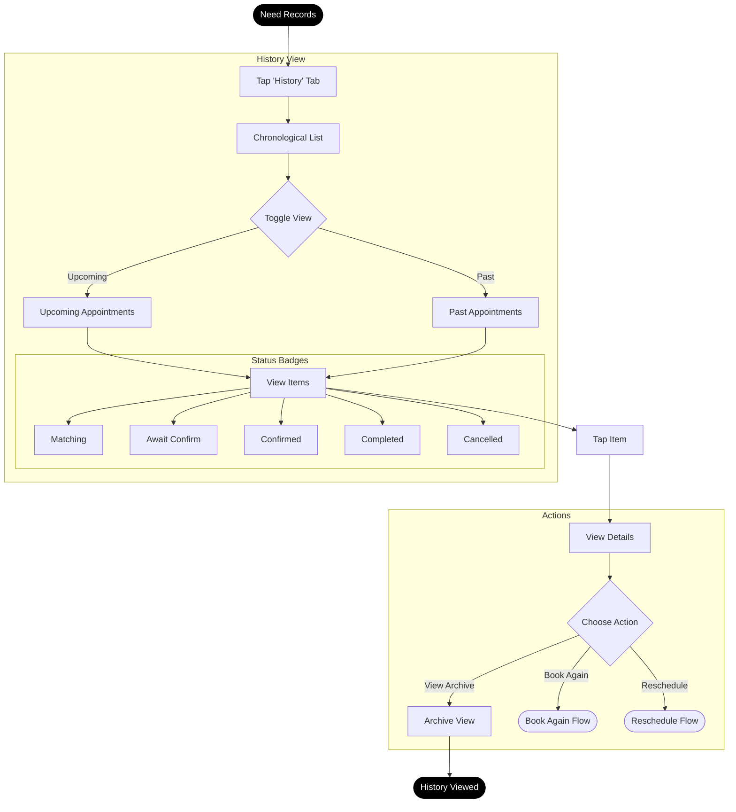

---

## Flow: In-App Notifications (J6) - NEW in v3

### Flow Steps

| Step | User Action | System Response | Objects Modified | Success Criteria |
|------|-------------|-----------------|------------------|------------------|
| 1 | Appointment status changes | Detect change | Appointment: status | Change detected |
| 2 | System shows toast | Display notification | - | Toast appears |
| 3 | (Optional) Tap "View" | Navigate to appointment | - | Detail opens |
| 4 | (Optional) Dismiss | Toast auto-dismisses | - | Toast gone |

### Notification Types

| Type | Trigger | Content | Deep Link |
|------|---------|---------|-----------|
| Confirmed | Matching → Confirmed | "Appointment confirmed" | Appointment Detail |
| No Match | Matching → Cancelled | "No match found" | No Match Screen |
| Cancelled by Doctor | Doctor cancels | "Appointment cancelled by doctor" | Appointment Detail |
| Cancelled | User cancels | "Appointment cancelled" | History |
| Completed | Appointment done | "Appointment completed" | History |

### Flow Diagram

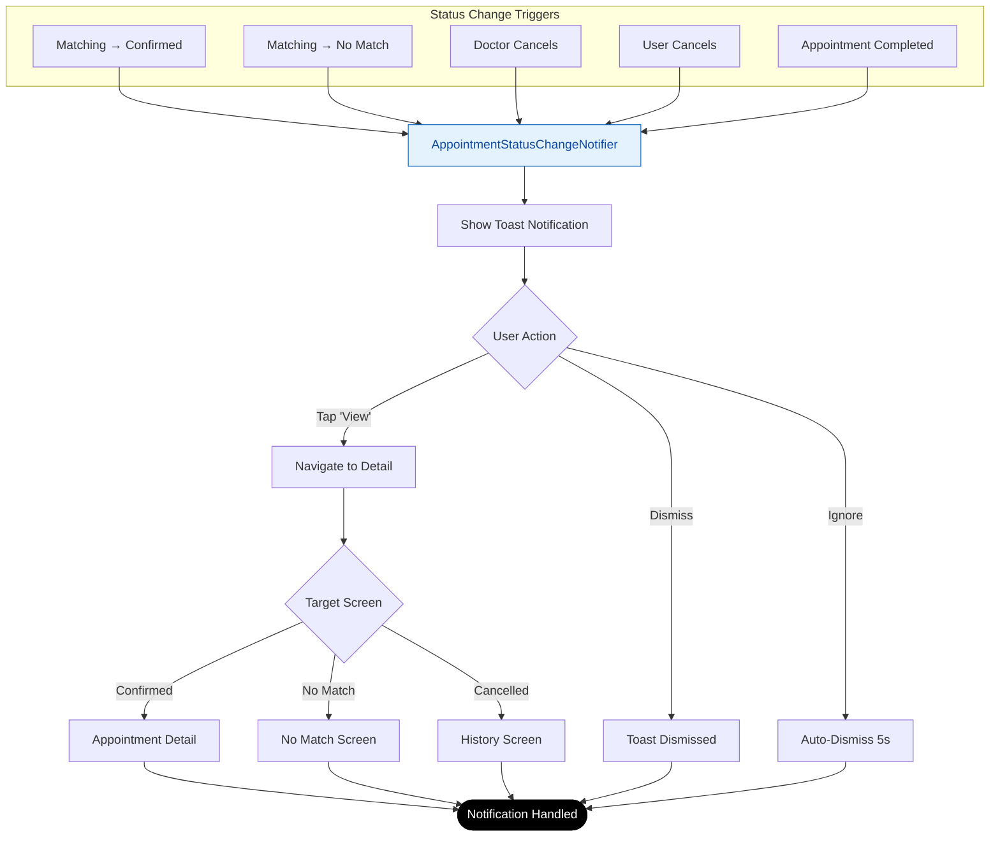

---

## Flow: News & Content (J7)

### Flow Steps

| Step | User Action | System Response | Objects Modified | Success Criteria |
|------|-------------|-----------------|------------------|------------------|
| 1 | Tap bell icon on Home | Show Notifications Center | - | Screen loads |
| 2 | Tap "News Feed" tab | Show news content | - | Content displays |
| 3 | View Short Guides carousel | Display video cards | - | Carousel shows |
| 4 | View Featured Story | Display featured card | - | Card shows |
| 5 | View Latest Health News | Display article cards | - | Articles show |
| 6 | Tap article | Show article detail | - | Article opens |
| 7 | Read article | Display full content | - | Content readable |
| 8 | (Optional) Share/Save | Trigger action | - | Action complete |
| 9 | Back button | Return to News Feed tab | - | Tab preserved |

### Flow Diagram

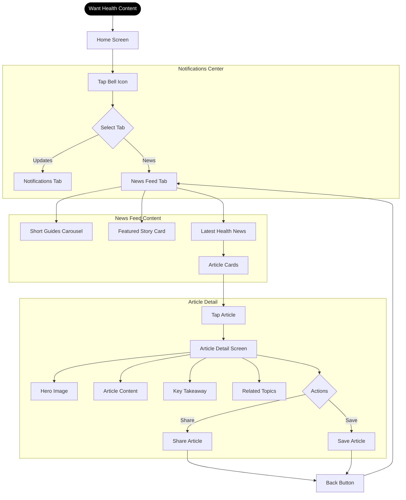

---

## Flow: Home Screen (J8)

### Flow Steps

| Step | User Action | System Response | Objects Modified | Success Criteria |
|------|-------------|-----------------|------------------|------------------|
| 1 | Open app | Load home screen | - | Screen loads |
| 2 | View greeting | Display personalized greeting | - | Greeting shows |
| 3 | View Quick Actions | Show Book, Family shortcuts | - | Actions display |
| 4 | View Pending Stack | Show swipeable appointments | - | Stack displays |
| 5 | Swipe appointment cards | Navigate through pending | - | Cards swipe |
| 6 | Tap appointment | Navigate to detail | - | Detail opens |
| 7 | View Latest Health News | Show article previews | - | News displays |
| 8 | Tap quick action | Navigate to feature | - | Feature opens |

### Flow Diagram

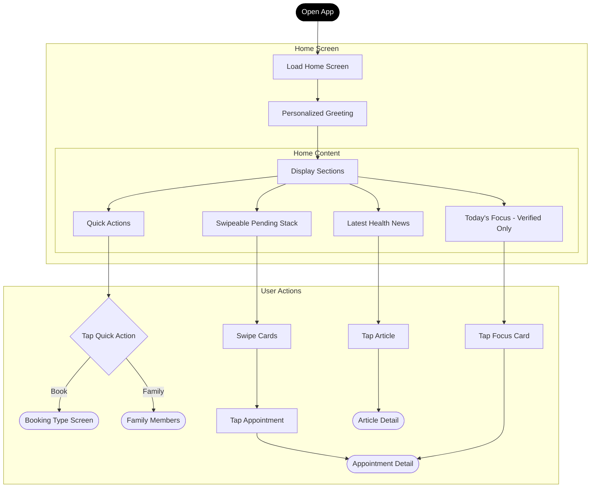

---

## Flow Metrics

| Flow | Primary Metric | Target | Fallback Metric |
|------|----------------|--------|-----------------|
| Registration | Completion rate | >90% | Time to complete &lt;1 min |
| Profile | Profile completion rate | >70% | Fields completed |
| Fast-Lane Booking | Match success rate | >75% | Time to match &lt;20s |
| Specialty Booking | Booking completion rate | >60% | Time to book &lt;3 min |
| Doctor Booking | Booking completion rate | >65% | Search success rate |
| Reschedule | Reschedule completion rate | >80% | Time to reschedule &lt;1 min |
| Book Again | Rebook conversion rate | >50% | Alternative selection rate |
| History | Page views per session | >2 | Status filter usage |
| Notifications | Toast tap-through rate | >30% | Auto-dismiss rate |
| News Feed | Article read rate | >25% | Scroll depth |

---
