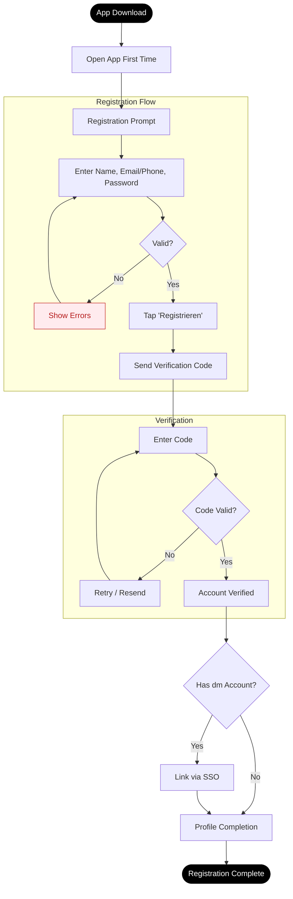
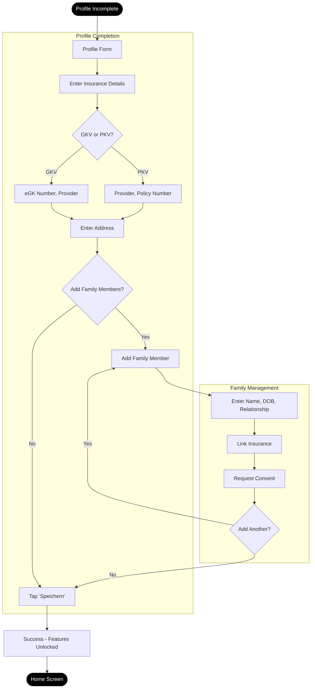
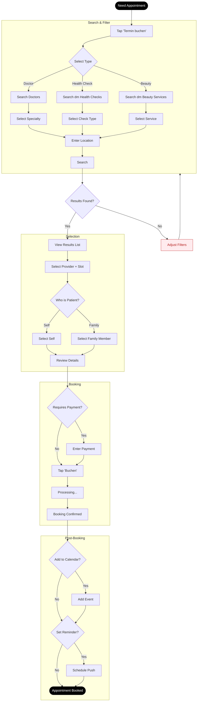
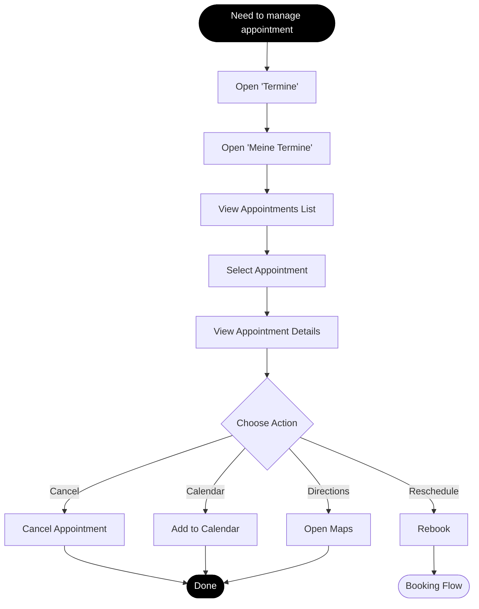
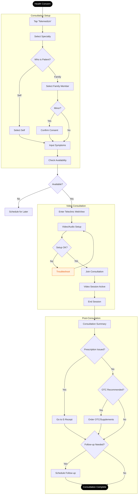
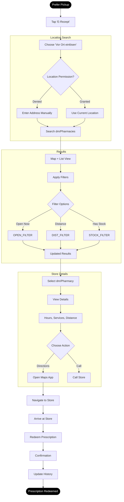
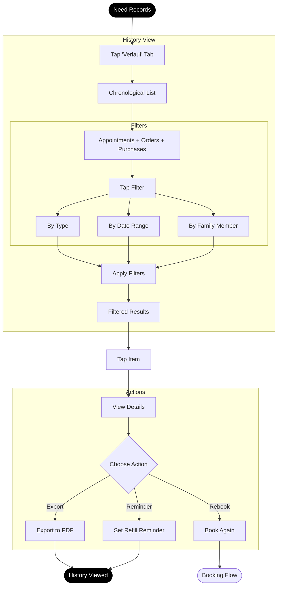
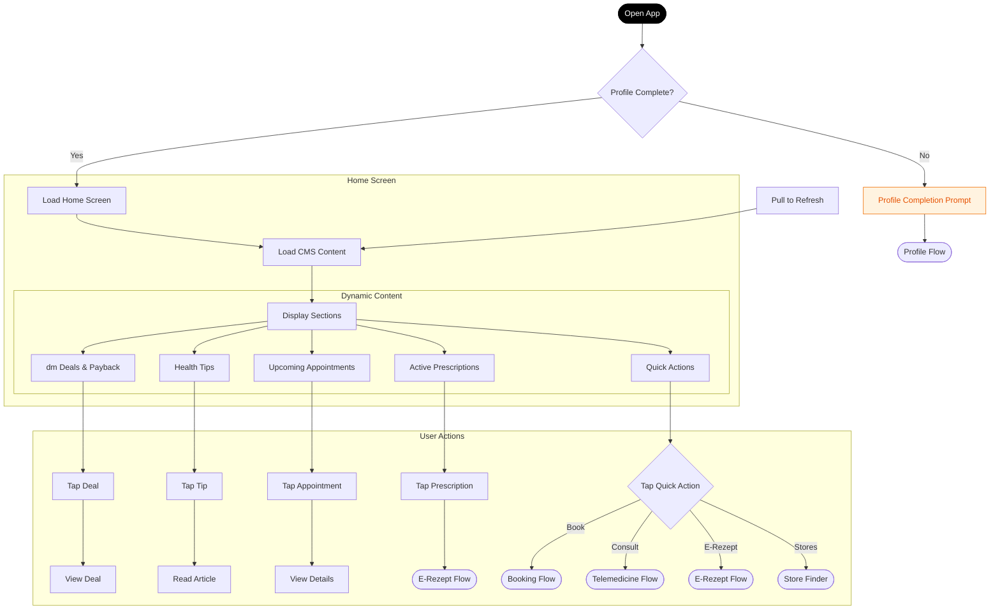
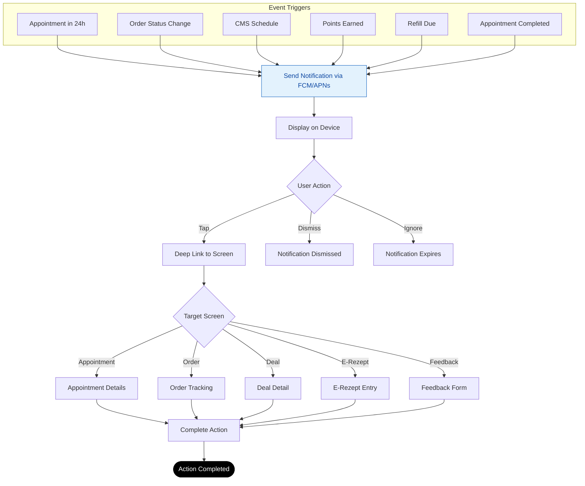

```mermaid
flowchart TD
    START([Have Prescription]) --> ENTRY[Tap 'E-Rezept']
    ENTRY --> ONLINE[Choose 'Online einlösen']

    subgraph NFC_SCAN["NFC Scan"]
        ONLINE --> SCAN_PROMPT[Show NFC Instructions]
        SCAN_PROMPT --> HOLD[Hold eGK to Phone]
        HOLD --> DETECT{Card Detected?}
        DETECT -->|No| RETRY[Retry]
        RETRY --> HOLD
        DETECT -->|Yes| VERIFY[Verify Insurance]
        VERIFY --> DETAILS[Show Prescription Details]
    end

    subgraph FULFILLMENT["Fulfillment Choice"]
        DETAILS --> FULFILL{Delivery or Click & Collect?}
        FULFILL -->|Delivery| DELIVERY
        FULFILL -->|Click & Collect| COLLECT

        subgraph DELIVERY["Home Delivery"]
            DEL_ADDR[Confirm/Edit Address]
        end

        subgraph COLLECT["Click & Collect"]
            STORE_SELECT[Select dm Store]
        end
    end

    DEL_ADDR --> OPTIONS
    STORE_SELECT --> OPTIONS

    subgraph ORDER_OPTIONS["Order Options"]
        OPTIONS[Order Options]
        OPTIONS --> PAYBACK{Apply Payback?}
        PAYBACK -->|Yes| ADD_PAYBACK[Add Points]
        PAYBACK -->|No| DISCREET
        ADD_PAYBACK --> DISCREET
        DISCREET{Discreet Packaging?}
        DISCREET -->|Yes| SET_DISCREET[Enable Discreet]
        DISCREET -->|No| SUMMARY
        SET_DISCREET --> SUMMARY[Order Summary]
    end

    SUMMARY --> CONFIRM[Tap 'Bestellen']
    CONFIRM --> PROCESSING[Processing via Apo Group]
    PROCESSING --> SUCCESS[Order Confirmed]

    subgraph TRACKING["Tracking"]
        SUCCESS --> TRACK[View Tracking]
        TRACK --> STATUS[Status Updates]
        STATUS --> COMPLETE{Delivered/Collected?}
        COMPLETE -->|Yes| DONE
        COMPLETE -->|No| STATUS
    end

    DONE([Order Complete])

    style START fill:#000000,stroke:#000000,color:#ffffff
    style DONE fill:#000000,stroke:#000000,color:#ffffff
    style RETRY fill:#fff3e0,stroke:#ef6c00,color:#e65100
```

# User Flows

**Generated From:** SCOPE-FOR-EXPLORATION.md
**Date:** 2026-01-20
**Focus:** dm-drogerie markt retail partner integration (healthcare + shopping + loyalty)

---

Notes: This document is derived from SCOPE-FOR-EXPLORATION.md. Items listed under Assumptions are inferred and not explicitly stated in the source.

## Jobs-to-be-Done Summary

| Job ID | Feature | Job Statement | Primary Personas |
|--------|---------|---------------|------------------|
| J1 | Registration | When I download the app, I want to register quickly so that I can access healthcare + shopping features | Elena, All |
| J2 | Profile | When I need to use core features, I want to complete my profile so that insurance/family are set up | Helga, Sarah |
| J3 | Booking | When I need care, I want to book doctor/in-store appointments so that I get confirmed slots | Sarah, Marc, Elena |
| J4 | Telemedicine | When I have a health concern, I want video consultation so that I avoid travel | Marc, Sarah, Helga |
| J5 | Online Rx | When I have a prescription, I want to redeem online so that meds come to me | Helga, Sarah, Elena |
| J6 | Offline Rx | When I prefer pickup, I want to find dm/pharmacies so that I get meds locally | Thomas, Sarah |
| J7 | History | When I need records, I want to view history so that I track everything | Sarah, Helga |
| J8 | Home | When I open the app, I want personalized content so that I see relevant actions/deals | Elena, All |
| J9 | Notifications | When something needs attention, I want alerts so that I don't miss important actions | All |

## Flow: User Registration (J1)

### Flow Steps

| Step | User Action | System Response | Objects Modified | Success Criteria |
|------|-------------|-----------------|------------------|------------------|
| 1 | Open app (first time) | Show registration prompt | - | Prompt displays |
| 2 | Enter name, email/phone, password | Validate inputs | - | No errors |
| 3 | Tap "Registrieren" | Send verification code | User: created (pending) | Code sent |
| 4 | Enter verification code | Verify code | User: verified | Code accepted |
| 5 | (Optional) Link dm account via SSO | Connect dm login | User: dmAccountLinked | SSO success |
| 6 | Navigate to profile completion | Show profile form | - | Form displays |

### Decision Points

| Branch Point | Condition | Path A | Path B |
|--------------|-----------|--------|--------|
| Verification method | Email or Phone? | Email verification | SMS verification |
| dm account | Has dm account? | SSO handoff | Skip to profile |

### Flow Diagram

## Flow: Profile Completion (J2)

### Flow Steps

| Step | User Action | System Response | Objects Modified | Success Criteria |
|------|-------------|-----------------|------------------|------------------|
| 1 | View profile form | Show fields (insurance, address, family) | - | Form loads |
| 2 | Enter insurance details (GKV/PKV, eGK) | Validate insurance | Insurance: created | Insurance saved |
| 3 | Enter address | Save address | Address: created | Address saved |
| 4 | (Optional) Add family members | Show family form | - | Form displays |
| 5 | Enter family member details | Validate, request consent | FamilyMember: created | Member added |
| 6 | Tap "Speichern" | Show success, unlock features | User: profileComplete | Success message |

### Flow Diagram

## Flow: Appointment Booking (J3)

### Flow Steps

| Step | User Action | System Response | Objects Modified | Success Criteria |
|------|-------------|-----------------|------------------|------------------|
| 1 | Tap "Termin buchen" | Show search screen | - | Screen loads |
| 2 | Select type (Doctor/Health Check/Beauty) | Filter by type | - | Type selected |
| 3 | Enter specialty/service + location | Search Curaay + dm API | - | Results load |
| 4 | Browse results | Show cards with slots | - | Cards display |
| 5 | Select provider/service + time slot | Show confirmation | - | Details shown |
| 6 | Select patient (self or family) | Update patient field | - | Patient selected |
| 7 | Confirm booking | Process via Curaay/dm | Appointment: created | Confirmation shown |
| 8 | Add to calendar | Create calendar event | Appointment: calendarSynced | Event added |
| 9 | Set reminder | Schedule push | Notification: scheduled | Reminder set |
| 10 | (Optional) View in "Meine Termine" | Show appointment details | - | Details shown |

### Decision Points

| Branch Point | Condition | Path A | Path B | Path C |
|--------------|-----------|--------|--------|--------|
| Booking type | What type? | Doctor (Curaay) | Health Check (dm) | Beauty (dm) |
| Patient | Who is this for? | Self | Family member | - |
| Payment | Beauty service? | Show payment | Skip payment | - |

### Flow Diagram

## Flow: My Appointments (J3a)

### Flow Steps

| Step | User Action | System Response | Objects Modified | Success Criteria |
|------|-------------|-----------------|------------------|------------------|
| 1 | Open "Termine" tab | Show Termine entry point | - | Screen loads |
| 2 | Open "Meine Termine" | Show appointments list | - | List displays |
| 3 | Select an appointment | Show appointment details | - | Details shown |
| 4 | (Optional) Cancel appointment | Cancel booking via provider/dm | Appointment: canceled | Status updated |
| 5 | (Optional) Reschedule | Start booking flow with context | - | Booking flow opens |
| 6 | (Optional) Add to calendar | Create calendar event | Appointment: calendarSynced | Event added |
| 7 | (Optional) Get directions | Open maps to location | - | Maps opens |

### Flow Diagram

## Flow: Telemedicine Consultation (J4)

### Flow Steps

| Step | User Action | System Response | Objects Modified | Success Criteria |
|------|-------------|-----------------|------------------|------------------|
| 1 | Tap "Telemedizin" | Show Teleclinic entry | - | Entry screen loads |
| 2 | Select specialty (sports/nutrition/derma/general) | Filter doctors | - | Specialty set |
| 3 | Select patient (self or family) | Check consent for minors | - | Patient selected |
| 4 | Input symptoms | Capture description | Consultation: symptoms | Symptoms saved |
| 5 | Check availability | Query Teleclinic 24/7 | - | Availability shown |
| 6 | Enter Teleclinic WebView | Handoff to partner | Consultation: created | WebView loads |
| 7 | Complete video setup (mic/camera test) | Validate devices | - | Setup complete |
| 8 | Conduct consultation | Video session | Consultation: in_progress | Session active |
| 9 | End session | Show summary | Consultation: completed | Summary shown |
| 10 | Prompt for prescription/OTC | Show redemption CTA | - | CTA displayed |

### Decision Points

| Branch Point | Condition | Path A | Path B |
|--------------|-----------|--------|--------|
| Patient | Self or Family? | Self flow | Minor consent check |
| Post-consult | Prescription issued? | Go to E-Rezept | OTC prompt |
| Follow-up | Doctor recommends? | Schedule follow-up | End |

### Flow Diagram

## Flow: Online Prescription Redemption (J5)

### Flow Steps

| Step | User Action | System Response | Objects Modified | Success Criteria |
|------|-------------|-----------------|------------------|------------------|
| 1 | Tap "E-Rezept" or prompt | Show redemption options | - | Options shown |
| 2 | Choose "Online einlösen" | Show NFC scan screen | - | Scan screen loads |
| 3 | Hold eGK to phone | CardLink NFC scan | - | Card detected |
| 4 | Verify insurance | Check via CardLink | - | Insurance verified |
| 5 | View prescription details | Show medications + costs | Prescription: retrieved | Details shown |
| 6 | Select fulfillment (Delivery/Click & Collect) | Show options | - | Option selected |
| 7a | (Delivery) Confirm address | Load from profile | Order: address set | Address confirmed |
| 7b | (Click & Collect) Select dm store | Show store picker | Order: pickupStore | Store selected |
| 8 | (Optional) Apply Payback | Calculate points | Order: paybackApplied | Points shown |
| 9 | (Optional) Select discreet packaging | Toggle option | Order: discreetPackaging | Option set |
| 10 | Confirm order | Process via Apo Group | Order: created | Order confirmed |
| 11 | View tracking | Show status timeline | Order: status updates | Tracking visible |

### Decision Points

| Branch Point | Condition | Path A | Path B |
|--------------|-----------|--------|--------|
| Fulfillment | Delivery or Pickup? | Home delivery | Click & Collect at dm |
| Discreet | Sensitive items? | Enable discreet packaging | Standard packaging |
| Recurring | Recurring prescription? | Set up auto-refill reminder | One-time |

### Flow Diagram

### Assumptions

- Apply Payback during online redemption is inferred from loyalty/deals context in the scope.

## Flow: Offline Prescription Redemption (J6)

### Flow Steps

| Step | User Action | System Response | Objects Modified | Success Criteria |
|------|-------------|-----------------|------------------|------------------|
| 1 | Choose "Vor Ort einlösen" | Show location search | - | Search loads |
| 2 | Grant location permission | Get GPS coordinates | - | Location acquired |
| 3 | Search dm stores/pharmacies | Query Google Maps + dm API | - | Results shown |
| 4 | Filter (open now, distance, stock) | Update results | - | Filtered |
| 5 | Select dm store or pharmacy | Show details | - | Details shown |
| 6 | View directions | Open Maps app | - | Maps opens |
| 7 | Redeem at location | Update status | Prescription: redeemed | Confirmation |
| 8 | Update history | Add to history | History: updated | History saved |

### Flow Diagram

## Flow: History Tracking (J7)

### Flow Steps

| Step | User Action | System Response | Objects Modified | Success Criteria |
|------|-------------|-----------------|------------------|------------------|
| 1 | Tap "Verlauf" tab | Show history list | - | List loads |
| 2 | View chronological list | Display all items | - | Items shown |
| 3 | Filter by type/date/family member | Update list | - | Filtered |
| 4 | Tap item for details | Show detail view | - | Details shown |
| 5 | (Optional) Export to PDF | Generate document | - | PDF created |
| 6 | (Optional) Set refill reminder | Schedule notification | Notification: scheduled | Reminder set |

### Flow Diagram

## Flow: Home Screen (J8)

### Flow Steps

| Step | User Action | System Response | Objects Modified | Success Criteria |
|------|-------------|-----------------|------------------|------------------|
| 1 | Open app | Load home screen | - | Screen loads |
| 2 | Check profile status | Gate features if incomplete | - | Status checked |
| 3 | Load CMS content | Fetch deals, health tips, Payback | CMS Content: loaded | Content displays |
| 4 | View personalized sections | Show based on profile | - | Personalized |
| 5 | Tap quick action | Navigate to feature | - | Feature opens |
| 6 | Pull to refresh | Update content | CMS Content: refreshed | Content updated |

### Flow Diagram

### Assumptions

- Home sections for Upcoming Appointments and Active Prescriptions are inferred.
- Pull-to-refresh behavior is inferred.

## Flow: Push Notifications (J9)

### Flow Steps

| Step | User Action | System Response | Objects Modified | Success Criteria |
|------|-------------|-----------------|------------------|------------------|
| 1 | Event triggers notification | Send via FCM/APNs | Notification: sent | Push delivered |
| 2 | Receive notification | Display on device | - | Notification shows |
| 3 | Tap notification | Deep link to relevant screen | - | Screen opens |
| 4 | Complete action | Update related object | Varies | Action completed |

### Notification Types

| Type | Trigger | Content | Deep Link |
|------|---------|---------|-----------|
| Appointment Reminder | 24h/1h before | "Ihr Termin morgen um 14:00" | Appointment Details |
| Prescription Ready | Order status change | "Ihre Medikamente sind abholbereit" | Order Tracking |
| dm Deals | CMS schedule | "20% auf Vitamine heute!" | Deal Detail |
| Payback | Points earned | "Sie haben 50 Punkte gesammelt" | Payback Dashboard |
| Refill Reminder | History flag | "Zeit für Ihre Rezeptverlängerung" | E-Rezept Entry |
| Post-Appointment | 60 min after | "Wie war Ihr Termin? Rezept einlösen?" | Feedback + E-Rezept |

### Assumptions

- Appointment reminder timing (24h/1h), points-earned notifications, and specific message copy are inferred.

### Flow Diagram

## Flow Metrics

Note: Metrics and targets are derived assumptions for planning, except the telemedicine session completion >90% stated in the source.

| Flow | Primary Metric | Target | Fallback Metric |
|------|----------------|--------|-----------------|
| Registration | Completion rate | >90% | Time to complete <1 min |
| Profile | Profile completion rate | >80% | Insurance verification success |
| Booking | Booking completion rate | >60% | Time to book <2 min |
| Telemedicine | Session completion rate | >85% | Video setup success >95% |
| Online Rx | Redemption rate | >70% | NFC scan success >85% |
| Offline Rx | Store selection rate | >60% | Directions opened >50% |
| History | Export/reminder usage | >20% | Page views per session |
| Home | Quick action tap rate | >40% | Session duration |
| Notifications | Tap-through rate | >25% | Delivery rate >98% |

---
