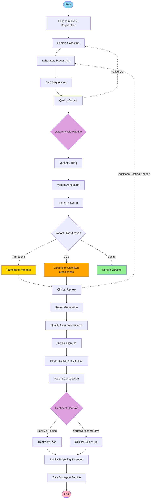

# Clinical Genomics Workflow - Big Picture Overview

## Mermaid Diagram Code

## Workflow Phases

### 1. Pre-Analysis Phase
- **Patient Intake & Registration**: Initial patient information collection
- **Sample Collection**: Biological sample acquisition
- **Laboratory Processing**: Sample preparation for sequencing

### 2. Sequencing & Quality Control
- **DNA Sequencing**: High-throughput sequencing of patient samples
- **Quality Control**: Validation of sequencing data quality
  - *Note: Failed QC loops back to Sample Collection*

### 3. Data Analysis Pipeline
- **Variant Calling**: Identification of genetic variants
- **Variant Annotation**: Adding biological context to variants
- **Variant Filtering**: Removing artifacts and irrelevant variants

### 4. Variant Classification
Variants are classified into three categories:
- **Pathogenic Variants**: Known disease-causing mutations
- **VUS (Variants of Unknown Significance)**: Uncertain clinical relevance
- **Benign Variants**: Non-pathogenic variations

### 5. Clinical Review & Reporting
- **Clinical Review**: Expert evaluation of findings
  - *Note: Can trigger additional testing if needed*
- **Report Generation**: Creation of clinical report
- **Quality Assurance Review**: Final validation
- **Clinical Sign-Off**: Authorization by qualified personnel
- **Report Delivery to Clinician**: Distribution to healthcare providers

### 6. Patient Care
- **Patient Consultation**: Discussion of results with patient
- **Treatment Decision**: Determination of next steps
  - Positive findings → Treatment Plan
  - Negative/Inconclusive → Clinical Follow-Up

### 7. Post-Analysis
- **Family Screening**: Cascade testing for relatives if indicated
- **Data Storage & Archive**: Long-term data retention

## Key Decision Points

1. **Quality Control Checkpoint**: Ensures data quality before proceeding
2. **Variant Classification**: Determines clinical significance
3. **Treatment Decision**: Guides patient management strategy

## Feedback Loops

- Quality Control failures return to Sample Collection
- Clinical Review may require additional laboratory testing

## Color Legend

- **Blue**: Start point
- **Pink**: End point
- **Gold**: Pathogenic variants
- **Orange**: Variants of unknown significance
- **Green**: Benign variants
- **Purple**: Major decision points