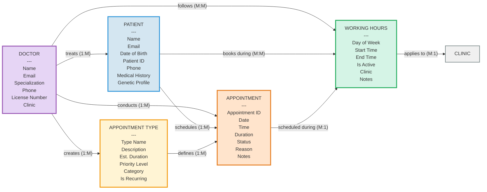

# garrioCAL Appointment System

## Mermaid Diagram

## Object Descriptions

### Core Objects (5)

**DOCTOR** (Purple)
- Healthcare provider managing patients and appointments
- Attributes: Name, Email, Specialization, Phone, License Number, Clinic

**PATIENT** (Blue)
- Individual receiving medical care
- Attributes: Name, Email, Date of Birth, Patient ID, Phone, Medical History, Genetic Profile

**WORKING HOURS** (Green)
- Operational schedule defining service availability
- Attributes: Day of Week, Start Time, End Time, Is Active, Clinic, Notes

**APPOINTMENT TYPE** (Yellow)
- Template/category for appointment types
- Attributes: Type Name, Description, Est. Duration, Priority Level, Category, Is Recurring

**APPOINTMENT** (Orange)
- Scheduled meeting between doctor and patient
- Attributes: Appointment ID, Date, Time, Duration, Status, Reason, Notes

### Supporting Objects

**CLINIC** (Gray)
- Healthcare facility or organizational unit for doctors and trading hours

## Relationships

| From | Relationship | To | Cardinality |
|------|-------------|-----|-------------|
| Doctor | treats | Patient | 1:M |
| Doctor | follows | Working Hours | M:M |
| Doctor | creates | Appointment Type | 1:M |
| Doctor | conducts | Appointment | 1:M |
| Patient | books during | Working Hours | M:M |
| Patient | schedules | Appointment | 1:M |
| Appointment | scheduled during | Working Hours | M:1 |
| Working Hours | applies to | Clinic | M:1 |
| Appointment Type | defines | Appointment | 1:M |

## Color Legend

- **Purple (#E6D5F5)** - Doctor
- **Blue (#D4E6F1)** - Patient
- **Green (#D5F4E6)** - Working Hours
- **Yellow (#FFF4D4)** - Appointment Type
- **Orange (#FFE4CC)** - Appointment
- **Gray (#F0F0F0)** - Supporting objects (Clinic)