## Input

**Required:** Hypotheses from Step 3, Assumptions from Step 2, Selected Approach from Step 6
**Optional:** Existing IA Map, Domain model, Personas, User task analysis

---

## Command

Generate structural UX artifacts using a goal-driven approach that prioritizes user tasks before information architecture.

This step produces four interconnected outputs in order:
1. **OOUX Dot Map** - Objects, attributes, relationships (WHAT)
2. **User Flows** - How users accomplish goals through the system (HOW)
3. **IA Map** - Where objects and flows live in app hierarchy (WHERE)
4. **Screen List** - Screens derived from flow moments (IMPLEMENT)

```
OOUX ──→ User Flows ──→ IA ──→ Screen List
(what)     (how)       (where)   (implement)
```

**Why this order:** Start with user goals and tasks to ensure IA serves user needs rather than internal organization. This prevents content-first thinking that can lead to poor user experiences.

---

## Naming Guidelines

**Use user-friendly names** in all artifacts so non-technical stakeholders can understand. Avoid technical jargon, component names, and developer terminology.

| Technical | User-Friendly |
|-----------|---------------|
| LoginScreen | Sign In |
| RegistrationScreen | Create Account |
| Dashboard / QuickAddPage | Home |
| FoodLog | Food Log |
| MealTemplate | Meal Combo |
| PortionPicker | Choose Portion Size |
| ActionSheet | Add Food Options |
| ManualEntryPage | Enter Manually |
| FAB tap | tap + button |
| ProtectedRoute | Logged in only |
| AuthRoute | Public (logged out only) |
| Toast | Notification |
| BottomSheet | Bottom sheet / Pop-up |
| logout | sign out |

**Apply to:**
- Object names in OOUX Dot Map
- Flow step names in User Flows
- Screen/section labels in IA Map
- Screen names in Screen List
- All Mermaid diagram labels

---

## Part 1: OOUX Dot Map

### 1.1 Identify Objects

Extract objects (nouns) from hypotheses and assumptions:

| Type | Object | Description |
|------|--------|-------------|
| **Primary** | [Core domain objects] | Objects users directly manipulate |
| **Secondary** | [Supporting objects] | Objects that support primary objects |
| **Derived** | [Computed objects] | Objects aggregated from others |

### 1.2 Map Attributes per Object

For each object, list attributes:

| Attribute | Type | Status |
|-----------|------|--------|
| id | string | Required |
| [attribute] | [type] | Required/Optional |

### 1.3 Define Actions per Object

| Object | User Actions (Verbs) |
|--------|---------------------|
| [Object Name] | create, read, update, delete, [custom actions] |

### 1.4 Draw Relationships

```
Object A --< has-many >-- Object B
Object A --< references >-- Object C
Object A -.-> derives >-- Object D (computed)
```

### 1.5 Generate Mermaid Diagram


---

## Part 2: User Flows

### 2.1 Derive Jobs-to-be-Done from Objects

From objects and their actions, identify user jobs:

| Job ID | Job Statement | Primary Objects | Key Actions | Expected Outcome |
|--------|---------------|-----------------|-------------|------------------|
| J1 | When I [trigger], I want to [action], So that [outcome] | [Objects involved] | [Actions] | [Success criteria] |
| J2 | When I [trigger], I want to [action], So that [outcome] | [Objects involved] | [Actions] | [Success criteria] |

### 2.2 Map Flow Steps per Job

For each job, detail the step-by-step flow:

| Step | User Action | System Response | Objects Modified | Success Criteria |
|------|-------------|-----------------|------------------|------------------|
| 1 | [What user does] | [What system shows] | [Objects affected] | [How user knows it worked] |
| 2 | [Next action] | [Response] | [Objects] | [Criteria] |

### 2.3 Identify Decision Points & Branching

| Branch Point | Condition | Path A | Path B | Objects Involved |
|-------------|-----------|--------|--------|------------------|
| [Decision] | [When this happens] | [Outcome A] | [Outcome B] | [Objects] |

### 2.4 Error States & Recovery

| Error Scenario | User Experience | Recovery Path | Objects Affected |
|----------------|-----------------|---------------|------------------|
| [Error condition] | [How user experiences it] | [How to fix] | [Objects] |

### 2.5 Generate Flow Diagram


### 2.6 Flow Metrics & Success Criteria

| Flow | Primary Metric | Success Threshold | Fallback Metric |
|------|----------------|-------------------|-----------------|
| [Job/Flow Name] | [Measurable outcome] | [Target] | [Alternative measure] |

---

## Part 3: IA Map (Information Architecture)

### 3.1 Design Structure Around Flows

Now that you know the user flows, organize the IA to support these paths efficiently:

| Flow Step | Required Objects | IA Location | Access Pattern |
|-----------|------------------|-------------|----------------|
| [Flow Step] | [Objects needed] | [Where in hierarchy] | [How user gets there] |
| [Next Step] | [Objects needed] | [Where in hierarchy] | [How user gets there] |

### 3.2 Map Objects to IA Locations

Based on flow requirements, assign objects to locations:

| Object | Primary Location | Secondary Location(s) | Flow Context |
|--------|------------------|----------------------|--------------|
| [Object A] | /flow-start | /flow-alternative | [Which flow uses it] |
| [Object B] | /flow-middle | - | [Which flow uses it] |

### 3.3 Show Current IA (if existing app)

```mermaid
flowchart TB
    subgraph ROOT["🏠 App"]
        direction TB
        HOME["Home/Dashboard"]

        subgraph NAV["Navigation"]
            N1["Tab 1"]
            N2["Tab 2"]
            N3["Tab 3"]
        end
    end

    HOME --> NAV
```



### 3.4 Show IA Changes for Flows

Design IA to minimize navigation friction in flows:

```mermaid
flowchart TB
    subgraph ROOT["🏠 App"]
        direction TB
        HOME["Home/Dashboard"]

        subgraph NAV["Navigation"]
            N1["Tab 1"]
            N2["Tab 2"]
            N3["Tab 3"]
            N4["🆕 Flow Entry Point"]
        end

        subgraph FLOW["🔄 Flow Section"]
            F1["Flow Step 1"]
            F2["Flow Step 2"]
            F3["Flow Decision"]
            F4["Flow Step 3"]
        end
    end

    HOME --> NAV
    N4 --> FLOW
    F1 --> F2
    F2 --> F3
    F3 --> F4

    style FLOW fill:#e8f5e9,stroke:#4CAF50,stroke-width:2px
    style N4 fill:#e8f5e9,stroke:#4CAF50,stroke-width:2px
```



### 3.5 IA Decision Table

| Location | Change Type | Rationale | Flow Support |
|----------|-------------|-----------|--------------|
| /flow-section | NEW | [Why this supports the flow] | [Which flow] |
| /existing/modified | MODIFIED | [How it better serves flow] | [Which flow] |
| /existing | UNCHANGED | [Why flow doesn't need changes] | N/A |

### 3.6 Navigation Paths Optimized for Flows

| Flow | Primary Path | Optimized For | Alternative Path(s) |
|------|--------------|---------------|---------------------|
| [Flow Name] | Home → Flow Entry → Steps | [Speed/Efficiency] | Search → Direct Access |
| [Flow Name] | Home → Alternative → Steps | [Context] | Quick Action |

---

## Part 4: Screen List

### 4.1 Derive Screens from Flow Moments

Map flow steps to screens, considering IA context:

| Screen ID | Screen Name | Primary Flow | IA Location | Key Objects | Entry Points |
|-----------|-------------|--------------|-------------|-------------|--------------|
| S1 | [User-friendly name] | [Flow name] | [IA path] | [Objects shown] | [How users arrive] |
| S2 | [User-friendly name] | [Flow name] | [IA path] | [Objects shown] | [How users arrive] |

### 4.2 Screen Relationships


### 4.3 Screen Details

For each screen:

#### Screen: [Screen Name]

**Purpose:** [Why this screen exists in the flow]

**Primary Objects:**
- [Object A]: [Purpose on this screen]
- [Object B]: [Purpose on this screen]

**Key Actions:**
- [Action 1]: [What happens]
- [Action 2]: [What happens]

**Success States:**
- [State 1]: [How user knows it worked]
- [State 2]: [How user knows it worked]

**Error States:**
- [Error 1]: [How it's communicated]
- [Error 2]: [How it's communicated]

---

## Output Format

### Format 1: Integrated Document ⭐ Recommended

Single markdown file with all four parts, using anchor links for navigation.

### Format 2: Separate Files

- `ooux-dot-map.md`
- `user-flows.md`
- `ia-map.md`
- `screen-list.md`

### Format 3: Presentation Deck

PowerPoint/Keynote with flow diagrams and IA visualizations.

---

## Next Steps

After completing flows-first approach:

1. ✅ **Validate flows** — Test with users to ensure they accomplish goals
2. ✅ **Iterate IA** — Adjust structure if flows reveal better organization
3. ✅ **Cross-reference** — Ensure all objects from OOUX are accessible in IA
4. → **Proceed to Step 8** — Define scope and metrics based on flows and screens

---

## When to Use This Alternative

**Use flows-first when:**
- User tasks are complex or non-linear
- You're designing for goal completion rather than content consumption
- The domain is unfamiliar and user behavior unpredictable
- You want to avoid content-first IA that might not serve users

**Stick with IA-first when:**
- Content structure is pre-existing and stable
- Platform conventions dictate navigation patterns
- You're extending familiar app patterns
- Speed is priority over user task optimization

---

## Common Pitfalls

❌ **Flows become too complex** → Break into smaller job-based flows
❌ **IA ignores flow needs** → Always validate IA changes against flow efficiency
❌ **Skipping object-IA mapping** → Ensure all OOUX objects have homes in IA
❌ **Flows without success metrics** → Define measurable outcomes for each flow