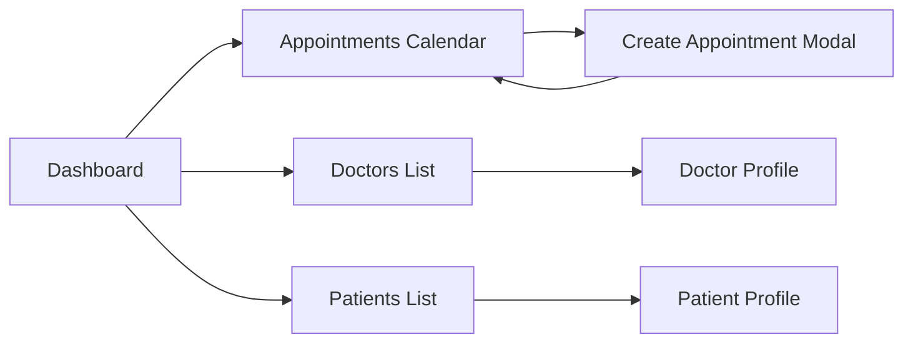

# MedAlpha Connect — Implementation Plan

## Overview
Clinic reception/front-desk booking system for managing doctors, patients, and appointments. Primary user: clinic admin/receptionist.

---

## Screens to Build

| # | Screen | Priority | States to Design |
|---|--------|----------|------------------|
| 1 | **Dashboard** | 1st | Loaded, Empty (no appointments today) |
| 2 | **Appointments Calendar** | 1st | Week view (default), Day view, Month view |
| 3 | **Create Appointment Modal** | 1st | Default, Validation errors, Success |
| 4 | **Doctors List** | 2nd | Loaded, Empty, Filtered |
| 5 | **Doctor Profile + Working Hours** | 2nd | View mode, Edit hours modal |
| 6 | **Patients List** | 2nd | Loaded, Empty, Search results |
| 7 | **Patient Profile + Medical History** | 2nd | View mode, Edit sections |
| 8 | **Navigation Shell** | 1st | Sidebar with user info |

---

## Key Decisions Made

| Decision | Choice | Rationale |
|----------|--------|-----------|
| Dashboard layout | Mini calendar + appointment list | Visual date navigation, status colors at a glance |
| Calendar organization | By doctor (columns) | See all doctors' schedules side-by-side |
| Default calendar view | Week view | Most useful for reception booking workflow |
| Appointment modal flow | Type → Doctor → Date/Time | Filter doctors by appointment type offered |
| Doctor colors | Consistent across calendar & lists | Quick visual identification (Green, Orange, Purple) |
| Working hours | Per-day table with status toggle | Simple to scan and edit |
| Patient medical history | Card-based sections | Conditions, Allergies, Medications as separate cards |

---

## Execution Decides

- Exact spacing and padding values (follow 8/12/16/24px rhythm)
- Icon selection (line icons, 1.5-2px weight)
- Hover/focus states for interactive elements
- Animation timing for modals (150-250ms, soft easing)
- Responsive breakpoints if needed
- Empty state illustrations
- Form validation messaging style

---

## Data Model Reference

```
Doctor: Name, Email, Specialization, Phone, License Number, Clinic
Patient: Name, Email, DOB, Patient ID, Phone, Medical History, Genetic Profile
Working Hours: Day, Start Time, End Time, Is Active, Clinic, Notes
Appointment Type: Name, Description, Duration, Priority, Category, Is Recurring
Appointment: ID, Date, Time, Duration, Status, Reason, Notes
```

**Relationships:**
- Doctor → Patient (1:M treats)
- Doctor → Working Hours (M:M)
- Doctor → Appointment Type (1:M creates)
- Patient → Appointment (1:M schedules)
- Appointment Type → Appointment (1:M defines)

---

## Design System Summary

### Colors (Warm Wellness Palette)
- **Primary text:** mindfulBrown.90
- **Secondary text:** optimisticGray.60
- **Background:** gray10-20
- **Cards:** white or gray10
- **Primary CTA:** serenityGreen.60 (#8BC6A3)
- **Secondary accent:** empathyOrange.60 (#F5A962)
- **Tertiary accent:** kindPurple (#C4B5E0)
- **Success:** serenityGreen
- **Warning:** empathyOrange
- **Error:** use sparingly

### Typography
- **Font:** Urbanist (Google Fonts)
- **H1:** 28-32 semibold
- **H2:** 22-24 semibold
- **Body:** 14-16 regular
- **Caption:** 12 regular

### Spacing & Shapes
- **Screen padding:** 16-20px
- **Card padding:** 16-20px
- **Card radius:** 16-24px
- **Button radius:** fully rounded (pill)
- **Input radius:** 16-20px
- **Touch targets:** 44px minimum

### Component Patterns
- **Buttons:** Pill shape, filled primary uses green/orange
- **Cards:** White/gray10, rounded 20-24px, soft shadow
- **Status badges:** Background tint + colored text (never color alone)
- **Tables:** Rounded container, subtle row borders
- **Avatars:** Colored circles with initials (doctor colors consistent)

---

## Constraints

- **Do NOT use:** Dark mode (not required for MVP)
- **Do NOT use:** Complex animations or micro-interactions
- **Match:** Existing warm, wellness-centric aesthetic throughout
- **Ensure:** Status indicators use symbol + color (accessibility)
- **Ensure:** Consistent doctor color coding across all screens

---

## Screen Flow


