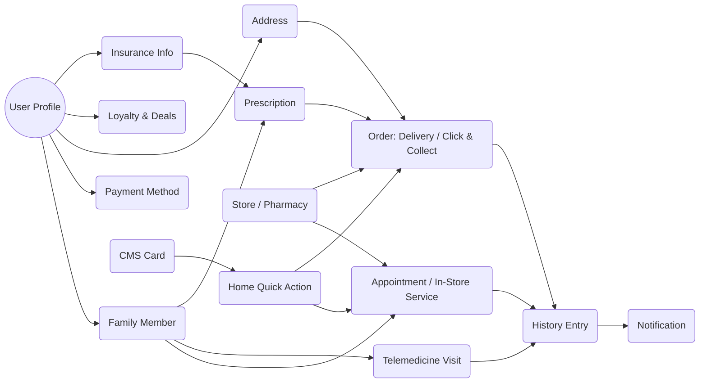

# OOUX Dot Map — MedAlpha Connect (dm-style retail partner)
Date: January 20, 2026  
Source: `scope-for-exploration.md`

## Objects
- **Primary**: User Profile, Family Member, Insurance Info (eGK), In-Store Service, Doctor Visit, Telemedicine Visit, Prescription, OTC / Click & Collect Order, Payment Method, Loyalty & Deals, Store / Pharmacy, History Entry, Notification, CMS Card, Home Quick Action.
- **Secondary**: Eligibility Check, Verification (email/SMS), Calendar Event, Reminder, Address, Consent Record, Feedback Form, Device Settings (permissions), Accessibility Preference.
- **Derived**: Upcoming Reminder, Suggested Service, Personalized Feed, Order Status, Visit Summary.

## Attributes (samples)
- User Profile: id, name, contact, auth method, default address, default payment, loyalty ids.
- Family Member: id, relationship, DOB, consent status, insurance link.
- Insurance Info: insurer type (GKV/PKV), eGK token, verification status.
- Appointment (Doctor / In-Store): type, location/store, slot, practitioner, status, price, family member id.
- Telemedicine Visit: specialty, slot, provider, status, summary link.
- Prescription: id, issuer, date, items, redemption status.
- Order (Online / Click & Collect): fulfillment type, delivery/pickup location, tracking, discreet packaging flag.
- Store / Pharmacy: id, name, address, open hours, services available, distance.
- History Entry: type, date, linked object ids, export link.
- Notification: type, trigger, target object, CTA, read status.

## Actions (key)
- Profile: create/edit, add family, manage consent, add insurance, add address, add payment.
- Booking: search, filter, select slot, confirm, reschedule, cancel.
- Telemedicine: start session, retry device check, end session, view summary.
- Redemption: scan eGK, choose fulfillment, confirm order, track, repeat.
- Pickup: request location, search stores/pharmacies, get directions, confirm pickup.
- History: filter, view detail, export PDF, set reminder.
- Home/CMS: view cards, tap quick action, refresh, personalize order.
- Notifications: opt-in/out, open deep link, snooze.

## Relationships Diagram

