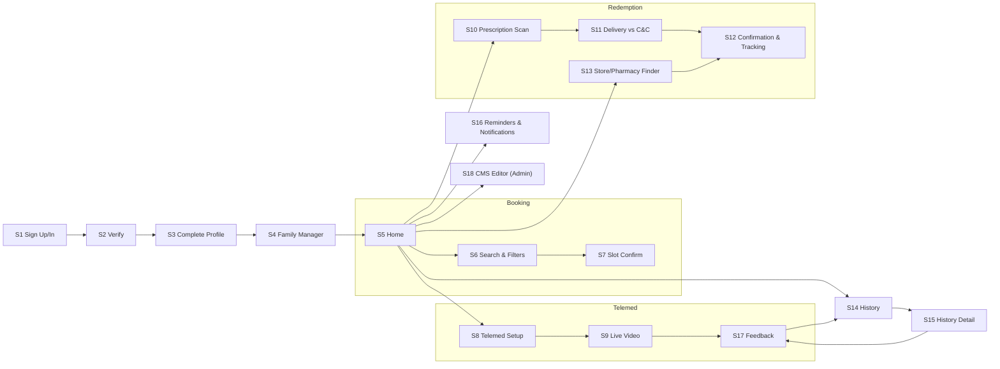

# Screen List — User-Friendly Names
Date: January 20, 2026  
Source: `scope-for-exploration.md`

## Screen IDs & Names
- **S1** Sign Up / Sign In (email/phone/SSO)
- **S2** Verify Code
- **S3** Complete Profile (Insurance, Address, Consent)
- **S4** Family Manager (Add/Switch)
- **S5** Home (Personalized Feed + Quick Actions)
- **S6** Search & Filters (Doctors / In-Store Services)
- **S7** Slot Details & Confirmation
- **S8** Telemedicine Setup (Symptom, Device Check)
- **S9** Live Video Visit
- **S10** Prescription Scan (eGK NFC / Code)
- **S11** Delivery vs Click & Collect Choice
- **S12** Order / Redemption Confirmation & Tracking
- **S13** Store & Pharmacy Finder (Map/List)
- **S14** History & Filters
- **S15** History Detail (Visit/Order/Pickup)
- **S16** Reminders & Notifications Settings
- **S17** Feedback & Follow-Up
- **S18** CMS Content Editor (Partner Admin - future-ready)

## Screen Flow Diagram

## Notes
- Home (S5) is the main hub with quick actions into Booking, Telemed, and Redemption.
- Family picker surfaces at S6/S7/S10 to keep flows family-aware.
- Notifications deep-link into S7, S9, S12, or S15 depending on trigger.
