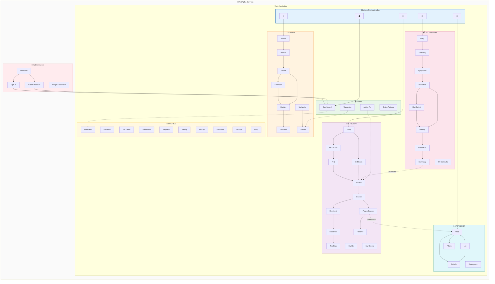
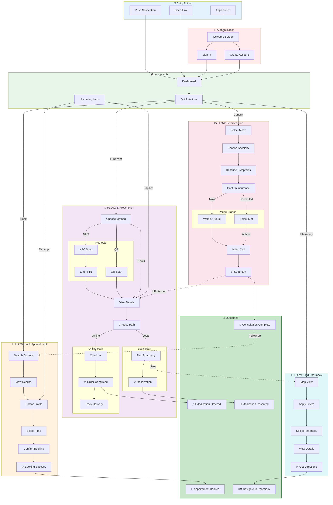
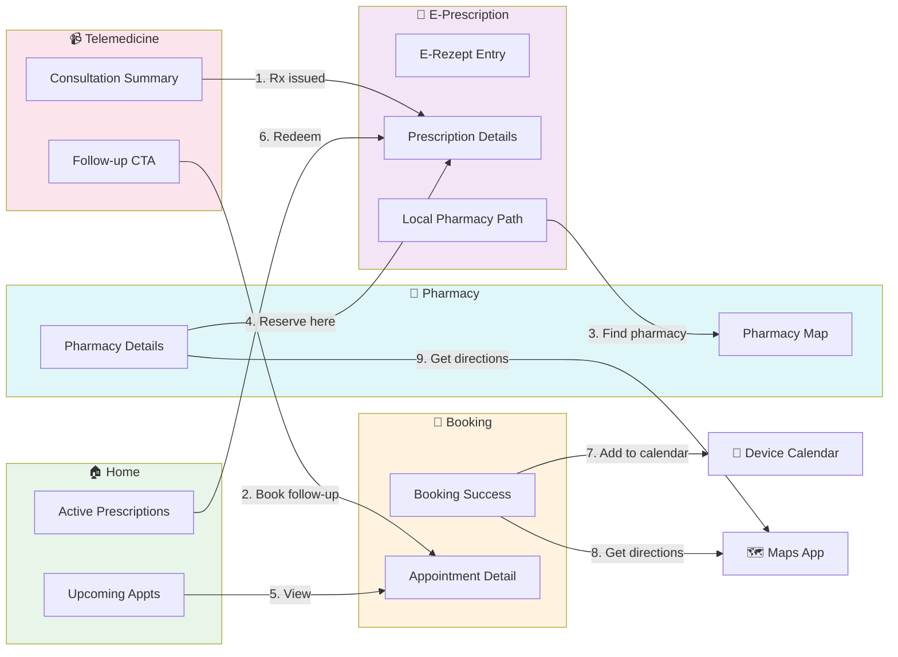

# MedAlpha Connect - Master IA & User Flow

**Version:** 1.0
**Last Updated:** 2026-01-20
**Total Screens:** 49 | **Primary Flows:** 4 | **Cross-Flow Connections:** 8

---

## Table of Contents

1. [Master Information Architecture](#1-master-information-architecture)
2. [Navigation System](#2-navigation-system)
3. [Master User Flow](#3-master-user-flow)
4. [Flow Integration Map](#4-flow-integration-map)
5. [Screen Inventory](#5-screen-inventory)

---

# 1. Master Information Architecture

## 1.1 High-Level Structure

```
MedAlpha Connect
│
├── 🔐 Authentication Layer
│   ├── Welcome
│   ├── Sign In
│   ├── Create Account
│   └── Forgot Password
│
├── 📱 Main Application
│   │
│   ├── 🏠 HOME (Dashboard)
│   │   ├── Upcoming Appointments
│   │   ├── Active Prescriptions
│   │   ├── Quick Actions
│   │   └── Recent Activity
│   │
│   ├── 📅 TERMINE (Appointments)
│   │   ├── Search Doctors
│   │   ├── Doctor Results
│   │   ├── Doctor Profile
│   │   │   ├── About
│   │   │   ├── Services
│   │   │   ├── Reviews
│   │   │   └── Calendar
│   │   ├── Booking Confirmation
│   │   ├── Booking Success
│   │   ├── My Appointments
│   │   └── Appointment Details
│   │
│   ├── 📹 TELEMEDIZIN (Telemedicine)
│   │   ├── Mode Selection
│   │   ├── Select Specialty
│   │   ├── Symptom Check
│   │   │   ├── Symptom Chips
│   │   │   ├── Free Text
│   │   │   └── Photo Upload
│   │   ├── Insurance Confirmation
│   │   ├── [Scheduled] Select Time Slot
│   │   ├── [Now] Waiting Room
│   │   ├── Video Call
│   │   ├── Consultation Summary
│   │   └── My Consultations
│   │
│   ├── 💊 E-REZEPT (E-Prescription)
│   │   ├── Retrieval Options
│   │   ├── [NFC] Card Scan
│   │   ├── [NFC] PIN Entry
│   │   ├── [QR] QR Scanner
│   │   ├── Prescription Details
│   │   ├── Redemption Choice
│   │   ├── [Online] Checkout
│   │   │   ├── Address
│   │   │   ├── Payment
│   │   │   └── Summary
│   │   ├── [Online] Order Confirmation
│   │   ├── [Online] Delivery Tracking
│   │   ├── [Local] Pharmacy Search
│   │   ├── [Local] Pharmacy Reservation
│   │   ├── My Prescriptions
│   │   └── My Orders
│   │
│   ├── 🏪 APOTHEKEN (Pharmacies)
│   │   ├── Map View
│   │   ├── List View
│   │   ├── Filters
│   │   ├── Pharmacy Details
│   │   └── Emergency Pharmacies
│   │
│   └── 👤 PROFILE (Account)
│       ├── Profile Overview
│       ├── Personal Information
│       ├── Insurance Details
│       ├── My Addresses
│       ├── Payment Methods
│       ├── Family Members
│       ├── Activity History
│       ├── Favorite Pharmacies
│       ├── Settings
│       │   ├── Language
│       │   ├── Notifications
│       │   ├── Privacy
│       │   └── Accessibility
│       └── Help & Support
│
└── 🔔 System Overlays
    ├── Push Notifications
    ├── Bottom Sheets
    ├── Error Dialogs
    └── Success Toasts
```

## 1.2 Master IA Diagram



---

# 2. Navigation System

## 2.1 Primary Navigation (Bottom Tab Bar)

| Tab | Icon | Label | Default Screen | Badge |
|-----|------|-------|----------------|-------|
| 1 | 🏠 | Home | Dashboard | - |
| 2 | 📅 | Termine | Search Doctors | Upcoming count |
| 3 | 📹 | Telemedizin | Mode Selection | - |
| 4 | 💊 | E-Rezept | Retrieval Options | Active Rx count |
| 5 | 🏪 | Apotheken | Map View | - |

## 2.2 Secondary Navigation

| Location | Type | Trigger |
|----------|------|---------|
| Profile | Header icon | Tap avatar/icon in header |
| Back | Header left | Tap back arrow |
| Search | In-screen | Search bar in relevant screens |
| Filters | Bottom sheet | Tap filter button |
| Actions | Context menu | Long press or overflow menu |

## 2.3 Navigation Patterns

```
┌─────────────────────────────────────────────────────────────────────────────┐
│                           NAVIGATION PATTERNS                               │
├─────────────────────────────────────────────────────────────────────────────┤
│                                                                             │
│  LINEAR FLOW (Booking, Telemedicine, E-Rezept)                             │
│  ┌────┐   ┌────┐   ┌────┐   ┌────┐   ┌────┐                               │
│  │ S1 │ → │ S2 │ → │ S3 │ → │ S4 │ → │ S5 │                               │
│  └────┘   └────┘   └────┘   └────┘   └────┘                               │
│     ←        ←        ←        ←                                           │
│  (Back navigation available at each step)                                  │
│                                                                             │
├─────────────────────────────────────────────────────────────────────────────┤
│                                                                             │
│  BRANCHING FLOW (E-Rezept redemption)                                      │
│                    ┌────┐                                                   │
│                 ┌─→│ S3A│ → [Online Path]                                  │
│  ┌────┐   ┌────┐│  └────┘                                                   │
│  │ S1 │ → │ S2 │┤                                                           │
│  └────┘   └────┘│  ┌────┐                                                   │
│                 └─→│ S3B│ → [Local Path]                                   │
│                    └────┘                                                   │
│                                                                             │
├─────────────────────────────────────────────────────────────────────────────┤
│                                                                             │
│  HUB & SPOKE (Pharmacy, Profile)                                           │
│           ┌────┐                                                            │
│        ┌─→│ S2 │                                                            │
│        │  └────┘                                                            │
│  ┌────┐│  ┌────┐                                                            │
│  │ HUB│┼─→│ S3 │                                                            │
│  └────┘│  └────┘                                                            │
│        │  ┌────┐                                                            │
│        └─→│ S4 │                                                            │
│           └────┘                                                            │
│                                                                             │
├─────────────────────────────────────────────────────────────────────────────┤
│                                                                             │
│  CROSS-FLOW JUMP (Telemedicine → E-Rezept)                                 │
│                                                                             │
│  [Flow A]                    [Flow B]                                       │
│  ┌────┐   ┌────┐            ┌────┐   ┌────┐                                │
│  │ A1 │ → │ A2 │ ·········→ │ B3 │ → │ B4 │                                │
│  └────┘   └────┘   (deep    └────┘   └────┘                                │
│                    link)                                                    │
│                                                                             │
└─────────────────────────────────────────────────────────────────────────────┘
```

---

# 3. Master User Flow

## 3.1 Complete User Journey Map



## 3.2 Flow Summary Table

| Flow | Entry Points | Steps | Branches | Outcomes | Avg. Screens |
|------|--------------|-------|----------|----------|--------------|
| **Book Appointment** | Tab, Home, Deep Link | 6 | 2 (Quick/Profile) | Appointment confirmed | 4-6 |
| **Telemedicine** | Tab, Home, Deep Link | 7 | 2 (Now/Scheduled) | Consultation complete, Rx | 5-7 |
| **E-Prescription** | Tab, Home, Tele Summary | 6-8 | 3 (NFC/QR/In-app) + 2 (Online/Local) | Order placed, Reserved | 5-8 |
| **Find Pharmacy** | Tab, E-Rezept, Deep Link | 5 | 2 (Map/List) | Directions, Reservation | 3-5 |

---

# 4. Flow Integration Map

## 4.1 Cross-Flow Connections



## 4.2 Integration Points Detail

| # | From | To | Trigger | Data Passed | User Action |
|---|------|-----|---------|-------------|-------------|
| 1 | Telemedicine Summary | E-Rezept Details | Prescription issued | Prescription ID | Tap "E-Rezept öffnen" |
| 2 | Telemedicine Summary | Booking | Doctor recommends | Specialty, Doctor ID | Tap "Folgetermin buchen" |
| 3 | E-Rezept (Local) | Pharmacy Map | User chooses local | Prescription data | Tap "Apotheke wählen" |
| 4 | Pharmacy Details | E-Rezept Reserve | In E-Rezept context | Pharmacy ID | Tap "E-Rezept einlösen" |
| 5 | Home Upcoming | Appointment Details | User views upcoming | Appointment ID | Tap appointment card |
| 6 | Home Active Rx | E-Rezept Details | User views active | Prescription ID | Tap prescription card |
| 7 | Booking Success | Device Calendar | User wants reminder | Event data | Tap "Zum Kalender" |
| 8 | Booking Success | Maps App | User needs directions | Address | Tap "Route öffnen" |
| 9 | Pharmacy Details | Maps App | User needs directions | Address | Tap "Route" |

## 4.3 Deep Link Scheme

| Deep Link | Destination | Parameters |
|-----------|-------------|------------|
| `medalpha://home` | Dashboard | - |
| `medalpha://appointments` | Search Doctors | `specialty`, `location` |
| `medalpha://appointments/:id` | Appointment Details | `id` |
| `medalpha://telemedicine` | Mode Selection | `mode` (now/scheduled) |
| `medalpha://telemedicine/call/:id` | Join Video Call | `consultationId` |
| `medalpha://e-rezept` | Retrieval Options | - |
| `medalpha://e-rezept/:id` | Prescription Details | `prescriptionId` |
| `medalpha://pharmacies` | Pharmacy Map | `lat`, `lng`, `filter` |
| `medalpha://pharmacies/:id` | Pharmacy Details | `pharmacyId` |
| `medalpha://profile` | Profile Overview | - |

---

# 5. Screen Inventory

## 5.1 Complete Screen List by Section

### 🔐 Authentication (4 screens)

| ID | Screen | Purpose | Entry |
|----|--------|---------|-------|
| AUTH-01 | Welcome | First launch, value prop | App launch (first time) |
| AUTH-02 | Sign In | Login with credentials | Welcome, Sign out |
| AUTH-03 | Create Account | New user registration | Welcome |
| AUTH-04 | Forgot Password | Password recovery | Sign In |

### 🏠 Home (1 screen, 4 sections)

| ID | Screen | Purpose | Entry |
|----|--------|---------|-------|
| HOME-01 | Dashboard | Central hub with overview | Tab, Login |

### 📅 Appointments (8 screens)

| ID | Screen | Purpose | Entry |
|----|--------|---------|-------|
| APPT-01 | Search Doctors | Specialty + location input | Tab, Home |
| APPT-02 | Doctor Results | List of matching doctors | Search |
| APPT-03 | Doctor Profile | Doctor info, reviews | Results |
| APPT-04 | Doctor Calendar | Full week time slots | Profile |
| APPT-05 | Booking Confirmation | Confirm details (bottom sheet) | Slot tap |
| APPT-06 | Booking Success | Confirmation + next actions | Confirm |
| APPT-07 | My Appointments | List of booked appointments | Tab overflow |
| APPT-08 | Appointment Details | Single appointment view | List tap |

### 📹 Telemedicine (9 screens)

| ID | Screen | Purpose | Entry |
|----|--------|---------|-------|
| TELE-01 | Mode Selection | Now vs. Scheduled choice | Tab, Home |
| TELE-02 | Select Specialty | Medical specialty picker | Mode |
| TELE-03 | Symptom Check | Describe symptoms | Specialty |
| TELE-04 | Insurance Confirmation | Verify insurance | Symptoms |
| TELE-05 | Select Time Slot | Pick scheduled time | Insurance (scheduled) |
| TELE-06 | Waiting Room | Queue position + tips | Insurance (now), Slot |
| TELE-07 | Video Call | Live consultation | Ready notification |
| TELE-08 | Consultation Summary | Diagnosis + next steps | Call end |
| TELE-09 | My Consultations | Past consultations list | Tab overflow |

### 💊 E-Prescription (13 screens)

| ID | Screen | Purpose | Entry |
|----|--------|---------|-------|
| ERX-01 | Retrieval Options | NFC/QR/In-app choice | Tab, Home, Tele |
| ERX-02 | NFC Scan | Card scan instructions | Entry (NFC) |
| ERX-03 | PIN Entry | 6-digit PIN input | NFC success |
| ERX-04 | QR Scan | Camera QR scanner | Entry (QR) |
| ERX-05 | Prescription Details | Medications + costs | PIN/QR/In-app |
| ERX-06 | Redemption Choice | Online vs. Local | Details |
| ERX-07 | Online Checkout | Address + payment | Choice (online) |
| ERX-08 | Order Confirmation | Success + order number | Checkout |
| ERX-09 | Delivery Tracking | Timeline status | Confirmation |
| ERX-10 | Pharmacy Search | Map for local pickup | Choice (local) |
| ERX-11 | Pharmacy Reservation | Reserve confirmation | Pharmacy select |
| ERX-12 | My Prescriptions | All prescriptions list | Tab overflow |
| ERX-13 | My Orders | Order history | Profile |

### 🏪 Pharmacies (5 screens)

| ID | Screen | Purpose | Entry |
|----|--------|---------|-------|
| PHARM-01 | Map View | Map with pharmacy pins | Tab |
| PHARM-02 | List View | Pharmacy cards list | Map toggle |
| PHARM-03 | Filters | Filter options (bottom sheet) | Map/List |
| PHARM-04 | Pharmacy Details | Full pharmacy info | Pin/Card tap |
| PHARM-05 | Emergency Pharmacies | Notdienst list | Filter |

### 👤 Profile (10 screens)

| ID | Screen | Purpose | Entry |
|----|--------|---------|-------|
| PROF-01 | Profile Overview | Account summary | Header icon |
| PROF-02 | Personal Information | Name, email, phone | Overview |
| PROF-03 | Insurance Details | GKV/PKV info | Overview |
| PROF-04 | My Addresses | Saved addresses | Overview |
| PROF-05 | Payment Methods | Cards, PayPal | Overview |
| PROF-06 | Family Members | Dependent profiles | Overview |
| PROF-07 | Activity History | Past appointments, orders | Overview |
| PROF-08 | Favorite Pharmacies | Saved pharmacies | Overview |
| PROF-09 | Settings | App preferences | Overview |
| PROF-10 | Help & Support | FAQ, contact | Overview |

## 5.2 Screen Count Summary

| Section | Screens | Percentage |
|---------|---------|------------|
| Authentication | 4 | 8% |
| Home | 1 | 2% |
| Appointments | 8 | 16% |
| Telemedicine | 9 | 18% |
| E-Prescription | 13 | 27% |
| Pharmacies | 5 | 10% |
| Profile | 10 | 20% |
| **Total** | **50** | **100%** |

## 5.3 Screen Complexity Matrix

| Screen | Objects | Actions | Complexity |
|--------|---------|---------|------------|
| Dashboard (HOME-01) | 4 | 6 | High |
| Doctor Results (APPT-02) | 3 | 5 | High |
| Symptom Check (TELE-03) | 2 | 4 | Medium |
| Video Call (TELE-07) | 2 | 5 | High |
| Prescription Details (ERX-05) | 3 | 4 | Medium |
| Online Checkout (ERX-07) | 3 | 3 | Medium |
| Pharmacy Map (PHARM-01) | 2 | 5 | High |
| Profile Overview (PROF-01) | 1 | 8 | Medium |

---

## Appendix: Quick Reference

### Flow Entry Points

| Flow | Primary Entry | Secondary Entries |
|------|---------------|-------------------|
| Booking | Tab "Termine" | Home quick action, Deep link |
| Telemedicine | Tab "Telemedizin" | Home quick action, Deep link |
| E-Prescription | Tab "E-Rezept" | Home active Rx, Tele summary, Deep link |
| Pharmacy | Tab "Apotheken" | E-Rezept local path, Deep link |

### Flow Exit Points

| Flow | Success Exit | Alternative Exits |
|------|--------------|-------------------|
| Booking | Calendar/Maps integration | Back to home |
| Telemedicine | E-Rezept / Follow-up booking | Back to home |
| E-Prescription | Tracking / Pharmacy directions | Back to home |
| Pharmacy | Maps directions / E-Rezept reserve | Back to home |

### Key Metrics per Flow

| Flow | Primary KPI | Target |
|------|-------------|--------|
| Booking | Completion rate | >60% |
| Telemedicine | Consultation completion | >80% |
| E-Prescription | Redemption rate | >70% |
| Pharmacy | Route action rate | >50% |
